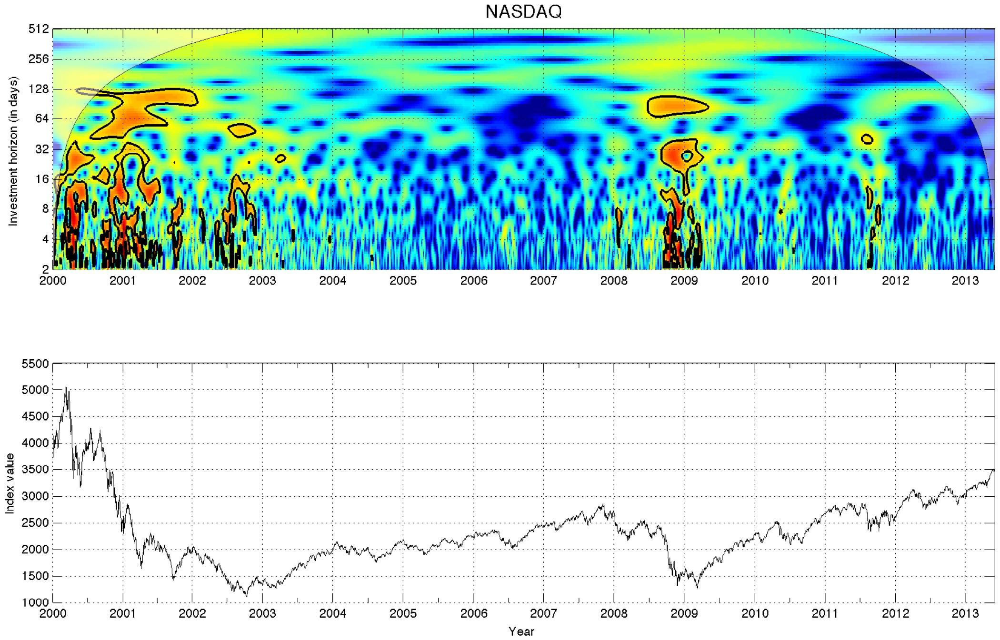

## Table of Contents

## What is the Fractal Markets Hypothesis?

The Fractal Markets Hypothesis is a theory about how financial markets work. It was created by a man named Edgar Peters. This theory says that markets are not always predictable and can change in ways that are hard to guess. It uses the idea of fractals, which are patterns that repeat at different scales. This means that the same kinds of ups and downs you see in the market over a short time can also happen over a longer time.

This hypothesis is different from other theories like the Efficient Market Hypothesis, which says that all information is already included in the price of stocks. The Fractal Markets Hypothesis suggests that markets are more complex and that investors' behavior can create patterns that are not easy to predict. It also says that understanding these patterns can help investors make better decisions, but it's not easy because the patterns can change quickly.

## How does the Fractal Markets Hypothesis differ from traditional market theories like the Efficient Market Hypothesis?

The Fractal Markets Hypothesis and the Efficient Market Hypothesis have different views on how financial markets work. The Efficient Market Hypothesis believes that markets are always right and that all information is already included in stock prices. This means that it's hard to beat the market because prices reflect everything known about a stock. On the other hand, the Fractal Markets Hypothesis says that markets are not always predictable and can change in ways that are hard to guess. It uses the idea of fractals, which are patterns that repeat at different scales, to explain that the market can have the same kinds of ups and downs over short and long periods.

The main difference is that the Efficient Market Hypothesis thinks markets are efficient and that it's tough to find bargains because prices are always correct. The Fractal Markets Hypothesis, however, suggests that markets are more complex and that investors' behavior can create patterns that are not easy to predict. This means that while understanding these patterns can help investors make better decisions, it's challenging because the patterns can change quickly. So, the Fractal Markets Hypothesis offers a more dynamic view of markets, where patterns and changes are key, unlike the more static view of the Efficient Market Hypothesis.

## Who developed the Fractal Markets Hypothesis and when was it introduced?

The Fractal Markets Hypothesis was developed by Edgar Peters. He introduced this idea in the early 1990s. Edgar Peters is known for his work in financial markets and for using the concept of fractals to understand how markets behave.

This hypothesis came about because Peters noticed that markets did not always follow the patterns that traditional theories like the Efficient Market Hypothesis suggested. He saw that markets could be unpredictable and that the same kinds of ups and downs could happen over short and long periods. By using fractals, Peters wanted to show that markets are more complex and that understanding these patterns could help investors make better decisions.

## What are the key principles of the Fractal Markets Hypothesis?

The Fractal Markets Hypothesis says that markets are not always predictable and can change in ways that are hard to guess. It uses the idea of fractals, which are patterns that repeat at different scales. This means that the same kinds of ups and downs you see in the market over a short time can also happen over a longer time. The hypothesis suggests that markets are more complex than other theories say. It believes that investors' behavior can create patterns that are not easy to predict.

Understanding these patterns can help investors make better decisions, but it's not easy because the patterns can change quickly. The Fractal Markets Hypothesis is different from other theories like the Efficient Market Hypothesis, which says that all information is already included in the price of stocks. Instead, the Fractal Markets Hypothesis looks at how markets can be unpredictable and how investors can use this knowledge to their advantage. It offers a more dynamic view of markets, where patterns and changes are key.

## How does the concept of fractals apply to financial markets according to this hypothesis?

The Fractal Markets Hypothesis uses the idea of fractals to explain how financial markets work. Fractals are patterns that repeat at different scales. This means that if you look at a short period of time in the market, you might see ups and downs. If you look at a longer period of time, you can see the same kinds of ups and downs, just on a bigger scale. This idea helps us understand that the market can be unpredictable because the same patterns can happen over short and long times.

According to this hypothesis, the way investors behave can create these [fractal](/wiki/fractal-indicators) patterns in the market. For example, if many investors start buying a stock, the price goes up. If they all decide to sell, the price goes down. These actions can create patterns that repeat at different times. Understanding these patterns can help investors make better decisions, but it's hard because the patterns can change quickly. So, the Fractal Markets Hypothesis says that markets are more complex than other theories suggest, and that knowing about fractals can help investors navigate this complexity.

## Can you explain the role of liquidity in the Fractal Markets Hypothesis?

Liquidity is really important in the Fractal Markets Hypothesis. It's about how easy it is to buy or sell something in the market without changing its price too much. According to the hypothesis, when there's a lot of [liquidity](/wiki/liquidity-risk-premium), the market can move smoothly. This means that the fractal patterns, or the ups and downs that repeat at different scales, can be seen more clearly. If there's not enough liquidity, it can be harder to see these patterns because the market might not move as smoothly.

In the Fractal Markets Hypothesis, liquidity helps explain why markets can be unpredictable. When liquidity is high, investors can buy and sell more easily, which can create the fractal patterns. But if liquidity suddenly drops, it can cause big changes in the market, making it harder to predict what will happen next. So, understanding how liquidity affects the market is key to using the Fractal Markets Hypothesis to make better investment decisions.

## What are some practical implications of the Fractal Markets Hypothesis for investors?

The Fractal Markets Hypothesis tells investors that markets can be hard to predict because the same patterns of ups and downs can happen over short and long times. This means that instead of trying to guess what the market will do next, investors should look for these repeating patterns. By understanding these patterns, investors can make better decisions about when to buy or sell stocks. For example, if an investor notices a certain pattern happening over a few days, they might expect a similar pattern over a few weeks or months.

Another practical implication is that investors need to pay attention to liquidity, which is how easy it is to buy or sell stocks without changing their price too much. When there's a lot of liquidity, the market can move smoothly, and the fractal patterns are easier to see. But if liquidity suddenly drops, it can cause big changes in the market, making it harder to predict what will happen next. So, investors should keep an eye on liquidity to help them understand and use the fractal patterns to their advantage.

## How can the Fractal Markets Hypothesis be used to predict market behavior?

The Fractal Markets Hypothesis says that markets can be hard to predict because the same patterns of ups and downs can happen over short and long times. These patterns are called fractals. By looking for these repeating patterns, investors can try to guess what the market might do next. For example, if an investor sees a certain pattern happening over a few days, they might expect a similar pattern over a few weeks or months. This can help them decide when to buy or sell stocks.

Another way the Fractal Markets Hypothesis can help predict market behavior is by paying attention to liquidity. Liquidity is how easy it is to buy or sell stocks without changing their price too much. When there's a lot of liquidity, the market can move smoothly, and the fractal patterns are easier to see. But if liquidity suddenly drops, it can cause big changes in the market, making it harder to predict what will happen next. So, by keeping an eye on liquidity, investors can better understand and use the fractal patterns to make predictions about the market.

## What are the criticisms and limitations of the Fractal Markets Hypothesis?

The Fractal Markets Hypothesis has some criticisms and limitations. One big criticism is that it's hard to use in real life. The idea of looking for repeating patterns, or fractals, sounds good, but it's tough to find these patterns in a way that helps investors make money. The market can change quickly, and what looks like a pattern might not be one. This makes it hard for investors to use the hypothesis to predict what will happen next.

Another limitation is that the Fractal Markets Hypothesis doesn't explain everything about how markets work. It focuses a lot on the patterns that repeat at different scales, but it doesn't say much about other things that can affect the market, like news or big events. Also, some people think that the hypothesis is too complicated and that simpler theories, like the Efficient Market Hypothesis, might be just as good or better at explaining how markets work.

## How has the Fractal Markets Hypothesis influenced financial modeling and market analysis?

The Fractal Markets Hypothesis has changed the way some people think about financial modeling and market analysis. It says that markets are not always predictable and can change in ways that are hard to guess. This idea has led some researchers and analysts to look for repeating patterns, or fractals, in the market. By understanding these patterns, they hope to make better guesses about what the market might do next. This has pushed the development of new tools and methods in financial modeling that focus on finding and using these fractal patterns.

However, the Fractal Markets Hypothesis has not been accepted by everyone in the financial world. Some people think it's too hard to use in real life because the market changes so quickly. They say that what looks like a pattern might not be one, and this makes it tough to use the hypothesis to make money. Also, the hypothesis doesn't explain everything about how markets work. It focuses a lot on patterns but doesn't say much about other things that can affect the market, like news or big events. So, while the Fractal Markets Hypothesis has influenced some areas of financial modeling and market analysis, it's not the only way people think about markets.

## Are there any empirical studies that support the Fractal Markets Hypothesis?

Yes, there have been some studies that support the Fractal Markets Hypothesis. One study by Edgar Peters, who came up with the hypothesis, looked at stock market data and found that the market did show fractal patterns. This means that the same kinds of ups and downs happened over short and long times. Another study by other researchers used different ways to look at market data and also found evidence of fractals. These studies suggest that the Fractal Markets Hypothesis might be right about how markets work.

However, not all studies agree with the Fractal Markets Hypothesis. Some researchers have looked at the same kind of data and did not find clear fractal patterns. They say that what looks like a pattern might just be random changes in the market. This means that while some studies support the hypothesis, others do not, and there is still a lot of debate about whether the Fractal Markets Hypothesis is a good way to understand markets.

## What future research directions are suggested for the Fractal Markets Hypothesis?

Future research on the Fractal Markets Hypothesis could focus on finding better ways to spot fractal patterns in the market. Right now, it's hard to tell if a pattern is really a fractal or just random changes. Scientists could work on new tools and methods that make it easier to find these patterns. They could also look at different kinds of markets, like [cryptocurrency](/wiki/cryptocurrency) or real estate, to see if fractal patterns show up there too. This would help us understand if the hypothesis works for all kinds of markets, not just the stock market.

Another important direction for future research is to test the hypothesis with more data over longer times. By looking at more data, researchers can see if fractal patterns keep showing up, even when the market changes a lot. They could also study how other things, like news or big events, affect the patterns. This would give us a better idea of how useful the Fractal Markets Hypothesis is for predicting what the market will do next. Understanding these things could help investors make better decisions and might make the hypothesis more accepted in the financial world.

## References & Further Reading

[1]: Peters, Edgar E. ["Fractal Market Analysis: Applying Chaos Theory to Investment & Economics."](https://archive.org/details/fractalmarketana0000pete) John Wiley & Sons, 1994.

[2]: Mandelbrot, Benoit B., and Richard L. Hudson. ["The (Mis)Behavior of Markets: A Fractal View of Risk, Ruin, and Reward."](https://users.math.yale.edu/~bbm3/web_pdfs/misbehaviorprelude.pdf) Basic Books, 2004.

[3]: Lo, Andrew W., and A. Craig MacKinlay. ["A Non-Random Walk Down Wall Street."](https://www.amazon.com/Non-Random-Walk-Down-Wall-Street/dp/0691092567) Princeton University Press, 1999.

[4]: Turiel, Antonio, and David del Toro. ["Intermittency and Turbulence in Financial Markets: A Fractal Approach."](https://www.thegreatsimplification.com/episode/65-antonio-turiel) Physica A: Statistical Mechanics and its Applications, 2004.

[5]: Jansen, Stefan. ["Python for Algorithmic Trading: From Idea to Cloud Deployment"](https://www.amazon.com/Python-Algorithmic-Trading-Cloud-Deployment/dp/149205335X) Wiley, 2020.