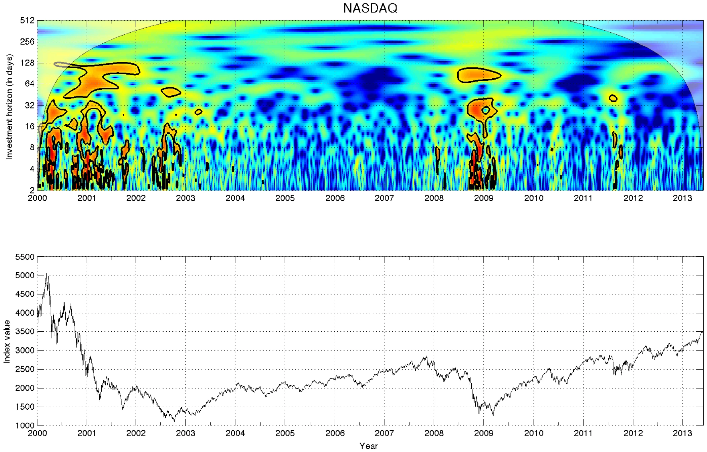

## Table of Contents

## What is Fractal Markets Theory?

Fractal Markets Theory is a way of looking at financial markets that says they are made up of many smaller parts that look similar to the whole market. These smaller parts, or "fractals," repeat themselves at different scales, just like the branches of a tree or the coastline of an island. The idea is that by understanding these smaller patterns, we can better understand the bigger picture of the market. This theory was developed by economist Edgar Peters in the 1990s, who noticed that traditional ways of predicting market movements didn't always work because markets are too complex and unpredictable.

In simple terms, Fractal Markets Theory suggests that the market is not just one big thing but a collection of many smaller markets, each behaving in ways that can help us predict the larger market's behavior. For example, if you look at the stock market, you can see patterns in daily, weekly, or monthly price movements that look similar. By studying these patterns, investors can make better decisions. This theory helps explain why markets can be hard to predict and why they can change so quickly, as each smaller part can affect the whole in unexpected ways.

## Who developed the Fractal Markets Theory?

Edgar Peters developed the Fractal Markets Theory in the 1990s. He was an economist who noticed that the usual ways of predicting how markets would move didn't always work. He saw that markets were too complicated and hard to predict using old methods.

Peters came up with the idea that markets are made of many smaller parts that look like the whole market. These parts, called fractals, repeat at different sizes. By understanding these smaller patterns, people can better understand the bigger market. This theory helps explain why markets can be so hard to predict and why they can change quickly.

## How does Fractal Markets Theory differ from traditional market theories?

Fractal Markets Theory and traditional market theories look at the financial markets in very different ways. Traditional theories, like the Efficient Market Hypothesis, say that all the information about a stock or market is already in its price. They believe that it's hard to beat the market because prices always reflect all the known information. This means that markets are predictable if you have all the information. But, these theories often assume that markets move in a smooth and orderly way, which isn't always true.

On the other hand, Fractal Markets Theory says that markets are made up of many smaller parts that look like the whole market. These smaller parts, or fractals, repeat at different sizes. This means that markets are not smooth and orderly but are complex and can change quickly. Fractal Markets Theory helps explain why markets can be hard to predict and why they can move in ways that traditional theories can't explain. By looking at these smaller patterns, investors can get a better understanding of the bigger market and make better decisions.

In simple terms, traditional theories see the market as one big, predictable thing, while Fractal Markets Theory sees it as a collection of smaller, repeating patterns. This difference means that Fractal Markets Theory can help explain sudden market changes and complex behaviors that traditional theories might miss.

## What are the key principles of Fractal Markets Theory?

Fractal Markets Theory says that markets are made of many smaller parts that look like the whole market. These smaller parts, called fractals, repeat at different sizes. This means that the market is not one big thing but a collection of many smaller markets. Each of these smaller markets behaves in ways that can help us understand the bigger market. By looking at these smaller patterns, we can see how the market might move next.

The theory also says that markets can change quickly and in ways that are hard to predict. This is because each smaller part can affect the whole market in unexpected ways. Traditional theories often think markets move in a smooth and orderly way, but Fractal Markets Theory says markets are more complex. By understanding these smaller patterns, investors can make better decisions and be ready for sudden changes in the market.

## Can you explain the concept of fractals in the context of financial markets?

In the world of financial markets, fractals are like little patterns that repeat over and over again, but at different sizes. Imagine looking at a tree: you see the big branches, but if you look closer, you see smaller branches that look a lot like the big ones. In the same way, the price movements in financial markets can have patterns that repeat at different time scales, like daily, weekly, or monthly. These repeating patterns are called fractals.

Fractal Markets Theory says that by looking at these smaller patterns, we can better understand the whole market. For example, if you see a certain pattern in the daily price movements of a stock, you might see a similar pattern in the weekly or monthly movements too. This helps investors see how the market might move next and make better decisions. Because these patterns can repeat at different sizes, the market can change quickly and in ways that might be hard to predict if you're only looking at the big picture.

## How does Fractal Markets Theory apply to market behavior and investor psychology?

Fractal Markets Theory helps us understand how markets behave by showing that they are made up of many smaller patterns that look like the whole market. These patterns, called fractals, repeat at different sizes, like daily, weekly, or monthly price movements. By looking at these smaller patterns, investors can get a better idea of how the market might move next. This is useful because markets can change quickly and in ways that are hard to predict if you only look at the big picture. For example, if an investor sees a certain pattern in the daily price movements of a stock, they might see a similar pattern in the weekly or monthly movements too, helping them make better decisions.

Fractal Markets Theory also ties into investor psychology because it shows how people's behavior can affect the market in unexpected ways. When many investors see the same small pattern and react to it, their actions can create bigger patterns that influence the whole market. This can lead to sudden changes in the market because each small action can have a big impact. Understanding these patterns can help investors stay calm and make smarter choices, even when the market seems chaotic. By recognizing that markets are made of many smaller parts, investors can better handle the ups and downs and avoid making hasty decisions based on fear or excitement.

## What role do market inefficiencies play in Fractal Markets Theory?

Market inefficiencies are important in Fractal Markets Theory because they help explain why markets can be hard to predict. Traditional theories often assume that markets are efficient, meaning all the information is already in the price of stocks. But Fractal Markets Theory says that markets are made of many smaller parts, called fractals, that repeat at different sizes. These smaller parts can create inefficiencies because they don't always move in a smooth and orderly way. When these smaller parts behave differently, it can lead to sudden changes in the market that traditional theories might miss.

These inefficiencies show up as patterns in the market that investors can use to make better decisions. For example, if an investor sees a certain pattern in the daily price movements of a stock, they might see a similar pattern in the weekly or monthly movements too. By understanding these patterns, investors can spot opportunities that others might miss. This means that market inefficiencies, which traditional theories see as a problem, are actually useful in Fractal Markets Theory. They help investors navigate the complex and unpredictable nature of the market.

## How can Fractal Markets Theory be used to predict market trends?

Fractal Markets Theory can help predict market trends by looking at the smaller patterns in the market. These patterns, called fractals, repeat at different sizes, like daily, weekly, or monthly price movements. By studying these smaller patterns, investors can see how the market might move next. For example, if an investor sees a certain pattern in the daily price movements of a stock, they might see a similar pattern in the weekly or monthly movements too. This helps them make better guesses about where the market is headed.

Because markets can change quickly and in ways that are hard to predict, understanding these smaller patterns can give investors an edge. Fractal Markets Theory shows that markets are not just one big thing but a collection of many smaller markets. Each of these smaller parts can affect the whole market in unexpected ways. By paying attention to these smaller patterns, investors can spot trends that others might miss and make smarter decisions. This can help them be ready for sudden changes in the market and take advantage of opportunities that come from market inefficiencies.

## What are some practical applications of Fractal Markets Theory in trading and investment strategies?

Fractal Markets Theory can help traders and investors make better decisions by looking at the smaller patterns in the market. These patterns, called fractals, repeat at different sizes, like daily, weekly, or monthly price movements. By understanding these smaller patterns, traders can predict how the market might move next. For example, if a trader sees a certain pattern in the daily price movements of a stock, they might see a similar pattern in the weekly or monthly movements too. This can help them decide when to buy or sell, making their trading strategies more effective.

Investors can also use Fractal Markets Theory to spot trends that others might miss. Since markets are made of many smaller parts, each part can affect the whole market in unexpected ways. By paying attention to these smaller patterns, investors can find opportunities that come from market inefficiencies. This means they can make smarter choices and be ready for sudden changes in the market. Understanding these patterns can help investors stay calm and avoid making hasty decisions based on fear or excitement, leading to better long-term investment strategies.

## What are the criticisms and limitations of Fractal Markets Theory?

Some people think Fractal Markets Theory is hard to use in real life because it's tricky to find the right patterns to look at. It's like trying to find a small puzzle piece in a big puzzle. The theory says markets are made of many smaller parts that repeat, but figuring out which parts to focus on can be tough. Also, it's hard to be sure that the patterns you see will keep happening in the future. Markets can change quickly, and what worked before might not work again.

Another problem with Fractal Markets Theory is that it can be hard to test and prove. Traditional theories like the Efficient Market Hypothesis have been studied a lot and have clear ways to check if they're right or wrong. But with Fractal Markets Theory, it's not as easy to do experiments or gather data to see if it works. This makes some people doubt if it's a good way to understand markets. Even though it helps explain why markets can be hard to predict, it's still a challenge to use it to make solid predictions or investment choices.

## How has Fractal Markets Theory evolved since its inception?

Since Edgar Peters came up with Fractal Markets Theory in the 1990s, people have been trying to use it to understand markets better. The theory says that markets are made of many smaller parts that look like the whole market. These parts, called fractals, repeat at different sizes. Over the years, more people have started looking at these smaller patterns to predict how the market might move next. They've used computers and math to find these patterns and see if they can help make better investment choices. This has made the theory more popular and given investors new tools to use.

Even though the theory has become more popular, it still has some problems. It's hard to find the right patterns to look at, and it's not always clear if the patterns will keep happening in the future. Markets can change quickly, so what worked before might not work again. Also, it's tough to test and prove the theory because it's not as easy to do experiments or gather data as with other theories. Still, people keep studying Fractal Markets Theory and trying to find ways to use it better, hoping to understand the complex and unpredictable nature of markets.

## What advanced mathematical models are used in the deeper analysis of Fractal Markets Theory?

To dive deeper into Fractal Markets Theory, people use advanced math models like the Hurst exponent and multifractal analysis. The Hurst exponent helps figure out if the market's price movements are random or if they follow a pattern. It's a way to measure how much the past movements of a stock's price can tell us about its future movements. If the Hurst exponent is high, it means the market's patterns are more likely to repeat, which is useful for making predictions. Multifractal analysis, on the other hand, looks at how these patterns repeat at different sizes. It's like looking at a tree and seeing how the branches, twigs, and leaves all look similar but at different scales. This helps investors understand the complex ways markets can move.

These math models help investors see the smaller patterns in the market and use them to make better guesses about where the market is headed. By using computers and these models, people can find patterns that might be hard to see otherwise. But, it's still tricky because markets can change quickly, and what worked before might not work again. Even with these advanced tools, it's hard to be sure if the patterns will keep happening in the future. Still, these models give investors more ways to understand the ups and downs of the market and make smarter choices.

## What is the relationship between Information Asymmetry and Interpretation?

In the Fractal Market Hypothesis (FMH), the variability in perception and interpretation of information among investors is a significant [factor](/wiki/factor-investing) influencing market dynamics. Investors interpret financial data through the lens of their individual investment horizons and risk appetites, leading to a diverse array of market actions. In stable markets, the uniform distribution of information fosters a homogenized response among investors, contributing to market stability and balanced investment actions. Information is assimilated relatively uniformly across different investor classes, ensuring that no single group disproportionately influences market outcomes.

During periods of crisis, however, this equilibrium is disrupted. Market participants react with heightened sensitivity to new information, which can lead to significant disparities in interpretation. Such periods often cause short-term information to overshadow long-term analysis, resulting in a convergence of investment horizons. As short-term horizons become prevalent, market [volatility](/wiki/volatility-trading-strategies) increases due to the rapid adjustments in investment strategies based on the latest data, thus destabilizing the market.

This dynamic can be quantitatively modeled by analyzing how new information impacts the variance in investor behavior. In a stable market, we might observe a low variance ($\sigma^2$) in investor responses as information is uniformly interpreted. Conversely, during crises, this variance spikes, indicating disparate interpretations:

$$
\sigma^2_{crisis} \gg \sigma^2_{stable}
$$

Such rapid shifts in investment horizons can be detrimental to market stability, causing [liquidity](/wiki/liquidity-risk-premium) to thin and escalating the potential for dramatic price swings. The FMH suggests that understanding these shifts and the underlying mechanisms in interpretation variance is crucial for developing effective risk management and [algorithmic trading](/wiki/algorithmic-trading) strategies that aim to anticipate and mitigate these disruptions. By acknowledging the heterogeneity in investor behavior and its susceptibility to information asymmetry, practitioners can better navigate the complexities of modern financial markets.

## References & Further Reading

[1]: Peters, Edgar E. (1991). ["Fractal Market Analysis: Applying Chaos Theory to Investment and Economics"](https://www.amazon.com/Fractal-Market-Analysis-Investment-Economics/dp/0471585246). Wiley.

[2]: Mandelbrot, Benoit B., & Hudson, Richard L. (2005). ["The (Mis)Behavior of Markets: A Fractal View of Risk, Ruin, and Reward"](https://books.google.com/books/about/The_Mis_Behaviour_of_Markets.html?id=zg91TAIs6bgC). Basic Books.

[3]: Lo, Andrew W. (2004). ["The Adaptive Markets Hypothesis: Market Efficiency from an Evolutionary Perspective."](https://papers.ssrn.com/sol3/papers.cfm?abstract_id=602222) The Journal of Portfolio Management, 30(5), 15-29.

[4]: Peters, Edgar E. (1994). ["Fractal Structure in the Capital Markets"](https://www.jstor.org/stable/4479238). Financial Analysts Journal, 50(4), 40-48.

[5]: Jansen, Stefan. (2018). ["Hands-On Machine Learning for Algorithmic Trading: Design and Implement Investment Strategies Based on Smart Algorithms that Learn from Data Using Python"](https://www.amazon.com/Hands-Machine-Learning-Algorithmic-Trading/dp/178934641X). Packt Publishing.