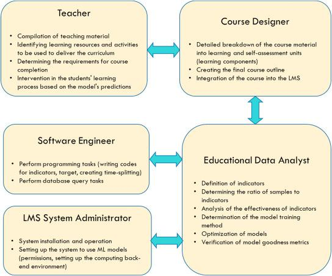

## Table of Contents

## What is the Fraction of Successes in machine learning?

The Fraction of Successes in machine learning is a simple way to measure how well a model is doing. It looks at how often the model gets the right answer. Imagine you have a model that tries to guess if an email is spam or not. If the model says 80 out of 100 emails are spam correctly, the fraction of successes is $$ \frac{80}{100} = 0.8 $$. This means the model is right 80% of the time.

This measure is easy to understand and calculate, but it has some limits. For example, if you have a lot more of one type of outcome (like 95% of emails are not spam), the model could guess "not spam" every time and still be right a lot. This would give a high fraction of successes, but the model isn't really doing a good job. So, while the fraction of successes is a good start, it's important to use other measures too to get a full picture of how well a model is working.

## How is the Fraction of Successes calculated?

The Fraction of Successes is calculated by dividing the number of times a model gets the right answer by the total number of guesses it makes. If a model correctly predicts 75 out of 100 cases, the Fraction of Successes is $$ \frac{75}{100} = 0.75 $$. This means the model is right 75% of the time.

This measure is straightforward and easy to understand. However, it can be misleading in some situations. For example, if most of the data is one type (like 99% of emails are not spam), a model could guess the majority type every time and still have a high Fraction of Successes, even if it's not really doing a good job at predicting. So, while the Fraction of Successes is useful, it's important to use other measures too to get a full picture of how well a model is working.

## What is the significance of the Fraction of Successes in evaluating model performance?

The Fraction of Successes is a simple and easy-to-understand way to see how well a model is doing. It tells you what fraction of the time the model gets the right answer. For example, if a model correctly predicts 80 out of 100 cases, the Fraction of Successes is $$ \frac{80}{100} = 0.8 $$. This means the model is right 80% of the time. It's a good starting point to check if a model is working well.

However, the Fraction of Successes has some limits. If the data has a lot more of one type of outcome, like 95% of emails are not spam, a model could guess the majority type every time and still have a high Fraction of Successes. This would make it seem like the model is doing well, even if it's not really predicting anything. So, while the Fraction of Successes is useful, it's important to use other measures too to get a full picture of how well a model is working.

## Can you explain the difference between Fraction of Successes and other metrics like accuracy?

The Fraction of Successes and accuracy are both ways to see how well a model is doing, but they can be a bit different. The Fraction of Successes is just the number of times the model gets the right answer divided by the total number of guesses it makes. If a model correctly predicts 75 out of 100 cases, the Fraction of Successes is $$ \frac{75}{100} = 0.75 $$. This means the model is right 75% of the time. It's a simple way to check how well a model is doing, but it can be misleading if one type of outcome is much more common.

Accuracy is also a measure of how often the model gets the right answer, but it's usually used in a more specific way. It's often used when the data is balanced, meaning there's a similar number of each type of outcome. Like the Fraction of Successes, accuracy is calculated by dividing the number of correct predictions by the total number of predictions. If a model correctly predicts 80 out of 100 cases, the accuracy is $$ \frac{80}{100} = 0.8 $$. But if the data isn't balanced, accuracy can be misleading too. That's why it's important to use other measures along with accuracy to get a full picture of how well a model is working.

## In what types of machine learning problems is the Fraction of Successes most commonly used?

The Fraction of Successes is most commonly used in simple classification problems where the goal is to see how often a model gets the right answer. For example, if you're trying to predict whether an email is spam or not, the Fraction of Successes tells you what fraction of the time the model correctly identifies spam emails. If the model correctly identifies 80 out of 100 spam emails, the Fraction of Successes is $$ \frac{80}{100} = 0.8 $$. This measure is easy to understand and calculate, making it a good starting point for evaluating how well a model is doing.

However, the Fraction of Successes is also used in situations where the data is not balanced, meaning one type of outcome is much more common than the others. For instance, if 95% of emails are not spam, a model could guess "not spam" every time and still have a high Fraction of Successes. This can make it seem like the model is doing well, even if it's not really predicting anything useful. Because of this, while the Fraction of Successes is useful, it's important to use other measures too to get a full picture of how well a model is working.

## How does the Fraction of Successes help in handling imbalanced datasets?

The Fraction of Successes is a simple way to measure how well a model is doing, even when the data is imbalanced. Imagine you have a lot more of one type of outcome, like 95% of emails are not spam. If a model guesses "not spam" every time, it would be right a lot, and the Fraction of Successes would be high. For example, if the model correctly guesses 95 out of 100 emails as not spam, the Fraction of Successes is $$ \frac{95}{100} = 0.95 $$. This shows that the model is right 95% of the time, but it's not really doing a good job because it's just guessing the most common outcome.

Even though the Fraction of Successes can be misleading with imbalanced data, it still helps by giving a starting point to see how well a model is doing. It's a simple number that tells you what fraction of the time the model gets the right answer. But because it can be misleading, it's important to use other measures too, like precision and recall, to get a full picture of how well the model is working with imbalanced datasets.

## What are the limitations of using the Fraction of Successes as a performance metric?

The Fraction of Successes is a simple way to see how well a model is doing, but it has some big limits. One big problem is when the data has a lot more of one type of outcome than the others. For example, if 95% of emails are not spam, a model could guess "not spam" every time and still have a high Fraction of Successes. If the model correctly guesses 95 out of 100 emails as not spam, the Fraction of Successes is $$ \frac{95}{100} = 0.95 $$. This makes it look like the model is doing well, but it's not really doing a good job because it's just guessing the most common outcome.

Another limit is that the Fraction of Successes doesn't tell you anything about the types of mistakes the model is making. For example, in a medical test, it's more important to know if the model is missing sick people (false negatives) than if it's saying healthy people are sick (false positives). The Fraction of Successes just gives you one number and doesn't help you understand these different kinds of errors. That's why, while the Fraction of Successes is a good starting point, it's important to use other measures too to get a full picture of how well a model is working.

## How can the Fraction of Successes be used in conjunction with other metrics to get a comprehensive view of model performance?

The Fraction of Successes is a simple way to see how often a model gets the right answer. It's calculated by dividing the number of correct predictions by the total number of predictions. For example, if a model correctly predicts 80 out of 100 cases, the Fraction of Successes is $$ \frac{80}{100} = 0.8 $$. This tells you that the model is right 80% of the time. While this is a good starting point, it doesn't tell the whole story, especially if the data has a lot more of one type of outcome than the others. That's why it's important to use other metrics along with the Fraction of Successes to get a full picture of how well a model is doing.

Using other metrics like precision, recall, and F1 score can help you understand different aspects of the model's performance. Precision tells you how many of the positive predictions the model made were actually correct. Recall tells you how many of the actual positive cases the model was able to find. The F1 score is a way to combine precision and recall into one number. For example, if a model is trying to predict if an email is spam, precision would tell you how many of the emails the model said were spam actually were spam, and recall would tell you how many of the actual spam emails the model found. By looking at these metrics along with the Fraction of Successes, you can see not just how often the model is right, but also how it's doing with different types of mistakes.

## What are some advanced techniques to optimize the Fraction of Successes in a model?

To optimize the Fraction of Successes in a model, one advanced technique is to use techniques like cross-validation. Cross-validation helps you check how well your model works on different parts of your data. You split your data into smaller pieces, train your model on some of the pieces, and then test it on the other pieces. This helps you see if your model is doing well on different kinds of data, not just the data it was trained on. By doing this, you can make changes to your model to improve the Fraction of Successes across different parts of your data.

Another technique is to use ensemble methods. Ensemble methods combine the predictions from different models to make a final prediction. For example, you could use a method called "bagging" where you train many different models on different parts of your data and then average their predictions. This can help improve the Fraction of Successes because it reduces the chance that your model will make a mistake. If one model gets something wrong, the other models might get it right, and the final prediction will be more accurate. By using these advanced techniques, you can make your model better at getting the right answer more often.

## How does the choice of threshold affect the Fraction of Successes in classification problems?

In classification problems, the choice of threshold can have a big impact on the Fraction of Successes. The threshold is the point where the model decides if something is one type or another. For example, if you're trying to predict if an email is spam, the model might give a score between 0 and 1, and you need to decide where to draw the line. If you set the threshold at 0.5, anything above 0.5 is considered spam. If you change the threshold to 0.6, the model will be more strict about what it calls spam. This can change the Fraction of Successes because it changes how many emails the model says are spam and how many it gets right.

Changing the threshold can help you balance the types of mistakes the model makes. If you lower the threshold, the model might catch more spam emails, but it might also call more good emails spam by mistake. This could make the Fraction of Successes go up if catching more spam is more important, but it could go down if calling good emails spam is a big problem. On the other hand, if you raise the threshold, the model might miss some spam emails but make fewer mistakes with good emails. By trying different thresholds, you can find the one that gives you the best Fraction of Successes for your specific problem.

## Can you discuss any case studies where the Fraction of Successes played a crucial role in model selection?

In a case study about predicting customer churn for a telecom company, the Fraction of Successes was crucial in choosing the best model. The company wanted to know which customers were likely to leave, so they could try to keep them. They tried different models and looked at the Fraction of Successes for each one. One model had a Fraction of Successes of $$ \frac{85}{100} = 0.85 $$, which meant it was right 85% of the time. This was better than the other models, which had lower Fractions of Successes. The company chose this model because it got the right answer more often, helping them focus on the customers most likely to leave.

Another case study involved a medical diagnosis system for detecting a rare disease. The Fraction of Successes helped the team decide which model to use. The disease was not common, so the data was imbalanced. One model had a high Fraction of Successes, but it was mostly guessing that patients didn't have the disease. Another model had a lower Fraction of Successes but was better at finding the few cases where patients actually had the disease. The team chose the second model because it was more important to find the rare cases than to have a high Fraction of Successes. This shows how the Fraction of Successes can help in model selection, but it's important to think about what the model is being used for.

## What future developments or research areas are focused on improving the utility of the Fraction of Successes in machine learning?

Future developments in machine learning are looking at ways to make the Fraction of Successes more useful, especially when data is not balanced. One area of research is about finding new ways to adjust the Fraction of Successes so it can tell us more about how well a model is doing, even if one type of outcome is much more common. For example, researchers are working on methods to give different weights to different types of mistakes, so the Fraction of Successes can show us if a model is good at finding the less common outcomes. This could help in areas like medical diagnosis, where it's important to find the few cases of a rare disease, even if it means the Fraction of Successes is lower.

Another area of research is about combining the Fraction of Successes with other metrics to get a better picture of how well a model is doing. Researchers are looking at ways to use the Fraction of Successes along with metrics like precision, recall, and the F1 score to understand different aspects of a model's performance. By doing this, they hope to create new ways to see how well a model is working in different situations. For example, if a model is trying to predict if an email is spam, using the Fraction of Successes with other metrics could help show not just how often the model is right, but also how it's doing with different types of mistakes.