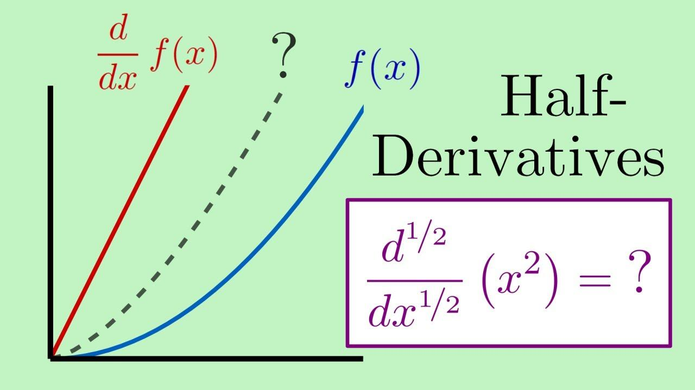

Algorithmic trading, defined as the use of computer algorithms to automate financial trading activities, plays a pivotal role in modern finance due to its ability to process large volumes of data at speeds impossible for human traders. These algorithms leverage mathematical models to make decisions on behalf of traders, often capitalizing on market inefficiencies and executing trades at the optimal price and time. The significance of algorithmic trading is emphasized by its widespread adoption across global markets, where it enhances liquidity, reduces trading costs, and improves the overall efficiency of financial markets.

Fractional differentiation is a mathematical concept that extends the traditional notion of differentiation to non-integer orders, providing a more flexible tool for modeling complex, real-world phenomena. Whereas traditional differentiation involves integer orders such as the first derivative (rate of change) or the second derivative (acceleration), fractional differentiation allows for orders defined by any real number, thereby enabling a nuanced analysis of data that exhibits memory and hereditary properties.



In the context of trading models, fractional differentiation is particularly significant due to its capacity to transform non-stationary financial time series into stationary ones without losing relevant information. This characteristic is vital for predictive modeling, as many statistical and machine learning techniques assume data stationarity. By employing advanced techniques such as fractional differentiation, traders and financial analysts can enhance the predictive power and robustness of their trading algorithms, addressing the limitations posed by traditional differentiation methods.

The primary goal of this article is to elucidate the concept and application of fractional differentiation in algorithmic trading. We will begin by exploring the fundamentals of fractional differentiation and its mathematical underpinnings. Subsequently, we will discuss its role in transforming non-stationary data and improving the performance of trading algorithms. The article will also include practical implementation guides, real-world case studies, and insights into the future potential and developments of fractional differentiation in the trading domain. Through this structured analysis, readers will gain a comprehensive understanding of how fractional differentiation can revolutionize trading strategies by enhancing their analytical capabilities.

## Table of Contents

## Understanding Fractional Differentiation

Fractional differentiation extends the concept of traditional differentiation to non-integer orders, offering a flexible approach to analyze dynamics in various datasets. Traditional differentiation, an essential concept in calculus, operates on the principle of integer orders, providing rates of change at specific points. In contrast, fractional differentiation allows for derivative orders of any real or complex number, providing a more nuanced tool for capturing memory and hereditary properties in datasets.

Mathematically, fractional differentiation is grounded in the theory of fractional calculus, which generalizes integrals and derivatives to non-integer orders. One of the common definitions used to express fractional differentiation is the Riemann-Liouville derivative, given by:

$$
D^{\alpha} f(t) = \frac{1}{\Gamma(n-\alpha)} \frac{d^n}{dt^n} \int_{a}^{t} (t - \tau)^{n-\alpha-1} f(\tau) \, d\tau
$$

where $\alpha$ is the order of differentiation, $n$ is the integer such that $n-1 < \alpha < n$, and $\Gamma$ denotes the gamma function. This formula incorporates an integral, reflecting the accumulative memory of the process, which distinguishes it from classical differentiation.

The application of fractional differentiation to time series data is particularly insightful, especially in fields like finance, where data often exhibits long memory and non-stationary characteristics. By allowing fractional orders, analysts can model the persistence and cyclical patterns within time series data more effectively.

For instance, consider a financial time series representing asset prices that are typically characterized by high levels of noise and [volatility](/wiki/volatility-trading-strategies). Traditional first-order differentiation might not capture the underlying pattern, as it eliminates much of the characteristic information along with the noise. By applying fractional differentiation, analysts can maintain the long-term dependencies and varying behaviors, providing a clearer insight into the trends and cycles that govern the data.

Here's a simple Python example showcasing fractional differentiation on a time series using the `fracdiff` library:

```python
import numpy as np
import fracdiff

# Example time series data
data = np.random.randn(100)

# Applying fractional differentiation with order of 0.5
frac_diff_order = 0.5
diff_data = fracdiff.frac_diff(data, diff_order=frac_diff_order)

# Display the results
print("Original Data:", data[:5])
print("Fractionally Differentiated Data:", diff_data[:5])
```

In this code, `fracdiff.frac_diff` is used to perform fractional differentiation on a sample dataset, capturing the intermediate complexity between integration and traditional differentiation. Such an approach helps maintain the dataset's stationarity while preserving essential structural information, ultimately enhancing subsequent analyses and models, especially in [algorithmic trading](/wiki/algorithmic-trading).

Fractional differentiation thus serves as a potent tool in analyzing time series data, enabling the retention of essential information, accommodating long memory processes, and addressing the challenges posed by non-stationary data patterns.

## Role of Fractional Differentiation in Algorithmic Trading

Algorithmic trading relies heavily on the analysis of time series data to predict future price movements. However, one of the primary challenges in this domain is dealing with non-stationary time series. A non-stationary time series possesses properties, such as mean and variance, that change over time, making it difficult for traditional statistical models to provide accurate predictions.

Fractional differentiation offers a solution by enabling the transformation of non-stationary data into stationary data while retaining essential long-term dependencies. Traditional differentiation, typically an integer order, may either fully differentiate the data or fail to address non-stationarity adequately. In contrast, fractional differentiation allows for non-integer orders of differentiation, which offers a more tailored approach to achieving stationarity.

Mathematically, fractional differentiation is defined using the concept of fractional calculus, which extends the traditional calculus. One of the common operators used is the fractional differencing operator $D^d$, where $d$ can be a non-integer. The transformation is given by:

$$
D^d y_t = \sum_{k=0}^{\infty} \frac{\Gamma(k-d)}{\Gamma(-d)\Gamma(k+1)} y_{t-k}
$$

where $y_t$ is the original time series, and $\Gamma$ is the gamma function, which generalizes factorials to non-integer values.

By using fractional differentiation, financial data series can be made stationary without losing the underlying memory or dependencies that are often essential for models based on historical data. This adjustment can significantly enhance the predictive capabilities of trading algorithms. When time series are made stationary through fractional differentiation, statistical properties become more constant over time, allowing for more robust and reliable model fittings.

The improved predictive power offered by fractional differentiation is pivotal for algorithmic trading. It enhances model performance by maintaining enough historical information, crucial for pricing assets, while eliminating random walks that can obscure market patterns. By effectively balancing memory preservation with stationarity, fractional differentiation allows trading models to better capture and exploit market trends, leading to improved trade entry and [exit](/wiki/exit-strategy) strategies.

Furthermore, by enabling a more refined and precise approach to time series differentiation, fractional differentiation enhances the capacity for algorithms to adapt to various market regimes and conditions. This adaptability results in [quantitative trading](/wiki/quantitative-trading) strategies that are more resilient to volatility and unpredictability inherent in financial markets.

In summary, fractional differentiation plays a critical role in overcoming the challenges posed by non-stationary time series in trading. Through its ability to make data stationary while preserving significant historical dependencies, it offers substantial benefits to algorithmic trading strategies, mainly by improving predictive accuracy and model robustness.

## Implementation of Fractional Differentiation in Algo Trading

Fractional differentiation is an advanced mathematical technique increasingly used in algorithmic trading for handling non-stationary time series data. Implementing fractional differentiation in financial data involves understanding the fractional differencing process, selecting appropriate libraries, and executing the technique in a programming environment like Python. 

### Step-by-Step Guide

#### Step 1: Understanding Fractional Differentiation

Fractional differentiation extends the concept of integer-order differentiation to non-integer orders, allowing for more nuanced data analysis. This process is particularly beneficial in making non-stationary time series data—common in financial markets—stationary without losing essential long-term memory properties.

#### Step 2: Select Appropriate Software Tools and Libraries

Python, a popular programming language in finance, offers several libraries that can assist in implementing fractional differentiation:

1. **NumPy and SciPy**: These fundamental libraries provide the basic tools for numerical calculations and data manipulation.

2. **pandas**: Useful for managing data structures and time series data.

3. **Fractional Differentiation (fracdiff)**: A specialized library that focuses on fractional differencing of time series data.

4. **arch**: Provides tools for financial modeling and econometrics, which can be useful in conjunction with fractional differentiation techniques.

#### Step 3: Implementing Fractional Differentiation in Python

Below is an example of how fractional differentiation can be applied using the `fracdiff` package:

```python
# First, install the fracdiff library
# pip install fracdiff

import pandas as pd
import numpy as np
import fracdiff

# Create a synthetic time series data
np.random.seed(42)
data = np.random.normal(0, 1, 1000)
time_series = pd.Series(data)

# Apply fractional differentiation
# d is the fractional differencing order
d = 0.4
frac_diff_series = fracdiff.fracdiff(time_series, d)

# Display the first few rows of the original and differentiated series
print("Original Series:\n", time_series.head())
print("Fractionally Differentiated Series:\n", frac_diff_series.head())
```

In this example, the fractional differentiation is applied using a differencing order `d = 0.4`. This order can be tuned depending on the data characteristics and the desired degree of stationarity.

#### Step 4: Integrating Differentiated Data in Trading Algorithms

Once fractional differentiation is applied, the resultant stationary data can be used for training statistical models, such as ARIMA, or [machine learning](/wiki/machine-learning) algorithms, enhancing their predictive capacity by maintaining long-term dependencies.

### Conclusion

Implementing fractional differentiation efficiently transforms non-stationary time series data into a more manageable form for further analysis in algorithmic trading strategies. By leveraging Python and associated libraries, traders and quantitative analysts can enhance their models' performance, incorporating subtle yet significant temporal dependencies without losing vital historical information.

## Case Studies and Examples

### Case Studies and Examples

Fractional differentiation has garnered attention for its potential advantages in refining algorithmic trading strategies. Its capacity to manage non-stationary time series data more effectively than traditional differentiation methods has been leveraged in various real-world applications, resulting in notable enhancements in predictive accuracy and trading performance.

#### Case Study 1: Enhanced Predictive Accuracy in Equity Markets

In a study conducted by Lopez de Prado and others, fractional differentiation was employed to convert non-stationary time series data of equity prices into stationary data without losing the memory of the original series. This was achieved by applying fractional differentiation to ensure that vital patterns and structures within the data were preserved, allowing strong predictive models to be constructed. The outcome of this application was a substantial improvement in the model's ability to forecast price movements. The study used the ARIMA (AutoRegressive Integrated Moving Average) model, where fractional differentiation replaced traditional integer differencing, enhancing the model's predictive power while maintaining computational efficiency.

#### Case Study 2: Volatility Forecasting in Forex Trading

Another instance involved the application of fractional differentiation to predict volatility in foreign exchange markets. Trading strategies in [forex](/wiki/forex-system) markets often grapple with the non-stationary characteristics of currency pair data. Implementing a fractional differentiation approach, researchers observed a noticeable reduction in forecast error. By maintaining the balance between differencing and retaining essential long-term dependencies in the data, trading algorithms could adjust more dynamically to market changes, improving the timing and execution of trades.

#### Limitations and Considerations

Despite these successes, there are notable considerations and limitations in using fractional differentiation. One primary challenge is determining the optimal degree of differentiation, denoted as $d$, that provides the best balance between over-differencing, which can lead to loss of critical information, and under-differencing, which can leave non-stationarity unaddressed. Incorrect parameter settings can significantly affect the outcome of trading strategies, leading to either failure in achieving stationarity or excessive noise.

Additionally, computational complexity arises in calculating fractional derivatives, especially in large datasets common in algorithmic trading. Efficient implementation requires significant computational resources and optimized algorithms to handle the increased processing load.

These case studies highlight the potential benefits of integrating fractional differentiation into trading models, while also drawing attention to the meticulous parameter tuning and resource considerations necessary for effective application.

## Future Prospects and Developments

The future role of fractional differentiation in algorithmic and quantitative trading looks promising as ongoing research continues to unlock its potential in handling complex financial data. Fractional differentiation stands out as a sophisticated mathematical technique capable of addressing the persistent challenge of non-stationary time series data in trading. Its ability to finely tune the differentiation order allows traders to retain memory effects within data while minimizing noise, thus offering a significant advantage in predictive modeling.

Current advancements focus on optimizing the selection of fractional orders to best suit specific datasets. This process enhances the balance between retaining valuable long-term trends and achieving stationarity. Researchers are exploring adaptive algorithms that dynamically adjust these orders based on evolving market conditions, thus enabling more responsive and resilient trading strategies.

The future applications of fractional differentiation are expected to expand with the integration of machine learning and [artificial intelligence](/wiki/ai-artificial-intelligence). These technologies can leverage the nuanced insights from fractionally differentiated data to enhance feature engineering, ultimately improving the precision of predictive algorithms. As machine learning systems become increasingly integral to trading, fractional differentiation may serve as a powerful tool for enhancing model input quality.

Evolving market conditions, such as increased volatility and the proliferation of high-frequency trading, underscore the importance of adopting advanced methodologies like fractional differentiation. These factors may influence traders to seek more robust approaches to ensure their strategies remain competitive and adaptive. The ongoing refinement of fractional differentiation techniques could provide a crucial edge in navigating such environments.

Overall, fractional differentiation is poised to play a significant role in the future of algorithmic trading. As research progresses and market dynamics evolve, its application is likely to expand, offering enhanced analytical capabilities for developing sophisticated, data-driven trading models.

## Conclusion

In conclusion, fractional differentiation emerges as a significant advancement in the field of algorithmic trading, offering a robust method to enhance trading models. This mathematical technique extends beyond traditional differentiation, allowing traders to effectively handle non-stationary time series data—a common challenge in financial markets. By making the data stationary, fractional differentiation improves the predictive power and reliability of trading algorithms.

The application of fractional differentiation in developing trading strategies addresses the inherent limitations of conventional methods, providing traders with a more nuanced understanding of market dynamics. As a result, trading strategies can be optimized to adapt quickly to changing conditions, potentially resulting in improved performance and more informed decision-making.

For traders and data scientists, exploring fractional differentiation unlocks new possibilities for innovation in quantitative trading. The integration of this technique into existing models paves the way for more sophisticated and adaptive trading systems. As research and technological advancements continue, the role of fractional differentiation is expected to grow, making it a crucial component of future trading strategies. Stakeholders in the field are encouraged to investigate this technique further, recognizing its potential to contribute to more rigorous and effective trading methodologies.

## References & Further Reading

[1]: ["Advances in Financial Machine Learning"](https://www.amazon.com/Advances-Financial-Machine-Learning-Marcos/dp/1119482089) by Marcos Lopez de Prado

[2]: ["Evidence-Based Technical Analysis: Applying the Scientific Method and Statistical Inference to Trading Signals"](https://www.amazon.com/Evidence-Based-Technical-Analysis-Scientific-Statistical/dp/0470008741) by David Aronson

[3]: ["Machine Learning for Algorithmic Trading"](https://github.com/stefan-jansen/machine-learning-for-trading) by Stefan Jansen

[4]: ["Quantitative Trading: How to Build Your Own Algorithmic Trading Business"](https://books.google.com/books/about/Quantitative_Trading.html?id=j70yEAAAQBAJ) by Ernest P. Chan