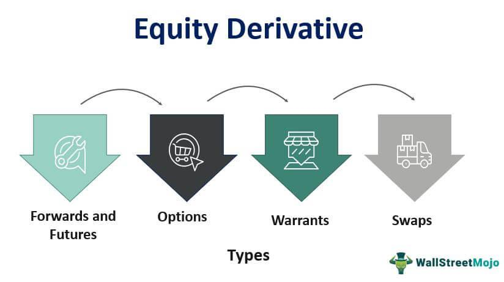

## Table of Contents

## What is fractional differentiation?

Fractional differentiation is a way of taking derivatives that goes beyond the usual whole numbers like 1, 2, or 3. Instead of just these whole numbers, you can use fractions or even decimals. For example, you might take the 1/2 derivative or the 0.7 derivative of a function. This idea might sound strange because we're used to thinking of derivatives in whole numbers, but it's useful in many fields like physics, engineering, and finance.

The concept of fractional derivatives was first thought of a long time ago, but it has become more important recently because of computers. These fractional derivatives help us model things in nature that don't fit well with regular derivatives. For example, they can be used to describe how materials stretch and bend in unusual ways, or how certain processes in nature change over time in a more complex manner than simple whole-number derivatives can show.

## How does fractional differentiation differ from integer-order differentiation?

Fractional differentiation is different from regular, or integer-order, differentiation because it uses fractions or decimals instead of whole numbers. With regular differentiation, you take the first derivative, second derivative, and so on. These are whole numbers like 1, 2, 3, etc. But with fractional differentiation, you can take derivatives like the 1/2 derivative or the 0.7 derivative. This means you're not limited to whole numbers, which gives you more ways to look at how things change.

This difference is important because it lets us study things in nature that don't change in simple, whole-number ways. Regular differentiation works well for many things, but it can't handle everything. Fractional differentiation helps us understand and model more complex changes, like how some materials stretch and bend, or how certain processes in nature evolve over time. It's like having a more detailed tool to look at how things change, which is useful in fields like physics, engineering, and finance.

## What are the basic mathematical definitions of fractional derivatives?

Fractional derivatives are a way to take derivatives using numbers that aren't whole, like fractions or decimals. There are different ways to define fractional derivatives, but one common way is called the Riemann-Liouville definition. In this definition, if you want to take the α-th derivative of a function f(x), where α is a fraction or decimal, you first take the integer part of α and use that to take a regular derivative. Then, you adjust the result with a special function called the Gamma function, which helps you deal with the fractional part of α.

Another common definition is the Caputo definition. In the Caputo definition, you start by taking the regular derivative of the function f(x) as many times as the integer part of α. After that, you use the Gamma function to adjust for the fractional part of α, but you do it in a different way than the Riemann-Liouville definition. The Caputo definition is often easier to use when you're dealing with initial conditions in real-world problems, because it keeps the meaning of these conditions clearer.

Both definitions use the Gamma function, which is a special function in math that extends the idea of factorials to numbers that aren't whole. The Gamma function helps make sense of the fractional part of the derivative. While the Riemann-Liouville and Caputo definitions are different, they both let you take derivatives with fractions or decimals, which is useful for studying complex changes in nature.

## What are some common methods used to compute fractional derivatives?

One common way to compute fractional derivatives is by using the Riemann-Liouville method. In this method, you first figure out how many whole number derivatives you need to take, which is the integer part of the fractional number you're using for the derivative. Then, you take that many regular derivatives of your function. After that, you use a special function called the Gamma function to adjust for the fractional part of the derivative. This method can be a bit tricky because it involves dealing with the Gamma function, but it's a standard way to handle fractional derivatives.

Another method is the Caputo method. With the Caputo method, you start by taking the regular derivatives of your function as many times as the integer part of the fractional number. After that, you use the Gamma function to adjust for the fractional part, but you do it differently than in the Riemann-Liouville method. The Caputo method is often easier to use when you're working with real-world problems that have initial conditions, because it keeps those conditions clearer and easier to understand. Both methods involve the Gamma function, but they handle the fractional part of the derivative in different ways, making them useful for different kinds of problems.

There are also numerical methods to compute fractional derivatives, which are useful when you're working with computers. These methods break down the function into smaller parts and use special formulas to calculate the fractional derivative. They can be more practical for complex functions or when you need to do a lot of calculations quickly. While the Riemann-Liouville and Caputo methods are more theoretical, numerical methods give you a way to actually compute the fractional derivatives in practice.

## Can you explain the Grünwald-Letnikov definition of fractional differentiation?

The Grünwald-Letnikov definition of fractional differentiation is another way to take derivatives using fractions or decimals instead of whole numbers. In this method, you think about the derivative as a limit of a sum, similar to how you learn about regular derivatives. But instead of using whole numbers, you use a special formula to figure out the weights for each term in the sum. These weights depend on the fractional number you're using for the derivative. You keep adding more and more terms, and as you do, you get closer and closer to the fractional derivative of your function.

This method is useful because it's easier to understand and work with on a computer. You can break down the function into smaller parts and use the special formula to calculate the fractional derivative step by step. This makes it practical for solving real-world problems where you need to compute the fractional derivative of a function. The Grünwald-Letnikov definition is just one of the ways to think about fractional derivatives, but it's a good one to use when you want to actually calculate them in practice.

## What is the Riemann-Liouville definition of fractional differentiation and how is it applied?

The Riemann-Liouville definition of fractional differentiation is a way to take derivatives using numbers that aren't whole, like fractions or decimals. In this method, you first figure out how many whole number derivatives you need to take, which is the integer part of the fractional number you're using for the derivative. For example, if you want to take the 2.5 derivative, you start by taking the second derivative (which is the integer part of 2.5). After that, you use a special function called the Gamma function to adjust for the fractional part of the derivative, which is 0.5 in this case. The Gamma function helps you deal with the fractional part by extending the idea of factorials to numbers that aren't whole.

To apply the Riemann-Liouville definition, you start with your function and take the regular derivatives as many times as the integer part of the fractional number. Then, you use the Gamma function to adjust for the fractional part. This method can be a bit tricky because it involves dealing with the Gamma function, but it's a standard way to handle fractional derivatives. It's useful for studying complex changes in nature that don't fit well with regular, whole-number derivatives. For example, it can help model how materials stretch and bend in unusual ways or how certain processes in nature change over time in more complex ways than simple whole-number derivatives can show.

## How does the Caputo definition of fractional differentiation differ from Riemann-Liouville?

The Caputo definition of fractional differentiation is different from the Riemann-Liouville definition because it handles the fractional part of the derivative in a different way. In the Caputo method, you start by taking the regular derivatives of your function as many times as the integer part of the fractional number. For example, if you want to take the 2.5 derivative, you first take the second derivative. Then, you use the Gamma function to adjust for the fractional part, which is 0.5 in this case. The big difference is that the Caputo method keeps the meaning of initial conditions clearer and easier to understand, which is important when you're working with real-world problems.

The Riemann-Liouville definition, on the other hand, starts with the Gamma function to adjust for the fractional part before taking the regular derivatives. This can make it a bit trickier to work with initial conditions because the fractional part is dealt with first. Both methods use the Gamma function to handle the fractional part of the derivative, but they do it in different orders. The Caputo method is often easier to use when you need to keep track of how things start out in a problem, while the Riemann-Liouville method is a standard way to handle fractional derivatives but can be more complex when dealing with initial conditions.

## What are the practical applications of fractional differentiation in science and engineering?

Fractional differentiation is used in many areas of science and engineering because it helps us understand things that change in complex ways. For example, in materials science, fractional derivatives can model how materials stretch and bend in unusual ways. This is important for making things like new kinds of plastics or metals that need to be strong and flexible. In physics, fractional derivatives help us study how things move or change over time in ways that regular derivatives can't handle. This is useful for understanding things like how heat spreads through a material or how waves move through the ocean.

In engineering, fractional differentiation is used to design better control systems. These systems help machines and devices work more smoothly and efficiently. For example, engineers use fractional derivatives to make sure robots move in a more natural way or to control the speed of a car's engine more precisely. In finance, fractional derivatives help model how stock prices or interest rates change over time in ways that are more complex than simple whole-number derivatives can show. This helps people make better predictions and decisions about money.

## How can fractional differentiation be used in signal processing?

Fractional differentiation can be really helpful in signal processing. It's used to look at signals in a new way, especially when the signals change in complex patterns. For example, if you're trying to clean up a noisy sound or image, fractional derivatives can help you see the small details that regular derivatives might miss. This is because fractional derivatives can pick up on changes that happen over time in a more detailed way than just using whole numbers.

In practical terms, engineers use fractional differentiation to make better filters for signals. These filters can smooth out the signal and remove noise more effectively. By using fractional derivatives, they can design systems that work well with signals that have unusual patterns or changes. This makes things like audio or image processing more accurate and efficient, which is important for things like improving the quality of music or making medical images clearer.

## What are the challenges and limitations of using fractional differentiation in practical scenarios?

Using fractional differentiation in real life can be tricky because it's more complicated than regular differentiation. One big challenge is that it involves the Gamma function, which can be hard to work with. This means you need good math skills and often a computer to do the calculations. Also, there are different ways to define fractional derivatives, like the Riemann-Liouville and Caputo methods, and choosing the right one for your problem can be confusing. Each method has its own strengths and weaknesses, so you need to know a lot about them to use them well.

Another limitation is that fractional differentiation is not as well understood as regular differentiation. This makes it harder to explain and use in real-world situations. For example, in engineering or finance, people might not be as familiar with fractional derivatives, so it can be tough to convince others to use them. Plus, the results you get from fractional differentiation can be harder to interpret because they don't fit into the usual patterns we're used to with whole-number derivatives. Even though fractional differentiation can help model complex changes, these challenges mean it's not always the best choice for every problem.

## Can you discuss any recent advances in the theory of fractional differentiation?

Recently, there have been some cool new ideas in the theory of fractional differentiation. One big advance is better ways to calculate fractional derivatives on computers. These new methods make it easier and faster to use fractional differentiation in real life. They help solve problems in areas like engineering and finance, where you need to understand how things change in complex ways. Another exciting thing is that researchers are finding new ways to use fractional derivatives in different fields. For example, they're using them to study how diseases spread or to make better models of the weather.

Also, people are working on making the math behind fractional differentiation easier to understand. They're coming up with new ways to explain it that make it less confusing. This is important because it helps more people use fractional differentiation in their work. There's also more research on how to choose the best method for a specific problem. Since there are different ways to do fractional differentiation, like the Riemann-Liouville and Caputo methods, figuring out which one to use can be tricky. These new studies are helping people make better choices and get more accurate results.

## How might future developments in fractional differentiation impact various fields of study?

Future developments in fractional differentiation could make a big difference in many areas. As computers get better at calculating fractional derivatives, scientists and engineers might use them more often to solve tricky problems. This could help make things like new materials, better robots, and more accurate weather predictions. In medicine, doctors could use fractional differentiation to understand how diseases spread in new ways, which might lead to better treatments. It's also possible that people in finance will use these new methods to predict how the stock market will change, helping them make smarter choices with money.

Also, as the math behind fractional differentiation gets easier to understand, more people might start using it. This could lead to new discoveries in physics and other sciences, where things often change in complex ways that regular math can't explain well. If more people learn about fractional differentiation and how to use it, it could become a common tool in many different fields. This could help us solve problems that we can't solve now, making the world a better place in lots of different ways.

## What is Understanding Fractional Differentiation?

Fractional differentiation extends the concept of traditional differentiation to non-integer orders, offering a flexible approach to analyze dynamics in various datasets. Traditional differentiation, an essential concept in calculus, operates on the principle of integer orders, providing rates of change at specific points. In contrast, fractional differentiation allows for derivative orders of any real or complex number, providing a more nuanced tool for capturing memory and hereditary properties in datasets.

Mathematically, fractional differentiation is grounded in the theory of fractional calculus, which generalizes integrals and derivatives to non-integer orders. One of the common definitions used to express fractional differentiation is the Riemann-Liouville derivative, given by:

$$
D^{\alpha} f(t) = \frac{1}{\Gamma(n-\alpha)} \frac{d^n}{dt^n} \int_{a}^{t} (t - \tau)^{n-\alpha-1} f(\tau) \, d\tau
$$

where $\alpha$ is the order of differentiation, $n$ is the integer such that $n-1 < \alpha < n$, and $\Gamma$ denotes the gamma function. This formula incorporates an integral, reflecting the accumulative memory of the process, which distinguishes it from classical differentiation.

The application of fractional differentiation to time series data is particularly insightful, especially in fields like finance, where data often exhibits long memory and non-stationary characteristics. By allowing fractional orders, analysts can model the persistence and cyclical patterns within time series data more effectively.

For instance, consider a financial time series representing asset prices that are typically characterized by high levels of noise and [volatility](/wiki/volatility-trading-strategies). Traditional first-order differentiation might not capture the underlying pattern, as it eliminates much of the characteristic information along with the noise. By applying fractional differentiation, analysts can maintain the long-term dependencies and varying behaviors, providing a clearer insight into the trends and cycles that govern the data.

Here's a simple Python example showcasing fractional differentiation on a time series using the `fracdiff` library:

```python
import numpy as np
import fracdiff

# Example time series data
data = np.random.randn(100)

# Applying fractional differentiation with order of 0.5
frac_diff_order = 0.5
diff_data = fracdiff.frac_diff(data, diff_order=frac_diff_order)

# Display the results
print("Original Data:", data[:5])
print("Fractionally Differentiated Data:", diff_data[:5])
```

In this code, `fracdiff.frac_diff` is used to perform fractional differentiation on a sample dataset, capturing the intermediate complexity between integration and traditional differentiation. Such an approach helps maintain the dataset's stationarity while preserving essential structural information, ultimately enhancing subsequent analyses and models, especially in [algorithmic trading](/wiki/algorithmic-trading).

Fractional differentiation thus serves as a potent tool in analyzing time series data, enabling the retention of essential information, accommodating long memory processes, and addressing the challenges posed by non-stationary data patterns.

## What is the Role of Fractional Differentiation in Algorithmic Trading?

Algorithmic trading relies heavily on the analysis of time series data to predict future price movements. However, one of the primary challenges in this domain is dealing with non-stationary time series. A non-stationary time series possesses properties, such as mean and variance, that change over time, making it difficult for traditional statistical models to provide accurate predictions.

Fractional differentiation offers a solution by enabling the transformation of non-stationary data into stationary data while retaining essential long-term dependencies. Traditional differentiation, typically an integer order, may either fully differentiate the data or fail to address non-stationarity adequately. In contrast, fractional differentiation allows for non-integer orders of differentiation, which offers a more tailored approach to achieving stationarity.

Mathematically, fractional differentiation is defined using the concept of fractional calculus, which extends the traditional calculus. One of the common operators used is the fractional differencing operator $D^d$, where $d$ can be a non-integer. The transformation is given by:

$$
D^d y_t = \sum_{k=0}^{\infty} \frac{\Gamma(k-d)}{\Gamma(-d)\Gamma(k+1)} y_{t-k}
$$

where $y_t$ is the original time series, and $\Gamma$ is the gamma function, which generalizes factorials to non-integer values.

By using fractional differentiation, financial data series can be made stationary without losing the underlying memory or dependencies that are often essential for models based on historical data. This adjustment can significantly enhance the predictive capabilities of trading algorithms. When time series are made stationary through fractional differentiation, statistical properties become more constant over time, allowing for more robust and reliable model fittings.

The improved predictive power offered by fractional differentiation is pivotal for algorithmic trading. It enhances model performance by maintaining enough historical information, crucial for pricing assets, while eliminating random walks that can obscure market patterns. By effectively balancing memory preservation with stationarity, fractional differentiation allows trading models to better capture and exploit market trends, leading to improved trade entry and [exit](/wiki/exit-strategy) strategies.

Furthermore, by enabling a more refined and precise approach to time series differentiation, fractional differentiation enhances the capacity for algorithms to adapt to various market regimes and conditions. This adaptability results in [quantitative trading](/wiki/quantitative-trading) strategies that are more resilient to volatility and unpredictability inherent in financial markets.

In summary, fractional differentiation plays a critical role in overcoming the challenges posed by non-stationary time series in trading. Through its ability to make data stationary while preserving significant historical dependencies, it offers substantial benefits to algorithmic trading strategies, mainly by improving predictive accuracy and model robustness.

## References & Further Reading

[1]: ["Advances in Financial Machine Learning"](https://www.amazon.com/Advances-Financial-Machine-Learning-Marcos/dp/1119482089) by Marcos Lopez de Prado

[2]: ["Evidence-Based Technical Analysis: Applying the Scientific Method and Statistical Inference to Trading Signals"](https://www.amazon.com/Evidence-Based-Technical-Analysis-Scientific-Statistical/dp/0470008741) by David Aronson

[3]: ["Machine Learning for Algorithmic Trading"](https://github.com/stefan-jansen/machine-learning-for-trading) by Stefan Jansen

[4]: ["Quantitative Trading: How to Build Your Own Algorithmic Trading Business"](https://books.google.com/books/about/Quantitative_Trading.html?id=j70yEAAAQBAJ) by Ernest P. Chan