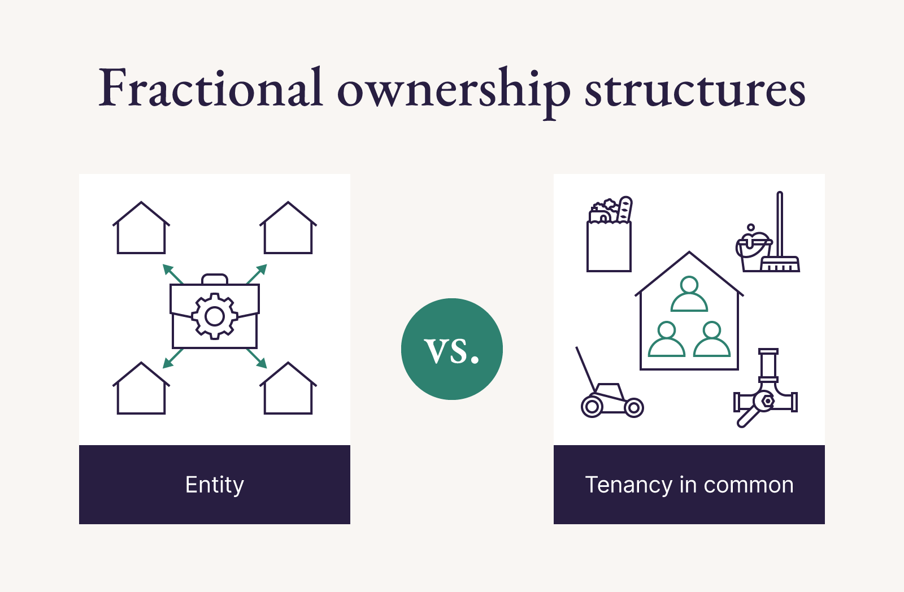

## Table of Contents

## What is fractional ownership?

Fractional ownership is a way for people to own a part of something expensive, like a vacation home or an airplane, without having to pay for all of it. Instead of one person owning the whole thing, many people can buy smaller parts of it. This makes it easier for more people to enjoy things that might be too costly for just one person to buy.

For example, if a vacation home costs $1 million, instead of one person buying the whole house, 10 people could each buy a 10% share for $100,000. Each owner can then use the home for a certain amount of time each year. This way, everyone gets to enjoy the vacation home without the full financial burden. Fractional ownership is popular for things like vacation properties, private jets, and even art.

## How does fractional ownership work?

Fractional ownership works by letting people buy a piece of something expensive, like a vacation home or a private jet. Instead of one person owning everything, many people can own parts of it. For example, if a vacation home costs $1 million, 10 people could each buy a 10% share for $100,000. This way, each person only pays for a small part of the total cost, making it easier for more people to afford it.

Once the ownership is divided, each owner gets to use the property for a certain amount of time each year. This is usually arranged in advance, so everyone knows when they can use it. The owners might also share the costs of keeping the property in good shape, like paying for repairs or cleaning. This makes it a good option for people who want to enjoy luxury items without the full financial responsibility.

## What are the benefits of fractional ownership?

Fractional ownership lets you own part of something expensive, like a vacation home or a private jet, without having to pay for all of it. This means you can enjoy luxury items that might be too costly if you had to buy them all by yourself. For example, if a vacation home costs a million dollars, you could buy a small part of it for much less money. This makes it easier for more people to afford nice things.

Another benefit is that you share the costs of keeping the property in good shape. This includes things like repairs, cleaning, and maintenance. When you own only a part of something, you only pay for a part of these costs. This can save you a lot of money compared to owning the whole thing by yourself. Plus, you get to use the property for a certain amount of time each year, so you still get to enjoy it without the full responsibility.

## What are the potential risks and drawbacks of fractional ownership?

One risk of fractional ownership is that you might not always get to use the property when you want to. Since you share it with other people, you have to plan ahead and follow a schedule. If someone else is using it during the time you want, you might have to wait or change your plans. Also, if there's a disagreement among the owners about how to use or maintain the property, it can cause problems and stress.

Another drawback is that you still have to pay for part of the costs to keep the property in good shape. Even though you only own a piece of it, you have to share the costs of things like repairs, cleaning, and taxes. If something big breaks, like the roof, you and the other owners will have to pay for it together. This means you might end up spending more money than you planned, especially if there are unexpected expenses.

Lastly, selling your share of the property can be tricky. Since you only own a part of it, finding someone who wants to buy just that part can be hard. You might have to wait a long time to sell, or you might not get as much money as you hoped. This can make it difficult if you need to get your money out of the investment quickly.

## In which industries is fractional ownership commonly used?

Fractional ownership is commonly used in the real estate industry, especially for vacation homes. Instead of one person buying a whole vacation home, many people can buy smaller parts of it. This makes it easier for more people to enjoy a vacation home without having to pay for all of it. Each owner gets to use the home for a certain amount of time each year, and they share the costs of keeping the home in good shape.

Another industry where fractional ownership is popular is the aviation sector, particularly for private jets. Owning a private jet is very expensive, so fractional ownership allows people to buy a part of a jet instead of the whole thing. This way, they can use the jet for a certain number of hours each year, and they share the costs of maintaining the jet with other owners. This makes private air travel more affordable for more people.

Fractional ownership is also used in the art world. High-value artworks can be very expensive, so people can buy a share of a piece of art instead of the whole thing. This allows more people to invest in and enjoy valuable art without having to pay the full price. The owners might get to display the art in their homes for a certain period or share in any profits if the artwork is sold later.

## How can someone get started with fractional ownership?

To get started with fractional ownership, the first step is to decide what you want to own a part of. It could be a vacation home, a private jet, or even a piece of art. Once you know what you're interested in, you need to find a company or a group that offers fractional ownership in that item. Many real estate companies, aviation firms, and art investment platforms provide these opportunities. You can search online or talk to a financial advisor to find the right option for you.

After finding a suitable opportunity, you'll need to buy your share. This means paying for a part of the total cost of the item. For example, if you want to own a part of a vacation home, you might buy a 10% share. Once you've bought your share, you'll need to agree on how to use and maintain the item with the other owners. This often involves setting up a schedule for using the property and sharing the costs of upkeep. Make sure you understand all the terms and conditions before you commit to the purchase, so you know what you're getting into.

## What legal considerations should be taken into account with fractional ownership?

When you get into fractional ownership, you need to think about the legal stuff. First, you'll need a legal agreement that says how much of the property you own and how you can use it. This agreement should also talk about what happens if you want to sell your part or if someone else wants to buy it. It's important to have everything written down clearly so everyone knows what they're supposed to do. You might also need to think about taxes. Owning a part of something can mean you have to pay taxes on it, and the rules can be different depending on where the property is.

Another thing to consider is how decisions are made. If you own a part of a vacation home with other people, you'll need to agree on things like repairs and how to use the home. Sometimes, you might need to vote on big decisions, and the agreement should say how that works. If there's a problem, like someone not paying their share of the costs, you'll need to know what to do. It's a good idea to talk to a lawyer who knows about fractional ownership to make sure you understand all the legal parts and to help you make a good agreement with the other owners.

## How does fractional ownership differ from timeshares?

Fractional ownership and timeshares are two ways to enjoy a vacation home without buying the whole thing, but they are different. With fractional ownership, you actually own a part of the property. This means you have a legal share in the home, and you can sell it or pass it on to someone else if you want. You also get to use the home for a certain amount of time each year, and you share the costs of keeping it in good shape with the other owners.

Timeshares, on the other hand, are more like renting a part of the property for a certain time each year. You don't own any part of the home; you just have the right to use it during your assigned time. This can be cheaper than fractional ownership, but it also means you don't have any say in how the property is managed or maintained. If you decide you don't want the timeshare anymore, it can be harder to sell because you're not selling a piece of the property, just the right to use it.

## What are some successful examples of fractional ownership in real estate?

One successful example of fractional ownership in real estate is Pacaso. Pacaso lets people buy a part of a vacation home instead of the whole thing. This makes it easier for more people to own a nice vacation home without spending a lot of money. Each owner gets to use the home for a certain number of weeks each year, and they share the costs of keeping the home in good shape. Pacaso takes care of all the details, like scheduling and maintenance, so it's easy for the owners.

Another example is Arrived Homes. Arrived Homes lets people invest in rental properties by buying shares. Instead of buying a whole house, you can buy a small part of it. This means you can start investing in real estate with less money. Arrived Homes manages the properties and shares the rental income with the owners based on how much of the property they own. This way, people can make money from real estate without having to be a landlord themselves.

## How does fractional ownership impact asset management and investment strategies?

Fractional ownership changes how people manage their assets and plan their investments. Instead of buying a whole expensive thing like a vacation home or a private jet, people can buy just a part of it. This means they can spread their money across different investments without spending a lot on one thing. For example, if someone has $100,000, they could buy a small part of a vacation home, a piece of art, and a share in a private jet. This way, they can enjoy different things and also spread the risk of their investments.

Fractional ownership also makes it easier to get into markets that might be too expensive otherwise. For instance, real estate in popular vacation spots or high-value art can be very costly. By owning a part of these assets, people can still benefit from their value going up without having to pay the full price. This can be a smart part of an investment strategy because it lets people own a piece of something that might grow in value over time. Plus, they can share the costs of keeping the asset in good shape, which can save them money and make the investment more manageable.

## What role does technology play in facilitating fractional ownership?

Technology makes fractional ownership easier by helping people find and buy parts of expensive things like vacation homes or private jets. There are websites and apps that let you look at different options and buy a share of something you like. These platforms take care of all the details, like making schedules for when you can use the property and keeping track of who owns what. They also help with payments and make sure everyone knows what they have to pay for things like repairs and maintenance.

Another way technology helps is by making it easier to manage and sell your share of the property. If you want to sell your part, these platforms can help you find someone who wants to buy it. They also keep all the legal documents safe and easy to find, so everyone knows what they agreed to. This makes the whole process smoother and less stressful, so more people can enjoy the benefits of owning a part of something expensive without having to worry about all the complicated stuff.

## What future trends are expected in the field of fractional ownership?

In the future, more people might use fractional ownership for all sorts of things, not just vacation homes and private jets. We might see people owning parts of cars, boats, or even high-tech gadgets. Technology will make it easier to find and buy these shares, with apps and websites showing you all the options and helping you manage your part of the property. This could make expensive things more affordable for more people and let them invest in different kinds of assets.

Another trend could be using blockchain and smart contracts to make fractional ownership safer and easier. These technologies can keep track of who owns what and make sure everyone follows the rules without needing a middleman. This could make buying and selling shares quicker and more secure, and it might also help people trust fractional ownership more. As more people learn about these benefits, fractional ownership could become a common way to own and enjoy expensive things.

## References & Further Reading

[1]: Walton, D. (2018). ["Fractional Ownership: The Financial World’s Best Kept Secret"](https://www.financestrategists.com/wealth-management/alternative-investment/fractional-ownership/). Forbes.

[2]: Miller, G. (2021). ["Shared Ownership: A Comprehensive Guide to Property Ownership"](https://gleague.nba.com/news/leonard-miller-named-kia-nba-g-league-player-of-the-month). Expert Law Review.

[3]: Lo, A. W. (2010). ["Hedging Your Bets in Real Estate with Algorithmic Trading"](https://blog.elearnmarkets.com/a-comprehensive-guide-to-hedging-strategies/) Real Estate Finance Journal.

[4]: Chan, E. P. (2009). ["Quantitative Trading: How to Build Your Own Algorithmic Trading Business"](https://github.com/ftvision/quant_trading_echan_book) by Ernest P. Chan

[5]: Lopez de Prado, M. (2018). ["Advances in Financial Machine Learning"](https://www.amazon.com/Advances-Financial-Machine-Learning-Marcos/dp/1119482089) by Marcos Lopez de Prado

[6]: Jansen, S. (2020). ["Machine Learning for Algorithmic Trading"](https://github.com/stefan-jansen/machine-learning-for-trading) by Stefan Jansen