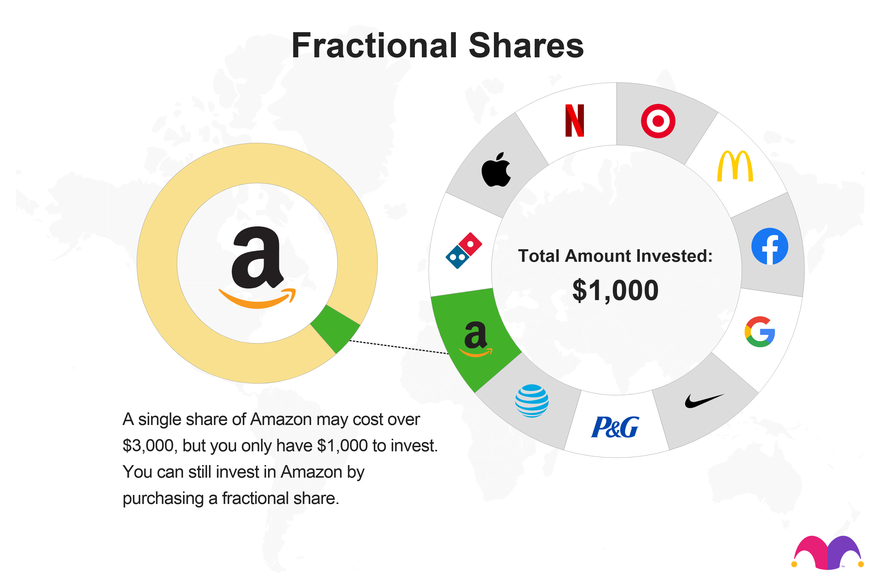

## Table of Contents

## What is a fractional share?

A fractional share is a portion of a whole stock that is less than one full share. This means you can buy a part of a company's stock instead of having to buy a whole share, which can be expensive. For example, if a stock costs $1,000 per share, you could buy a fractional share for $100, owning 1/10th of a share.

Fractional shares are useful for people who want to invest in expensive stocks but don't have enough money to buy a full share. They also help investors to diversify their portfolio by allowing them to spread their money across different stocks. Many online brokerages now offer the option to buy and sell fractional shares, making it easier for more people to start investing.

## How do fractional shares work?

Fractional shares let you buy a part of a stock instead of a whole one. If a stock costs $100 per share, you can buy a piece of it for less money, like $10 for 1/10th of a share. This is helpful if you want to invest in a company but can't afford a full share. Many online brokerages offer this option, making it easier for more people to start investing.

When you own a fractional share, you get a part of the benefits that come with owning a whole share. This includes dividends, which are payments companies sometimes give to shareholders. If a company pays a $1 dividend per share, and you own 1/10th of a share, you would get $0.10. You can also sell your fractional shares whenever you want, just like whole shares. This makes it easy to manage your investments and adjust your portfolio as needed.

## Why would someone want to buy fractional shares?

Someone might want to buy fractional shares because they make it easier to start investing without a lot of money. If a stock is very expensive, like $1,000 per share, a person might not be able to afford a whole share. But with fractional shares, they can buy a part of that stock for less money, like $100 for 1/10th of a share. This way, they can still own a piece of the company and start building their investment portfolio.

Another reason to buy fractional shares is to diversify investments. Instead of putting all their money into one stock, a person can spread it across many different stocks. For example, if they have $1,000 to invest, they could buy fractional shares in 10 different companies instead of just one whole share of a single company. This helps reduce risk because if one stock does poorly, the others might do well and balance things out.

## What are the benefits of investing in fractional shares?

Investing in fractional shares lets you start investing with less money. If a stock costs a lot, like $1,000 per share, you might not be able to buy a whole share. But with fractional shares, you can buy a part of that stock for less money, like $100 for 1/10th of a share. This way, you can still own a piece of the company and begin building your investment portfolio without needing a lot of money upfront.

Another benefit of fractional shares is that they help you spread your investments across many different stocks. Instead of putting all your money into one stock, you can buy fractional shares in several companies. For example, if you have $1,000 to invest, you could buy fractional shares in 10 different companies instead of just one whole share of a single company. This helps reduce risk because if one stock does poorly, the others might do well and balance things out.

## Which platforms or brokers offer fractional shares?

Many online platforms and brokers now offer the option to buy and sell fractional shares. Some popular ones include Robinhood, which lets you buy parts of stocks with no minimum investment, and Charles Schwab, where you can buy fractional shares of stocks and ETFs. Fidelity also offers fractional shares, allowing you to invest in stocks starting at $1.

Other platforms that support fractional shares are E*TRADE, which lets you buy fractional shares of S&P 500 stocks, and Interactive Brokers, where you can invest in fractional shares of stocks and ETFs. Vanguard offers fractional shares too, but only for their ETFs. These platforms make it easy for people to start investing without needing a lot of money.

## How can you purchase fractional shares?

To purchase fractional shares, you need to use a platform or broker that offers this option. Some popular ones are Robinhood, Charles Schwab, and Fidelity. You can start by opening an account with one of these brokers. Once your account is set up, you can search for the stock you want to buy. Instead of buying a whole share, you can choose to buy a fraction of it. For example, if you want to invest in a stock that costs $100 per share, you can buy a part of it for $10, which would be 1/10th of a share.

After choosing the stock and the amount you want to invest, you can place your order. The process is usually simple and quick, similar to buying a whole share. You can set up automatic investments if you want to buy more fractional shares over time. Once you own the fractional shares, you can keep them in your account and watch them grow. You can also sell them whenever you want, just like whole shares. This makes it easy to manage your investments and adjust your portfolio as needed.

## What are the costs associated with buying and selling fractional shares?

When you buy and sell fractional shares, you might have to pay some fees. Many brokers let you buy and sell fractional shares without charging a commission, which is great because it means you don't have to pay extra money just to make a trade. But, some brokers might still charge small fees for other services, like account maintenance or for using their platform. It's a good idea to check with your broker to see what fees they might charge.

Even though there might be some costs, the main advantage of fractional shares is that they let you start investing with less money. You can buy a part of a stock instead of a whole one, which can be cheaper. This makes it easier for more people to invest in the stock market and build their portfolios over time. Just remember to look at all the costs involved so you can make the best choice for your investments.

## Can you receive dividends from fractional shares?

Yes, you can receive dividends from fractional shares. If a company pays a dividend, you get a part of it based on how much of the share you own. For example, if a company pays a $1 dividend per share and you own 1/10th of a share, you would get $0.10.

This makes fractional shares a good way to earn money from stocks even if you can't afford a whole share. You can still benefit from the company's profits just like someone who owns a full share.

## How do you sell fractional shares?

Selling fractional shares is easy and works a lot like selling whole shares. If you have an account with a broker that lets you buy and sell fractional shares, you can just log into your account and find the stock you want to sell. Then, you can choose how much of that stock you want to sell. If you own a part of a share, you can sell that part just as easily as if you owned a whole share.

After you decide how much you want to sell, you can place your order. The process is quick and simple. Once your order is complete, the money from the sale will go into your account. You can use that money to buy other stocks or take it out if you need it. Selling fractional shares lets you manage your investments easily and adjust your portfolio whenever you want.

## What are the tax implications of trading fractional shares?

When you trade fractional shares, you need to think about taxes. If you make money by selling your fractional shares for more than you paid for them, you might have to pay capital gains tax. This tax depends on how long you held the shares. If you held them for less than a year, it's a short-term capital gain, and you'll pay tax at your regular income tax rate. If you held them for more than a year, it's a long-term capital gain, and the tax rate is usually lower.

You also need to think about dividends. If you get dividends from your fractional shares, you might have to pay taxes on that money too. The tax rate for dividends can be different based on whether they are qualified or non-qualified dividends. It's a good idea to keep track of all your trades and dividends so you can report them correctly on your taxes. Talking to a tax advisor can help you understand all the rules and make sure you're doing things right.

## How do fractional shares affect portfolio diversification?

Fractional shares make it easier to spread your money across many different stocks. If you only have a little money to invest, you can buy small pieces of many companies instead of just one whole share. This helps you build a more diverse portfolio because you're not putting all your money into one stock. If one company does badly, the others might do well and balance things out, which can lower your risk.

Having a diverse portfolio is important because it can help protect your money. When you own fractional shares in different companies, you're less likely to lose a lot of money if one stock goes down. This way, you can still grow your investments over time, even if you start with a small amount of money. Fractional shares let you take part in the stock market and build a strong, varied investment plan.

## What are the potential risks and limitations of investing in fractional shares?

When you invest in fractional shares, there are some risks and limits you should know about. One big risk is that the value of the stock can go down, just like with whole shares. If the company does badly, you could lose money on your investment. Also, not all brokers offer fractional shares, so you might be limited in where you can buy and sell them. Some brokers might charge fees for trading or other services, which can add up over time and eat into your profits.

Another thing to think about is that you might not get all the same benefits as someone who owns whole shares. For example, some companies give shareholders voting rights, but with fractional shares, you might not get a full vote. Also, if the company goes bankrupt, you might not get as much money back as someone who owns whole shares. It's important to understand these limits and risks before you start investing in fractional shares.

## References & Further Reading

[1]: Malkiel, B. G. (2007). ["A Random Walk Down Wall Street: The Time-Tested Strategy for Successful Investing"](https://www.amazon.com/Random-Walk-Down-Wall-Street/dp/0393330338). W. W. Norton & Company.

[2]: ["Advances in Financial Machine Learning"](https://www.amazon.com/Advances-Financial-Machine-Learning-Marcos/dp/1119482089) by Marcos Lopez de Prado

[3]: ["The Complete Guide to Fractional Investing: How to Buy Shares on a Budget"](https://www.investopedia.com/how-to-buy-fractional-shares-7482606) Fidelity Investments.

[4]: ["Machine Learning for Algorithmic Trading"](https://github.com/stefan-jansen/machine-learning-for-trading) by Stefan Jansen

[5]: Securities and Exchange Commission. (2020). ["Investor Bulletin: Understanding Margin Accounts"](https://www.sec.gov/investor/alerts/ib_marginaccounts.pdf). U.S. Securities and Exchange Commission.