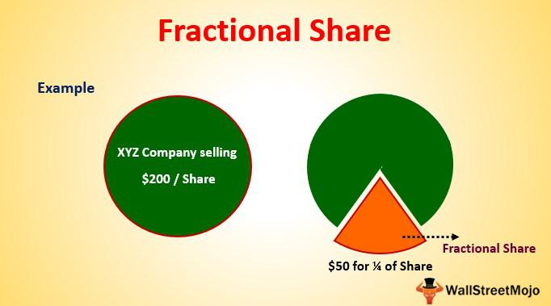

Fractional shares have emerged as a transformative element in the investment landscape, providing unprecedented opportunities for both novice and seasoned investors. These are essentially portions of a full share, allowing individuals to invest in high-priced stocks without needing to purchase entire shares. This innovation makes even the most expensive stocks accessible, enabling a more inclusive approach to investing. The introduction of fractional shares has fundamentally changed how people engage with the stock market, democratizing access and allowing investors to diversify portfolios with smaller sums of money.

The concept of fractional shares extends beyond just buying portions of expensive stocks. It encompasses both the buying and selling processes, offering flexibility and cost efficiency that were previously unattainable. For instance, fractional shares allow investors to implement cost averaging—an investment strategy where money is systematically invested in small portions, reducing the impact of market volatility.



Moreover, fractional shares have gained significant traction among retail investors. With stocks like those of major tech companies often trading at several hundred, if not thousands, of dollars per share, fractional ownership makes these stocks accessible to a broader audience. This accessibility encourages greater participation from individuals who might otherwise be priced out of the market.

Another critical aspect of fractional shares is their role in algorithmic trading. The precision and flexibility offered by fractional shares allow sophisticated trading algorithms to execute transactions with greater accuracy and efficiency, especially in volatile market conditions. This integration enhances trading strategies, enabling more nuanced decisions that can lead to optimized returns.

The growing interest in fractional shares can be attributed to their ability to make high-priced stocks more approachable, their contribution to diversified portfolio strategies, and their facilitation of efficient algorithmic trading practices. As such, they represent a significant advancement in the financial world, one that continues to draw interest from an expanding base of retail investors.

## Table of Contents

## What are Fractional Shares?

Fractional shares represent a portion of a full share in a publicly traded company, allowing investors to purchase a fraction of a share rather than needing to buy a whole one. Unlike traditional shares, which require buying an entire share, fractional shares enable small investors or those with limited budgets to invest in high-priced stocks by acquiring smaller pieces of those stocks. This approach markedly differs from the all-or-nothing nature of traditional full shares, thus appealing to a broader audience.

Fractional shares can originate through several mechanisms. One common method of creation is stock splits. In a stock split, a company increases the number of its outstanding shares, thus decreasing the price per share proportionately. For instance, in a 2-for-1 stock split, an investor who owns one full share will now possess two shares, each valued at half of the original share price. If the investor originally held a partial share, the stock split would further fractionalize their holding.

Another method by which fractional shares come into existence is through mergers and acquisitions. During these corporate events, it is rare for the conversion rate of shares between the two entities involved in the merger to result in perfect whole shares for all investors, often leading to fractional figures post-conversion.

Dividend reinvestment plans (DRIPs) also play a crucial role in the emergence of fractional shares. When companies issue dividends, investors enrolled in DRIPs may have the option to automatically reinvest dividends to purchase additional shares instead of receiving cash payouts. Since the reinvestment amount might not equal the current trading price of a full share, investors often acquire fractional shares in the process. 

Fractional shares possess significant relevance in the democratization of investing. By lowering the entry threshold, fractional shares provide equitable access to investment opportunities that were once reserved for individuals with substantial financial resources. This transformation empowers a diverse array of investors to diversify their portfolios by investing in high-priced stocks like Amazon or Berkshire Hathaway. As a result, the approach facilitates broader participation in financial markets, fostering a more inclusive investment landscape.

## Benefits of Buying Fractional Shares

Fractional shares have opened new doors for small investors by making it easier to invest in high-priced stocks that were once out of reach. Traditional investing often requires purchasing whole shares, which can be a significant financial barrier for those who want to own shares in large, expensive companies like Amazon or Google. Fractional shares allow investors to buy just a portion of a share, thus lowering the entry cost and enabling more individuals to participate in the stock market.

One of the most significant advantages of fractional shares is the opportunity they provide for portfolio diversification. By being able to purchase smaller portions of various stocks, investors can spread their investments across multiple companies and industries without needing a substantial amount of capital. This diversification helps to mitigate risk, as the performance of a single stock or sector will have a less pronounced impact on the overall value of an investor's portfolio.

In addition to enhancing diversification, fractional shares facilitate the practice of cost averaging. This strategy involves investing a fixed amount of money at regular intervals, regardless of the stock price. By purchasing fractional shares, investors can consistently buy into expensive stocks even with limited resources. Over time, this can result in a lower average cost per share, as purchases occur both when stock prices are high and low. This approach can be particularly beneficial during periods of market [volatility](/wiki/volatility-trading-strategies), as it reduces the impact of price fluctuations on investment returns.

To illustrate, consider an investor who chooses to invest $100 monthly in a stock priced at $1,000 per share. Without fractional shares, this investor would have to wait several months to accumulate sufficient funds to buy a whole share. However, with the option to purchase fractions of a share, the investor can acquire 0.1 shares each month, benefiting from any price changes during that period and decreasing the overall risk.

Overall, fractional shares significantly increase the flexibility and accessibility of the stock market, enabling small investors to pursue more comprehensive investment strategies than previously possible. This capability helps more individuals participate in economic growth and achieve their financial goals.

## Challenges of Selling Fractional Shares

Fractional shares, while offering numerous advantages to investors, present certain challenges when it comes to selling. One of the primary complications is the issue of [liquidity](/wiki/liquidity-risk-premium). Unlike full shares, fractional shares can be more difficult to sell because they do not always find a ready market. Liquidity concerns arise as potential buyers may not be interested in purchasing fractional amounts, often preferring to invest in whole shares. This can result in longer wait times to execute a sale, particularly if an investor seeks a specific price point.

In traditional investing setups, selling fractional shares often necessitates combining them to form whole shares before they can be sold. This requirement primarily arises from the conventional stock market structure where transactions are typically executed in full share quantities. For instance, if an investor holds 0.4 and 0.6 fractional shares of a particular stock, the optimal approach would be to combine these fractions to form a complete share, facilitating a smoother sale. This need for aggregation can pose a hurdle for investors wishing to quickly liquidate their holdings.

Major brokerages are increasingly addressing these challenges through innovative financial technologies. They have developed novel systems and tools that allow for the direct sale and purchase of fractional shares without needing to combine them into whole shares. For example, some platforms provide internal mechanisms to match buyers and sellers of fractional shares within their systems. This internal matching can significantly reduce liquidity issues, enabling investors to execute transactions more efficiently.

Additionally, brokerages are enhancing their technological frameworks with advanced algorithms that can optimize the trading of fractional shares. These algorithms identify favorable market conditions for executing transactions in fractional shares, thus addressing both buy-side and sell-side liquidity concerns. Through [machine learning](/wiki/machine-learning) and data analysis, these algorithms can predict demand for fractional shares, facilitating timely and cost-effective trades for clients.

The application of blockchain technology is another area where brokerages are innovating to overcome liquidity challenges. Blockchain can provide a transparent and immutable record of fractional shares transactions, thereby increasing trust and potentially drawing more participants to the market for fractional shares. By creating a more robust marketplace with a clear audit trail, blockchain innovations can enhance the liquidity of fractional shares.

In summary, while selling fractional shares presents distinct challenges primarily due to liquidity concerns and the need to form whole shares, major brokerages are deploying innovative financial technologies to mitigate these issues. Through advanced algorithms and blockchain technology, these institutions are creating more efficient avenues for trading fractional shares, providing investors with increased flexibility and opportunities in the stock market.

## Fractional Shares in Algorithmic Trading

Fractional shares have become pivotal in [algorithmic trading](/wiki/algorithmic-trading), enhancing both trading strategies and execution precision. By allowing investors to purchase portions of a share, rather than a full one, fractional shares enable algorithms to optimize trade structures, particularly in volatile markets.

Algorithmic trading, which utilizes computer programs to execute trades based on predefined strategies, benefits significantly from the agility and granularity offered by fractional shares. The core advantage lies in the ability to execute strategies that require precise investment amounts, which is often challenging with full shares due to their higher price points or limited availability. For example, if a trading algorithm identifies an opportunity in a high-priced stock, purchasing a full share may exceed the targeted investment cap of the strategy. Fractional shares enable the algorithm to invest exactly as intended without overcommitting capital.

Moreover, fractional shares enhance trading flexibility and precision. Consider a portfolio rebalancing algorithm aiming for specific asset allocation percentages. Fractional shares allow the algorithm to adjust positions with exactness that aligns with desired portfolio weightings, thereby maintaining balance with minimal effort and slippage.

In volatile markets, algorithms leveraging fractional shares can rapidly adjust positions. A common practice in algorithmic trading is adjusting positions based on small price movements. Fractional shares allow for micro-investments that can be scaled up or down swiftly, optimizing the potential to capitalize on short-term market fluctuations without significant capital investment. This capability can be integrated into algorithms using Python, which is a popular language for developing trading algorithms due to its rich ecosystem of financial libraries such as `pandas`, `numpy`, and `alpaca-trade-api`.

Here is an example of a Python code snippet that demonstrates how fractional shares can be utilized in a simple trading algorithm:

```python
import alpaca_trade_api as tradeapi

api = tradeapi.REST('YOUR-API-KEY', 'YOUR-SECRET-KEY', base_url='https://paper-api.alpaca.markets')

def buy_fractional_shares(symbol, dollar_amount):
    # Get the latest market data
    latest_price = api.get_barset(symbol, 'minute', 1)[symbol][0].c
    fractional_qty = dollar_amount / latest_price

    # Place a market order for fractional share
    api.submit_order(
        symbol=symbol,
        qty=fractional_qty,
        side='buy',
        type='market',
        time_in_force='gtc'
    )

buy_fractional_shares('AAPL', 50)  # Example: buy $50 worth of Apple stock
```

In this example, the algorithm calculates the number of shares that can be purchased for a specified dollar amount, employing the fractional quantity achievable with current market prices. Such precision is particularly valuable when executing large-scale strategies across numerous stocks and asset classes simultaneously.

Overall, the integration of fractional shares into algorithmic trading complements efficient capital allocation, enhances market entry and [exit](/wiki/exit-strategy) strategies, and empowers sophisticated asset management—all crucial factors in achieving competitive edge and maximizing returns in today's dynamic markets.

## How to Buy and Sell Fractional Shares

Fractional shares represent a portion of a full share of a company and can be an effective way for investors to enter the stock market with limited funds. The process of buying and selling these shares is made convenient through online brokers, each offering different features that facilitate trading.

### Buying Fractional Shares

1. **Research and Select a Broker**: Several online platforms enable the trading of fractional shares. Popular choices include Robinhood, Charles Schwab, and Fidelity. Each has unique features, such as commission-free trades or user-friendly interfaces, which should match your trading needs.

2. **Open a Brokerage Account**: Once you've chosen a broker, you'll need to create an account. This generally requires providing personal information, such as your Social Security Number, address, and employment details. The process typically involves identity verification and funding the account.

3. **Choose Your Investments**: Decide on the companies or ETFs you’re interested in. It’s crucial to research and align your choices with your financial goals and risk tolerance.

4. **Place an Order**: Most brokers allow you to specify the dollar amount you wish to invest rather than the number of shares. This allows you to buy a fraction of a high-priced stock. For example, if you want to invest $50 in a company trading at $500 per share, you would own 0.1 shares.

5. **Monitor Your Investments**: Keep track of your fractional shares through broker-provided tools and resources. These platforms often offer insights and analytics to help you make informed decisions.

### Selling Fractional Shares

1. **Log into Your Brokerage Account**: Navigate to your portfolio where your investments are listed. Confirm the current value of your fractional shares as market conditions can affect their worth.

2. **Select the Shares to Sell**: Identify the fractional shares you wish to sell. It’s critical to consider the timing and market conditions, as these can significantly impact your potential returns.

3. **Specify Sale Parameters**: Similar to buying, you can choose to sell either by specifying the dollar amount or the fraction of shares. Be mindful of any potential fees associated with the transaction.

4. **Execute the Sale**: Confirm the transaction to sell your fractional shares. The sale proceeds, minus any brokerage fees, will be credited to your account.

### Platforms Specializing in Fractional Trading

Certain platforms have distinguished themselves by specializing in fractional trading:

- **Robinhood**: Known for its user-friendly mobile app, Robinhood offers commission-free trading and allows purchasing fractional shares with as little as $1.

- **Charles Schwab**: Schwab’s Stock Slices program enables investors to purchase fractional shares from a selection of top U.S. companies, with zero commission on trades.

- **Fidelity**: Fidelity allows trading of fractional shares for almost the entire stock market, offering comprehensive services and educational resources for investors.

By following these steps and utilizing specialized platforms, investors can efficiently buy and sell fractional shares, making the stock market accessible regardless of account size.

## Top Brokers Offering Fractional Shares

Several major brokerage firms have taken significant steps to offer fractional shares, making investments in high-valued stocks more accessible to a broader audience. Below are some of the prominent brokers providing fractional share trading, along with their distinctive features and benefits:

### Charles Schwab
Charles Schwab offers a service known as "Stock Slices," allowing investors to purchase fractional shares in any of the S&P 500 companies. Investors can start investing with as little as $5. The platform charges no commissions for online equity trades, which is a considerable advantage for cost-conscious investors. Schwab's well-regarded research resources and educational tools make it a strong choice for both novice and seasoned investors seeking fractional shares.

### Robinhood
Robinhood has gained popularity for its user-friendly mobile app and zero-commission trades. It allows investors to buy and sell fractions of shares with as little as $1. This has made Robinhood an attractive option for young investors and those looking to test fractional investing with minimal capital. Additionally, its clean interface simplifies the trading process and includes features such as real-time data and instant fund transfers.

### Fidelity Investments
Fidelity offers the "Stocks by the Slice" program, enabling clients to buy fractional shares of any stock listed in the S&P 500. Fidelity stands out with no commissions for stock transactions, and it provides robust research tools and customer service support. It's an excellent choice for investors who value comprehensive educational resources during their investment journey.

### E*TRADE
E*TRADE allows fractional share purchases through its "E*TRADE Core Portfolios" service, which is more oriented towards managed portfolios. While E*TRADE imposes some management fees for this service, it compensates with a strong platform usability, diverse investment options, and active trading tools. E*TRADE's platform is ideal for those who prefer a more managed approach to accessing fractional shares.

### Interactive Brokers
[Interactive Brokers](/wiki/interactive-brokers-api) offers a sophisticated trading platform with the ability to trade fractional shares. This broker has lower trading fees and a wide array of investment products, which appeals to active traders and international investors alike. Its "Pro" accounts have tiered pricing, while the "Lite" accounts offer commission-free trading, making it flexible to cater to different investment strategies.

### TD Ameritrade
Although TD Ameritrade does not explicitly advertise fractional share trading, it offers a variety of mutual funds and ETFs that can include fractional shares. This is particularly beneficial for investors interested in building diversified portfolios without the higher costs of full shares. TD Ameritrade excels with its advanced trading tools and high-quality educational content.

In conclusion, these brokers cater to various investor needs by combining low-cost trading, user-friendly platforms, and access to fractional shares. Such features enhance stock market participation, making it possible for a wider range of investors to build diversified portfolios efficiently.

## Conclusion

Fractional share trading has redefined the investment landscape by offering investors enhanced accessibility and flexibility. One of the significant advantages of fractional shares is the democratization of investing, allowing individuals with modest resources to hold positions in high-priced stocks. This broadens their investment portfolio and can lead to greater diversification, which is a crucial strategy for managing risks.

Fractional shares enable investors to engage in strategic trading without needing substantial capital. This makes the approach particularly appealing for those seeking to optimize their portfolios through cost-averaging strategies. By purchasing small portions of stocks over time, investors can mitigate the impact of market volatility and potentially enhance their returns.

However, trading fractional shares is not without its challenges. Investors may face liquidity issues, especially when selling, as fractional shares must often be consolidated into whole shares in traditional brokerage setups. Despite these challenges, major financial institutions continue to develop innovative technologies to alleviate these concerns, facilitating smoother trading experiences.

Overall, fractional shares represent a significant step forward in making stock market investment more inclusive. They remove barriers to entry, allowing a broader audience to participate in financial markets. As a result, fractional shares hold enormous potential in democratizing investment access and empowering individual investors to build diversified, robust portfolios. These qualities make them an appealing tool for both novice and experienced investors looking to navigate and excel in today's dynamic investment environment.

## FAQs

What are fractional shares and how are they created?
Fractional shares represent less than one whole share of a company. They are often created through stock splits, where a company divides its existing shares to lower the price per share; mergers, resulting in conversion rates that leave shareholders with a fractional share; and dividend reinvestment plans, where dividends are used to buy partial shares if the dividend amount is not enough to purchase a full share. These mechanisms enable investors to own portions of expensive stocks that might otherwise be inaccessible.

How do I start investing in fractional shares?
To begin investing in fractional shares, you need to open an account with a brokerage that offers fractional share trading. Many online brokers, such as Robinhood, Fidelity, and Schwab, provide this feature. Once your account is set up, you can start selecting stocks you wish to invest in, specify the dollar amount you aim to invest, and the brokerage will allocate the corresponding portion of shares. This approach allows investors to easily diversify their portfolios with limited capital.

Are there risks involved in buying fractional shares?
Yes, buying fractional shares involves risks similar to those of traditional stock trading. Market volatility can impact the value of fractional shares, leading to potential losses. Additionally, fractional shares might have lower liquidity, complicating their sale, especially in larger quantities. Investors should also be aware that not all fractional shares receive voting rights, and in certain cases, selling fractional shares may incur fees or restrictions depending on the brokerage.

Can I make money through fractional shares in algorithmic trading?
Yes, you can profit from fractional shares in algorithmic trading by leveraging strategies designed to capitalize on fractional shares' accessibility. Algorithms can facilitate efficient trades by optimizing the timing and quantity of fractional share transactions, especially in volatile markets. This functionality enhances trading precision and flexibility, offering opportunities for financial gains through systematic trading strategies.

Do all brokers offer fractional share trading?
No, not all brokers provide fractional share trading. While several prominent brokers in the market, such as Robinhood, Schwab, and Fidelity, have embraced fractional trading to attract retail investors, others may still be operating without this capability. It is crucial for investors to research and select brokers that align with their investment strategies and preferences before engaging in fractional share transactions.

## References & Further Reading

[1]: Malkiel, B. G. (2007). ["A Random Walk Down Wall Street: The Time-Tested Strategy for Successful Investing"](https://www.amazon.com/Random-Walk-Down-Wall-Street/dp/0393330338). W. W. Norton & Company.

[2]: ["Advances in Financial Machine Learning"](https://www.amazon.com/Advances-Financial-Machine-Learning-Marcos/dp/1119482089) by Marcos Lopez de Prado

[3]: ["The Complete Guide to Fractional Investing: How to Buy Shares on a Budget"](https://www.investopedia.com/how-to-buy-fractional-shares-7482606) Fidelity Investments.

[4]: ["Machine Learning for Algorithmic Trading"](https://github.com/stefan-jansen/machine-learning-for-trading) by Stefan Jansen

[5]: Securities and Exchange Commission. (2020). ["Investor Bulletin: Understanding Margin Accounts"](https://www.sec.gov/investor/alerts/ib_marginaccounts.pdf). U.S. Securities and Exchange Commission.