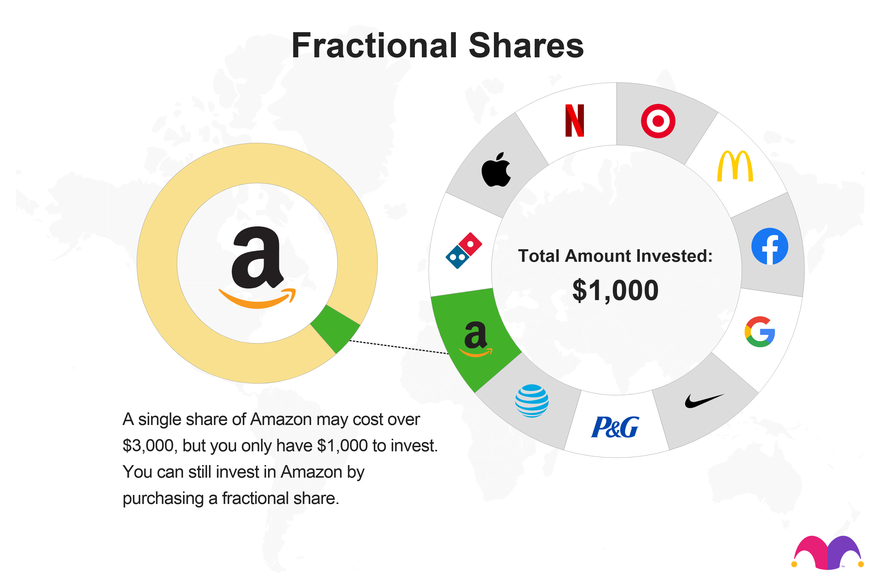

## Table of Contents

## What is fractional share purchasing?

Fractional share purchasing is when you can buy a part of a stock instead of a whole one. This is good for people who want to invest in expensive stocks but don't have enough money to buy a full share. For example, if a stock costs $1,000, you might be able to buy a piece of it for $100.

Many investment apps and platforms now offer fractional shares. This makes it easier for more people to start investing, even if they can only spend a little bit of money at a time. It helps spread out the risk too, because you can invest in different companies without spending a lot of money on each one.

## How does fractional share purchasing work?

Fractional share purchasing lets you buy a piece of a stock instead of a whole one. If a stock costs $100 per share, you might be able to buy just $10 worth of it. This is helpful if you want to invest in a company but don't have enough money to buy a full share. Many apps and platforms offer this option, making it easier for more people to start investing.

When you buy a fractional share, you own a part of the company, just like someone who owns a whole share. You can still earn dividends and see your investment grow if the stock price goes up. The main difference is that your gains or losses will be smaller because you own less of the stock. This way, you can spread your money across different companies without spending a lot on each one.

## What are the benefits of buying fractional shares?

Buying fractional shares makes it easier for people to start investing, even if they don't have a lot of money. If a stock is too expensive to buy a whole share, you can still invest in the company by buying a part of a share. This means you can own a piece of big companies like Amazon or Google without needing thousands of dollars.

Another benefit is that fractional shares help you diversify your investments. Instead of putting all your money into one stock, you can spread it across many different companies. This can lower your risk because if one company does badly, it won't affect your whole investment as much. Plus, you can still earn dividends and see your money grow, just like with whole shares.

## Which platforms offer fractional share purchasing?

Many popular investment apps and platforms now offer fractional share purchasing. Some of the well-known ones are Robinhood, Charles Schwab, and Fidelity. These platforms make it easy for people to buy parts of stocks, even if they don't have a lot of money. This way, you can invest in big companies without needing to buy a whole share.

Other platforms that offer fractional shares include Vanguard, SoFi, and M1 Finance. These services are designed to help people start investing with smaller amounts of money. They also often have user-friendly apps that make it simple to buy and manage your investments.

## Are there any risks associated with fractional share purchasing?

Yes, there are some risks with buying fractional shares. One risk is that not all companies offer fractional shares. This means you might not be able to invest in every company you want. Also, if the company you invest in does badly, the value of your fractional share will go down just like a whole share. This means you could lose money.

Another risk is that some platforms might charge fees for buying and selling fractional shares. These fees can add up over time and eat into your profits. It's important to check the fees before you start investing. Also, if you want to sell your fractional shares, you might find it harder to do so compared to whole shares because fewer people might want to buy them.

## How do fractional shares affect dividend payments?

When you own a fractional share, you still get dividends, but you get a smaller amount based on the size of your share. For example, if a company pays a $1 dividend per share and you own a quarter of a share, you would get $0.25. This way, you can still earn money from dividends even if you can't afford a whole share.

However, the process of getting dividends for fractional shares can be a bit different. Some platforms might pay you the exact amount based on your fractional share, while others might round it to the nearest cent. It's important to check how your platform handles dividends so you know what to expect.

## What is the minimum investment required for fractional shares?

The minimum investment for fractional shares can be very small, often just a few dollars. This makes it easy for people to start investing without needing a lot of money. Different platforms have different minimums, so it's a good idea to check before you start.

For example, some platforms let you buy fractional shares for as little as $1. This means you can own a piece of big companies like Apple or Tesla without spending a lot. It's a great way to get started with investing, even if you don't have much money to spend.

## How do you sell fractional shares?

Selling fractional shares is similar to selling whole shares, but it can depend on the platform you use. When you want to sell, you go to your investment app or website and find the option to sell your shares. If you own a fractional share, you can usually sell it just like a whole share. You pick how much of your fractional share you want to sell, and then you place the order.

The money from selling your fractional share will go back into your account, just like with whole shares. However, it might take a bit longer to sell fractional shares because not everyone wants to buy them. Some platforms might also charge fees for selling fractional shares, so it's good to check before you sell.

## Can fractional shares be transferred to another broker?

Transferring fractional shares to another broker can be tricky. Not all brokers allow you to transfer fractional shares. If your current broker doesn't support transferring fractional shares, you might need to sell them first and then move the money to the new broker. This means you might lose out on any gains if the stock price goes up after you sell.

Some brokers do allow transferring fractional shares, but it's important to check with both your current and new broker before you start the process. If they both support it, you can usually start a transfer by filling out a form or using an online tool. Just make sure you understand any fees or rules that might apply so you don't get any surprises.

## What are the tax implications of owning fractional shares?

The tax rules for fractional shares are pretty much the same as for whole shares. When you sell a fractional share, you might have to pay capital gains tax if you make a profit. The tax rate depends on how long you held the share. If you held it for a year or less, it's a short-term gain and taxed like regular income. If you held it for more than a year, it's a long-term gain and usually taxed at a lower rate.

You also need to think about taxes on dividends. If a company pays dividends and you own a fractional share, you'll get a smaller dividend based on your share size. You'll have to report these dividends on your taxes, and they might be taxed as ordinary income or at a special dividend tax rate, depending on your situation. It's a good idea to keep good records of your buys, sells, and dividends so you can handle your taxes easily.

## How does fractional share purchasing impact portfolio diversification?

Fractional share purchasing makes it easier for people to spread their money across different companies. If you don't have a lot of money, you can still buy parts of many stocks instead of just one. This helps you build a more balanced portfolio because you're not putting all your money into one place. By owning small pieces of many companies, you can lower the risk of losing a lot if one company does badly.

For example, if you have $100 to invest, you could buy a whole share of a cheaper stock or use that money to buy fractional shares of several more expensive stocks. This way, you get to own a piece of different industries and companies. It's like not putting all your eggs in one basket. Over time, this can help your investments grow more steadily because different parts of your portfolio might do well at different times.

## What are the future trends and predictions for fractional share purchasing?

Fractional share purchasing is likely to become even more popular in the future. As more people learn about investing, they want to start with small amounts of money. Apps and platforms are making it easier to buy parts of stocks, which means more people can join in. This trend is good for companies too, because it brings in more investors. We might see more platforms offering fractional shares and making the process even simpler.

Another trend could be that more types of investments might become available as fractional shares. Right now, you can mostly buy parts of stocks, but in the future, you might be able to buy pieces of bonds, real estate, or even art. This would give people more ways to spread their money around and invest in things they believe in. As technology gets better, buying and selling fractional shares might become faster and cheaper, making it easier for everyone to invest.

## References & Further Reading

[1]: Bergstra, J., Bardenet, R., Bengio, Y., & Kégl, B. (2011). ["Algorithms for Hyper-Parameter Optimization."](https://dl.acm.org/doi/10.5555/2986459.2986743) Advances in Neural Information Processing Systems 24.

[2]: ["Advances in Financial Machine Learning"](https://www.amazon.com/Advances-Financial-Machine-Learning-Marcos/dp/1119482089) by Marcos Lopez de Prado

[3]: ["Evidence-Based Technical Analysis: Applying the Scientific Method and Statistical Inference to Trading Signals"](https://www.amazon.com/Evidence-Based-Technical-Analysis-Scientific-Statistical/dp/0470008741) by David Aronson

[4]: ["Machine Learning for Algorithmic Trading"](https://github.com/PacktPublishing/Machine-Learning-for-Algorithmic-Trading-Second-Edition) by Stefan Jansen

[5]: ["Quantitative Trading: How to Build Your Own Algorithmic Trading Business"](https://books.google.com/books/about/Quantitative_Trading.html?id=j70yEAAAQBAJ) by Ernest P. Chan