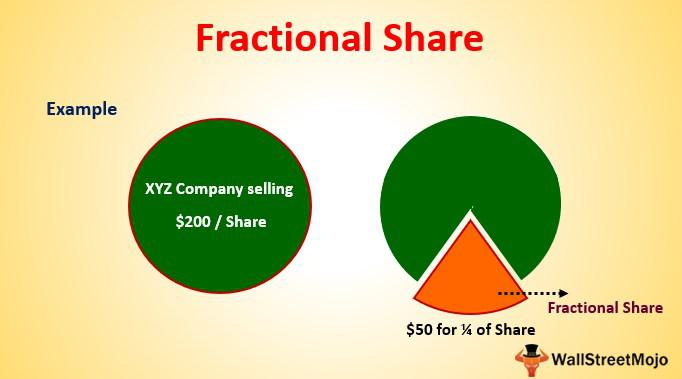

The stock market has undergone significant transformations over the years, evolving to incorporate a myriad of investment strategies and technological advancements. These innovations aim to enhance investors' ability to maximize returns while effectively managing risks. Among such advancements, the concept of fractional shares has emerged as a pivotal tool, enabling investors to purchase a portion of a stock rather than a whole unit. This approach opens the door to diversification and affordability, allowing individuals with limited capital to construct varied investment portfolios.

Alongside this development, algorithmic trading has become a cornerstone of modern investment practices. Algorithmic trading employs sophisticated computer algorithms to execute trades automatically based on predefined criteria. By leveraging technology, this approach minimizes emotional decision-making, optimizes trade timing, and increases the efficiency of transactions at speeds unmatched by human capabilities.



This article explores the convergence of fractional shares and algorithmic trading, examining how their integration can optimize investment strategies. By combining the accessibility and diversification potential of fractional shares with the precision and speed of algorithmic trading, investors stand to benefit from a more dynamic and effective participation in the stock market. This synergy not only democratizes access to finance by broadening investment opportunities but also refines the mechanisms through which trades are conducted, offering significant advantages in both strategy formulation and execution.

## Table of Contents

## Understanding Fractional Shares

Fractional shares provide investors the ability to purchase less than one full share of stock, thereby enabling investment in various companies without the necessity of buying entire shares. This innovation particularly benefits those with constrained budgets, allowing them to create diversified portfolios even with limited funds. By owning fractional shares, investors can distribute their investments across different stocks, thereby mitigating risk and enhancing the potential for returns.

Several investment platforms and brokers offer fractional shares, catering to both novice and experienced investors. These platforms often charge minimal fees, which increases accessibility to the stock market. Popular choices for investing in fractional shares include well-known platforms such as Robinhood, Charles Schwab, and M1 Finance. They allow users to invest specific dollar amounts rather than the price of a full share, thus aligning investments with individual financial capacities and goals.

However, fractional shares present certain limitations and challenges. First, not every stock is available for fractional purchase, restricting the range of available investment choices. In addition, transferring fractional shares between brokers can be complex or sometimes infeasible, as many brokerage firms do not support the transfer of fractional shares. These shares must often be sold and repurchased at the receiving broker, potentially incurring transaction costs and tax implications.

The utility of fractional shares is thus most advantageous when platforms provide a broad selection of stock offerings and support seamless management of investments. Despite some drawbacks, fractional shares democratize investing, making participation in the stock market more inclusive and providing opportunities for wealth accumulation across diverse economic segments.

## Advantages and Disadvantages of Fractional Shares

Fractional shares provide an accessible entry point into the stock market by allowing investors to purchase portions of stocks rather than whole shares. This characteristic is particularly beneficial for individuals with limited capital who wish to participate in trading high-value stocks like those of major tech companies. 

Affordability is a significant advantage of fractional shares, as it lowers the barrier to entry for aspiring investors. Instead of waiting to accumulate enough funds to buy an entire share, individuals can gradually build their portfolio by investing smaller amounts at regular intervals. This approach aligns well with dollar-cost averaging strategies, where investors make periodic investments in order to spread out the risk of price [volatility](/wiki/volatility-trading-strategies) over time.

Diversification is another key benefit. Fractional shares enable investors to distribute their investments across different sectors and companies without necessitating substantial financial resources. This diversification reduces reliance on the performance of individual stocks and can provide a cushion against market volatility. For instance, an investor could own a fraction of shares in several companies across various industries, achieving a balanced and risk-mitigated portfolio.

Despite these advantages, fractional shares also present certain challenges. Liquidity can be a concern, as fractional shares might be less readily traded in the market compared to whole shares. This could potentially complicate buying or selling positions at desired prices.

Moreover, fractional shares can introduce complexities in tax handling. When dealing with fractional shares, investors must be precise in accounting for partial stock transactions in their tax filings, which can be cumbersome. The fractional nature of these shares may require meticulous tracking of investment basis and transaction details over time.

In summary, while fractional shares offer a pathway to affordable and diversified investment portfolios, investors should be mindful of the associated potential [liquidity](/wiki/liquidity-risk-premium) constraints and tax filing intricacies. Evaluating these factors will help in making informed decisions aligned with financial goals and tolerance for risk.

## Algorithmic Trading: Technology Meets Investment

Algorithmic trading refers to the use of computer algorithms to execute trades at speeds and frequencies beyond human capability. This trading method leverages sophisticated algorithms based on predefined criteria, such as timing, price, and quantity, to make trading decisions. By automating the trading process, [algorithmic trading](/wiki/algorithmic-trading) minimizes human emotion, often an impediment in the trading decision-making process, and optimizes the timing of trade execution.

The core advantage of algorithmic trading is its ability to process vast amounts of data quickly, thus making rapid decisions that would be infeasible manually. Algorithms can be designed to analyze market conditions, detect lucrative opportunities, and execute trades with precision. This process entails complex mathematical models and formulas often beyond the comprehension of lay investors but essential for effective trading at micro and macro levels.

Different strategies encompass algorithmic trading. A common type is market-making, where the algorithm provides liquidity by setting simultaneous buy and sell prices. This approach allows traders to profit from the spread between the buying and selling prices. For instance, market-making algorithms continually quote buy and sell prices, dynamically adjusting as market conditions change.

Another significant algorithmic trading strategy is statistical [arbitrage](/wiki/arbitrage). This strategy relies on identifying price inefficiencies between correlated assets and profiting from their mean reversion tendencies. In simple terms, if two stocks historically move in concert but diverge, [statistical arbitrage](/wiki/statistical-arbitrage) algorithms identify the anomaly and execute trades to exploit the return to their historical pricing relationship.

Trend-following strategies also prominently feature in algorithmic trading. These algorithms are designed to identify trends based on historical data and market indicators, trading along the direction of the identified trend. This can involve moving averages or [momentum](/wiki/momentum) indicators, wherein an algorithm buys stocks on an uptrend or shorts them during a downtrend.

Algorithmic trading can be implemented using languages like Python due to its vast libraries and frameworks supporting data analysis and automation. Here is a simple Python example illustrating a moving average crossover strategy, a common trend-following tactic:

```python
import pandas as pd
import numpy as np

# Assumed DataFrame 'data' with stock prices

data['Short_MA'] = data['Close'].rolling(window=50).mean() # 50-day moving average
data['Long_MA'] = data['Close'].rolling(window=200).mean() # 200-day moving average

# Generating trading signals
data['Signal'] = np.where(data['Short_MA'] > data['Long_MA'], 1, 0)
data['Position'] = data['Signal'].diff()

# Display trading signals
print(data[['Close', 'Short_MA', 'Long_MA', 'Signal', 'Position']].tail())
```

In conclusion, algorithmic trading signifies a technological advancement in the investment landscape, offering enhanced precision, speed, and the potential to harness data-driven insights, transforming how trades are executed and managed.

## Combining Fractional Shares with Algorithmic Trading

Utilizing algorithmic trading in conjunction with fractional shares provides a compelling strategy that leverages the benefits of both approaches. This synergy allows investors to access the stock market with greater affordability and precision.

Algorithmic trading uses computer algorithms to execute trades swiftly and at a frequency unattainable by human traders. These algorithms can be programmed with complex mathematical models and data analytics to detect favorable trading conditions, thus optimizing investment decisions. When this technology is applied to fractional shares, it opens up possibilities for more nuanced and diversified investment strategies.

The primary advantage of combining fractional shares with algorithmic trading is that it democratizes access to sophisticated trading techniques. Investors can begin with a smaller capital base, buying into high-value stocks without purchasing full shares. Algorithms can optimize the timing and quantity of these purchases and sales based on real-time market data, aiming to maximize returns or minimize risk according to the investor's strategy.

For instance, consider an algorithm designed to implement a trend-following strategy. This could involve purchasing fractional shares of a stock when its price shows consistent upward momentum. The algorithm could be programmed to monitor specific indicators, such as moving averages, and automatically execute trades once set conditions are met. This ensures that trades are based on data rather than emotional decision-making.

Automated trading platforms are crucial for implementing such strategies efficiently. These platforms provide the technology necessary to execute algorithmic trades while offering the flexibility of fractional share purchasing. Combining these tools allows individual investors to replicate high-frequency trading strategies, commonly utilized by institutional investors, but on a scale suitable for individual portfolios.

By employing both fractional shares and algorithmic trading, investors can capitalize on the advantages of technology-driven strategies and accessibility to diversified assets. This approach offers an efficient method to achieve greater diversification and potentially enhanced returns, even with modest initial investments.

## Best Platforms for Investing in Fractional Shares with Algorithms

Not all stock trading platforms offer the combined functionalities of fractional shares and algorithmic trading, creating a niche for specific platforms that cater to these advanced investment strategies. Some platforms excel in providing tools for purchasing fractional shares, while others specialize in algorithmic trading. Evaluating which platform aligns with individual investment goals is crucial.

### Fidelity

Fidelity is a well-established platform that allows investors to trade fractional shares through its "Stocks by the Slice" program. The platform is known for its comprehensive research tools, educational resources, and minimal trade fees, making it attractive for both novice and seasoned investors. Although Fidelity does not inherently offer proprietary algorithmic trading, it supports integrations with third-party algorithmic trading software via its robust API services, making it a versatile choice for tech-savvy investors.

### Robinhood

Robinhood is particularly popular among younger investors. Its user-friendly interface and no-commission trades offer easy access to fractional shares without incurring significant transaction costs. While Robinhood lacks built-in advanced algorithmic trading features, it does provide an open API which allows investors to implement custom algorithmic strategies. However, it's important to note that Robinhood's focus is more on accessibility and ease of use rather than advanced trading technologies.

### M1 Finance

M1 Finance uniquely combines the features of fractional share investing with automated portfolio management. It offers "Pie Investing", where users can design custom portfolios of stocks and ETFs in fractional quantities. M1 Finance automates the rebalancing of these portfolios, akin to a simple algorithmic strategy, helping investors maintain their desired asset allocation without manual interference. Although M1's automation does not include high-frequency trading algorithms, its simplicity and the ability to allocate investments automatically based on user-defined "Pies" can emulate basic algorithmic principles.

### Considerations

Each platform comes with distinct features, costs, and limitations regarding stock availability. Factors such as transaction fees, the ease of use of their interfaces, and the extent of their support for third-party services must be considered. Platforms like Fidelity may cater to investors seeking a more comprehensive suite of trading tools and third-party integration capabilities, whereas Robinhood may appeal to those prioritizing cost and simplicity. M1 Finance serves those interested in automated portfolio management based on fractional shares.

In choosing a platform, investors must assess their own needs, technical expertise, and investment style to select the tool that best aligns with their strategic objectives. The right platform can significantly influence the success of an investment strategy that combines the benefits of fractional share investing and algorithmic trading.

## Conclusion

The integration of fractional shares and algorithmic trading represents a notable advancement in stock market participation. These innovations democratize finance by allowing individuals to access a broader range of investment opportunities, regardless of financial constraints. Fractional shares make it feasible for investors to buy into high-value stocks without needing substantial capital, thereby facilitating greater portfolio diversification.

Algorithmic trading further enhances this accessibility by employing technology to execute trades efficiently and effectively, minimizing human error and emotion-driven decisions. Algorithms analyze vast amounts of market data to identify the optimal timing to buy or sell, which can enhance the overall strategy implementation and maximize returns.

For investors aiming to utilize these opportunities, careful evaluation of available trading platforms is imperative. Each platform offers unique features, fee structures, and capabilities. Some specialize in fractional trading, while others excel in algorithmic execution, so aligning these options with one's investment strategy and risk tolerance is essential. By assessing their own financial goals and risk appetite, investors can effectively navigate this advanced landscape and potentially enhance their investment outcomes.

## References & Further Reading

[1]: Bergstra, J., Bardenet, R., Bengio, Y., & Kégl, B. (2011). ["Algorithms for Hyper-Parameter Optimization."](https://dl.acm.org/doi/10.5555/2986459.2986743) Advances in Neural Information Processing Systems 24.

[2]: ["Advances in Financial Machine Learning"](https://www.amazon.com/Advances-Financial-Machine-Learning-Marcos/dp/1119482089) by Marcos Lopez de Prado

[3]: ["Evidence-Based Technical Analysis: Applying the Scientific Method and Statistical Inference to Trading Signals"](https://www.amazon.com/Evidence-Based-Technical-Analysis-Scientific-Statistical/dp/0470008741) by David Aronson

[4]: ["Machine Learning for Algorithmic Trading"](https://github.com/PacktPublishing/Machine-Learning-for-Algorithmic-Trading-Second-Edition) by Stefan Jansen

[5]: ["Quantitative Trading: How to Build Your Own Algorithmic Trading Business"](https://books.google.com/books/about/Quantitative_Trading.html?id=j70yEAAAQBAJ) by Ernest P. Chan