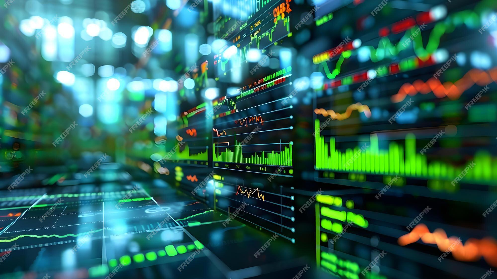

In the rapidly evolving world of finance, algorithmic trading has emerged as a cornerstone of modern market operations, characterized by its unparalleled efficiency and speed. Algorithmic trading, often synonymous with automated trading, involves the utilization of computer programs to execute a significant volume of trades, reducing human intervention and allowing for high-frequency trading. This approach thrives on the ability to rapidly process and analyze vast datasets, enabling traders to capitalize on even the smallest market inefficiencies with precision and speed.

Concurrently, the proliferation of trading venues has resulted in increased market fragmentation. Market fragmentation is defined by the existence of multiple trading platforms where financial securities are exchanged, diverging from the traditional centralized exchanges. This fragmentation is driven by advancements in technology and regulatory changes, leading to a more competitive trading landscape. While this competition can enhance market accessibility and potentially lower trading costs, it also introduces complexity.



The intersection of algorithmic trading and venue fragmentation presents a transformative dynamic in market operations. Algorithmic trading strategies must be adaptive to efficiently navigate multiple platforms and optimize trading opportunities. The fragmentation of trading venues impacts market liquidity and price discovery, which are critical components of market quality. Algorithmic traders must develop sophisticated strategies to manage the dispersed liquidity effectively.

Understanding these dynamics is crucial for traders, investors, and regulators. For traders and investors, comprehending the intricacies of venue fragmentation and its interaction with algorithmic trading can inform more effective trading strategies and risk management practices. For regulators, it is essential to ensure that the advantages of algorithmic trading and fragmented markets do not come at the expense of market integrity and stability. The delicate balance required in these domains underscores the necessity for ongoing research and adaptive regulatory frameworks to mitigate potential risks while harnessing the benefits that arise from these financial innovations.

## Table of Contents

## Understanding Trading Venue Fragmentation

Trading venue fragmentation refers to the proliferation of multiple trading platforms where financial securities are bought and sold. This concept has become increasingly prevalent in today's financial markets, largely due to regulatory changes and technological advancements. Fragmentation offers several benefits, particularly by providing more trading opportunities, which can enhance competition among venues. This competition can lead to better prices and services for traders, as venues strive to attract more business by improving their offerings.

However, market fragmentation also introduces challenges, especially regarding liquidity and price discovery. Liquidity, defined as the ease with which an asset can be bought or sold in the market without affecting its price, can become dispersed across multiple trading venues. This dispersion may lead to inefficiencies, as finding the best price for a transaction could require navigating through numerous platforms. This situation complicates the price discovery process, which is the mechanism through which the market arrives at the price of a security. Fragmentation can obscure the true price of an asset, as different venues might have varying prices at any given time.

The drivers behind venue fragmentation are primarily regulatory and technological. Regulatory changes, such as the implementation of the Markets in Financial Instruments Directive (MiFID) in the European Union, were designed to increase competition and transparency in financial markets, inadvertently encouraging the development of new trading venues. On the technological front, advances have facilitated the creation and accessibility of sophisticated trading platforms, catering to both institutional and retail traders.

For institutional traders, the benefits of fragmented markets include access to a broader range of trading strategies and the ability to exploit price differences among venues. They can use advanced algorithms to scan multiple platforms for the best prices, potentially improving their trading outcomes. However, they must also contend with the increased complexity and potentially higher costs associated with executing trades across different venues.

Retail traders, on the other hand, may benefit from the increased competition and choice that fragmentation brings. More venues can mean more options for trading styles and lower fees as platforms compete for business. Nonetheless, retail traders might face difficulties in navigating the multitude of available venues and assessing which one offers the best conditions for their trades.

In summary, trading venue fragmentation presents a double-edged sword for the financial markets. While it fosters competition and innovation, it also poses challenges related to [liquidity](/wiki/liquidity-risk-premium) and price discovery. Understanding the balance of these dynamics is crucial for participants within the financial system, as they navigate the increasingly complex landscape of modern trading environments.

## The Rise of Algorithmic Trading

Algorithmic trading involves the utilization of computer algorithms to execute trades with high speed and precision. This method has become increasingly prominent due to the pressing need for efficiency and accuracy in financial transactions. At its core, [algorithmic trading](/wiki/algorithmic-trading) is characterized by the ability to process and analyze extensive datasets rapidly, facilitating trade decisions far quicker than humanly possible.

The effectiveness of algorithmic trading largely rests on its capacity to leverage sophisticated mathematical models and statistical analysis. These algorithms can assess various market conditions, recognize patterns, and make real-time decisions on placing buy or sell orders. The velocity and [volume](/wiki/volume-trading-strategy) at which these trades are executed significantly exceed traditional manual trading methods.

A notable enhancement to algorithmic trading has been the integration of [artificial intelligence](/wiki/ai-artificial-intelligence) (AI) and [machine learning](/wiki/machine-learning) technologies. These advanced systems enhance the algorithms' capabilities by learning from historical data and adapting to new information. AI-powered algorithms can optimize trading strategies by simulating various market scenarios, thus improving prediction accuracy and decision-making processes. Machine learning, a subset of AI, allows algorithms to improve automatically through experience, using iterative processes to fine-tune their strategies based on past trades' outcomes.

Python, among other programming languages, plays a pivotal role in the development of these trading algorithms. Python's extensive libraries and tools, such as NumPy, pandas, and scikit-learn, facilitate data manipulation, statistical analysis, and machine learning tasks. For instance, a simple algorithmic trading strategy can be implemented in Python to track moving averages and execute trades based on certain threshold conditions:

```python
import numpy as np
import pandas as pd

# Example market data
data = pd.DataFrame({"Price": [101, 102, 103, 102, 104, 100, 98, 97, 96, 99]})

# Calculate moving averages
data['SMA'] = data['Price'].rolling(window=3).mean()

# Simple trading strategy
def trading_strategy(data):
    for i in range(1, len(data.index)):
        if data['Price'][i] > data['SMA'][i] and data['Price'][i-1] <= data['SMA'][i-1]:
            print(f"Buy at {data['Price'][i]}")
        elif data['Price'][i] < data['SMA'][i] and data['Price'][i-1] >= data['SMA'][i-1]:
            print(f"Sell at {data['Price'][i]}")

trading_strategy(data)
```

In this example, a simple moving average (SMA) is used to identify buying and selling opportunities, showcasing how even basic algorithms can be executed with precision and speed.

The rise of algorithmic trading marks a paradigm shift in financial markets, offering unprecedented levels of efficiency and accuracy. As these technologies continue to evolve, the potential to revolutionize trading further intensifies, making algorithmic trading an indispensable tool for modern financial markets.

## Impact of Fragmentation on Algorithmic Trading

Fragmentation significantly impacts algorithmic trading by altering how liquidity is distributed and perceived across various trading venues. This environment, characterized by multiple platforms offering trading opportunities, presents both opportunities and challenges for algorithmic traders. Crucially, the complexity of fragmented markets requires algorithms to possess a high level of sophistication in navigating and optimizing trading strategies across these platforms.

In a fragmented market, liquidity is not centrally consolidated but spread across numerous venues. This [dispersion](/wiki/dispersion-trading) can obscure the true depth of market liquidity, impacting execution quality for algorithmic trades. Algorithms designed for these environments must incorporate mechanisms to aggregate liquidity from different sources to enable effective trading. For instance, smart order routing technology, which intelligently directs orders to venues with the best available price and liquidity, becomes indispensable in such settings.

The opportunities in fragmented markets include enhanced competition, potentially leading to better pricing and trading conditions for those with the capability to leverage advanced algorithms. However, challenges arise such as increased latency, which can affect the timely execution of trades, and the need to constantly adapt to changing market structures and regulations.

Consider the following Python pseudocode illustrating a simplified version of smart order routing. This code snippet attempts to optimize trade execution by directing orders to venues with optimal prices and sufficient liquidity.

```python
def smart_order_routing(order, venues):
    best_price = float('inf')
    best_venue = None

    for venue in venues:
        price, liquidity = venue.get_order_book(order)

        if price < best_price and liquidity >= order.quantity:
            best_price = price
            best_venue = venue

    if best_venue:
        execute_order(order, best_venue)
    else:
        handle_unroutable_order(order)

def execute_order(order, venue):
    # Placeholder for code to execute the order on the given venue
    pass

def handle_unroutable_order(order):
    # Placeholder for logic to handle orders that cannot be routed
    pass
```

In real-world applications, this process would involve more complex decision-making, incorporating considerations such as transaction costs, latency impact, and potential adverse market movements. The challenging aspect of fragmentation is thus the need for constant adaptation and enhancement of algorithms to maintain competitive advantage. Algorithms must be designed to [factor](/wiki/factor-investing) in venue-specific characteristics, transaction fees, and the speed at which information is updated and shared across different platforms.

Case studies further illustrate how fragmentation influences algorithmic trading. In one example, the disparity in liquidity between primary exchanges and alternative trading systems significantly influenced an algorithm's decision-making process. Traders exploiting [arbitrage](/wiki/arbitrage) opportunities rely on algorithms that can swiftly identify and capitalize on price discrepancies across venues, thereby showcasing both the opportunities that fragmentation presents and the intricate strategies required for seamless operation.

In summary, fragmentation fundamentally reshapes the landscape for algorithmic trading by demanding increasingly advanced algorithmic solutions and strategies to harness dispersed liquidity effectively. The dual nature of fragmented markets as a source of opportunity and challenge underscores the need for continuous refinement of trading algorithms to ensure robust trading performance.

## Market Quality and Efficiency

Market quality is fundamentally assessed through the prisms of liquidity, transaction costs, and the efficiency of price discovery. These elements are integral to the functioning of financial markets, serving as indicators of how well a market facilitates the buying and selling of securities.

Fragmentation occurs when trading venues proliferate, leading to a dispersal of liquidity across multiple platforms. This dispersal can have significant implications on market quality. When liquidity is spread thinly, it may result in higher transaction costs for traders due to widened bid-ask spreads and increased price slippage. Consequently, the efficiency of price discovery is potentially compromised, as information does not aggregate swiftly and transparently in a single venue but diffuses across fragmented platforms.

Despite these challenges, algorithmic trading offers potential solutions to enhance market quality. By deploying sophisticated algorithms, traders can aggregate liquidity information from multiple venues, thereby bridging the gaps created by fragmentation. Algorithmic trading enables the execution of trades at optimal prices by rapidly processing vast amounts of data to identify the most advantageous venues for executing transactions. This rapid analysis and execution facilitate quicker price adjustments, enhancing the overall efficiency of price discovery in fragmented markets.

The balance between market fragmentation and algorithmic trading is delicate. On one hand, fragmentation increases the complexity of the trading environment, imposing additional costs on market participants as they invest in technology and strategies to efficiently navigate multiple venues. On the other hand, algorithmic trading, by leveraging technological advancements, can mitigate some of these drawbacks, ensuring that markets remain liquid, transaction costs are minimized, and prices reflect available information accurately and promptly.

The relationship between trading venue fragmentation and algorithmic trading is therefore not adversarial but symbiotic. While fragmentation poses clear challenges to market quality, algorithmic trading provides tools that can enhance liquidity provision and improve price mechanisms. For a robust trading environment, the continuous advancement of trading algorithms and technology is essential, alongside a regulatory framework that supports fair competition and transparency across all trading venues.

## Regulatory Considerations

Regulators are increasingly focused on addressing the complexities introduced by market fragmentation and algorithmic trading. The emergence of multiple trading venues and sophisticated trading algorithms has necessitated a regulatory framework aimed at ensuring fair trading practices and maintaining market stability.

One of the primary goals of regulatory frameworks is to standardize practices across fragmented markets. This involves implementing measures that enhance transparency, protect market participants, and reduce the risks associated with fragmented liquidity and algorithmic trading activities. Regulations such as the Markets in Financial Instruments Directive II (MiFID II) in the European Union exemplify efforts to increase transparency and oversight across trading venues. These regulations mandate reporting requirements for trade execution and demand that financial instruments be traded on regulated platforms.

Globally, regulatory initiatives aim to address the challenges posed by algorithmic trading by establishing guidelines that promote responsible algorithmic strategies. The Securities and Exchange Commission (SEC) in the United States, for example, enforces rules that require brokers and traders to maintain robust risk management systems to minimize the potential impacts of errant algorithms.

The role of technology in ensuring compliance with these regulations cannot be overstated. Advanced compliance software enables market participants to monitor trading activities in real time, ensuring adherence to regulatory standards. This software often incorporates machine learning algorithms that detect anomalous trading patterns indicative of market abuse or systemic risk.

Furthermore, algorithms themselves are increasingly subject to regulatory scrutiny. Regulatory bodies may require firms to implement "kill switches" that halt trading operations in response to abnormal market conditions, thus serving as a safeguard against potential market disruptions. Additionally, firms are required to conduct regular audits of their algorithmic strategies to ensure they operate within prescribed risk parameters.

In summary, as trading environments continue to evolve, regulators are tasked with creating comprehensive frameworks that manage the dual challenges of market fragmentation and algorithmic trading. By leveraging technology and enforcing stringent compliance measures, these frameworks aim to sustain a stable and equitable trading landscape.

## Conclusion

The fragmentation of trading venues and the rise of algorithmic trading are significantly reshaping global financial markets. These developments bring a wave of efficiency and novel opportunities, marked by rapid transaction executions and enhanced market competition. However, they also present substantial challenges that all stakeholders must carefully address. 

Fragmentation introduces complexity by dispersing liquidity across numerous trading platforms. This requires algorithmic traders to deploy sophisticated strategies to effectively navigate and optimize trading decisions, balancing the advantages of multiple venues with the potential downsides of increased transaction costs and reduced price clarity. Algorithmic trading, while enhancing market efficiency and liquidity provision, must align with these fragmented landscapes to maintain a coherent market structure.

In this shifting environment, stakeholders, including traders, investors, and regulators, must adeptly manage these complexities to ensure a robust and efficient trading ecosystem. Understanding the nuanced impact of venue fragmentation on market dynamics is critical for informed decision-making and strategy development.

As financial markets continue to evolve, ongoing research and vigilant regulation are essential to harness the benefits of trading advancements while minimizing associated risks. Regulatory bodies play a pivotal role in maintaining market stability and fairness, ensuring that technological progress in algorithmic trading does not outpace the frameworks needed to govern it. This balance is crucial to fostering a sustainable trading environment that accommodates innovative practices without compromising market integrity.

## References & Further Reading

[1]: Barber, B. M., Lee, Y.-T., Liu, Y.-J., & Odean, T. (2009). ["Just How Much Do Individual Investors Lose by Trading?"](https://faculty.haas.berkeley.edu/odean/Papers%20current%20versions/JustHowMuchDoIndividualInvestorsLose_RFS_2009.pdf) The American Economic Review, 99(2), 537-541.

[2]: Menkveld, A. J. (2013). ["High-Frequency Trading and the New-Market Makers."](https://www.sciencedirect.com/science/article/pii/S1386418113000281) Review of Financial Studies, 27(3), 734-767.

[3]: Hendershott, T., Jones, C. M., & Menkveld, A. J. (2011). ["Does Algorithmic Trading Improve Liquidity?"](https://onlinelibrary.wiley.com/doi/full/10.1111/j.1540-6261.2010.01624.x) Review of Financial Studies, 24(8), 2514-2553.

[4]: O'Hara, M., & Ye, M. (2011). ["Is Market Fragmentation Harming Market Quality?"](https://www.sciencedirect.com/science/article/pii/S0304405X11000390) Review of Financial Studies, 24(3), 1257-1296.

[5]: Gomber, P., Arndt, B., Lutat, M., & Uhle, T. (2011). ["High-Frequency Trading."](https://papers.ssrn.com/sol3/papers.cfm?abstract_id=1858626) SSRN Electronic Journal.

[6]: "Markets in Financial Instruments Directive (MiFID II)". (n.d.). [European Commission](https://finance.ec.europa.eu/regulation-and-supervision/financial-services-legislation/implementing-and-delegated-acts/markets-financial-instruments-directive-ii_en).

[7]: Harris, L. (2003). ["Trading and Exchanges: Market Microstructure for Practitioners"](https://www.amazon.com/Trading-Exchanges-Market-Microstructure-Practitioners/dp/0195144708). Oxford University Press.

[8]: Aldridge, I. (2013). ["High-Frequency Trading: A Practical Guide to Algorithmic Strategies and Trading Systems"](https://www.ahmetbeyefendi.com/wp-content/uploads/2020/07/High-Frequency-Trading-Irene-Aldridge.pdf). Wiley Trading.