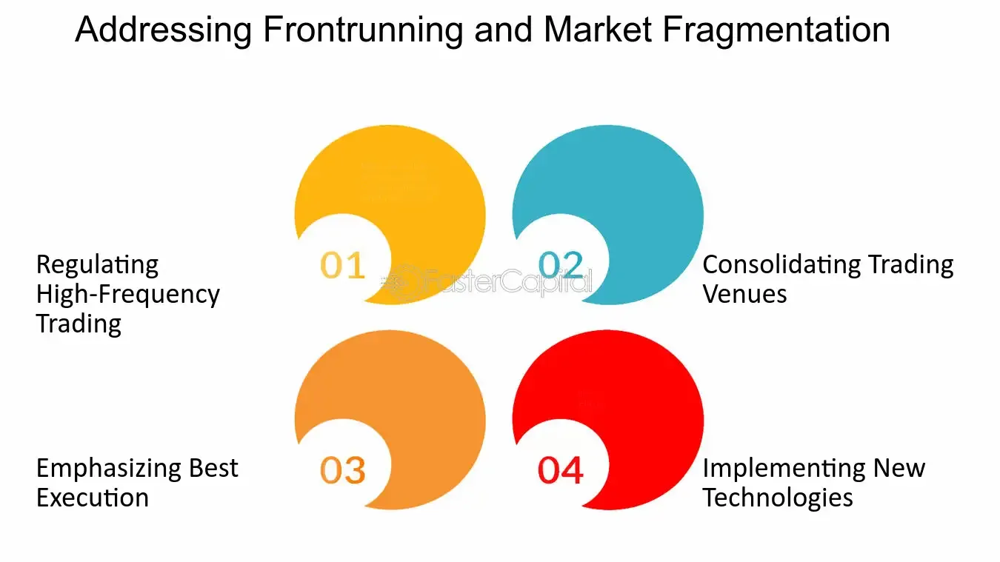

## Table of Contents

## What is fragmentation in the context of trading venues?

Fragmentation in trading venues refers to the splitting of trading activity across multiple platforms or exchanges. Instead of all trades happening in one place, like a single stock exchange, trades are spread out over different electronic systems and markets. This happens because of the growth of technology and new regulations that allow more places to handle trades.

This can be good and bad. On the positive side, fragmentation can lead to better prices and more choices for traders. They can shop around for the best deal. However, it can also make things more complicated. Traders might find it harder to get a clear picture of the market because the information is scattered across different places. This can make trading more challenging and increase costs for some people.

## How does fragmentation affect the stock market?

Fragmentation in the stock market means that trading is not just happening in one big place anymore. Instead, it's spread out over many different places like electronic trading platforms and other exchanges. This happens because technology has made it easier to set up new places for trading, and rules have changed to allow more competition. For people who trade stocks, this can mean they have more choices. They can look for the best prices across all these different places, which might save them money.

But fragmentation can also make things more complicated. When trading is spread out, it can be harder to see the whole picture of what's happening in the market. Information about prices and trades is scattered, so it might take more work to figure out where the best deals are. This can make trading more challenging and might increase costs for some people. Also, if a stock is traded in many places, it might be harder to buy or sell a lot of it quickly, which can affect how smoothly the market works.

## What are the main causes of fragmentation in trading venues?

Fragmentation in trading venues mainly happens because of technology and new rules. Technology has made it easier to set up new places for trading stocks. Computers and the internet allow companies to create electronic trading platforms that compete with big stock exchanges. This means that instead of everyone trading in one place, they can choose from many different places.

New rules from governments and regulators also play a big role. These rules often aim to increase competition and make trading fairer. For example, some regulations require that trade information be shared across different platforms, which encourages more places to get involved in trading. As a result, trading activity gets spread out over many different venues.

Overall, technology makes it possible for fragmentation to happen, while new rules encourage it. This leads to a situation where trading is not just happening in one big place, but is spread out over many smaller ones.

## Can you explain the difference between lit and dark pools in fragmented markets?

In fragmented markets, trading can happen in different kinds of places, like lit pools and dark pools. Lit pools are the more traditional trading venues where all the orders to buy and sell are visible to everyone. This means that if you want to buy or sell a stock, you can see all the other orders that are out there, and everyone can see your order too. This transparency helps people make better decisions because they can see what's happening in the market.

On the other hand, dark pools are trading venues where the orders are not shown to the public. When you place an order in a dark pool, other traders can't see it until the trade happens. This can be useful for big investors who don't want others to know what they're doing, because if everyone knew about a big order, it could affect the price of the stock. Dark pools can help these big investors trade without moving the market too much, but they also make the overall market less transparent.

## How does fragmentation impact market liquidity?

Fragmentation can have both good and bad effects on market [liquidity](/wiki/liquidity-risk-premium). On the positive side, it can increase liquidity because there are more places where people can trade. If there are lots of different trading venues, more people might be able to find a place to buy or sell, which means more trades can happen. This can make it easier for people to trade quickly and at good prices.

But fragmentation can also make it harder to have enough liquidity in one place. When trading is spread out over many different venues, it can be harder to find enough buyers and sellers in any one place. This can lead to less liquidity in each individual venue because the trading activity is split up. If someone wants to buy or sell a lot of a stock quickly, it might be harder to do if the market is too fragmented.

## What are the regulatory responses to fragmentation in trading venues?

Regulators have tried to deal with fragmentation in trading venues in different ways. One big way is by making rules that say all trading places have to share information about trades. This helps everyone see what's happening in the market, even if trading is spread out. For example, in Europe, there's a rule called MiFID II that says trading venues have to report their trades in a way that everyone can see. This is meant to make the market more transparent and fair, even with lots of different places to trade.

Another way regulators respond is by setting rules about how trades can happen. They might say that big trades have to go through certain places, or that some kinds of trades can only happen in certain ways. This can help make sure there's enough trading happening in one place to keep the market working well. Regulators also keep an eye on how fragmented the market is and might change rules if they think it's causing problems. This helps balance the benefits of more trading choices with the need for a smooth, fair market.

## How do traders adapt their strategies in a fragmented market environment?

In a fragmented market, traders have to change how they do things because trading is spread out over many places. They need to use special tools and computer programs to look at all the different trading venues at once. This helps them find the best prices and see where they can buy or sell quickly. Traders might also use smart order routing, which means their computer automatically sends their orders to the place where they can get the best deal. This way, they can take advantage of the different prices in different places.

Traders also need to be careful about how they place their orders. In a fragmented market, big orders can be split up and sent to different places to avoid moving the market too much. This is called order slicing. It helps keep the price stable and lets traders buy or sell without everyone knowing what they're doing. Traders might also use dark pools more often, where their orders are hidden from other traders. This can be useful for big trades that they don't want to affect the market. Overall, traders need to be smart and use technology to handle the challenges of a fragmented market.

## What are the benefits of trading venue fragmentation for investors?

Trading venue fragmentation can be good for investors because it gives them more choices. Instead of just one place to buy and sell stocks, there are many different places. This means investors can shop around for the best prices. They might find a better deal on one platform than on another. Having more options can also mean more competition among trading venues, which can lead to lower costs for investors. They might pay less in fees or get better prices for their trades.

Another benefit is that fragmentation can make the market more efficient. When trading is spread out over many places, it can be easier for investors to buy or sell quickly. More places to trade means more chances to find someone who wants to trade with you. This can make the market work better overall. Also, if investors can see what's happening in different places, they can make smarter choices about when and where to trade. This can help them get better results from their investments.

## What challenges do market participants face due to fragmentation?

Fragmentation can make things harder for people who trade in the stock market. When trading is spread out over many places, it can be tough to see the whole picture of what's happening. Traders have to look at lots of different platforms to find the best prices and make sure they're getting a good deal. This can take a lot of time and effort. Also, because the information is scattered, it might be harder to figure out where the market is going, which can make trading more risky.

Another challenge is that it can be harder to trade big amounts of stocks quickly. If a trader wants to buy or sell a lot of a stock, they might have to split their order across different places. This can slow things down and make it harder to get the trade done at the price they want. Plus, using different trading venues can mean more costs, like fees for using different platforms. All these things can make trading more complicated and expensive for market participants.

## How does fragmentation influence price discovery in financial markets?

Fragmentation in financial markets means that trading happens in many different places instead of just one. This can make it harder to find out the true price of a stock. When trading is spread out, the information about prices and trades is scattered too. Traders have to look at lots of different places to see what's happening. This can make it more difficult to figure out the best price for a stock because the full picture of supply and demand is not in one place.

On the other hand, fragmentation can also help with price discovery in some ways. Because there are more places to trade, there's more competition among trading venues. This can lead to better prices as traders shop around for the best deals. If information from all these places is shared well, it can help everyone see a more accurate picture of the market. But if the information isn't shared properly, it can still be hard to know the true value of a stock.

## What technological solutions are being developed to manage fragmentation?

To handle fragmentation in trading, people are making new computer programs and tools. These tools help traders see what's happening across all the different places where trading happens. They can look at prices and trades from many platforms at the same time. This makes it easier for traders to find the best deals and make smart choices. Some of these tools use smart order routing, which means the computer sends the trader's order to the place where they can get the best price automatically.

Another way technology is helping is by making it easier to share information between different trading places. This helps everyone see a clearer picture of the market, even if trading is spread out. For example, there are systems that collect and show data from all the different trading venues in one place. This can make the market more transparent and help traders figure out the true value of stocks. Overall, these technological solutions are trying to make trading easier and more efficient in a fragmented market.

## How might future trends in market structure further influence fragmentation?

In the future, market structure might change in ways that could make fragmentation even more common. As technology keeps getting better, it will be easier for new trading platforms to start up. This means more places where people can buy and sell stocks. Also, rules from governments might change to encourage more competition among trading venues. This could lead to even more places for trading, making the market more fragmented. More choices might be good for traders, but it could also make things more complicated because it's harder to see the whole market at once.

At the same time, new technology might help manage the challenges of fragmentation. Better computer programs and tools could make it easier for traders to see what's happening across all the different trading places. These tools could help them find the best prices and make smarter decisions. However, if these tools don't work well or if information isn't shared properly between different platforms, it might still be hard to understand the market. So, while technology could make fragmentation worse, it could also help traders deal with it better.

## References & Further Reading

[1]: Barber, B. M., Lee, Y.-T., Liu, Y.-J., & Odean, T. (2009). ["Just How Much Do Individual Investors Lose by Trading?"](https://faculty.haas.berkeley.edu/odean/Papers%20current%20versions/JustHowMuchDoIndividualInvestorsLose_RFS_2009.pdf) The American Economic Review, 99(2), 537-541.

[2]: Menkveld, A. J. (2013). ["High-Frequency Trading and the New-Market Makers."](https://www.sciencedirect.com/science/article/pii/S1386418113000281) Review of Financial Studies, 27(3), 734-767.

[3]: Hendershott, T., Jones, C. M., & Menkveld, A. J. (2011). ["Does Algorithmic Trading Improve Liquidity?"](https://onlinelibrary.wiley.com/doi/full/10.1111/j.1540-6261.2010.01624.x) Review of Financial Studies, 24(8), 2514-2553.

[4]: O'Hara, M., & Ye, M. (2011). ["Is Market Fragmentation Harming Market Quality?"](https://www.sciencedirect.com/science/article/pii/S0304405X11000390) Review of Financial Studies, 24(3), 1257-1296.

[5]: Gomber, P., Arndt, B., Lutat, M., & Uhle, T. (2011). ["High-Frequency Trading."](https://papers.ssrn.com/sol3/papers.cfm?abstract_id=1858626) SSRN Electronic Journal.

[6]: "Markets in Financial Instruments Directive (MiFID II)". (n.d.). [European Commission](https://finance.ec.europa.eu/regulation-and-supervision/financial-services-legislation/implementing-and-delegated-acts/markets-financial-instruments-directive-ii_en).

[7]: Harris, L. (2003). ["Trading and Exchanges: Market Microstructure for Practitioners"](https://www.amazon.com/Trading-Exchanges-Market-Microstructure-Practitioners/dp/0195144708). Oxford University Press.

[8]: Aldridge, I. (2013). ["High-Frequency Trading: A Practical Guide to Algorithmic Strategies and Trading Systems"](https://www.ahmetbeyefendi.com/wp-content/uploads/2020/07/High-Frequency-Trading-Irene-Aldridge.pdf). Wiley Trading.