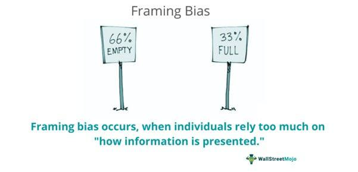

In the rapidly evolving world of algorithmic trading, decision-making processes significantly influence trading outcomes. Algorithmic trading, utilizing pre-programmed trading instructions, is heavily reliant on speed and precision. However, even the most advanced systems are not immune to the pitfalls of human cognitive biases. Among these biases, the framing effect stands out as a predominant influence that can lead traders to make flawed decisions. The framing effect refers to the cognitive bias where individuals react differently to the same piece of information based on its presentation. For instance, a choice presented in a positive light may be favored over an equivalent choice framed negatively, despite identical underlying data. Such biases can lead to decisions that deviate from rational analysis, ultimately affecting the performance of trading strategies.

In the context of algorithmic trading, these biases can seep into trading algorithms through the humans who design, program, and interpret their outcomes. As algorithms are only as rational as their creators, understanding and mitigating biases like the framing effect is crucial. This article will explore the role of cognitive biases, focusing specifically on the framing effect, in influencing algorithmic trading strategies. Recognizing and addressing these biases can lead to more rational decision-making processes and, consequently, improved trading outcomes.



## Table of Contents

## Understanding Cognitive Biases

Cognitive biases represent systematic deviations from rational judgment, significantly influencing decision-making processes. These mental shortcuts or tendencies often lead individuals away from objective assessments, skewing their judgments based on various psychological factors. In trading, these biases can critically impact decision outcomes, leading to less-than-optimal choices.

One prominent cognitive bias in trading is overconfidence, which can manifest as an unfounded belief in one's ability to predict market movements accurately. Traders affected by overconfidence might take larger risks, leading to considerable losses. This bias often stems from the cognitive illusion of control, where individuals overestimate their influence over events.

Anchoring bias is another common inclination affecting traders. This occurs when traders fixate on specific information, such as a stock's previous price, which serves as a reference point. Despite new information that might suggest a change in valuation, anchored traders might irrationally adhere to the initial reference point, affecting their buying or selling decisions.

The framing effect, crucial in trading contexts, involves decisions swayed by the presentation of information rather than the information itself. For instance, a trading strategy might be perceived differently if presented with a "90% success rate" versus a "10% failure rate", even though both statements convey the same statistical reality. This shift in perception can significantly impact risk assessment and decision-making processes.

To effectively manage trading strategies, algorithmic traders must first gain a thorough understanding of these biases. Recognizing how these psychological factors interfere with rational judgment enables traders to devise strategies to mitigate their influence. Doing so involves creating algorithms that prioritize objective data analysis over subjective interpretation, thus reducing the potential for bias-driven errors in trading decisions. By enhancing awareness and implementing bias-resistant algorithms, traders are better positioned to optimize their decision-making processes, aiming for rational, data-driven outcomes.

## The Framing Effect in Decision-Making

The framing effect is a cognitive bias that affects decision-making by causing people to respond differently based on whether an option is presented as a gain or a loss. This bias can lead to irrational decisions, as the focus shifts from the underlying facts to the presentation of these facts. For instance, individuals might react more positively to a scenario described as having a "70% chance of success" compared to one framed as having a "30% chance of failure," despite both scenarios conveying the same mathematical reality. 

In [algorithmic trading](/wiki/algorithmic-trading), the framing effect potentially leads to skewed interpretations that have significant implications for risk assessment and strategy implementation. Algorithms, no matter how data-driven, are programmed by humans who can impart biases, intentionally or unintentionally. Traders who design these algorithms may prefer positively framed data—such as information highlighting potential profits rather than equivalent potential losses—resulting in a skewed evaluation of risks and rewards.

Consideration of the framing effect is crucial in trading environments where decisions are made rapidly and must often rely on heuristic processing. This involves quick, rule-based processes that can be susceptible to biases like framing. For example, an algorithm could misprice risk because it interprets positively framed news as more credible or valuable than negatively framed news. Therefore, the challenge lies in ensuring algorithms weigh all available data impartially, without undue influence from how the data is presented.

Addressing framing biases entails rigorous programming protocols that prioritize factual content over presentation, by either normalizing input data presentation or incorporating mechanisms to assess data equivalency. For example, a Python-based approach might involve a preprocessing step that standardizes input data to ensure consistency across various formats, thereby minimizing framing biases:

```python
def standardize_format(data):
    # Convert all data points to a uniform representation
    standardized_data = []
    for point in data:
        if "success rate" in point:
            rate = extract_rate(point)
            standardized_data.append({'rate': rate})
        elif "failure rate" in point:
            rate = 100 - extract_rate(point)
            standardized_data.append({'rate': rate})
    return standardized_data

def extract_rate(point):
    # Example function to extract numerical value from data point
    return int(''.join(filter(str.isdigit, point)))

# Example usage
data = ["70% success rate", "30% failure rate"]
print(standardize_format(data))  # Output: [{'rate': 70}, {'rate': 70}]
```

By addressing presentation biases and setting algorithms to assess information based purely on data rather than presentation, traders may reduce the impact of the framing effect on their decision-making processes.

## Exploring the Framing Effect in Algorithmic Trading

Algorithmic trading is fundamentally driven by data; algorithms process vast amounts of information to make quick, informed trading decisions. However, even in such a data-centric environment, cognitive biases like the framing effect can significantly impact decision-making processes. This occurs when traders or their algorithms interpret information based on its presentation rather than the actual data, leading to potentially skewed trading decisions.

A common example of the framing effect in trading involves how success and failure rates are presented. For instance, a trading strategy might be described as having a "70% success rate" or a "30% failure rate." Although both metrics describe the same reality, they can result in different perceptions and choices due to the framing. Traders are often more inclined to choose strategies framed in positive terms, even if the negative framing contains the same information.

To mitigate this bias, it's essential for algorithmic trading systems to analyze data in a manner that is independent of such framing. One practical approach is to ensure that algorithms focus on absolute data values and metrics, rather than their descriptive labels. For example, instead of evaluating strategies based on qualitative descriptions, algorithms can assess quantitative outcomes:

```python
def evaluate_strategy(success_rate, failure_rate):
    if success_rate > failure_rate:
        decision = "Accept Strategy"
    else:
        decision = "Reject Strategy"
    return decision

strategy1 = evaluate_strategy(0.7, 0.3)  # expected result: "Accept Strategy"
strategy2 = evaluate_strategy(0.6, 0.4)  # expected result: "Accept Strategy"

print(strategy1)
print(strategy2)
```

In this Python script, the decision to accept or reject a strategy is based purely on numerical comparisons, thereby minimizing the potential influence of framing. Such implementations help ensure that algorithms remain objective, prioritizing data-driven decision-making over subjective interpretations.

Furthermore, traders can incorporate [machine learning](/wiki/machine-learning) models that are trained to recognize and nullify the effects of biased information framing. These models can be designed to give equal weight to all aspects of data presentation, reducing the temptation to favor one framing over another.

Ultimately, by structuring trading algorithms to be resilient against the framing effect, traders can enhance the reliability and effectiveness of their strategies, making decisions based on rational analysis rather than potentially misleading presentation.

## Case Studies and Real-world Examples

Numerous instances in trading illustrate how the framing effect leads to distinct trading behaviors, impacting decision-making and outcomes. A prominent example is the manner in which market news and earnings reports present financial information. The dissection and presentation of such reports often lean towards emotional elicitation, overshadowing objective, data-driven analysis.

Consider a scenario where a company announces its quarterly earnings. If the report highlights a 15% increase in revenue but simultaneously notes a drop in net profit margin, the framing can significantly influence investor sentiment. A headline focusing on revenue growth is likely to prompt a more favorable market reaction compared to one emphasizing profit margin decline, despite both metrics being crucial for comprehensive financial analysis.

To further underscore this effect, consider two hypothetical headlines: 
1. "Tech Company Records a 15% Boost in Revenue"
2. "Tech Company Experiences a Decline in Profit Margins Despite Revenue Boost"

The first headline tends to evoke optimism, potentially leading traders to pursue buy strategies, viewing the revenue increase as a signal of growth potential. Conversely, the second headline may incite caution or selling behavior due to the negative connotation associated with margin decline. Here, the framing effect not only sways individual investor decisions but also impacts market dynamics as a whole.

Analyzing such examples reveals common pitfalls associated with framing biases. Often, traders may overlook critical financial details or market indicators that present a more nuanced picture. To adjust strategies effectively, traders should dissect reports by focusing on core metrics such as Earnings Per Share (EPS), Price-to-Earnings (P/E) ratios, and Return on Equity (ROE) rather than getting swayed by the framing of headlines. Implementing algorithmic solutions that quantify and weigh various financial indicators objectively could mitigate the subjectivity introduced by framing biases.

Ultimately, recognizing and analyzing the framing effect in real-world trading scenarios can lead to more effective strategy adjustments. By fostering a critical understanding of how information is presented, traders can better navigate emotional responses and focus on data-driven decision-making processes.

## Strategies to Mitigate Framing Effects

Adopting strategies to mitigate the framing effect in algorithmic trading is critical to enhance decision-making and improve trading outcomes. A systematic approach combined with critical thinking can effectively counteract the biases introduced by the framing effect.

One effective strategy is designing algorithmic solutions to process data independently of framing by concentrating on raw data metrics. This approach involves developing algorithms that emphasize objective data interpretation, thus reducing susceptibility to how information is presented. By focusing solely on the quantitative aspects of market data, these algorithms can diminish the impact of emotionally charged frames that might otherwise skew decision-making. For example, an algorithm might calculate the expected value of a trade by evaluating historical performance metrics without bias, using simple statistical methods like:

```python
def expected_value(success_rate, gain, failure_rate, loss):
    return (success_rate * gain) + (failure_rate * loss)

# Example Usage:
success_rate = 0.7
gain = 100
failure_rate = 0.3
loss = -50

ev = expected_value(success_rate, gain, failure_rate, loss)
print(f"Expected Value of the Trade: {ev}")
```

Besides algorithmic optimization, employing credible third-party advice provides an external perspective that can help balance potentially biased internal information. Engaging with independent analysts or using advisory services offers traders alternative viewpoints that might not be swayed by the internal framing of data. This practice not only broadens the spectrum of insights but also grounds decision-making processes in a more balanced informational context.

Conducting regular strategy reviews is another vital measure. This involves periodically revisiting and scrutinizing trading algorithms, decision rules, and underlying assumptions behind trading strategies. Regular reviews promote the identification of biases, both cognitive and algorithmic, allowing traders to adjust strategies accordingly. These reviews should aim to identify any drift in algorithm performance metrics or decision-making distortions resulting from previously undetected framing effects.

Overall, systematically tackling framing effects through these techniques helps ensure that trading decisions remain objective and data-driven, minimizing the distortive influence of cognitive biases. Such an approach fosters better decision quality and improved trading performance in algorithmic markets.

## Conclusion

Understanding and addressing cognitive biases, particularly the framing effect, is crucial in improving decision-making processes in algorithmic trading. Cognitive biases can distort traders' judgments and lead to decisions that defy logical analysis. The framing effect, where traders' decisions are influenced by the way information is presented rather than the information itself, exemplifies the power of cognitive biases. Recognizing and mitigating these effects allow traders to refine algorithms toward more rational decision-making, leading to improved trading outcomes.

Recognizing the impact of cognitive biases requires rigorous analysis and a systematic approach to algorithm development. By integrating frameworks that assess and neutralize cognitive biases, algorithms can be aligned with objective data rather than subjective interpretation. This is essential for making informed trading decisions that are less susceptible to emotional and psychological influences.

Continual education and strategy revision remain pivotal in navigating the complexities introduced by cognitive biases in trading. Regular training sessions, reviewing updated research, and incorporating insights from behavioral finance can help traders stay informed about the latest methodologies to combat cognitive biases. Consistent strategy assessments are beneficial for ensuring that algorithms remain adaptive to market changes and minimize bias effects.

Through deliberate attention to cognitive biases, traders can enhance their algorithmic strategies for more consistent and data-driven decision-making, providing a competitive edge in the dynamic field of algorithmic trading.

## References & Further Reading

[1]: Tversky, A., & Kahneman, D. (1981). ["The Framing of Decisions and the Psychology of Choice."](https://psycnet.apa.org/record/1981-31998-001) Science, 211(4481), 453-458.

[2]: Thaler, R. H., & Sunstein, C. R. (2008). ["Nudge: Improving Decisions About Health, Wealth, and Happiness."](https://www.researchgate.net/publication/257178709_Nudge_Improving_Decisions_About_Health_Wealth_and_Happiness_RH_Thaler_CR_Sunstein_Yale_University_Press_New_Haven_2008_293_pp) Penguin Books.

[3]: ["Thinking, Fast and Slow"](https://en.wikipedia.org/wiki/Thinking,_Fast_and_Slow) by Daniel Kahneman

[4]: Barberis, N., & Thaler, R. (2003). ["A Survey of Behavioral Finance."](https://www.semanticscholar.org/paper/A-Survey-of-Behavioral-Finance-Barberis-Thaler/a4ab7d7161deac0f532d121b1614cf7b97d90e78) Handbook of the Economics of Finance.

[5]: Shefrin, H. (2000). ["Beyond Greed and Fear: Understanding Behavioral Finance and the Psychology of Investing."](https://academic.oup.com/book/27607) Oxford University Press.