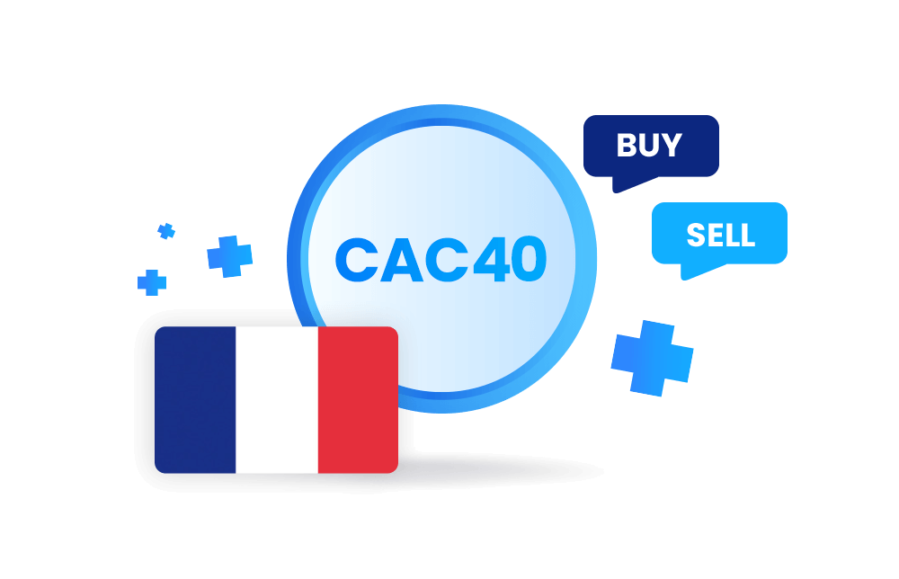

## Table of Contents

## What is an Exchange-Traded Fund (ETF)?

An Exchange-Traded Fund (ETF) is a type of investment that works a lot like a mutual fund but trades on a stock exchange, just like a stock. It's a basket of securities, like stocks, bonds, or commodities, that you can buy or sell throughout the trading day at market prices. This is different from mutual funds, which you can only buy or sell at the end of the trading day at a price set once a day.

ETFs are popular because they offer a way to invest in a broad range of assets without having to buy each one individually. For example, if you want to invest in the technology sector, you can buy an ETF that includes many tech companies. This helps spread out risk and can be more cost-effective than buying individual stocks. Plus, ETFs often have lower fees than mutual funds, making them an attractive option for many investors.

## What is the CAC 40 Index?

The CAC 40 Index is a stock market index that represents the 40 largest companies listed on the Euronext Paris stock exchange in France. It's like a snapshot of how these big companies are doing, and it gives people an idea of how the French stock market is performing overall. The companies in the CAC 40 come from different industries, like banking, energy, and technology, so the index shows a broad picture of the French economy.

The CAC 40 is calculated using the market capitalization of the companies, which means it takes into account how much each company is worth on the stock market. The index is updated every 15 seconds during trading hours, so it's always showing the most recent information. People use the CAC 40 to see if the market is going up or down, and it can help them make decisions about buying or selling stocks.

## How do France ETFs track the CAC 40 Index?

France ETFs that track the CAC 40 Index do so by holding a portfolio of stocks that matches the companies in the index. These ETFs aim to replicate the performance of the CAC 40 as closely as possible. To do this, they buy shares of the 40 companies in the same proportions as they appear in the index. This way, if the CAC 40 goes up or down, the [ETF](/wiki/etf-trading-strategies) should move in the same direction.

Sometimes, an ETF might use a method called "sampling" to track the index. This means they don't buy every single stock in the CAC 40 but instead choose a smaller selection that they think will perform similarly to the whole index. This can be a bit less accurate but can also be cheaper to manage. Either way, the goal is to give investors an easy way to invest in the French market without having to buy each of the 40 stocks themselves.

## What are the benefits of investing in France ETFs?

Investing in France ETFs can be a smart choice for many reasons. One big benefit is that it lets you spread your money across many big French companies without having to buy each stock one by one. This is called diversification, and it helps lower your risk. Instead of betting on just one company, you're betting on the whole French market, which can be safer. Plus, France ETFs are easy to buy and sell because they trade on stock exchanges just like regular stocks. This means you can quickly change your investments if you need to.

Another advantage is that France ETFs often have lower fees than other types of funds. This is because they are designed to track an index, like the CAC 40, which means they don't need as much active management. Lower fees mean more of your money stays in your pocket. Also, by investing in a France ETF, you get a piece of the French economy, which is one of the biggest in the world. This can be a good way to grow your money over time, especially if you believe in the future of France and its businesses.

## What are the risks associated with France ETFs?

One risk of investing in France ETFs is that they go up and down with the French market. If the French economy has a bad time, the value of your ETF can go down. This means you could lose money if you need to sell your shares when the market is low. Also, because France ETFs focus on French companies, they might not do well if other countries are doing better. So, your investment might not grow as fast as if you had invested in a different country or a mix of countries.

Another risk is that even though ETFs usually have lower fees, you still have to pay them. These fees can add up over time and eat into your returns. Also, while ETFs are meant to track the CAC 40 closely, sometimes they don't match it perfectly. This can happen because of things like trading costs or if the ETF uses sampling instead of buying all the stocks in the index. So, your returns might be a bit different from what you expect based on the index's performance.

## How can one start investing in France ETFs?

To start investing in France ETFs, you first need to choose a brokerage account. This is like a bank account but for buying and selling investments. You can find many online brokerages that let you trade ETFs easily. Once you've picked a brokerage, you'll need to open an account, which usually involves filling out some forms and maybe putting in some money to get started. After your account is set up, you can search for France ETFs, like ones that track the CAC 40 Index. 

Once you've found the ETF you want, you can buy shares of it just like you would buy a stock. You decide how many shares you want and place an order. Most brokerages let you do this online or through their app. After you buy the shares, you'll own a piece of the French market. Remember, you can always sell your shares later if you want to, just like selling a stock. Keep an eye on how your investment is doing and think about your goals and how much risk you're okay with taking.

## What are the major France ETFs that track the CAC 40 Index?

Some of the major France ETFs that track the CAC 40 Index are the Lyxor CAC 40 (DR) UCITS ETF and the Amundi ETF CAC 40 UCITS ETF. These ETFs are designed to follow the performance of the CAC 40 as closely as possible. They do this by holding shares of the same 40 companies that make up the index, in the same proportions. This means if the CAC 40 goes up or down, these ETFs should move in the same way.

Both of these ETFs are popular choices for people who want to invest in the French market. They are traded on stock exchanges, so you can buy and sell them easily during the trading day. They also have lower fees compared to many other types of funds, which can help you keep more of your money. By investing in these ETFs, you get a piece of some of the biggest and most important companies in France, which can be a good way to grow your money over time.

## How do France ETFs compare to other European ETFs?

France ETFs, like those that track the CAC 40 Index, focus on the French market. They give you a way to invest in big French companies without buying each stock one by one. This can be good if you think France will do well, but it also means your money is tied to just one country. If the French economy has a bad time, your ETF might go down too. Also, France ETFs might not do as well as ETFs from other countries if those countries are doing better.

Other European ETFs, on the other hand, can spread your money across many countries in Europe. This can be safer because if one country has problems, the others might still do well. For example, an ETF that tracks the Euro Stoxx 50 includes companies from several big European countries, not just France. This can help your money grow more steadily over time. But, these ETFs might have higher fees than France ETFs, and they might not do as well if France is doing better than other countries.

In the end, choosing between France ETFs and other European ETFs depends on what you want. If you believe in the future of France and want to focus your money there, a France ETF might be a good choice. But if you want to spread your risk across more countries, a broader European ETF could be better. Both types of ETFs can help you invest in Europe, but they do it in different ways.

## What is the historical performance of France ETFs tracking the CAC 40 Index?

The historical performance of France ETFs that track the CAC 40 Index has had its ups and downs, just like any other investment. Over the long term, these ETFs have generally followed the performance of the French stock market. For example, during good times for the French economy, like the early 2000s and the years leading up to the global financial crisis in 2008, the CAC 40 and the ETFs tracking it saw significant growth. However, they also experienced sharp declines during the 2008 financial crisis and the early stages of the COVID-19 pandemic in 2020, showing how closely tied they are to the overall health of the French market.

In more recent years, the performance of France ETFs has been influenced by factors like European Union policies, global economic trends, and the performance of major French companies. For instance, after the initial drop in 2020 due to the pandemic, the CAC 40 and its ETFs recovered and even reached new highs in 2021 and 2022. This recovery was driven by a combination of factors, including strong performances from sectors like luxury goods and technology, as well as supportive monetary policies from the European Central Bank. Overall, while France ETFs offer a way to invest in the French market, their performance can be volatile and is closely tied to the economic conditions in France and Europe.

## How do economic factors in France affect the performance of CAC 40 ETFs?

Economic factors in France play a big role in how well CAC 40 ETFs do. If the French economy is doing well, with more people buying things and companies making more money, the CAC 40 usually goes up. This means the ETFs that track the CAC 40 will also go up. Things like low unemployment, strong business growth, and good government policies can help the French market do well. For example, if the government helps businesses grow or if there are new jobs being created, the companies in the CAC 40 might do better, which would make the ETFs go up too.

On the other hand, if the French economy is struggling, the CAC 40 and its ETFs can go down. If people are not spending as much money, or if companies are not making as much profit, the stock market can drop. Things like high unemployment, slow business growth, or bad government policies can hurt the French market. For instance, if there's a big economic crisis or if there are problems in Europe that affect France, the CAC 40 might go down, and so would the ETFs that follow it. So, the performance of CAC 40 ETFs is closely tied to what's happening in the French economy.

## What are the tax implications of investing in France ETFs for non-residents?

If you live outside of France and you invest in France ETFs, you need to know about the taxes you might have to pay. In France, if you make money from your ETFs, like dividends or when you sell them for a profit, you might have to pay a tax called the "flat tax" or "PFU" (Prélèvement Forfaitaire Unique). This tax is usually 30% and includes both income tax and social charges. But, the rules can be different depending on where you live and what kind of tax treaty your country has with France. Some countries have agreements with France that can change how much tax you pay or where you pay it.

Also, you need to think about the taxes in your own country. When you invest in France ETFs, you might have to report this money on your taxes at home. Your country might tax the money you make from the ETFs, and they might give you a credit for the taxes you already paid in France. This can get complicated, so it's a good idea to talk to a tax expert who knows about international investments. They can help you understand all the rules and make sure you're not paying more tax than you need to.

## How do France ETFs fit into a diversified global investment portfolio?

France ETFs can be a great part of a diversified global investment portfolio. They let you invest in the French market without having to buy each French stock one by one. This is good because it helps spread your money across many different companies in France, which can lower your risk. Instead of betting on just one country or one type of investment, you can add France ETFs to your mix of investments from around the world. This way, if one part of your portfolio goes down, the other parts might still do well, helping to balance things out.

Adding France ETFs to your global portfolio can also give you a chance to grow your money in different ways. France is one of the biggest economies in Europe, and it has strong companies in industries like luxury goods, energy, and technology. By investing in France ETFs, you get a piece of these companies and the French economy. This can be good if you believe France will do well in the future. But remember, while France ETFs can help diversify your portfolio, they are still tied to the French market. So, it's important to think about how much of your money you want to put in France compared to other places around the world.

## References & Further Reading

[1]: ["Understanding Possibilities and Risks of Algorithmic Trading"](https://www.investopedia.com/articles/active-trading/101014/basics-algorithmic-trading-concepts-and-examples.asp) - SpringerLink

[2]: ["The Little Book of Common Sense Investing"](https://www.amazon.com/Little-Book-Common-Sense-Investing/dp/1119404509) by John C. Bogle

[3]: ["Exchange-Traded Funds in Europe: Evolution and Regulation"](https://www.sciencedirect.com/book/9780128136393/exchange-traded-funds-in-europe) - European Fund and Asset Management Association (EFAMA)

[4]: ["Algorithmic and High-Frequency Trading"](https://www.cambridge.org/us/universitypress/subjects/mathematics/mathematical-finance/algorithmic-and-high-frequency-trading) by Álvaro Cartea, Sebastian Jaimungal, and José Penalva

[5]: European Securities and Markets Authority (ESMA). ["MiFID II - Directive on Markets in Financial Instruments."](https://www.esma.europa.eu/publications-and-data/interactive-single-rulebook/mifid-ii)