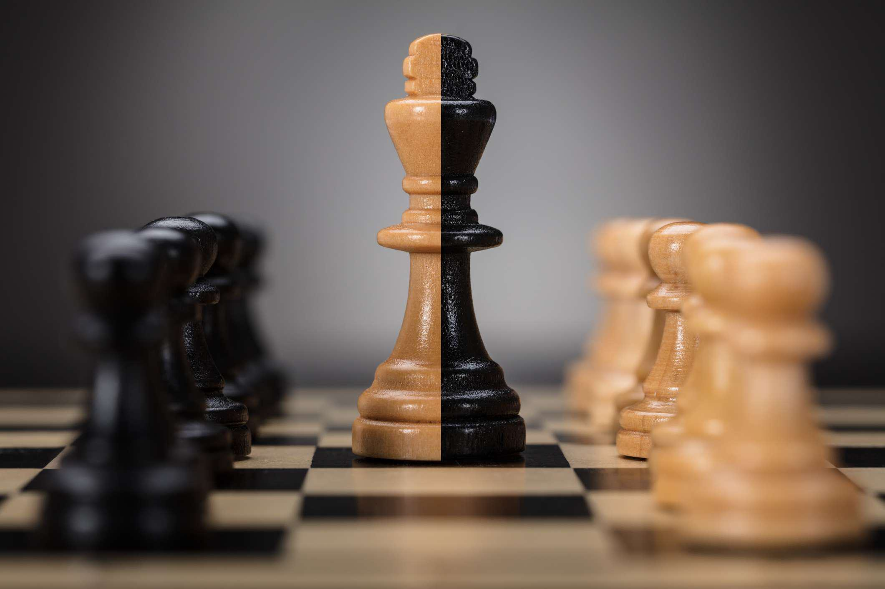

## Table of Contents

## What is a franchised monopoly?

A franchised monopoly is when a government gives one company the exclusive right to provide a certain service or product in a specific area. This means that no other companies can offer the same service or product in that area. For example, a city might give one company the right to be the only one to provide electricity to homes and businesses in that city.

This kind of monopoly is often set up for services that are really important and need a lot of money to build and maintain, like water supply, electricity, or public transportation. The government does this to make sure that these services are reliable and that the company can make enough money to keep the service running well. In return, the company usually has to follow certain rules set by the government to make sure they provide good service at fair prices.

## How does a franchised monopoly differ from other types of monopolies?

A franchised monopoly is different from other types of monopolies because it is created and protected by the government. The government gives one company the exclusive right to provide a specific service or product in a certain area. This is different from a natural monopoly, where one company can provide a service more efficiently than others because of the high costs and technical challenges involved, like in utilities. It's also different from a legal monopoly, where a company gets exclusive rights through a patent or copyright, which are usually for a limited time.

Unlike a pure monopoly, where one company controls the entire market without any government intervention, a franchised monopoly has rules set by the government. These rules make sure the company provides good service and doesn't charge too much. In contrast, a pure monopoly might happen because of a company's strong market power, and it can set prices and control the market without any oversight. So, while all these types of monopolies give one company control over a market, the way they get that control and the rules they have to follow can be very different.

## What are the key characteristics of a franchised monopoly?

A franchised monopoly is when the government gives one company the only right to provide a certain service or product in a specific place. This means no other companies can offer the same thing in that area. For example, a city might give one company the right to be the only one to give electricity to homes and businesses there. This kind of monopoly is often set up for important services that cost a lot to build and keep running, like water, electricity, or public transportation.

The government creates a franchised monopoly to make sure these important services are reliable and the company can make enough money to keep the service good. In return, the company has to follow rules set by the government. These rules help make sure the company gives good service and doesn't charge too much. So, while the company has control over the market, it's not free to do whatever it wants because the government is watching and setting rules.

## Can you provide a simple example of a franchised monopoly?

Imagine a small town called Sunnyville. The government of Sunnyville decided that they needed a better bus system to help people get around. They chose one company, called SunnyBus, to be the only bus company in town. This means that no other bus companies can start running buses in Sunnyville. The government did this because they thought it would be better to have one good bus system instead of many different ones that might not work well together.

In return, the government made rules that SunnyBus has to follow. They have to make sure the buses run on time and keep the tickets at a fair price. If SunnyBus doesn't follow these rules, the government can take away their right to be the only bus company in town. So, while SunnyBus is the only one providing bus services, they have to do a good job and follow the government's rules.

## What are the benefits of a franchised monopoly for the franchisor?

For the franchisor, a franchised monopoly means they get to be the only one providing a certain service or product in a specific area. This can be really good for them because they don't have to worry about other companies trying to take away their customers. They can focus on making their service really good and making sure it works well without competition. This can help them make more money because they don't have to spend as much on trying to beat other companies.

Another benefit is that the franchisor can plan better for the future. Since they know they will be the only ones providing the service, they can invest more money in making their service better and expanding it. They can also work closely with the government to make sure they are meeting all the rules and getting support to keep their service running smoothly. This can help them grow their business and make it stronger over time.

## What advantages do franchisees gain from being part of a franchised monopoly?

Franchisees in a franchised monopoly get to be part of a business that is the only one offering a certain service or product in a specific area. This means they don't have to worry about other businesses trying to take away their customers. They can focus on doing a good job and making sure their customers are happy. This can help them make more money because they don't have to spend as much on trying to beat other businesses.

Also, being part of a franchised monopoly can give franchisees more support from the franchisor. The franchisor might help them with training, marketing, and other resources they need to run their business well. Since the franchisor is the only one providing the service, they can focus on making the whole system better, which can help franchisees do a better job and grow their business.

## What are the common criticisms of franchised monopolies?

People often criticize franchised monopolies because they think they can lead to higher prices and lower quality service. Since the company is the only one providing the service, they might not have a big reason to keep prices low or make the service better. Without other companies to compete with, the franchised monopoly might not work as hard to make customers happy. This can make people feel like they are not getting a good deal.

Another criticism is that franchised monopolies can be unfair to other businesses. Because the government gives one company the right to be the only one in the area, other companies can't start up and offer the same service. This can stop new ideas and businesses from growing. Some people think this goes against the idea of a free market, where anyone should be able to start a business and compete fairly.

## How do franchised monopolies impact consumer choice and market competition?

Franchised monopolies can limit consumer choice because they are the only ones allowed to provide a certain service or product in an area. This means that if you live in a place with a franchised monopoly, you can't choose between different companies for that service. For example, if a city has given one company the right to be the only bus service, you have to use that bus company if you want to take the bus. This can be frustrating for people who might want different options or better service.

Franchised monopolies also affect market competition by keeping other businesses out. When the government gives one company the exclusive right to provide a service, other companies can't start up and compete. This can stop new ideas and businesses from growing. Without competition, the franchised monopoly might not work as hard to keep prices low or improve their service, which can make it harder for consumers to get a good deal.

## What regulatory measures are in place to oversee franchised monopolies?

Governments set up rules to make sure franchised monopolies do a good job and don't charge too much. These rules are called regulations. The government watches the franchised monopoly to make sure they follow these rules. If the company doesn't follow the rules, the government can take away their right to be the only one providing the service. This helps make sure the company keeps their service good and their prices fair.

Regulations can include things like setting a maximum price for the service, making sure the service is reliable, and requiring the company to report how they are doing. The government might also have a special group or agency that keeps an eye on the franchised monopoly. This group can check if the company is following the rules and can make them change if they are not. By doing this, the government tries to balance the power of the franchised monopoly and protect the people who use the service.

## Can you discuss a case study where a franchised monopoly was challenged legally?

In the United States, a famous case where a franchised monopoly was challenged legally is the case of the City of San Diego versus San Diego Gas & Electric (SDG&E). SDG&E had been given the exclusive right by the city to provide electricity and natural gas in the area. But some people thought SDG&E was charging too much and not doing a good job. They took the company to court, saying that SDG&E was not following the rules set by the city and was taking advantage of its monopoly power.

The court looked at the case and decided that SDG&E had to follow the city's rules more closely. They made SDG&E lower their prices and improve their service. This case showed that even though a company might have a franchised monopoly, they still have to follow the rules and can be challenged in court if they don't. It also showed that people can fight back if they think a franchised monopoly is not treating them fairly.

## How do economic theories explain the sustainability of franchised monopolies?

Economic theories explain the sustainability of franchised monopolies by looking at how they can keep making money and stay in business over time. One key idea is that franchised monopolies often provide services that are really important and expensive to set up, like water or electricity. Because of this, it makes sense for the government to give one company the right to be the only one providing the service. This way, the company can make enough money to keep the service running well without worrying about other companies trying to take away their customers. The government also sets rules to make sure the company doesn't charge too much and keeps the service good, which helps the monopoly stay sustainable.

Another part of the theory is about how franchised monopolies can plan for the future better than other businesses. Since they know they will be the only ones providing the service, they can invest more money in making their service better and expanding it. This long-term planning can help them keep making money and stay strong over time. But, if the company doesn't follow the government's rules, they could lose their right to be the only one providing the service. So, the balance between having the exclusive right and following the rules is what helps keep franchised monopolies sustainable according to economic theories.

## What future trends might affect the prevalence and operation of franchised monopolies?

In the future, technology could change how franchised monopolies work. New technology might make it easier for other companies to offer the same services, like electricity or water, in a way that is cheaper and better. This could make it harder for franchised monopolies to stay the only ones providing these services. Also, as people use more renewable energy and smart technology, like solar panels and smart meters, they might not need to rely as much on big companies for their services. This could mean fewer franchised monopolies because people have more choices.

Another trend that might affect franchised monopolies is how governments think about them. More people are talking about how these monopolies can lead to higher prices and lower quality service. Governments might start to make stricter rules or even break up some franchised monopolies to let other companies compete. This could make the market more open and give people more choices. But, if governments still see the need for these monopolies to provide important services, they might just keep making the rules better to make sure the companies do a good job and keep prices fair.

## What is a Monopoly?

A monopoly occurs when a single entity achieves overwhelming control over a particular market or industry, thereby significantly diminishing or completely eliminating competition. The defining characteristic of a monopoly is its ability to dictate terms, prices, and the availability of products or services, thereby creating a barrier to entry for potential competitors.

Monopolies can manifest through various mechanisms. One common pathway is through aggressive competitive strategies, where a company may engage in tactics to outmaneuver and eliminate rivals. These strategies can include underpricing competitors to drive them out of business, securing exclusive deals with suppliers, or establishing formidable customer loyalty programs that competitors find challenging to match.

Another scenario contributing to the emergence of monopolies is through mergers and acquisitions. When companies in similar industries merge, the resulting entity may hold a significant market share, thus reducing competition. The case of the merger between two prominent firms, if unchallenged by regulatory bodies, can shrink the competitive landscape, giving the merged entity a dominant position. For example, if companies $A$ and $B$ each have a market share of 30%, their merger would result in a combined entity controlling 60% of the market, assuming no other major competitors exist.

Monopolistic markets are characterized by several economic indicators. The Herfindahl-Hirschman Index (HHI) is one such measure, calculated as:

$$

HHI = \sum_{i=1}^{n} s_i^2 
$$

where $s_i$ represents the market share of firm $i$, expressed as a percentage. In a perfect monopoly, where one firm controls 100% of the market, the HHI would be 10,000, indicating maximal concentration.

While monopolies might offer certain benefits such as economies of scale, leading to potentially lower prices and unified service levels, they often draw criticism for stifling innovation and limiting consumer choice due to the lack of competitive pressure. Moreover, monopolistic entities may have little incentive to improve their offerings or customer service, leading to suboptimal outcomes for consumers. Therefore, understanding the dynamics and formation of monopolies is crucial for assessing their impact on markets and economies.

## References & Further Reading

[1]: Granitz, E., & Klein, B. (1996). ["Monopolization by 'Raising Rivals' Costs': The Standard Oil Case."](https://www.jstor.org/stable/725768) The Journal of Law and Economics, 39(1), 1-47.

[2]: Livesey, H. C. (2014). ["Andrew Carnegie and the Rise of Big Business."](https://archive.org/details/andrewcarnegieri0000live) HarperCollins Publishers.

[3]: Scott Morton, F., & Dinielli, D. (2020). ["Roadmap for a Digital Advertising Monopolization Case Against Google."](https://omidyar.com/wp-content/uploads/2020/09/Roadmap-for-a-Case-Against-Google.pdf) Omidyar Network.

[4]: Dorfman, J. (2012). ["The Luxottica Monopoly: Did You Know You’re Probably Wearing Glasses from a Single Italian Company?"](https://thedutchinvestors.substack.com/p/the-hidden-monopoly-in-eyewear) Forbes.

[5]: Spar, D. L. (2006). ["Continuity and Change in the International Diamond Market: An Analytical Framework."](https://pubs.aeaweb.org/doi/pdfplus/10.1257/jep.20.3.195) The Journal of Economic Perspectives, 20(3), 195-208.