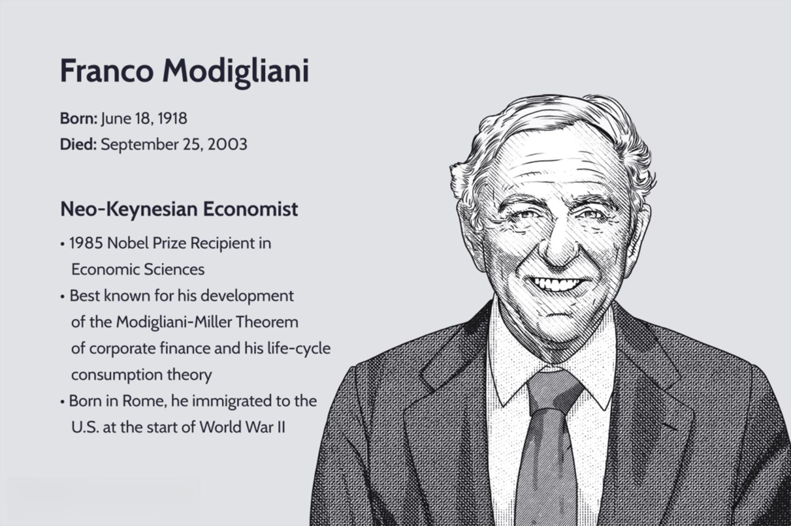

Franco Modigliani was a distinguished Neo-Keynesian economist whose work has had a profound and enduring impact on economic theory. Born in Rome, Italy, in 1918, Modigliani moved to the United States during World War II, where he would shape much of modern economic thinking. His innovative theories and rigorous analytical approaches earned him numerous accolades, culminating in being awarded the Nobel Prize in Economic Sciences in 1985.

Modigliani's economic contributions are particularly noteworthy in the areas of corporate finance and consumer behavior. One of his most significant theoretical developments was the Modigliani-Miller Theorem, co-developed with economist Merton Miller. This theorem posits that, in an efficient market free of taxes and bankruptcy costs, a firm’s total value is not affected by its capital structure. The implications of this theorem have been far-reaching, reshaping our understanding of corporate finance and capital investment.



Additionally, Modigliani advanced the life-cycle consumption theory, which suggests that individuals plan their consumption and savings behavior with an aim to maintain stable consumption over their lifetime. This theory provided a cornerstone for addressing questions related to savings behavior and personal financial management, influencing both economic policies and individual financial planning.

In the contemporary financial landscape, Modigliani's theories have found applications beyond traditional boundaries, particularly enhancing the efficiency and effectiveness of algorithmic trading. Algorithmic trading involves making data-driven, automated trading decisions, relying heavily on market efficiency insights, a concept linked to Modigliani's work.

This article explores Modigliani's seminal economic theories, examining the foundational role they play in both theoretical and practical facets of finance and economics. We delve into how his contributions continue to influence modern financial strategies and technological applications, such as algorithmic trading, demonstrating the lasting relevance of his intellectual legacy.

## Table of Contents

## Franco Modigliani: A Brief Biography

Franco Modigliani was born on June 18, 1918, in Rome, Italy. His early academic pursuits were in the field of law at the University of Rome; however, his interests soon shifted toward economics. This transition was influenced by his exposure to the economic turmoil of Italy during the 1930s and by his innate curiosity about the workings of economies. Modigliani's move to the study of economics was solidified following his emigration to the United States due to the rise of Fascism in Italy and the impact of the World War II.

Once in the United States, Modigliani pursued his newfound passion in economics and received a doctorate in social sciences from the New School for Social Research in 1944. His doctoral research, which emphasized dynamic models in economic theory, was conducted under the supervision of noted economists such as Jacob Marschak. This period laid the groundwork for Modigliani to become an influential figure in the evolving landscape of economic theory.

Modigliani's academic career flourished as he held various teaching and research positions at some of the most prestigious institutions. He served on the faculty at Carnegie Mellon University, where he collaborated with contemporaries in pioneering research. Later, he joined the Massachusetts Institute of Technology (MIT), where he would remain for decades, influencing a generation of economists with his teachings and research.

Throughout his career, Modigliani was not only a prolific contributor to economic thought but also a revered educator, guiding students and scholars in his areas of expertise. His work earned numerous accolades, and his influence on both theoretical and applied economics continues to be recognized globally.

## Key Economic Theories of Franco Modigliani

Franco Modigliani, a distinguished economist, is best known for two pivotal contributions to economic theory: the life-cycle consumption theory and the Modigliani-Miller Theorem. Both have profoundly impacted our understanding of financial markets and economic behavior.

The life-cycle consumption theory posits that individuals aim to stabilize their consumption throughout their lifetime, despite fluctuations in income. According to this model, people accumulate savings during their working years and draw down on these savings during retirement, smoothing consumption over time. This behavioral insight helps explain variances in personal savings rates across different age groups and economic conditions. The mathematical representation of this theory involves optimizing a utility function subject to a lifetime budget constraint. The utility function U often reflects the satisfaction or benefit derived from consuming goods and is expressed as a function of consumption over time:

$$

U = \sum_{t=1}^{T} \frac{C_t^{1-\gamma}}{1-\gamma} \times \beta^t 
$$

where $C_t$ is consumption at time t, $\gamma$ is the coefficient of relative risk aversion, $\beta$ is the discount factor, and $T$ is the planning horizon. The optimization involves choosing $C_t$ to maximize the utility subject to the budget constraint over the lifespan.

In collaboration with Merton Miller, Modigliani developed the Modigliani-Miller Theorem, a cornerstone of modern corporate finance. The theorem asserts that in efficient markets, a firm's total value is unaffected by its capital structure; that is, the way it is financed—whether through equity, debt, or hybrid instruments—does not impact its overall value. Specifically, the theorem's initial proposition, often referred to as Proposition I, can be formally represented as:

$$

V_L = V_U 
$$

where $V_L$ represents the value of a levered firm (financed with debt and equity), and $V_U$ is the value of an unlevered firm (financed solely with equity). This neutrality simplifies the decision-making process concerning financing, allowing firms to focus on investment and operational decisions without the need to optimize capital structure. The theorem assumes perfect capital markets, no taxes, and rational investor behavior—conditions rarely met in the real world but valuable as a theoretical baseline.

Modigliani's pioneering work transformed corporate finance and economic policy, laying fundamental groundwork for subsequent research and application in the economic domain. His theories provide essential tools for understanding the dynamic interplay of consumption, savings, and capital allocation in diverse economic environments.

## Modigliani's Influence on Modern Finance

Franco Modigliani's contributions have deeply impacted modern finance, particularly through the Modigliani-Miller Theorem and the life-cycle hypothesis. The Modigliani-Miller Theorem, developed in collaboration with Merton Miller, provides a foundational framework for corporate finance, challenging traditional assumptions about capital structure. The theorem stipulates that in efficient markets, the valuation of a firm is independent of its debt-to-equity ratio, assuming no taxes, bankruptcy costs, or asymmetric information. This concept has been pivotal, offering corporations a robust analytical tool to evaluate financial strategies, especially in assessing leverage and determining the optimal mix of debt and equity. 

A practical implication of the Modigliani-Miller Theorem in modern financial strategies is its utility in capital structure optimization. Given its assumptions, the theorem suggests that financial managers focus more on operational efficiencies and investment opportunities rather than attempting to increase firm value through financial rearrangements. This principle has been instrumental in shaping corporate financial policies and strategies, particularly in emerging financial environments where transparency and market efficiency are priorities.

Modigliani's life-cycle hypothesis also significantly influences contemporary economic policies and personal financial planning. This theory suggests that individuals optimize their consumption and savings behavior over their lifetime to maintain stable life satisfaction, saving during their working years and dis-saving during retirement. Understanding this model helps policymakers design effective fiscal policies, particularly those related to retirement planning, social security, and taxation. By accounting for lifetime income changes, governments can tailor these policies to promote economic stability and ensure a more equitable distribution of wealth.

Similarly, the life-cycle hypothesis also informs individuals and financial institutions in planning savings schemes and retirement plans. Financial advisors often utilize Modigliani's insights to guide clients in asset allocation, balancing their portfolios between growth-oriented investments and secure, income-generating assets through various life stages.

Furthermore, Modigliani's theories support the foundation of many automated financial tools that dominate today's trading ecosystems. Automated trading systems, which rely heavily on advanced algorithms and data analytics, incorporate theories on market efficiency and consumption patterns derived from Modigliani's work. These tools utilize algorithms to forecast market movements and optimize portfolios efficiently, reducing human error and enhancing the precision of trading strategies.

As financial markets increasingly turn to automation, Modigliani's insights remain highly applicable, drawing a direct line from his groundbreaking theories to the sophisticated technologies that characterize modern financial markets. His work continues to offer a reliable theoretical basis for developing and refining automated trading systems, crucial in an era dominated by rapid technological advancements and high-frequency trading. Franco Modigliani's contributions endure as integral components of the evolving discourse in finance, underpinning the strategies and tools that guide both corporate entities and individual financial decision-makers.

## Algorithmic Trading and Modigliani's Theories

Algorithmic trading, characterized by the execution of trades using automated and pre-programmed instructions accounting for variables such as time, price, and [volume](/wiki/volume-trading-strategy), has revolutionized financial markets. This innovation draws significantly from Franco Modigliani's insights into market efficiencies, particularly through the Modigliani-Miller Theorem and the life-cycle consumption theory.

The Modigliani-Miller Theorem posits that, under certain conditions, the value of a firm is unaffected by its capital structure. This principle of capital structure irrelevance suggests an inherent market efficiency that is crucial for [algorithmic trading](/wiki/algorithmic-trading). When applied, the theorem implies that the risk associated with a firm's capital structure, whether leveraged through debt or financed through equity, is neutralized by an efficient market. Consequently, algorithmic trading models leveraging this theorem can be designed to execute trades without needing to account for capital structure variability as a risk [factor](/wiki/factor-investing), thus providing a stable framework for decision-making.

Algorithmic trading strategies rely on market predictions and stability, something that the neutrality posited by the Modigliani-Miller Theorem inherently supports. For instance, a Python-based algorithm might include:

```python
def evaluate_trade(decision_threshold, market_data):
    capital_structure_neutral = True
    trade_value = sum(market_data['price'] * market_data['volume'])

    if capital_structure_neutral:
        if trade_value > decision_threshold:
            return "Execute Trade"
        else:
            return "Hold"
```

The life-cycle consumption theory, another key insight from Modigliani, is equally transformative for algorithmic trading. This theory suggests that individuals aim for a stable consumption pattern throughout their lives, adjusting for anticipated income fluctuations over time. Understanding these consumption patterns equips algorithmic traders with the ability to predict market trends based on aggregated consumer behavior. This anticipation is invaluable for constructing trading algorithms that predict market movements in response to shifting consumer savings and expenditures.

Integrating these consumption patterns into algorithmic models can enhance their predictive capabilities. For instance:

```python
def predict_market_trend(average_savings, income_fluctuations):
    trend_indicator = average_savings / income_fluctuations

    if trend_indicator > 1:
        return "Market Uptrend"
    else:
        return "Market Downtrend"
```

This incorporation of Modigliani’s theories into algorithmic trading highlights their enduring relevance in navigating modern financial challenges. By leveraging the Modigliani-Miller Theorem’s assertion of capital structure neutrality and applying the predictive capacity of the life-cycle consumption hypothesis, algorithmic trading strategies can achieve newfound levels of precision and reliability.

## Conclusion

Franco Modigliani's economic theories have had a profound and enduring influence on both corporate finance and personal financial strategies. His insights have fundamentally reshaped the understanding of market dynamics, informing today's economic thought and practice. Modigliani's pioneering work, particularly the Modigliani-Miller Theorem and the life-cycle consumption theory, provides key frameworks for analyzing financial structures and consumption behaviors.

In the context of modern finance, Modigliani's theories are increasingly significant. As algorithmic trading becomes more prevalent, Modigliani's work on market efficiency and capital structure neutrality offers crucial theoretical support. The Modigliani-Miller Theorem, by asserting the irrelevance of a firm's capital structure in frictionless markets, enables a stable foundation for developing complex, rule-based trading algorithms. These algorithms operate more effectively in environments theoretically described by Modigliani where capital allocation is optimized without the distortive influence of taxes, bankruptcy costs, and asymmetric information.

Moreover, Modigliani's life-cycle hypothesis—suggesting individuals allocate their resources over their lifetime to achieve stable consumption patterns—has implications for understanding long-term market trends. By modeling consumption and savings decisions, financial analysts and developers of automated systems can better predict behavior and tailor trading strategies accordingly. This enhances the robustness of algorithmic models by allowing them to incorporate human consumption patterns, leading to more accurate forecasting of market movements.

As the economic landscape continues to evolve with technological advances, Modigliani's legacy remains vital. His theories provide a foundation that supports innovation in financial analysis and the development of new technologies. These contributions have been instrumental in adapting economic models to new paradigms of automated and algorithm-driven trading. Franco Modigliani's work not only continues to inform current financial policies and personal financial planning but also serves as a beacon guiding future developments in financial technology.

## References & Further Reading

[1]: Modigliani, F., & Miller, M. H. (1958). ["The Cost of Capital, Corporation Finance and the Theory of Investment."](https://www.jstor.org/stable/1812919) American Economic Review, 48(3), 261–297.

[2]: Modigliani, F., & Brumberg, R. (1954). ["Utility Analysis and the Consumption Function: An Interpretation of Cross-Section Data"](https://direct.mit.edu/books/edited-volume/2669/chapter/72277/Utility-Analysis-and-the-Consumption-Function-An) in Post-Keynesian Economics.

[3]: Samuelson, P. A., & Modigliani, F. (1966). ["The Pass-Through Problem and the Efficacy of Monetary Policy."](http://piketty.pse.ens.fr/fichiers/enseig/ecoineg/articl/ModiglianiSamuelson1966.pdf) American Economic Review, 56(3), 354–384.

[4]: Merton, R. C. (1990). ["Continuous-Time Finance."](https://archive.org/details/continuoustimefi0000mert) Blackwell.

[5]: Scholes, M., & Modigliani, F. (1981). ["Effects of Dividend Yield and Dividend Policy on Common Stock Prices and Returns."](https://www.sciencedirect.com/science/article/pii/0304405X74900063) Journal of Financial Economics, 10(1), 1–22.