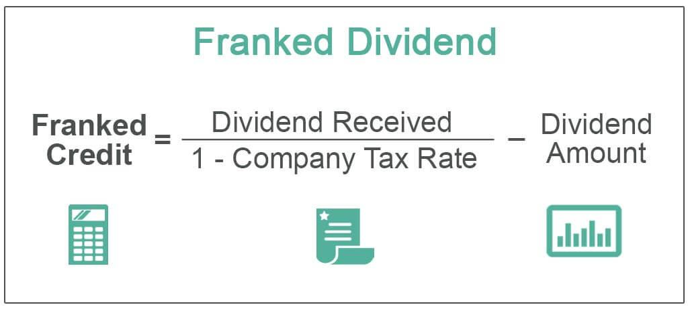

Dividends are a valuable part of investment portfolios, providing a stream of income from a company's earnings that is distributed to shareholders. Understanding the various types of dividends and their tax implications is essential for investors aiming to maximize their returns. This article will examine different categories of dividends, such as franked and unfranked dividends, which have distinct tax treatments with significant implications for investors. Franked dividends carry tax credits reflecting that corporate taxes have already been paid, while unfranked dividends do not offer such credits, impacting the tax liabilities of shareholders differently.

The relationship between dividends and tax credits is particularly relevant in jurisdictions with tax imputation systems, where franked dividends can help prevent double taxation. For instance, in countries like Australia, investors benefit from franking credits that can offset their individual tax liabilities, potentially resulting in tax refunds if the shareholder's tax rate is lower than the corporate rate. Conversely, unfranked dividends may result in higher tax obligations, as shareholders must pay taxes on the full dividend amount received.



Integrating these financial components with algorithmic trading presents an innovative approach to boosting tax efficiency in investment strategies. Algorithmic trading, driven by advanced computational techniques, can be designed to assess and target dividend stocks that offer favorable tax conditions. By incorporating tax credits into algorithmic models, investors can optimize their tax outcomes, thereby enhancing their overall investment returns. This strategy involves leveraging technology to automate complex tax calculations, offering the potential for increased efficiency and effectiveness in managing dividend-focused investments.

Our exploration aims to equip investors with a comprehensive understanding of dividends and tax credits, focusing on the synergy between these financial instruments and algorithmic trading mechanisms. With this knowledge, investors will be better positioned to craft informed investment strategies, optimize tax liabilities, and navigate the ever-evolving financial landscape to their best advantage.

## Table of Contents

## Understanding Dividend Types and Tax Credits

Dividends are regular payments made by a corporation to its shareholders from its profits or accumulated reserves. These distributions can take the form of cash or additional shares, rewarding investors for their investment in the company. Understanding the nuances of different types of dividends and their associated tax implications is crucial for investors aiming to maximize their returns.

Franked dividends are a tax-efficient way to distribute profits to shareholders. They come with an attached franking credit, which signifies that the company has already paid corporate tax on the profits being distributed. In essence, franking credits help align the tax responsibilities between a corporation’s corporate tax payments and the shareholders’ personal tax payments. The introduction of franking credits was primarily to counteract the problem of double taxation, where income gets taxed at both the corporate level and again at the individual level when distributed as dividends. 

For example, consider a company paying a dividend of AUD 70, with a franked credit of AUD 30 due to prior corporate tax payments. The deemed taxable income then becomes AUD 100 (dividend of AUD 70 + franking credit of AUD 30). For a shareholder, this implies declaring the full AUD 100 as taxable income, while the AUD 30 franking credit can offset their tax liability. Should the shareholder's tax rate be lower than the corporate rate, they are eligible for a tax refund equivalent to the unused portion of the franking credit.

Unfranked dividends, on the other hand, do not include any tax credit, meaning the income has not been taxed at the corporate level. Consequently, shareholders are liable to pay taxes on the full amount of the dividend according to their marginal tax rate.

Partially franked dividends are an intermediate case where only a portion of the dividends distributed has tax paid at the corporate level. This scenario occurs when a company has paid corporate tax on only part of its earnings but opts to distribute the entire profits as dividends. For example, if half of the distributed earnings have incurred corporate tax and the other half has not, the company might distribute a partially franked dividend reflecting this tax status. Such scenarios demand careful scrutiny from investors, as the tax obligations tied to these dividends could vary significantly.

In conclusion, understanding the different types of dividends and their correlated tax credits is essential for investors. Exploring franked and unfranked dividends unveils significant tax planning opportunities by diminishing overall tax burdens and, in certain circumstances, securing tax refunds. Investors should therefore assess the structure of dividend payments keenly to fortify their investment decisions and ensure optimal fiscal outcomes.

## The Mechanics of Franked Dividends

Franked dividends serve as a mechanism to prevent the double taxation of dividends by attaching a franking credit. In essence, these credits represent the tax already paid by a corporation, ensuring that this tax amount is not levied again on shareholders when they receive the dividends.

### Function of Franking Credits

When a corporation pays tax on its earnings, it distributes the remaining profits to shareholders as dividends. To align the tax treatment of corporate income with shareholder income, a franking credit is attached to dividends. This credit embodies the tax paid by the corporation. Shareholders, in turn, can use this credit to offset their personal income tax liabilities, thus eliminating or reducing double taxation.

For example, suppose a company earns $1,000 and pays a corporate tax at a rate of 30%, resulting in $300 of tax paid. If the company chooses to distribute the remaining $700 as a dividend, it attaches a franking credit reflecting the $300 in taxes already paid. When a shareholder reports this income, they declare both the $700 dividend and the $300 franking credit, acknowledging a grossed-up taxable income of $1,000.

### Calculating Franking Credits

To illustrate:

1. **Gross Income from Dividend**: Consider a dividend of $700 with a franking credit of $300.
2. **Total Taxable Income** for the shareholder: $700 (dividend) + $300 (franking credit) = $1,000.
3. **Tax Obligation**: If the shareholder's marginal tax rate is, say 25%, the tax on $1,000 would be $250.
4. **Tax Payable/Refundable**:
$$
   \text{Tax Liability} = \text{Marginal Tax Rate} \times \text{Total Taxable Income} - \text{Franking Credit}

$$
$$
   \text{Tax Liability} = 0.25 \times 1000 - 300 = 250 - 300 = -50

$$

This negative result implies that the shareholder is eligible for a tax refund of $50, showing how franking credits can completely offset and even exceed the tax obligations of shareholders whose personal tax rates are lower than the corporate rate.

### Tax Imputation Systems

Systems like Australia's tax imputation approach enhance dividend earnings efficiency by eliminating the corporate vs. individual tax discrepancy. Such systems not only avert double taxation but create attractive investment environments. Shareholders benefit from more favorable tax treatments, potentially leading to higher after-tax returns. As each country's corporate tax rate and tax imputation policy may vary, the specific benefits can differ, providing an advantage to investors in jurisdictions embracing full or partial tax credits.

Franking credits ultimately reward investors, especially those liable to lower personal tax rates, by transforming corporate tax payments into potential tax benefits or refunds upon receiving dividends. This integration fosters a more neutral and potentially more profitable investment landscape.

## Tax Implications and Benefits for Investors

The imputation system is designed to mitigate the tax burden on dividends by allocating franking credits to shareholders, effectively reducing their overall tax liability. This is particularly advantageous when the investor's marginal tax rate is lower than the corporate tax rate. In such cases, the difference between the corporate tax rate and the individual tax rate can be refunded to the shareholder, thus enhancing the appeal of dividend-yielding stocks in jurisdictions that offer franking credits.

### Investment Attraction of Dividend-Yielding Stocks

Dividend-yielding stocks in jurisdictions with imputation systems are generally attractive to investors seeking tax efficiency. These systems allow shareholders to receive a credit for the tax already paid by the corporation, thereby avoiding double taxation. Stocks in regions with robust imputation systems, such as Australia, often provide higher after-tax returns, making them attractive for both domestic and international investors. The ability to claim these credits can lead to substantial tax savings and plays a crucial role in the decision-making process for investors focusing on income generation.

### Realizing Tax Refunds Through Effective Management

Effective management of franking credits can lead to tax refunds, contingent on individual circumstances. When filing taxes, shareholders declare their dividend income along with the attached franking credits. If their individual tax obligation falls below the franking credit value, they can claim the difference as a tax refund. This necessitates precise record-keeping and understanding of one's tax situation to maximize potential refunds. The formula for calculating the potential refund is:

$$
\text{Tax Refund} = \text{Franking Credit} - (\text{Shareholder's Marginal Tax Rate} \times \text{Dividend Income})
$$

By employing this strategy, investors can optimize their tax outcomes, but it requires careful planning and execution.

### Global Applicability and Variations

Globally, the implementation of imputation systems varies widely. While countries like Australia and New Zealand have fully integrated imputation systems offering substantial tax benefits, others may have partial systems or none at all. For instance, Canada and the United Kingdom offer tax relief on dividends but employ different mechanisms. In these jurisdictions, dividend income is taxed at a reduced rate or receives a dividend tax credit, albeit less directly than the Australian model.

In the United States, there is no imputation system; however, qualified dividends are taxed at the capital gains tax rate, which is typically lower than the ordinary income rate. Investors need to be aware of these variations as they significantly impact the potential returns from dividend stocks.

Understanding the differences among these systems is crucial for international investors seeking to navigate tax strategies across multiple jurisdictions. Adapting investment strategies to fit the local tax landscape can maximize after-tax income, making dividend stocks a vital component of a tax-efficient portfolio.

## Algorithmic Trading and Tax Efficiency

Algorithmic trading leverages advanced computational techniques to execute trades at optimal prices, speeds, and efficiencies that are beyond human capabilities. A key advantage of [algorithmic trading](/wiki/algorithmic-trading) is its ability to enhance tax efficiency, particularly in the context of dealing with dividends and their associated tax credits.

Algorithms can be structured to maximize tax efficiency by incorporating information and preferences related to tax credits, specifically in targeting dividend-yielding stocks. For instance, an algorithm may prioritize investments in high-franking credit stocks, thereby minimizing the tax burden for investors whose marginal tax rate is lower than the corporate tax rate. This approach effectively reduces the tax liability on received dividends and can potentially result in tax refunds.

Consider a simple Python algorithm that selects stocks based on their franking credit yield. The following pseudocode outlines how such an algorithm might function:

```python
import pandas as pd

def select_tax_efficient_stocks(stock_data, investor_tax_rate):
    # stock_data is a DataFrame with columns: 'stock', 'dividend_yield', 'franking_credit', 'market_value'

    # Calculate the after-tax dividend yield for each stock
    stock_data['after_tax_yield'] = stock_data.apply(
        lambda row: row['dividend_yield'] * (1 - investor_tax_rate + row['franking_credit']), 
        axis=1
    )

    # Rank stocks by after-tax yield
    ranked_stocks = stock_data.sort_values(by='after_tax_yield', ascending=False)

    return ranked_stocks

# Example DataFrame
data = {
    'stock': ['A', 'B', 'C'],
    'dividend_yield': [0.05, 0.04, 0.06],
    'franking_credit': [0.003, 0.002, 0.004],
    'market_value': [100, 150, 200]
}

stock_df = pd.DataFrame(data)
investor_marginal_tax_rate = 0.30

# Select stocks with the highest tax-adjusted yield
optimal_stocks = select_tax_efficient_stocks(stock_df, investor_marginal_tax_rate)
print(optimal_stocks)
```

In this example, the algorithm calculates each stock's "after-tax yield" by considering both the declared dividend yield and the franking credit, adjusted for the investor's tax rate. This enables the investor to focus on stocks providing the best post-tax returns.

Technology plays a pivotal role in automating tax calculations, significantly enhancing trading returns. Automation reduces the possibility of errors that can occur with manual calculations and adjustments. Modern trading platforms are equipped with sophisticated tools for integrating tax considerations, such as franking credits, into broader trading strategies. These platforms allow real-time data analysis and execution based on tax-efficient algorithms, ensuring optimal transaction timing and decision-making processes.

With the ever-increasing complexity of tax laws and financial instruments, the advancement of algorithmic trading technologies presents investors with opportunities to customize their trading strategies effectively. The integration of tax optimization algorithms facilitates better alignment with tax-efficient investing, ultimately culminating in improved net returns while minimizing tax liabilities.

## Integrating Tax Considerations into Trading Strategies

Integrating tax considerations into algorithmic trading strategies involves embedding tax calculations within trading models to enhance investment returns by optimizing tax outcomes. This process typically involves using advanced algorithms to select stocks that maximize after-tax returns, while also factoring in potential tax liabilities and benefits associated with different investment decisions.

One approach to automating tax considerations in trading involves utilizing software tools and platforms that are specifically designed for this purpose. Platforms such as QuantConnect, Alpaca, and MetaTrader offer integration capabilities for Python-based scripts that can incorporate tax-efficient strategies. These tools enable traders to apply complex algorithms that consider various tax scenarios and optimize trading decisions based on tax implications alongside other market factors.

Case studies have shown that integrating tax-efficient strategies within algorithmic trading can lead to improved trading results. For instance, strategies that prioritize investments in dividend-paying stocks with favorable tax treatments, such as those offering substantial franking credits, can enhance after-tax returns significantly. An example of such a strategy could involve dynamically rebalancing a portfolio to capitalize on upcoming ex-dividend dates while minimizing exposure to less tax-efficient stocks.

```python
import numpy as np
import pandas as pd

# Example of a basic tax-efficient stock selection algorithm
def tax_efficient_strategy(stocks_data, tax_data):
    tax_efficiency_scores = []

    for stock in stocks_data:
        # Calculate hypothetical post-tax return
        pre_tax_return = stock['expected_return']
        dividend_yield = stock['dividend_yield']
        franking_credit = tax_data['franking_credit'].get(stock['ticker'], 0)

        post_tax_return = pre_tax_return + dividend_yield * (1 - franking_credit)
        tax_efficiency_scores.append((stock['ticker'], post_tax_return))

    return sorted(tax_efficiency_scores, key=lambda x: x[1], reverse=True)

# Sample data
stocks_data = pd.DataFrame({'ticker': ['STK1', 'STK2'], 'expected_return': [0.05, 0.08], 'dividend_yield': [0.02, 0.03]})
tax_data = {'franking_credit': {'STK1': 0.3, 'STK2': 0.5}}

# Run strategy
tax_efficient_ranking = tax_efficient_strategy(stocks_data.to_dict('records'), tax_data)
print(tax_efficient_ranking)
```

Despite the advantages, integrating tax strategies into trading models does come with potential risks. One significant risk is the possibility of regulatory changes that may alter the validity or financial benefit of certain tax strategies. Traders must remain informed about changes in tax law and adjust their strategies accordingly. Additionally, calculation errors or incorrect assumptions within the algorithm can lead to suboptimal trading decisions and potential financial losses. Therefore, it is crucial to incorporate robust error-checking and validation mechanisms within the trading software.

In conclusion, by embedding tax considerations into algorithmic trading models, investors can potentially optimize their investment outcomes. However, it is essential to acknowledge and manage the risks associated with such strategies, ensuring compliance with prevailing regulations and maintaining the integrity of the trading algorithms.

## Conclusion and Future Trends

Understanding dividends and their associated tax credits is crucial for optimizing investment strategies, especially within modern trading frameworks. Franked dividends, with their franking credits, serve to alleviate the burden of double taxation, thereby enhancing the net returns for shareholders. This integral feature can significantly influence investment decisions, particularly in markets that adopt an imputation tax system. Additionally, the synergy between tax-efficient approaches and algorithmic trading is poised to further revolutionize investment methodologies. The automated nature of algorithmic trading allows for precise calculations and adjustments, integrating tax considerations seamlessly into trading strategies for optimal economic outcomes.

Looking ahead, the landscape of taxation and trading technology is expected to evolve in significant ways. On a global scale, we may witness shifts in tax laws as governments adapt to changing economic conditions and seek to harmonize their tax policies. Such changes could impact the effectiveness of franking credits and the attractiveness of dividend-yielding stocks. It is essential for investors to stay informed on these developments to safeguard and potentially enhance their returns.

The advancement in trading technologies, particularly in [artificial intelligence](/wiki/ai-artificial-intelligence) and [machine learning](/wiki/machine-learning), will likely drive further innovation. These technologies can be harnessed to create more sophisticated algorithms that not only optimize tax efficiency but also adapt dynamically to market conditions. This evolution underlines the importance for investors to continuously engage in learning and adapt their strategies to sustain a competitive edge.

Emphasizing continuous education is vital for navigating this dynamic financial environment. Investors are encouraged to engage with new learning opportunities, such as online courses and webinars, focusing on tax-efficient investing and algorithmic trading. By doing so, they can better position themselves to capitalize on these insights, ultimately maximizing returns while minimizing tax liabilities. The intersection of well-informed investment strategies and advanced technological tools holds the promise of transforming traditional investment approaches into more refined and efficient systems.

## References & Further Reading

### References & Further Reading

1. **Tax Authority Guidelines**
   - Australian Taxation Office. "Guide to Franking Credits," which provides comprehensive information on how franking credits work within Australia's tax imputation system. Available at: [Australian Taxation Office](https://www.ato.gov.au).
   - Internal Revenue Service (IRS). "U.S. Tax Treatment of Dividends," a detailed guide on how dividends are taxed in the United States. Accessible here: [IRS](https://www.irs.gov).

2. **Scholarly Articles**
   - Green, R., & Talmor, E. (1985). "Taxation and the Ex-Dividend Day Behavior of Common Stock Prices." Journal of Finance, 40(2), 405-435. This paper discusses tax effects on dividend yield and market behavior.
   - Auerbach, A., & Hassett, K. (2003). "The 2003 Dividend Tax Cuts and the Value of the Firm: An Event Study." National Bureau of Economic Research. This article examines implications of changes in dividend taxation on stock prices.

3. **Books**
   - Damodaran, A. (2012). "Investment Valuation: Tools and Techniques for Determining the Value of Any Asset." This book includes sections focusing on dividend distribution strategies and their tax implications.
   - Bodie, Z., Kane, A., & Marcus, A. J. (2014). "Investments." This textbook offers insights into dividends and capital gains tax strategies.

4. **Digital Resources**
   - Coursera. "Financial Markets by Yale University," an online course that covers basics of financial markets, including dividends and taxes. Available at: [Coursera](https://www.coursera.org).
   - Udemy. "Algorithmic Trading & Quantitative Analysis Using Python," which offers training on building tax-efficient trading algorithms. Find it here: [Udemy](https://www.udemy.com).

5. **Webinars and Online Series**
   - CFA Institute. Offers a range of webinars focusing on investment strategies and tax considerations in trading. These resources are valuable for in-depth understanding and staying updated on industry practices. Visit: [CFA Institute](https://www.cfainstitute.org).
   - Bloomberg Professional Services. Regular webinars on financial strategies, including tax-efficient investing and algorithmic trading. More information can be found at: [Bloomberg Professional](https://www.bloomberg.com/professional).

These resources collectively provide a comprehensive guide for further exploration of dividend taxation and the strategic role of algorithmic trading in maximizing tax efficiency.

