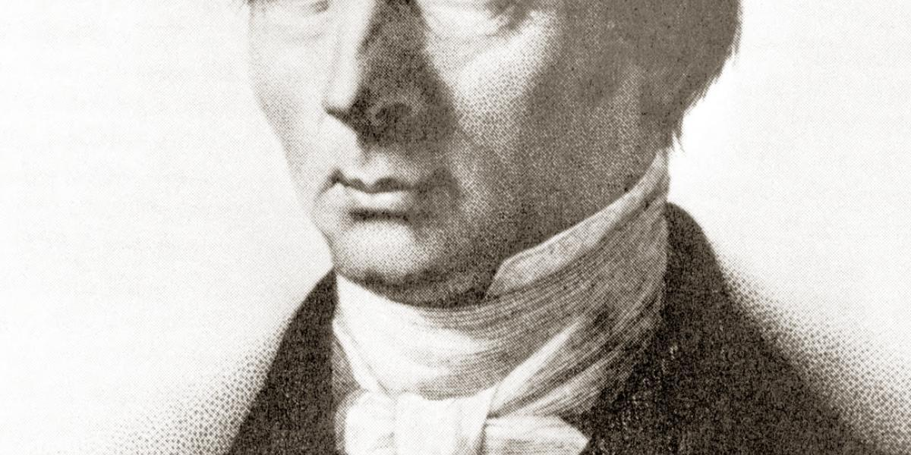

## Table of Contents

## Who was Frederic Bastiat?

Frederic Bastiat was a French economist and writer who lived in the 1800s. He is famous for his ideas about free markets and how they help people. Bastiat believed that if people could trade freely without too many rules from the government, everyone would be better off. He wrote many books and articles to explain his ideas.

One of Bastiat's most famous writings is called "The Parable of the Broken Window." In this story, he explains that breaking a window might seem to create jobs for the glazier, but it actually just wastes resources. The money spent on fixing the window could have been used for something else, like buying new shoes. This idea is called "opportunity cost," and it shows how some actions can hide their true costs.

Bastiat's work is still important today. Many people study his ideas to understand how economies work and how to make them better. His clear and simple way of explaining complex ideas makes his writings easy to understand and useful for everyone.

## What is the significance of Frederic Bastiat in the field of economics?

Frederic Bastiat was very important in economics because he helped people understand the idea of free markets. He believed that if people could trade freely without too many government rules, it would make everyone's lives better. Bastiat wrote a lot about how free trade could help countries grow and how it could make goods cheaper for everyone. His ideas are still used today by people who study economics and want to understand how to make economies work better.

One of Bastiat's big contributions was his idea of opportunity cost, which he explained in "The Parable of the Broken Window." He showed that when something like a window gets broken, it might seem like it creates jobs for the person fixing it, but it actually wastes money that could have been used for something else. This idea helps economists think about the hidden costs of actions and decisions. Bastiat's simple way of explaining complex ideas made his work easy to understand and very influential in the field of economics.

## Where and when was Frederic Bastiat born?

Frederic Bastiat was born in the town of Bayonne, which is in France. His birthday was June 30, 1801. Bayonne is a place near the ocean in the southwest part of France.

When Bastiat was born, the world was a different place. People used horses and carriages to travel, and there were no cars or airplanes. France was also going through many changes at that time, with new ideas about how countries should be run.

## What were the main influences on Bastiat's education?

Frederic Bastiat's education was influenced by his family and the [books](/wiki/algo-trading-books) he read. When he was young, his grandfather took care of him and taught him a lot. His grandfather was a businessman, so Bastiat learned about trade and how businesses work. He also read many books on his own, which helped him learn about different ideas and ways of thinking.

Later, Bastiat went to school in a town called Sorèze. There, he studied many subjects like history, literature, and science. The school was run by monks, so he also learned about religion. These experiences helped him develop his own ideas about the world and how it should work.

## What are some of the key works written by Frederic Bastiat?

Frederic Bastiat wrote many important books and articles. One of his most famous works is "Economic Sophisms," which he published in 1845. In this book, he talks about how some ideas about economics can be misleading. He uses simple stories and examples to show why free trade is good for everyone. Another important work is "The Law," which he wrote in 1850. In "The Law," Bastiat explains that the main job of the government should be to protect people's rights, not to control their lives too much.

Another well-known work by Bastiat is "What Is Seen and What Is Not Seen," which he published in 1850. This essay includes the famous "Parable of the Broken Window," where he explains the idea of opportunity cost. He shows that when we make choices, we need to think about what we give up, not just what we gain. These works are still read and studied today because they help people understand important ideas in economics in a clear and simple way.

## How did Bastiat's 'The Law' contribute to political theory?

Frederic Bastiat's "The Law" is an important book in political theory because it talks about what the government should and should not do. Bastiat believed that the main job of the government is to protect people's rights, like their right to life, freedom, and property. He thought that the government should not try to control people's lives too much or take away their rights. This idea is called "limited government," and it has influenced many people who believe that governments should be small and not interfere too much in people's lives.

Bastiat also warned about something he called "legal plunder." This is when the government uses its power to take things from some people and give them to others. He thought this was wrong because it goes against the idea of protecting everyone's rights equally. "The Law" has been very influential in political theory because it helps people think about what the government should do and how it should treat its citizens. Many people still read and discuss Bastiat's ideas today to understand how governments should work.

## What is the concept of 'opportunity cost' as explained by Bastiat?

Frederic Bastiat explained the concept of opportunity cost using a simple story called "The Parable of the Broken Window." In this story, a boy breaks a window, and people think it's good because it creates work for the glazier who fixes it. But Bastiat says this is wrong. When the window gets fixed, the money spent on it can't be used for something else, like buying new shoes. So, the real cost of the broken window is not just the price of the new window, but also the shoes that could have been bought instead.

This idea of opportunity cost means that every choice we make has a hidden cost. When we decide to do one thing, we give up the chance to do something else. Bastiat wanted people to think about these hidden costs when making decisions, especially in economics. Understanding opportunity cost helps us see that some actions might seem good at first, but they can actually make us worse off because of what we have to give up.

## Can you explain Bastiat's famous parable of the broken window?

Frederic Bastiat's famous parable of the broken window is a simple story that teaches a big lesson about economics. In the story, a boy breaks a shopkeeper's window. People around think it's not so bad because the shopkeeper will have to pay to fix the window, which means work for the glazier who fixes it. They think this is good because it creates a job and keeps money moving in the economy.

But Bastiat says this way of thinking is wrong. When the shopkeeper spends money to fix the window, he can't use that same money to buy something else he needs, like new shoes. So, the real cost of the broken window is not just the price of the new window, but also the shoes he can't buy. This teaches us about something called "opportunity cost," which means that every choice we make has a hidden cost because we give up other things we could have done with our time or money.

## How did Bastiat's ideas influence the development of economic liberalism?

Frederic Bastiat's ideas were very important for the growth of economic liberalism. He believed that people should be free to trade without too many rules from the government. This idea is a big part of economic liberalism, which says that free markets help everyone. Bastiat wrote a lot about how free trade could make countries richer and goods cheaper for everyone. His clear and simple way of explaining these ideas helped more people understand and support economic liberalism.

Bastiat's work also helped people think about the hidden costs of actions, like in his story about the broken window. He showed that when we make choices, we give up other things we could have done. This idea of opportunity cost is important in economic liberalism because it helps people see the real effects of government actions. Bastiat's ideas are still used today by people who believe in free markets and want to make economies work better.

## What was Bastiat's role in the French political scene during his lifetime?

Frederic Bastiat played an active role in the French political scene during his lifetime. He was a member of the French National Assembly from 1848 to 1850. During this time, he spoke out a lot about his ideas on free trade and how the government should work. He believed that the government should protect people's rights but not control their lives too much. Bastiat used his time in the Assembly to argue against laws that he thought were bad for the economy, like high taxes and trade restrictions.

Bastiat also started a group called the Association pour la Liberté des Échanges, which means the Association for Free Trade. This group wanted to get rid of rules that stopped people from trading freely. They thought that if people could trade more easily, it would make everyone's life better. Even though Bastiat was only in politics for a short time, his ideas had a big impact. He helped start conversations about free trade and limited government that people still talk about today.

## How have Bastiat's economic theories been critiqued or expanded upon by later economists?

Later economists have critiqued and expanded upon Frederic Bastiat's economic theories in different ways. Some economists agree with Bastiat's ideas about free markets and opportunity cost. They think his ideas are still useful for understanding how economies work. For example, economists like Ludwig von Mises and Friedrich Hayek built on Bastiat's ideas when they talked about how free markets can help people make better choices. They also used Bastiat's ideas to argue against too much government control over the economy.

Other economists have criticized Bastiat's theories. They say that his ideas about free trade and limited government are too simple. These critics believe that governments need to do more than just protect rights. They think the government should also help people who are struggling and make sure that everyone has a fair chance. Economists like John Maynard Keynes, for example, argued that sometimes the government needs to spend money to help the economy grow, which is different from what Bastiat believed. Even though there are different opinions about Bastiat's ideas, his work is still important and helps people think about how economies should work.

## What is the legacy of Frederic Bastiat in modern economic thought?

Frederic Bastiat's legacy in modern economic thought is very important. He helped people understand the idea of free markets and how they can make everyone's life better. Bastiat believed that if people could trade freely without too many rules from the government, it would help the economy grow. His ideas about free trade and limited government are still used today by economists who believe in free markets. Many people study Bastiat's work to learn about how economies work and how to make them better.

Bastiat's idea of opportunity cost, which he explained in the parable of the broken window, is also a big part of his legacy. This idea helps economists think about the hidden costs of actions and decisions. When we make a choice, we give up other things we could have done. Understanding opportunity cost helps people see the real effects of government actions and economic policies. Even though some economists disagree with Bastiat's ideas, his work is still important and helps people think about how to make economies work better for everyone.

## References & Further Reading

[1]: Bastiat, F. (1848). ["Economic Sophisms."](https://www.gutenberg.org/files/44145/44145-h/44145-h.htm) Liberty Fund.

[2]: Bastiat, F. (1850). ["The Law."](https://en.wikipedia.org/wiki/The_Law_(Bastiat_book)) Liberty Fund.

[3]: Hayek, F.A. (2021). ["The Road to Serfdom."](https://www.taylorfrancis.com/books/mono/10.4324/9781315728124/road-serfdom-hayek-bruce-caldwell) University of Chicago Press.

[4]: Mises, L.v. (2007). ["Human Action: A Treatise on Economics."](https://mises.org/library/book/human-action) Ludwig von Mises Institute.

[5]: ["Advances in Financial Machine Learning"](https://www.amazon.com/Advances-Financial-Machine-Learning-Marcos/dp/1119482089) by Marcos Lopez de Prado

[6]: Smith, A. (1776). ["An Inquiry into the Nature and Causes of the Wealth of Nations."](https://archive.org/details/inquiryintonatur01smit_0/) 

[7]: Jansen, S. (2020). ["Machine Learning for Algorithmic Trading - Second Edition."](https://github.com/stefan-jansen/machine-learning-for-trading) Packt Publishing.