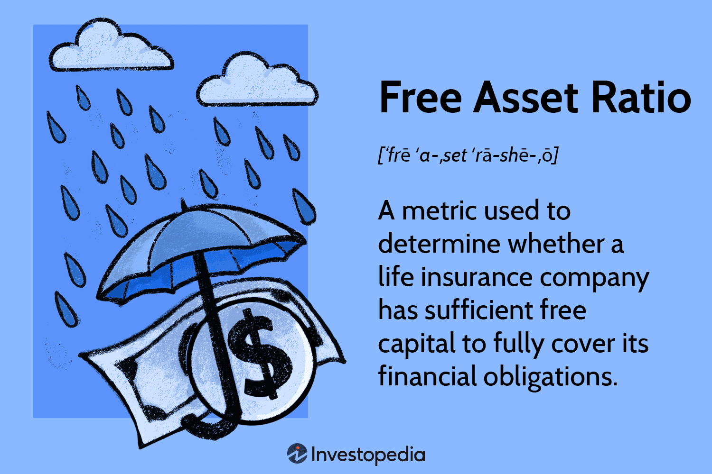

## Table of Contents

## What is the Free Asset Ratio (FAR)?

The Free Asset Ratio (FAR) is a financial measure that shows how much money a company has left after it pays for all its short-term debts. It tells us if a company can easily pay its bills without selling its long-term assets. To find the FAR, you take the total value of a company's current assets and subtract its current liabilities. The result is then divided by the total assets of the company.

FAR is important because it helps investors and managers see how financially healthy a company is. A higher FAR means the company has more free assets, which is good because it shows the company can handle its short-term debts well. If the FAR is low, it might mean the company is struggling to pay its bills and could be at risk of financial trouble. By keeping an eye on the FAR, people can make better decisions about investing in or managing a company.

## Why is the Free Asset Ratio important for businesses?

The Free Asset Ratio (FAR) is important for businesses because it shows how well they can pay their short-term bills without selling off their long-term stuff. It's like checking if you have enough money in your pocket to buy lunch without needing to sell your bike. If a business has a high FAR, it means they are in a good spot financially. They can easily cover their debts and still have money left over, which is great for keeping the business running smoothly and planning for the future.

On the other hand, if the FAR is low, it's a warning sign. It means the business might be struggling to pay its bills and could be at risk of running into money problems. This can make it hard for the business to grow or even stay afloat. By keeping an eye on the FAR, business owners and investors can make smarter choices about how to manage money, whether to invest more, or if they need to cut back on spending to stay safe financially.

## How is the Free Asset Ratio calculated?

The Free Asset Ratio (FAR) is calculated by taking a company's current assets and subtracting its current liabilities. This gives you the free assets, which is the money left over after paying all the short-term bills. Then, you divide this number by the total assets of the company. The formula looks like this: FAR = (Current Assets - Current Liabilities) / Total Assets.

This simple calculation helps show how financially healthy a company is. If the FAR is high, it means the company has a lot of money left after paying its bills, which is good. It can use this extra money for growth or other investments. If the FAR is low, it means the company might struggle to pay its bills and could be in financial trouble. By looking at the FAR, people can make better decisions about the company's money management and future plans.

## What are the key components needed to calculate the Free Asset Ratio?

To calculate the Free Asset Ratio (FAR), you need to know three main things: current assets, current liabilities, and total assets. Current assets are things a company can turn into cash quickly, like money in the bank, money customers owe, and inventory. Current liabilities are the bills a company needs to pay soon, like money owed to suppliers or short-term loans. Total assets are everything the company owns, including both current assets and long-term stuff like buildings and equipment.

Once you have these numbers, calculating the FAR is easy. You start by taking the current assets and subtracting the current liabilities. This gives you the free assets, which is the money left after paying all the short-term bills. Then, you divide this number by the total assets. The formula is FAR = (Current Assets - Current Liabilities) / Total Assets. This simple calculation helps show how well a company can pay its bills without selling its long-term assets.

## Can you provide a simple example of calculating the Free Asset Ratio?

Let's say a company has $50,000 in current assets, which is the money they can easily turn into cash. They also have $30,000 in current liabilities, which are the bills they need to pay soon. Their total assets, which is everything they own, come to $100,000. To find the Free Asset Ratio (FAR), we first figure out the free assets by taking the current assets and subtracting the current liabilities. So, $50,000 minus $30,000 gives us $20,000 in free assets.

Next, we divide the free assets by the total assets to get the FAR. So, we take the $20,000 in free assets and divide it by the $100,000 in total assets. This gives us a FAR of 0.20 or 20%. This means the company has 20% of its total assets left after paying all its short-term bills. A higher FAR like this is good because it shows the company can easily cover its debts and still have money left over for other things.

## What does a high Free Asset Ratio indicate about a company's financial health?

A high Free Asset Ratio (FAR) means a company is in good financial shape. It shows that after paying all its short-term bills, the company still has a lot of money left over. This is like having extra cash in your pocket after buying what you need. A high FAR means the company can easily handle its debts and doesn't have to worry about running out of money. It's a sign that the company is strong and can keep running smoothly.

Having a high FAR also means the company can use the extra money for other things, like growing the business or investing in new projects. It gives the company more freedom to make plans for the future without the stress of not being able to pay its bills. Investors and managers like to see a high FAR because it shows the company is doing well and is a safe place to put their money.

## What does a low Free Asset Ratio suggest, and what are the potential risks?

A low Free Asset Ratio (FAR) means a company might be in trouble with money. It shows that after paying all the short-term bills, there's not much money left. This is like having just a little change in your pocket after buying what you need. If the FAR is low, it means the company could struggle to pay its bills and might need to sell off long-term assets, like buildings or equipment, just to keep going.

The main risk of a low FAR is that the company could run out of money and go bankrupt. It might also have a hard time getting loans because banks see it as risky. This can make it tough for the company to grow or even stay in business. A low FAR is a warning sign that the company needs to be careful with its spending and might need to find ways to bring in more money or cut costs to stay safe financially.

## How does the Free Asset Ratio differ from other financial ratios like the Current Ratio or Quick Ratio?

The Free Asset Ratio (FAR) is different from the Current Ratio and the Quick Ratio because it shows how much money a company has left after paying its short-term bills. The FAR is calculated by taking the current assets, subtracting the current liabilities, and then dividing by the total assets. This gives you an idea of the company's financial health by showing what's left over after all the immediate bills are paid. The Current Ratio and Quick Ratio, on the other hand, focus more on the company's ability to pay its short-term debts without considering what's left over.

The Current Ratio is found by dividing current assets by current liabilities, which tells you if a company can pay its short-term bills with its short-term assets. It's a simple way to see if the company has enough money to cover its immediate debts. The Quick Ratio is similar but even stricter; it's calculated by taking current assets minus inventory and then dividing by current liabilities. This ratio shows if a company can pay its short-term bills without selling its inventory. Both the Current Ratio and Quick Ratio are important, but they don't tell you what's left over after paying the bills, which is what the FAR does.

## What industries typically have higher or lower Free Asset Ratios, and why?

Industries that typically have higher Free Asset Ratios (FAR) are often those with a lot of cash on hand and fewer short-term debts. For example, technology companies like software firms often have high FARs because they don't need to spend a lot on physical stuff like factories or inventory. They can make money from their ideas and services without a lot of upfront costs. This means they can keep more money after paying their bills, leading to a higher FAR. Also, companies in the finance industry, like banks, might have high FARs because they deal with a lot of cash and investments, which count as current assets.

On the other hand, industries with lower FARs often have to spend a lot of money just to keep their business running. Manufacturing companies, for example, have to buy a lot of materials and machines, which can lead to more short-term debts. They also have to keep a lot of inventory, which ties up their money. Retail businesses might have lower FARs too because they need to buy products to sell, and they might not get paid right away by customers. This means they have less money left after paying their bills, leading to a lower FAR. The type of industry and how it manages its money can really affect its FAR.

## How can a company improve its Free Asset Ratio?

A company can improve its Free Asset Ratio by focusing on increasing its current assets and reducing its current liabilities. One way to do this is by speeding up how quickly they collect money from customers. If they can get paid faster, they will have more cash on hand, which counts as a current asset. Another way is by selling off any inventory that isn't moving quickly. This turns the inventory into cash, which also helps boost current assets. The company can also try to find cheaper ways to buy the things they need, which can save money and lower their costs.

Another important step is to manage their current liabilities better. This means paying off short-term debts as quickly as possible or negotiating better terms with suppliers so they don't have to pay right away. If a company can delay paying its bills without any penalties, it keeps more cash in its pocket for a longer time. By carefully watching both their current assets and liabilities, a company can work to improve its Free Asset Ratio, making it healthier financially and more able to handle its bills without worry.

## What are the limitations of using the Free Asset Ratio as a financial metric?

The Free Asset Ratio (FAR) can be a helpful way to see how well a company can pay its short-term bills, but it has some limits. One big problem is that it doesn't tell the whole story about a company's money situation. For example, it doesn't look at how fast the company makes money or how much it owes in the long run. A company might have a high FAR but still be in trouble if it can't keep making money or if it has a lot of long-term debt to pay.

Another limit of the FAR is that it can change a lot depending on what's happening in the company at that moment. If a company just got a big payment from a customer, its FAR might look really good. But if it has to buy a lot of stuff to keep running, the FAR could drop quickly. This means the FAR can be a bit like a snapshot that doesn't show the full picture of the company's money health over time. It's important to use the FAR along with other financial measures to get a better idea of how the company is really doing.

## How can advanced financial analysts use the Free Asset Ratio in conjunction with other metrics for deeper insights?

Advanced financial analysts can use the Free Asset Ratio (FAR) along with other financial metrics to get a fuller picture of a company's health. For example, they might look at the FAR together with the Debt-to-Equity Ratio to see if a company is using too much debt to fund its operations. If the FAR is high but the Debt-to-Equity Ratio is also high, it might mean the company can pay its short-term bills but is still at risk because of its long-term debts. By comparing these numbers, analysts can understand if a company is financially stable or if it's just good at managing short-term money.

Another important metric to use with the FAR is the Return on Assets (ROA), which shows how well a company is using its assets to make money. If a company has a high FAR but a low ROA, it might mean the company isn't using its extra money well. It could be sitting on a lot of cash but not investing it to grow the business. By looking at both the FAR and ROA, analysts can see if a company is not just able to pay its bills but also good at making money from its assets. This helps them give better advice on whether to invest in the company or how to improve its financial strategy.

## What is the Free Asset Ratio (FAR) and how is it understood?

The Free Asset Ratio (FAR) is a financial metric utilized by life insurance companies to assess their ability to meet financial obligations. This ratio provides insight into the company's financial health by indicating the level of surplus capital available beyond the mandatory requirements. A high FAR is indicative of robust financial stability and a strong balance sheet.

FAR is calculated using the formula:

$$
\text{FAR} = \frac{\text{Admitted Assets} - (\text{Liabilities} + \text{Minimum Solvency Margin})}{\text{Admitted Assets}}
$$

This formula involves three key components:

1. **Admitted Assets**: These are assets recognized by regulatory bodies for solvency purposes and include cash, bonds, and real estate held by the insurance company.

2. **Liabilities**: These constitute the company's obligations, including policyholder claims and debts that must be settled.

3. **Minimum Solvency Margin**: This is a regulatory requirement that ensures a company maintains a certain level of financial buffer to protect policyholders.

The resulting FAR value is instrumental for insurance companies to ensure they maintain sufficient free capital, signifying the excess available after all obligations and regulatory requirements are met. This surplus acts as a safeguard against unexpected financial stress, allowing the company to confidently meet policyholder claims and other liabilities.

## What is the role of FAR in insurance solvency?

Insurance solvency refers to the capability of an insurance company to fulfill its long-term financial obligations to policyholders. It is a critical measure of financial health, ensuring that insurers maintain adequate financial resources to meet claims and cover unexpected losses. The Free Asset Ratio (FAR) plays a pivotal role in this assessment by offering insights into the company’s available capital after considering liabilities and regulatory reserves.

Mathematically, the FAR is calculated as:

$$
\text{FAR} = \frac{\text{Admitted Assets} - (\text{Liabilities} + \text{Minimum Solvency Margin})}{\text{Admitted Assets}}
$$

This formula helps quantify the surplus capital an insurer holds, which is essential for gauging its solvency. A high FAR indicates a robust financial position, suggesting that the insurer has ample free capital to absorb financial shocks and fulfill policyholder claims without facing distress.

In the United Kingdom, the application of the FAR is particularly significant due to stringent solvency regulations. It is widely adopted as a benchmark for ensuring that insurance firms maintain sufficient capital buffers, thus safeguarding policyholder interests and fostering market confidence.

A strong FAR not only suggests that an insurer can comfortably meet its obligations, but also implies a lower probability of encountering financial distress, which is crucial for maintaining trust with policyholders and regulators. Therefore, insurance companies in the UK routinely use FAR alongside other solvency metrics to comply with regulatory requirements and to demonstrate financial resilience.

## What is the role of solvency ratios in financial analysis?

Solvency ratios are critical tools in financial analysis, providing an overview of a company's ability to meet its long-term obligations. These ratios, including debt-to-equity, debt-to-assets, and interest coverage ratio, offer insights into a company's financial leverage and overall stability, making them indispensable for assessing long-term risk and investment potential.

The debt-to-equity ratio is a key indicator, calculated as:

$$
\text{Debt-to-Equity Ratio} = \frac{\text{Total Liabilities}}{\text{Shareholders' Equity}}
$$

This ratio measures the extent to which a company is financing its operations through debt versus wholly-owned funds. A lower ratio typically suggests a stronger equity position, indicating better financial health and lower risk of insolvency.

The debt-to-assets ratio provides another perspective:

$$
\text{Debt-to-Assets Ratio} = \frac{\text{Total Liabilities}}{\text{Total Assets}}
$$

This ratio reveals the proportion of a company’s assets that are financed by debt. A lower debt-to-assets ratio indicates a lower risk of default, as it implies that the company relies less on borrowed funds.

The interest coverage ratio is similarly crucial:

$$
\text{Interest Coverage Ratio} = \frac{\text{Earnings Before Interest and Taxes (EBIT)}}{\text{Interest Expense}}
$$

This metric assesses a company's ability to pay interest on its outstanding debt, with higher values indicating better coverage and reduced risk of financial distress.

Understanding these solvency ratios is vital for highlighting a company’s creditworthiness and potential for growth. They enable investors and traders to evaluate a company’s ability to sustain operations and expand over time. Those focused on long-term financial health use these metrics to gauge stability and invest strategically. By examining solvency ratios, stakeholders can make informed decisions that align with their risk tolerance and financial goals.

## References & Further Reading

[1]: ["Understanding the Solvency II Framework"](https://assets.kpmg.com/content/dam/kpmg/pdf/2015/07/KPMG-Life-Actuarial-Insights-July-2011.pdf) by European Insurance and Occupational Pensions Authority (EIOPA)

[2]: ["Quantitative Risk Management: Concepts, Techniques and Tools"](https://www.amazon.com/Quantitative-Risk-Management-Techniques-Princeton/dp/0691122555) by Alexander J. McNeil, Rudiger Frey, and Paul Embrechts 

[3]: ["Handbook of Solvency for Actuaries and Risk Managers: Theory and Practice"](https://www.taylorfrancis.com/books/mono/10.1201/b10338/handbook-solvency-actuaries-risk-managers-arne-sandstr%C3%B6m) by Arne Sandstrom

[4]: ["Insurance Risk and Ruin"](https://www.cambridge.org/core/books/insurance-risk-and-ruin/AF53364CCCAB89FE1027DEF46311D98C) by David C. M. Dickson

[5]: ["Algorithmic Trading and DMA: An Introduction to Direct Access Trading Strategies"](https://www.amazon.com/Algorithmic-Trading-DMA-introduction-strategies/dp/0956399207) by Barry Johnson

[6]: ["Financial Modeling"](https://en.wikipedia.org/wiki/Financial_modeling) by Simon Benninga

[7]: ["Risk Management and Financial Institutions"](https://www.simonfoucher.com/MBA/FINA%20695%20-%20Risk%20Management/riskmanagementandfinancialinstitutions4theditionjohnhull-150518225205-lva1-app6892.pdf) by John C. Hull