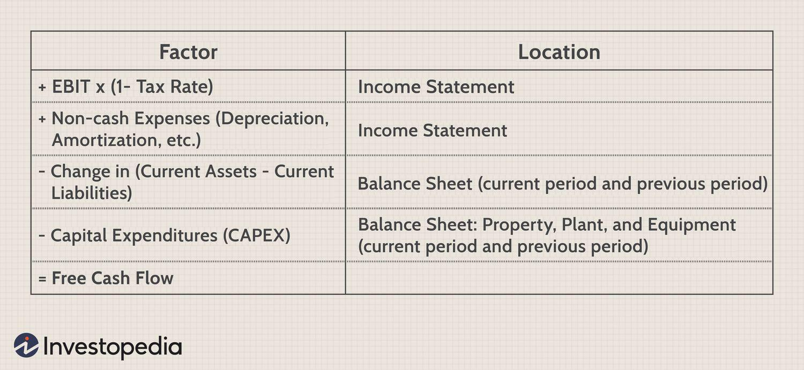

## Table of Contents

## What is free cash flow and why is it important?

Free cash flow is the money a company has left after it pays for all its expenses and investments. It's like the extra money in your pocket after you've paid all your bills and bought what you need. Companies use free cash flow to pay back loans, buy back their own stock, pay dividends to shareholders, or save for future projects.

Free cash flow is important because it shows how healthy a company's finances are. If a company has a lot of free cash flow, it means it's doing well and can grow or reward its investors. On the other hand, if a company doesn't have much free cash flow, it might struggle to keep up with its bills or invest in new opportunities. Investors and managers look at free cash flow to make decisions about the company's future.

## How is free cash flow calculated?

Free cash flow is calculated by starting with the company's operating cash flow, which is the money coming in from its regular business activities. From this, you subtract the capital expenditures, which are the costs of buying or upgrading things like buildings, equipment, or technology that the company needs to keep running and growing. So, the simple formula is: Free Cash Flow = Operating Cash Flow - Capital Expenditures.

This calculation gives a clear picture of how much money the company has left over after it has paid for everything it needs to keep operating. If the number is positive, it means the company has extra money to use for things like paying off debts, giving money back to shareholders, or saving for future projects. If the number is negative, it means the company is spending more than it's [earning](/wiki/earning-announcement), which could be a warning sign that it might struggle financially.

## What are the differences between free cash flow to the firm (FCFF) and free cash flow to equity (FCFE)?

Free cash flow to the firm (FCFF) and free cash flow to equity (FCFE) are two different ways to measure how much money a company has left over. FCFF looks at the total cash flow available to everyone who has a stake in the company, including shareholders and debt holders. It starts with the company's operating cash flow, then subtracts capital expenditures and adds back any interest expenses (because FCFF is before interest payments). This gives a picture of the cash the whole company generates, which can be used to pay off debts or be distributed to shareholders.

On the other hand, free cash flow to equity (FCFE) focuses only on the cash flow available to the company's shareholders. It starts with the same operating cash flow but subtracts capital expenditures and then subtracts any debt payments (like interest and principal repayments) but adds back any new borrowing. This calculation shows how much money is left for shareholders after the company has taken care of its debts and investments. FCFE is useful for investors who want to know how much money they might get back from their investment in the company's stock.

## Can you explain the significance of free cash flow in valuing a company?

Free cash flow is really important when we want to figure out how much a company is worth. Think of it like this: if you were buying a business, you'd want to know how much extra money it makes after paying for everything it needs. That extra money is the free cash flow. When we look at free cash flow, we can see how much money the company could give back to its owners, like through dividends or buying back its own stock. This helps us understand if the company is a good buy or not.

Using free cash flow to value a company also helps us see into the future. We can guess how much free cash flow the company will make in the coming years and then use that to figure out what the company might be worth today. It's like trying to guess the price of a house by thinking about how much rent it could bring in over time. If a company keeps making more and more free cash flow, it might be worth more money because it's growing and doing well. This way, free cash flow gives us a good idea of a company's health and future potential.

## What are common uses of free cash flow by a company?

Companies use free cash flow in many important ways. One big use is paying down debts. If a company has loans, using free cash flow to pay them off can save money on interest and make the company's finances stronger. Another common use is giving money back to shareholders. This can be done by paying dividends, which are like little rewards for owning part of the company, or by buying back its own stock, which can make each remaining share worth more.

Another use of free cash flow is saving it for future projects. Companies might keep some money aside to invest in new ideas or to expand their business. This can help them grow and stay competitive. Free cash flow can also be used for things like buying other companies, which can help them get bigger or enter new markets. In short, free cash flow is like a company's extra money that can be used to make it stronger and help it grow.

## How can free cash flow be used to assess a company's financial health?

Free cash flow is like a health check for a company's finances. It shows how much money a company has left after it pays for everything it needs to run and grow. If a company has a lot of free cash flow, it's a good sign that the business is doing well. It means the company can pay its bills, invest in new projects, and even give money back to its owners. On the other hand, if a company doesn't have much free cash flow or if it's negative, it might be struggling. This could mean it's having trouble making enough money to cover its costs, which could be a warning sign for investors and managers.

Looking at free cash flow over time helps us see if a company is getting healthier or not. If free cash flow keeps growing, it's a good sign that the company is on the right track. It might be getting better at making money or finding ways to spend less. But if free cash flow is shrinking, it could mean the company is facing problems, like losing customers or having to spend more to keep up. By keeping an eye on free cash flow, investors and managers can make smarter decisions about whether to invest more in the company or maybe look for ways to help it improve.

## What are the limitations of using free cash flow as a financial metric?

Free cash flow is a great way to see how much extra money a company has, but it's not perfect. One problem is that it can change a lot from year to year. A company might have a lot of free cash flow one year because it didn't need to spend much on new stuff, but the next year it might need to spend a lot, making its free cash flow go down. This can make it hard to know if the company is really doing well or not. Also, free cash flow can be affected by things like how a company decides to pay its bills or when it buys new things, which can make it tricky to compare different companies.

Another limitation is that free cash flow doesn't tell the whole story about a company's finances. It's just one piece of the puzzle. A company might have good free cash flow but still have a lot of debt, which could be a problem. Or it might be making money but not growing, which might not be good for the future. Free cash flow can also be affected by one-time events, like selling off a part of the business, which can make it look better than it really is. So, while free cash flow is helpful, it's important to look at other things too, like how much debt the company has, how fast it's growing, and how well it's doing compared to other companies in its industry.

## How does free cash flow analysis differ across industries?

Free cash flow analysis can be different for companies in different industries because each industry has its own way of making money and spending it. For example, a tech company might spend a lot on research and development to create new products, which can make its free cash flow lower in the short term. But if those new products do well, the free cash flow could go up a lot later on. On the other hand, a utility company like an electric company might have more stable free cash flow because it needs to spend money on big things like power plants, but it also gets a steady income from customers who need electricity all the time.

Another reason free cash flow can be different across industries is because of how much money companies need to spend just to keep running. A manufacturing company might need to spend a lot on machines and factories, which can make its free cash flow lower. But a service company, like a consulting firm, might not need to spend as much on big things, so its free cash flow could be higher. It's important to compare companies to others in the same industry because what looks like a lot of free cash flow in one industry might not be so great in another.

## What are some advanced techniques for forecasting free cash flow?

Forecasting free cash flow can be tricky, but there are some smart ways to do it better. One way is to use something called a discounted cash flow (DCF) model. This model looks at how much money a company is expected to make in the future and then figures out what that money is worth today. To do this, you guess how much free cash flow the company will have each year and then use a discount rate to figure out what those future dollars are worth now. This method helps you see if a company is a good investment by comparing the value of its future cash flows to its current price.

Another advanced technique is to use scenario analysis. This means you create different stories about what might happen to the company and the world around it. You can make a best-case scenario where everything goes well, a worst-case scenario where things go badly, and a few scenarios in between. By looking at free cash flow in each of these different stories, you can get a better idea of how risky the company is and how much money it might make. This helps you plan for different possibilities and make smarter decisions about the company's future.

A third technique is to use regression analysis. This involves looking at past data to find patterns that can help predict future free cash flow. You can look at things like sales growth, profit margins, and capital spending to see how they've affected free cash flow in the past. Then, you can use these patterns to make guesses about what might happen next. This method is a bit more complicated, but it can give you a more scientific way to forecast free cash flow based on real data from the company's history.

## How can investors use free cash flow to make investment decisions?

Investors can use free cash flow to figure out if a company is a good investment. Free cash flow shows how much extra money a company has after paying for everything it needs to run and grow. If a company has a lot of free cash flow, it might be a good sign because it means the company can pay its bills, invest in new projects, and even give money back to its owners through dividends or stock buybacks. On the other hand, if a company has little or no free cash flow, it might be struggling to make enough money to cover its costs, which could be a warning sign for investors.

By looking at free cash flow, investors can also guess how much a company might be worth in the future. They can use something called a discounted cash flow model to see what the company's future free cash flow might be worth today. This helps them decide if the company's current price is a good deal or not. Plus, investors can compare a company's free cash flow to other companies in the same industry to see which one might be a better investment. By using free cash flow this way, investors can make smarter choices about where to put their money.

## What are the impacts of capital expenditures and working capital changes on free cash flow?

Capital expenditures, or money spent on things like buildings and equipment, can have a big impact on free cash flow. When a company spends a lot on capital expenditures, it reduces the amount of free cash flow it has left over. This is because free cash flow is calculated by taking the operating cash flow and subtracting the capital expenditures. So, if a company buys a lot of new equipment, its free cash flow will go down. But, if the company can use that new equipment to make more money in the future, it might lead to higher free cash flow later on.

Changes in working capital also affect free cash flow. Working capital is the money a company uses to run its day-to-day business, like paying for inventory or collecting money from customers. If a company needs to spend more on working capital, like buying more inventory, it will have less free cash flow. On the other hand, if the company can collect money from customers faster or reduce the amount of inventory it needs, it will have more free cash flow. So, managing working capital well can help a company have more free cash flow to use for other things, like paying off debts or giving money back to shareholders.

## How can free cash flow analysis be integrated with other financial analysis techniques for a comprehensive assessment?

Free cash flow analysis is a powerful tool, but it works even better when you use it with other financial analysis techniques. One way to do this is by looking at free cash flow alongside the company's income statement and balance sheet. The income statement shows how much money the company made and spent over a period of time, while the balance sheet shows what the company owns and owes at a specific point in time. By comparing free cash flow to these other financial statements, you can get a fuller picture of the company's financial health. For example, if a company has a lot of free cash flow but also a lot of debt on its balance sheet, it might not be as healthy as it seems.

Another way to use free cash flow with other techniques is by looking at financial ratios. Ratios like the debt-to-equity ratio, which shows how much the company is borrowing compared to what its owners have put in, can help you understand if the company is using its free cash flow wisely. If a company has a lot of free cash flow but also a high debt-to-equity ratio, it might be using that free cash flow to pay off debts instead of growing the business. By combining free cash flow analysis with these other methods, you can make smarter decisions about whether a company is a good investment or not.

## What is Understanding Free Cash Flow?

Free Cash Flow (FCF) is a crucial financial metric that quantifies the cash generated by a company after accounting for capital expenditures necessary to maintain or expand its asset base. It serves as an indicator of a company's ability to generate surplus cash that can be utilized for various purposes without impacting ongoing operations. FCF is calculated by subtracting capital expenditures from operating cash flow and is expressed mathematically as:

$$
\text{FCF} = \text{Operating Cash Flow} - \text{Capital Expenditures}
$$

Unlike net income, which includes non-cash items such as depreciation and amortization, FCF provides a clearer picture of a company's [liquidity](/wiki/liquidity-risk-premium) and financial health. It focuses on cash flows rather than accounting profits, making it a more reliable measure for assessing the ability of a company to generate cash after maintaining its asset base.

FCF is critical for a company's strategic financial planning. Firms with healthy free cash flows have the flexibility to invest in growth opportunities, such as research and development, expanding into new markets, or upgrading infrastructure. Additionally, strong FCF positions companies to reduce debt, enhancing financial stability, or to pay dividends, thus providing shareholder value. It also facilitates pursuing acquisitions to foster business growth or gain competitive advantage without needing to secure external financing.

For investors and analysts, FCF is a valuable tool in assessing the intrinsic value of a company. It provides insight into how efficiently a company is generating cash and utilizing it for growth, which is instrumental in making informed investment decisions. Understanding this metric helps investors gauge the potential for future dividends and stock buybacks, ultimately reflecting a company's operational efficiency and long-term sustainability.

## How do you calculate free cash flow?

Free Cash Flow (FCF) is calculated by subtracting capital expenditures from operating cash flow. This calculation provides insight into the cash that a company generates after accounting for the costs associated with maintaining or expanding its asset base. 

The formula for calculating FCF is straightforward:

$$
\text{FCF} = \text{Operating Cash Flow} - \text{Capital Expenditures}
$$

Operating cash flow (OCF) can be derived from a company's financial statement, specifically the cash flow statement, which details the cash inflows and outflows from business operations. Capital expenditures (CapEx), on the other hand, represent the funds used by a company to acquire, upgrade, or maintain physical assets such as property, industrial buildings, or equipment. 

Tools such as Microsoft Excel, Google Sheets, or specialized financial software can streamline the FCF calculation process by leveraging functions and templates designed for financial analysis. These platforms allow users to input data directly from financial statements and automate the computation of FCF using formulas. For instance, in Excel, one might set up the calculation using the following approach: 

1. Input the company’s operating cash flow and capital expenditures into separate cells.
2. Use the formula $= \text{Operating\_Cash\_Flow\_Cell} - \text{Capital\_Expenditures\_Cell}$ to compute the FCF.

For those using Python, it is possible to use libraries such as Pandas to manage and calculate these financial metrics. An example code snippet might look like this:

```python
import pandas as pd

# Example data
data = {'Operating_Cash_Flow': [50000], 'Capital_Expenditures': [15000]}
df = pd.DataFrame(data)

# Calculate Free Cash Flow
df['Free_Cash_Flow'] = df['Operating_Cash_Flow'] - df['Capital_Expenditures']

print(df)
```

This code snippet demonstrates how to calculate FCF using a DataFrame, a primary data structure in Pandas, which is well-suited for handling and analyzing financial data. By subtracting the capital expenditures from the operating cash flow for each entry, the free cash flow is derived. Such analytical tools allow for more efficient processing and visualization of data, aiding in dynamic financial evaluations and reporting.

## References & Further Reading

[1]: ["Free Cash Flow: Theory and Empirical Evidence"](https://www.jstor.org/stable/90002380) by Michael C. Jensen, published in the American Economic Review.

[2]: ["Evaluating the Free Cash Flow Anomaly"](https://www.investopedia.com/terms/f/freecashflow.asp) by Wesley S. Chan, published in Financial Analysts Journal.

[3]: ["Advances in Financial Machine Learning"](https://www.amazon.com/Advances-Financial-Machine-Learning-Marcos/dp/1119482089) by Marcos Lopez de Prado.

[4]: ["Accounting for Goodwill"](https://www.investopedia.com/terms/g/goodwill.asp) by Ross, S.A., Westerfield, R.W., & Jaffe, J. (2010), Chapter 3 in "Corporate Finance", explaining the interpretation of financial metrics like Free Cash Flow.

[5]: ["Machine Learning for Algorithmic Trading"](https://github.com/stefan-jansen/machine-learning-for-trading) by Stefan Jansen.