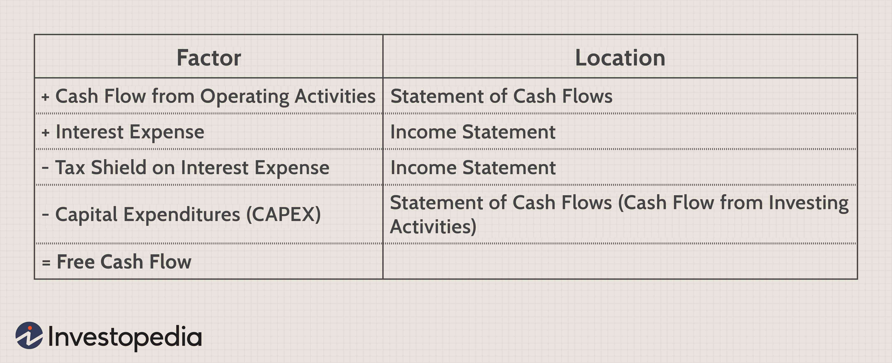

## Table of Contents

## What is free cash flow and why is it important?

Free cash flow is the money a company has left after it pays for its operating expenses and the costs to keep its business running, like buying new equipment or buildings. It's like the extra money in your pocket after you've paid all your bills and bought what you need to keep your life going. This money can be used to pay down debts, give money back to shareholders, or save for future projects.

Free cash flow is important because it shows how healthy a company's finances are. If a company has a lot of free cash flow, it means it's doing well and can grow or weather tough times. Investors like to look at free cash flow because it helps them see if a company is a good investment. A company with strong free cash flow is often seen as more stable and capable of making smart financial decisions.

## How do you calculate free cash flow using the basic formula?

To calculate free cash flow, you start with the company's operating cash flow. This is the money coming in from the company's main business activities, like selling products or services. From this amount, you subtract the capital expenditures. Capital expenditures are the costs of buying or maintaining things like buildings, equipment, or technology that the company needs to keep running.

So, the basic formula for free cash flow is: Free Cash Flow = Operating Cash Flow - Capital Expenditures. This calculation tells you how much cash the company has left over after it has paid for everything it needs to operate and grow. This extra cash is important because it shows how well the company is managing its money and how much it can use for other things like paying off debts, giving money back to shareholders, or saving for the future.

## What are the components of free cash flow?

Free cash flow is made up of two main parts: operating cash flow and capital expenditures. Operating cash flow is the money a company makes from its everyday business activities, like selling products or services. This is the money that comes in from what the company does to make money. Capital expenditures, on the other hand, are the costs the company has to pay to keep its business running smoothly. These costs can include buying new equipment, fixing old machines, or building new stores or factories.

When you subtract the capital expenditures from the operating cash flow, you get the free cash flow. This tells you how much extra money the company has after it has paid for everything it needs to keep going. This extra money is important because it shows how well the company is doing financially. It can be used for things like paying off debts, giving money back to shareholders, or saving for future projects. Understanding these components helps people see if a company is in good financial health and if it can grow or handle tough times.

## Can you explain the difference between operating cash flow and free cash flow?

Operating cash flow is the money a company makes from its everyday business activities, like selling products or services. It's the cash that comes in from what the company does to earn money. This includes money from customers, minus the costs of running the business day-to-day, like paying employees or buying supplies. Operating cash flow shows how much money the company is making from its core business operations.

Free cash flow, on the other hand, is what's left after the company pays for its operating expenses and the costs to keep the business running, like buying new equipment or fixing old machines. To find free cash flow, you take the operating cash flow and subtract the capital expenditures. Free cash flow is important because it shows how much extra money the company has after paying for everything it needs. This extra money can be used for things like paying off debts, giving money back to shareholders, or saving for future projects. It's a key indicator of a company's financial health and its ability to grow or handle tough times.

## How does capital expenditure affect free cash flow?

Capital expenditure is the money a company spends on things like new equipment, buildings, or fixing old machines. These are big costs that help the company keep running and grow. When a company spends a lot on capital expenditures, it takes away from the free cash flow. Free cash flow is what's left after paying for the day-to-day costs and these big expenses. So, if a company buys a lot of new equipment, there's less money left over as free cash flow.

Even though capital expenditures can lower free cash flow in the short term, they are important for the company's future. Spending on new equipment or buildings can help the company work better and make more money later on. This means that while free cash flow might go down right after a big purchase, the company could end up with more free cash flow in the future if the investment pays off. It's all about balancing the need to spend money now to make more money later.

## What adjustments might be necessary when calculating free cash flow?

When calculating free cash flow, you might need to make some adjustments to get a clearer picture of the company's financial health. One common adjustment is to add back any non-cash expenses, like depreciation and amortization. These are costs that don't actually use up cash but are still subtracted from the operating cash flow. By adding them back, you get a better idea of the real cash the company has.

Another adjustment could be to consider changes in working capital. Working capital is the money tied up in the day-to-day operations, like inventory and accounts receivable. If a company is holding onto a lot of inventory or waiting for customers to pay, it might look like there's less free cash flow than there really is. Adjusting for these changes can give a more accurate view of the cash available. It's important to make these adjustments carefully to understand how much money the company truly has to use for things like paying off debts or investing in new projects.

## How can free cash flow be used to assess a company's financial health?

Free cash flow is a key number that shows how well a company is doing financially. It tells you how much money the company has left after paying for everything it needs to run and grow. If a company has a lot of free cash flow, it means it's making more money than it's spending. This is a good sign because it shows the company is healthy and can handle tough times or grow bigger. Investors and people who run the company look at free cash flow to see if the business is doing well and if it's a good place to put their money.

On the other hand, if a company doesn't have much free cash flow or if it's negative, it could mean the company is spending more money than it's making. This can be a warning sign that the company might have trouble paying its bills or growing. By looking at free cash flow over time, you can see if the company is getting better or worse at managing its money. This helps everyone understand if the company is on a strong financial path or if it needs to make some changes.

## What are common pitfalls or errors in calculating free cash flow?

One common mistake when calculating free cash flow is not adding back non-cash expenses like depreciation and amortization. These are costs that show up on the income statement but don't actually use up any cash. If you don't add them back, you might think the company has less cash than it really does. Another error is not adjusting for changes in working capital. Working capital is the money tied up in things like inventory and accounts receivable. If a company is holding onto a lot of inventory or waiting for customers to pay, it can make the free cash flow look lower than it really is.

Another pitfall is confusing capital expenditures with operating expenses. Capital expenditures are big purchases like new equipment or buildings, while operating expenses are the day-to-day costs of running the business. If you mix these up, you might end up with a wrong number for free cash flow. It's also important to use the right time frame when looking at free cash flow. If you only look at one year, you might miss important trends or changes in the company's financial health. Always consider multiple years to get a full picture of how the company is doing.

## How does free cash flow differ for different industries?

Free cash flow can be very different for companies in different industries because each industry has its own way of making money and spending it. For example, technology companies often have high free cash flow because they don't need to spend as much on big things like factories or machines. They might spend more on research and development, but this can lead to new products that make more money later. On the other hand, manufacturing companies might have lower free cash flow because they have to spend a lot of money on equipment and buildings to make their products.

Different industries also have different business cycles that affect their free cash flow. For example, retail companies might have higher free cash flow during holiday seasons when they sell a lot more, but lower free cash flow during slower times of the year. Energy companies, like those in oil and gas, can have free cash flow that goes up and down a lot because the price of oil can change a lot. Understanding these differences helps investors and people running the companies know what to expect and plan better for the future.

## Can you provide an example of how to interpret free cash flow from a company's financial statements?

Imagine you're looking at the financial statements of a company called "TechCo." You see that TechCo's operating cash flow for the year is $500 million. This means they made $500 million from selling their products and services after paying for their everyday costs. But TechCo also spent $200 million on new equipment and buildings, which are their capital expenditures. So, to find their free cash flow, you subtract the capital expenditures from the operating cash flow. That gives you $500 million minus $200 million, which equals $300 million in free cash flow. This means TechCo has $300 million left over after paying for everything they need to run and grow their business.

This $300 million in free cash flow tells you a lot about TechCo's financial health. It shows that they're making more money than they're spending, which is a good sign. With this extra money, TechCo can pay off debts, give money back to shareholders, or save for future projects. If you compare this year's free cash flow to last year's, you can see if TechCo is getting better or worse at managing its money. For example, if last year's free cash flow was $250 million, this year's $300 million shows they're doing better. But if it was $400 million last year, it might mean they need to look at why their free cash flow went down.

## How do investors use free cash flow in valuation models like DCF?

Investors use free cash flow in a valuation model called Discounted Cash Flow (DCF) to figure out how much a company is worth. In a DCF model, they predict how much free cash flow the company will make in the future. They add up all these future free cash flows and then adjust them to today's money value using a discount rate. The discount rate is like an [interest rate](/wiki/interest-rate-trading-strategies) that shows how much risk there is in investing in the company. The idea is that money you get in the future is worth less than money you have now because you could invest it today and make more money.

By using free cash flow in the DCF model, investors can see if a company's stock price is a good deal or too expensive. If the total value of the future free cash flows, after being discounted, is higher than the company's current stock price, the stock might be undervalued. This means it could be a good investment. On the other hand, if the discounted value of the free cash flows is lower than the stock price, the stock might be overvalued, and investors might want to be careful. This way, free cash flow helps investors make smart choices about where to put their money.

## What advanced metrics can be derived from free cash flow for expert analysis?

From free cash flow, experts can derive advanced metrics like free cash flow yield and free cash flow margin. Free cash flow yield is calculated by dividing the free cash flow by the company's market value. It shows how much free cash flow the company makes compared to its total value. A high free cash flow yield can mean the company is a good investment because it's making a lot of extra money compared to its price. On the other hand, free cash flow margin is found by dividing the free cash flow by the company's revenue. This tells you how much of every dollar the company makes turns into free cash flow. A high free cash flow margin shows the company is good at turning sales into extra money.

Another useful metric is the free cash flow to equity (FCFE). This is the money left over after the company pays for its capital expenditures and any debt payments. It's what's available to give back to shareholders through dividends or buying back stock. FCFE helps investors see how much money the company can return to them. By looking at these metrics, experts can get a deeper understanding of a company's financial health and make better investment decisions.

## What is Understanding Free Cash Flow (FCF)?

Free Cash Flow (FCF) is a crucial financial metric that represents the cash a company generates after accounting for capital expenditures (CAPEX), which are essential for maintaining or expanding its asset base. Unlike net income, which can be influenced by various non-cash items and accounting practices, FCF provides a clearer picture of a company's financial health and its ability to generate enough cash to fund operations, pay dividends, and pursue growth opportunities without the need for external financing.

### Definition and Importance over Earnings

FCF's significance lies in its ability to gauge a company's financial success more accurately than earnings. While earnings focus on profitability, FCF emphasizes the actual cash available to the firm after necessary investments in capital assets have been made. This cash can be used for expanding operations, reducing debt, or distributing returns to shareholders, thus making FCF a preferred measure for assessing a company's [liquidity](/wiki/liquidity-risk-premium) and operational efficiency.

### Types of Free Cash Flow

There are several types of Free Cash Flow used in financial analysis:

1. **Free Cash Flow to Firm (FCFF)**: This measures the cash available to all capital providers (both equity and debt holders) after accounting for capital expenditures. FCFF is particularly useful for valuing firms because it reflects the cash generated before interest payments are made, thereby providing a metric unaffected by a company’s financial structure.

   The formula for FCFF is:
$$
   \text{FCFF} = \text{EBIT} \times (1 - \text{Tax Rate}) + \text{Depreciation} - \text{CAPEX} - \text{Change in Working Capital}

$$

2. **Free Cash Flow to Equity (FCFE)**: This indicates the cash flow available to equity shareholders after all operating expenses, interests, and principal repayments on debt. FCFE is useful for equity valuation and helps investors understand the amount that could potentially be returned to shareholders through dividends or share buybacks.

   The formula for FCFE is:
$$
   \text{FCFE} = \text{Net Income} + \text{Depreciation} - \text{CAPEX} - \text{Change in Working Capital} + \text{Net Borrowing}

$$

### Components of Free Cash Flow

FCF is fundamentally composed of operating cash flow and capital expenditures, both of which can be derived from a company's financial statements:

- **Operating Cash Flow (OCF)**: This is the cash generated from a company's normal business operations. It can be found in the cash flow statement and represents the money a company can generate to maintain or expand the business. 
$$
   \text{OCF} = \text{Net Income} + \text{Non-cash Expenses} + \text{Changes in Working Capital}

$$

- **Capital Expenditures (CAPEX)**: These are the funds used by a company to acquire or upgrade physical assets such as property, industrial buildings, or equipment. CAPEX is listed in the investing activities section of the cash flow statement. High levels of CAPEX indicate a business that is heavily investing in its future growth, although it reduces FCF in the short term.

In summary, Free Cash Flow serves as an essential metric that enables investors and analysts to assess a company's potential to generate cash, which is a more reliable indicator of financial health than just focusing on earnings. Its calculation and analysis provide valuable insights into the firm's liquidity, investment potential, and capacity to generate shareholder value.

## How do you calculate free cash flow?

Free Cash Flow (FCF) is a crucial metric in financial analysis, providing insight into a company's ability to generate cash after covering capital expenditures. Calculating FCF can be approached through two primary methods: starting with cash flow from operating activities or using earnings before interest and taxes (EBIT).

### Calculating FCF from Cash Flow from Operating Activities

1. **Identify Cash Flow from Operating Activities (CFO)**: This figure is found within the cash flow statement, detailing the cash inflows and outflows from primary business operations. It is a direct reflection of the money generated from a company's core activities, excluding capital and financing considerations.

2. **Determine Capital Expenditures (CapEx)**: Capital expenditures represent the funds used by a company to purchase, upgrade, or maintain physical assets such as property, plants, or equipment. This information is typically available in the cash flow statement's investing section.

3. **Calculate Free Cash Flow**: Deduct the capital expenditures from the cash flow from operating activities:
$$
   \text{FCF} = \text{CFO} - \text{CapEx}

$$

### Calculating FCF Using Earnings Before Interest and Taxes (EBIT)

1. **Identify Earnings Before Interest and Taxes (EBIT)**: This metric, also known as operating profit, is reported on the income statement. It measures a company's profitability, excluding tax and interest expenses.

2. **Adjust for Non-Cash Expenses and Changes in Working Capital**: Add back non-cash charges like depreciation and amortization to the EBIT, and account for changes in working capital, as these adjustments align EBIT with actual cash processes.

3. **Subtract Capital Expenditures and Taxes**: Deduct CapEx (as determined previously) and taxes to arrive at the Free Cash Flow:
$$
   \text{FCF} = (\text{EBIT} + \text{Depreciation} + \text{Amortization} - \Delta \text{Working Capital} - \text{Taxes}) - \text{CapEx}

$$

### Tools and Software for FCF Calculation

Given the complexity and potential for error in manual computations, various tools and software packages can aid in calculating FCF accurately. Popular options include:

- **Microsoft Excel**: While not a dedicated financial tool, Excel's flexibility and formula capabilities make it widely used for financial modeling, including FCF calculations via spreadsheets.

- **Financial Software Packages**: Tools like Bloomberg Terminal, QuickBooks, and financial modules in ERP systems provide templates and automated features for accurate FCF computations.

- **Python Libraries**: For more customized analysis, Python offers libraries such as `pandas` for data manipulation and `numpy` for numerical operations. Here's a simple example of using Python to calculate FCF:

   ```python
   import pandas as pd

   # Sample data
   data = {
       'CFO': 100000,  # Cash Flow from Operating Activities
       'CapEx': 30000,  # Capital Expenditures
   }

   # Create a DataFrame
   df = pd.DataFrame(data, index=[0])

   # Calculate Free Cash Flow
   df['FCF'] = df['CFO'] - df['CapEx']

   print(df[['FCF']])
   ```

These tools enhance precision and allow for scenario analysis, improving financial decision-making based on FCF considerations.

## References & Further Reading

[1]: Damodaran, A. (1999). ["Estimating Equity Risk Premiums."](https://pages.stern.nyu.edu/~adamodar/pdfiles/papers/riskprem.pdf) Social Science Research Network.

[2]: Penman, S. H. (2012). ["Financial Statement Analysis and Security Valuation."](https://www.mheducation.com/highered/product/financial-statement-analysis-security-valuation-penman/M9780078025310.html) McGraw-Hill Education.

[3]: Koller, T., Goedhart, M., & Wessels, D. (2015). ["Valuation: Measuring and Managing the Value of Companies."](https://www.mckinsey.com/capabilities/strategy-and-corporate-finance/our-insights/valuation-measuring-and-managing-the-value-of-companies) John Wiley & Sons.

[4]: Barker, R. (2001). ["Determining Value: Valuation Models and Financial Statements."](https://www.semanticscholar.org/paper/Determining-Value%3A-Valuation-Models-and-Financial-Barker/397edc5556df0c7d3e80e20a56e7f90f8520ee73) Prentice Hall.

[5]: Ferri, R. A. (2009). ["The Power of Passive Investing: More Wealth with Less Work."](https://rickferri.com/books/the-power-of-passive-investing/) John Wiley & Sons.