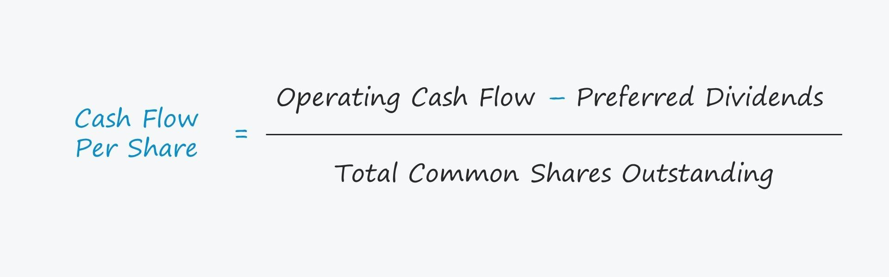

Financial metrics are vital tools for assessing a company's financial health and its potential as an investment opportunity. Among these metrics, Free Cash Flow (FCF) and Cash Flow per Share stand out due to their focus on cash generation and financial stability over time. These metrics differ from traditional indicators that often emphasize accounting profits, providing more accurate insights into how well a company can sustain and grow its operations.

Free Cash Flow, in particular, is a significant measure of a company's ability to generate cash after accounting for capital expenditures necessary to maintain or expand its asset base. By focusing on the cash that a company can generate, FCF provides a clearer picture of the financial flexibility and resilience a company possesses, allowing stakeholders to assess its potential for future investments, dividends, and debt reduction. This is crucial as positive FCF indicates that a company has ample liquidity to invest in growth initiatives or weather economic downturns.



Cash Flow per Share, on the other hand, serves as a valuable proxy for earnings per share by demonstrating the amount of cash generated per share of stock. This metric offers insights into a company's capacity to finance its operations and growth internally, without relying excessively on external capital. It highlights a company's ability to make consistent returns to shareholders, often reflecting the genuine value even when accounting profits may be distorted due to non-cash expenses.

The significance of these metrics extends into the domain of algorithmic trading, where investors and traders use sophisticated algorithms to make trading decisions based on real-time data. FCF and Cash Flow per Share data can be integrated into these algorithms to evaluate a company's financial health and predict stock price movements. This allows for more data-driven and automated evaluations, reducing the emotional biases that often influence human decision-making.

In conclusion, understanding Free Cash Flow and Cash Flow per Share is pivotal for gaining insights into a company's cash-generating capabilities and ensuring its long-term financial stability. These metrics are invaluable for investors, analysts, and traders who aim to make informed decisions based on a comprehensive understanding of a company's financial landscape. Integrating these metrics into investment strategies can provide a competitive advantage by revealing hidden opportunities and risks that may not be immediately obvious through traditional financial statements alone.

## Table of Contents

## Understanding Free Cash Flow (FCF)

Free Cash Flow (FCF) is a critical financial metric that measures the cash a company generates after accounting for capital expenditures needed to maintain or expand its asset base. These expenditures are necessary for ensuring future growth and operational efficiency, distinguishing FCF from more traditional earnings metrics that may overlook these outflows.

The significance of FCF lies in its ability to provide a clear picture of a company's [liquidity](/wiki/liquidity-risk-premium) and its capacity to generate cash that can be utilized for a variety of purposes, such as operational expenses, repaying debt, distributing dividends, or pursuing growth initiatives like mergers and acquisitions. Unlike net income, which includes numerous non-cash items and accounting adjustments, FCF offers a more straightforward reflection of the cash-producing efficiency of a business, making it a vital indicator for investors and financial analysts.

Traditional earnings metrics, such as earnings per share (EPS) or net income, often fail to account for cash dynamics associated with capital expenditures. For instance, a company may report substantial net income but still face liquidity challenges if significant portions of that income are tied up in capital projects or working capital. Consequently, FCF provides investors with crucial insights into the actual cash available to the firm after sustaining its asset base, thereby offering an additional layer of security and analysis beyond conventional metrics.

Free Cash Flow can be further categorized into different types, reflecting various stakeholder perspectives. Free Cash Flow to Firm (FCFF) is a version of FCF that measures the cash flows available to all capital providers, both debt and equity holders. It is calculated using the formula:

$$
\text{FCFF} = \text{EBIT} \times (1 - \text{tax rate}) + \text{Depreciation/Amortization} - \text{Changes in Working Capital} - \text{Capital Expenditures}
$$

In contrast, Free Cash Flow to Equity (FCFE) specifically focuses on the cash available to equity shareholders after accounting for debt obligations. The formula for FCFE is:

$$
\text{FCFE} = \text{Net Income} + \text{Depreciation/Amortization} - \text{Changes in Working Capital} - \text{Capital Expenditures} + \text{Net Borrowing}
$$

Both metrics, FCFF and FCFE, serve distinct purposes in evaluating a company's financial health. FCFF provides insight into the overall cash flow efficiency of a company, supporting decisions on financing or corporate restructuring. On the other hand, FCFE gives equity investors a clearer picture of the cash returns they might expect after all debts are serviced, enabling more informed investment decisions. Together, these metrics offer complementary perspectives on a company's ability to generate and manage cash, crucial for assessing its long-term financial stability and growth potential.

## Calculating Free Cash Flow

Free Cash Flow (FCF) is a crucial financial metric that represents the cash generated by a company after accounting for capital expenditures necessary to maintain or expand its asset base. Accurately calculating FCF allows investors and analysts to assess a firm's cash-generating efficiency and its potential for growth, debt servicing, and shareholder returns.

### Methods of Calculating Free Cash Flow

#### 1. From Cash Flow from Operating Activities

The simplest method to calculate FCF is to begin with the cash flow from operating activities (CFO), which is readily available in a company's cash flow statement. The formula is as follows:

$$

\text{Free Cash Flow (FCF)} = \text{CFO} - \text{Capital Expenditures} 
$$

**Example**:
Consider a company with $500 million in cash flow from operating activities and $200 million in capital expenditures. The FCF would be:

$$

\text{FCF} = 500 - 200 = 300 \, \text{million dollars}
$$

#### 2. Using Earnings Before Interest and Taxes (EBIT)

An alternative approach to calculate FCF involves using EBIT. This method aligns more closely with the company's profitability from its core business operations. The formula is:

$$

\text{FCF} = (\text{EBIT} \times (1 - \text{Tax Rate})) + \text{Depreciation and Amortization} - \text{Changes in Working Capital} - \text{Capital Expenditures} 
$$

**Example**:
Assume a firm has the following financials: EBIT of $400 million, a tax rate of 30%, depreciation of $50 million, an increase in working capital of $30 million, and capital expenditures of $100 million. The FCF is calculated as follows:

$$

\text{FCF} = (400 \times (1 - 0.30)) + 50 - 30 - 100 
$$
$$

\text{FCF} = 280 + 50 - 30 - 100 = 200 \, \text{million dollars}
$$

### Tools and Software for Accurate FCF Computation

Several tools and software can assist in calculating FCF accurately and efficiently. Excel is one of the most commonly used platforms, offering robust capabilities for detailed financial analysis and modeling. Users can leverage Excel functions to organize data, apply necessary formulas, and perform what-if analyses.

Furthermore, financial software such as Bloomberg Terminal, FactSet, and S&P Capital IQ provide comprehensive datasets and analytics tools that can automate FCF calculations and simulate various financial scenarios. These platforms offer extensive historical data and predictive analytics to enhance the reliability and depth of financial assessments.

Python has also emerged as a preferred programming language due to its versatility and powerful libraries, such as Pandas and NumPy, for handling financial data. Here is a simple Python code snippet to calculate FCF using EBIT:

```python
# Define the variables
EBIT = 400
tax_rate = 0.30
depreciation = 50
changes_in_working_capital = 30
capital_expenditures = 100

# Calculate FCF
FCF = (EBIT * (1 - tax_rate)) + depreciation - changes_in_working_capital - capital_expenditures

print(f"Free Cash Flow: ${FCF} million")
```

By employing these tools and methodologies, businesses and investors can achieve a nuanced understanding of a company's financial health, using FCF as a fundamental indicator of operational efficiency and potential growth.

## Cash Flow per Share: A Key Indicator

Cash Flow per Share (CFPS) is a crucial financial metric used to evaluate a company's financial performance and operational capacity. It represents the cash generated by a company on a per-share basis, providing insights into the firm's ability to generate cash relative to its outstanding shares. The formula for calculating CFPS is:

$$
\text{Cash Flow per Share} = \frac{\text{Operating Cash Flow} - \text{Preferred Dividends}}{\text{Outstanding Shares}}
$$

This metric is widely regarded as a more accurate reflection of a company's financial health compared to traditional earnings per share (EPS), as it focuses on actual cash flows rather than accounting profits which may be subject to various non-cash adjustments such as depreciation and amortization.

CFPS is considered a proxy for earnings per share because it provides a clearer picture of a company's profitability by excluding non-cash accounting entries. This clarity is especially important in scenarios where accounting earnings may not adequately reflect a company's cash-generating capability. For instance, two companies might report similar earnings per share figures, but their cash flows could be significantly different, impacting their ability to fund operations and growth without relying heavily on external financing.

A higher cash flow per share indicates greater financial flexibility, as it implies that the company has more cash to reinvest in its business, pay down debt, or return value to shareholders through dividends or share buybacks. This metric can thus serve as a useful tool for assessing a company's self-financing capability and its financial resilience against market fluctuations.

By evaluating CFPS, investors can better understand how well a company manages the funds generated through its core operations. This understanding aids in assessing whether the company is likely to achieve sustainable growth and manage unforeseen financial challenges effectively. Companies with strong cash flows per share can often finance capital-intensive projects and new growth initiatives without compromising their balance sheets, making CFPS an essential component in investment decision-making.

## Algorithmic Trading and FCF

Free Cash Flow (FCF) plays a crucial role in [algorithmic trading](/wiki/algorithmic-trading) strategies by providing a comprehensive view of a company's financial health. It allows traders to assess potential investment opportunities and make data-driven decisions. Algorithms can utilize FCF data to forecast stock movements based on a company's ability to generate cash, which is often seen as a strong indicator of corporate financial stability and growth potential.

Algorithms leverage FCF to evaluate a firm's intrinsic value by correlating cash generation capabilities with market performance. By incorporating historical FCF data, these algorithms can detect trends and patterns that signal future price movements. For example, a company consistently demonstrating strong and increasing FCF might be poised for stock price appreciation, signaling a buying opportunity. Conversely, a declining FCF trend could indicate potential financial instability, suggesting a sell signal.

In practical terms, integrating FCF data into an algorithmic trading model involves extracting data from financial statements, computing FCF, and then using this value within predictive models. Here's a simple Python example demonstrating how to calculate FCF and incorporate it into a basic algorithmic trading strategy:

```python
import pandas as pd
import numpy as np

# Sample financial data for a company
financial_data = {
    'Year': [2020, 2021, 2022],
    'OperatingCashFlow': [5000, 5200, 5500],
    'CapitalExpenditure': [1200, 1500, 1800]
}

# Convert to DataFrame
df = pd.DataFrame(financial_data)

# Calculate Free Cash Flow
df['FreeCashFlow'] = df['OperatingCashFlow'] - df['CapitalExpenditure']

# Define a simple trading strategy: Buy if FCF increases year-over-year, else sell
df['Signal'] = np.where(df['FreeCashFlow'].diff() > 0, 'Buy', 'Sell')

# Display the data with calculated FCF and trading signals
print(df[['Year', 'FreeCashFlow', 'Signal']])
```

In the above code, we calculate FCF by subtracting capital expenditures from operating cash flow for each year. The algorithm then determines a buy signal if the FCF increases year-over-year, otherwise suggesting a sell. This simplistic model can be augmented with additional variables and more sophisticated predictive techniques, but it serves to illustrate how FCF data can form the basis of a trading strategy.

By using FCF in this way, traders can align their strategies with fundamental financial insights, increasing the likelihood of making informed and profitable trading decisions. Overall, FCF is a powerful tool within algorithmic trading, offering robust insights into the financial health of a company and aiding in the prediction of stock movements.

## Interpreting Financial Metrics for Investment

Free Cash Flow (FCF) is a pivotal metric in evaluating a company's financial health and its potential as an investment. It represents the cash that a company generates after accounting for capital expenditures, which is available for distribution among its investors. Understanding the trends in FCF—whether positive, stable, or declining—can significantly impact investment decisions.

A positive FCF trend generally signals that a company is generating more cash than it is spending, indicating robust financial health and operational efficiency. This surplus cash can be used for debt repayment, dividend distribution, stock buybacks, or reinvestment into business expansion. Investors typically view a positive FCF as a sign of a company's strong cash-generating abilities and operational performance, making it an attractive investment prospect.

Conversely, a declining FCF trend may raise concerns about a company's financial health. It could suggest that the company is spending more than it is [earning](/wiki/earning-announcement), perhaps due to increased capital expenditures, rising operational costs, or declining revenues. While not necessarily indicative of impending financial distress, a consistent decline in FCF warrants a closer examination of the underlying reasons, especially if it is not accompanied by a strategic rationale, such as large-scale investments expected to generate higher future returns.

Stable FCF is often seen as a sign of financial consistency and predictability. Companies with stable FCF are generally able to manage their cash flows effectively, balancing operational costs with revenue generation. For conservative investors, such companies can be appealing for their perceived lower risk, offering steady returns.

Interpreting FCF trends, however, must be contextualized within industry-specific dynamics. For instance, industries characterized by heavy capital expenditures, such as telecommunications or manufacturing, may naturally experience fluctuating FCF patterns due to large, cyclical investments in infrastructure or technology upgrades. In such industries, an understanding of the investment cycle and its impact on FCF is crucial.

Moreover, FCF should not be evaluated in isolation. Integrating it with other financial indicators, like return on equity (ROE), earnings per share (EPS), and debt ratios, provides a more comprehensive financial assessment. This holistic evaluation helps investors discern whether a company’s capital structure and operational efficacy align with its cash flow trends.

In conclusion, monitoring and interpreting FCF trends can furnish valuable insights for investment strategy development. Still, these metrics require industry context and supplementary financial analysis to maximize their interpretive power.

## Real-World Applications and Case Studies

Analyzing real-world applications of Free Cash Flow (FCF) and its impact on corporate strategy and investment can provide valuable insights for financial decision-makers and algorithm developers. Many companies utilize FCF when planning strategic moves such as acquisitions or expansions. For instance, a company with strong FCF is well-positioned to pursue acquisitions without needing to leverage significant debt. This financial flexibility enhances the company's ability to seize market opportunities swiftly. Take the example of Apple Inc., which has consistently reported substantial FCF, allowing it to acquire other companies to strengthen its product offerings and technological capabilities without jeopardizing its financial stability.

On the other hand, neglecting FCF in corporate financial planning can lead to adverse outcomes. Companies that overlook FCF may find themselves with insufficient cash to fund operations or invest in growth opportunities, leading to potential liquidity crises. This oversight was evident during the bankruptcy of companies like Toys "R" Us. Despite having significant revenues, the company struggled with cash flow issues, which hindered its ability to reinvest in its business and ultimately contributed to its downfall.

Algorithmic trading systems also increasingly incorporate FCF metrics to gain investment insights. Algorithms designed to evaluate FCF trends can identify companies that exhibit financial robustness and sustainability, providing indications of potential stock price movements. For instance, a positive trend in FCF could suggest a company's capability to invest in growth, potentially leading to stock price appreciation. Below is a simple Python example illustrating how FCF could be calculated and utilized in algorithmic trading:

```python
import pandas as pd

def calculate_fcf(cash_flow_from_operations, capital_expenditures):
    return cash_flow_from_operations - capital_expenditures

def evaluate_fcf_trend(fcf_data):
    fcf_data['trend'] = fcf_data['FCF'].pct_change()
    positive_trend = fcf_data[fcf_data['trend'] > 0]
    return positive_trend

# Example data
data = {'Year': [2020, 2021, 2022],
        'Cash Flow from Operations': [500, 600, 650],
        'Capital Expenditures': [100, 150, 160]}

df = pd.DataFrame(data)
df['FCF'] = df.apply(lambda row: calculate_fcf(row['Cash Flow from Operations'], row['Capital Expenditures']), axis=1)

positive_trend_df = evaluate_fcf_trend(df)
print(positive_trend_df)
```

This script calculates FCF and identifies years with a positive FCF trend, which could signal promising investment opportunities. Algorithmic traders use such analyses to build models that automatically identify stocks with strong cash flow metrics, enabling more informed investment decisions based on empirical data rather than solely relying on volatile market sentiments.

By incorporating FCF into both strategic corporate decisions and algorithmic trading models, stakeholders can attain a comprehensive understanding of a company's financial health and future potential, ultimately supporting more sound investment and strategic decisions.

## Conclusion

Free Cash Flow (FCF) and Cash Flow per Share are integral components of financial analysis, offering insights that extend beyond traditional earnings metrics. These indicators are crucial for understanding a company's liquidity and its capacity to support ongoing operations, invest in growth, and service debt. By incorporating these metrics into comprehensive evaluation frameworks, investors and analysts can gain a more nuanced understanding of a company's financial health and trajectory.

In traditional financial analysis, FCF serves as a barometer for a company's ability to generate surplus cash after accounting for capital expenditures. It provides a clear picture of financial sustainability and operational efficiency. Cash Flow per Share complements this by translating cash-flow data into a per-share perspective, enhancing its utility for comparative analysis across companies. This metric is particularly valuable in assessing a company's ability to finance its operations and growth from internally generated cash, thus showcasing financial resilience.

Incorporating these metrics into algorithmic trading strategies presents significant advantages. Algorithms can efficiently process vast amounts of FCF and Cash Flow per Share data, enabling real-time analysis and decision-making. These metrics can be used to develop predictive models that assess financial health and anticipate stock movements, allowing for more informed and timely trading decisions. The quantitative nature of both FCF and Cash Flow per Share aligns seamlessly with algorithmic processes, enhancing their predictive power and strategic utility.

Overall, the integration of Free Cash Flow and Cash Flow per Share into both traditional and algorithmic trading frameworks can lead to more robust financial analyses and better-informed investment strategies. These metrics provide critical insights that can drive strategic decisions, optimize portfolio performance, and ultimately, yield higher returns. For investors and analysts, the ability to leverage such comprehensive financial metrics is paramount in navigating the complexities of the financial markets.

## References & Further Reading

1. Bragg, Steven M. "Business Ratios and Formulas: A Comprehensive Guide." Wiley, 2010. This book provides insights into various financial metrics, including Free Cash Flow, explaining their applications and significance in financial analysis.

2. Damodaran, Aswath. "Investment Valuation: Tools and Techniques for Determining the Value of Any Asset." Wiley, 2012. A comprehensive guide to valuation, including methodologies for assessing Free Cash Flow and its role in determining company value.

3. Ross, Stephen A., et al. "Corporate Finance." McGraw-Hill Education, 2019. This textbook covers the concepts of corporate finance, offering an understanding of cash flow metrics and their importance in evaluating a company's financial health.

4. Koller, Tim, et al. "Valuation: Measuring and Managing the Value of Companies." Wiley, 2020. This book discusses the valuation techniques with an emphasis on Free Cash Flow analysis and its use in assessing company performance.

5. "Free Cash Flow: A Major Prescriptive Indicator for Investment Decisions." Harvard Business Review, 2019. An article that highlights the importance of Free Cash Flow in investment decisions, with case studies and real-world applications.

6. Pandey, I.M. "Financial Management." Vikas Publishing, 2021. An overarching text on financial management, offering detailed insights into cash flow statements and their derivations and interpretations in business contexts.

7. CFA Institute. "Certificate in Investment Performance Measurement (CIPM) Program Curriculum." CFA Institute, 2020. Provides an educational perspective on how Free Cash Flow and Cash Flow per Share metrics fit into professional investment assessments.

8. Investopedia. "Free Cash Flow (FCF) Definition." https://www.investopedia.com/terms/f/freecashflow.asp. An online resource offering a succinct overview of Free Cash Flow, including its calculation and interpretation.

9. Python for Finance - "Analyzing Financial Data and Implementing Financial Models using Python" by Yves Hilpisch, O’Reilly Media, 2018. This book provides examples of Python programming applied in financial analysis, including calculating and utilizing Free Cash Flow for algorithmic trading.

