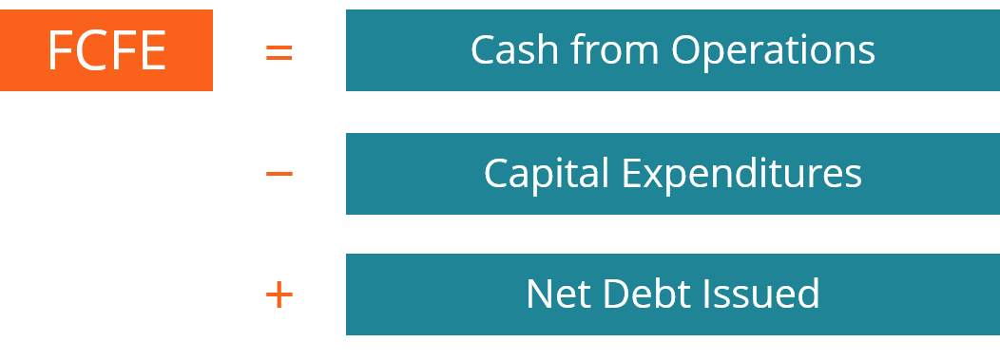

## Table of Contents

## What is Free Cash Flow to Equity (FCFE)?

Free Cash Flow to Equity (FCFE) is the amount of cash a company has left over after it has paid for all its expenses, investments, and debts. It's the money that could be given back to the shareholders, either through dividends or by buying back shares. FCFE is important because it shows how much cash a company can return to its shareholders without affecting its operations or growth.

To calculate FCFE, you start with the company's net income and then make some adjustments. You add back any non-cash expenses like depreciation, and subtract any money spent on capital expenditures, which are investments in things like new equipment or buildings. You also need to account for changes in working capital, which is the money tied up in the day-to-day running of the business. Finally, you adjust for any debt the company has taken on or paid off. The result is the FCFE, which tells you how much cash is available to the equity holders.

## Why is FCFE important for investors?

FCFE is important for investors because it shows how much money a company can give back to its shareholders. This is the cash that's left after the company has paid for everything it needs to keep running and growing. When investors look at FCFE, they can see if a company is making enough money to pay dividends or buy back its own shares. This helps them understand if the company is a good investment.

Investors also use FCFE to value a company. By looking at the FCFE, they can estimate how much the company might be worth in the future. If a company has a lot of FCFE, it might mean that it's undervalued and could be a good buy. On the other hand, if the FCFE is low or negative, it might mean the company is overvalued or struggling to make enough money. So, FCFE helps investors make smarter choices about where to put their money.

## How does FCFE differ from Free Cash Flow to the Firm (FCFF)?

Free Cash Flow to Equity (FCFE) and Free Cash Flow to the Firm (FCFF) are two different ways to look at how much money a company has left over. FCFE is the cash that's available to the shareholders after the company has paid for everything it needs to run and grow, including paying off any debts. It's the money that could be used to pay dividends or buy back shares. So, FCFE is all about what's left for the people who own the company.

On the other hand, FCFF is the cash that's available to everyone who has a stake in the company, not just the shareholders. This includes the shareholders, but also anyone who has lent money to the company, like bondholders. FCFF is the money left over after the company has paid for all its operating expenses and investments, but before it pays any interest to its debt holders. FCFF gives a broader picture of the company's financial health because it shows how much cash the whole business is generating.

## What are the components of the FCFE formula?

The FCFE formula helps figure out how much money a company has left over for its shareholders after paying for everything it needs. To calculate FCFE, you start with the company's net income. Then, you add back non-cash expenses like depreciation because these don't actually use up cash. Next, you subtract capital expenditures, which is the money the company spends on things like new equipment or buildings. You also need to adjust for changes in working capital, which is the money tied up in the day-to-day running of the business.

After that, you need to consider the company's debt. If the company has borrowed money, you add back the money it received from new debt. If the company has paid off debt, you subtract that amount. This is because borrowing money gives the company more cash to use, while paying off debt uses up cash. The final number you get is the FCFE, which shows how much cash is left over for the shareholders.

## Can you provide a basic example of how to calculate FCFE?

Let's say a company has a net income of $100,000. They also have depreciation expenses of $20,000, which is a non-cash expense. The company spent $30,000 on new equipment, which is a capital expenditure. They also had an increase in working capital of $10,000. Finally, the company took out a new loan of $15,000 and paid off an old loan of $5,000.

To calculate the FCFE, we start with the net income of $100,000. We add back the depreciation of $20,000 because it's a non-cash expense, making the total $120,000. Next, we subtract the capital expenditure of $30,000, leaving us with $90,000. We then subtract the increase in working capital of $10,000, bringing the total down to $80,000. Finally, we add the new loan of $15,000 and subtract the old loan payment of $5,000. This gives us a final FCFE of $90,000. This is the amount of cash available to the shareholders after all expenses and investments have been paid for.

## What adjustments might be necessary when calculating FCFE?

When calculating FCFE, you might need to make some adjustments to get a more accurate picture of the cash available to shareholders. One key adjustment is adding back non-cash expenses like depreciation and amortization. These expenses reduce the company's net income on paper, but they don't actually use up any cash. By adding them back, you get a better idea of the real cash flow. Another adjustment is subtracting capital expenditures, which are the costs of buying new equipment or building new facilities. These are important because they represent cash going out of the company to support its growth and operations.

You also need to adjust for changes in working capital. Working capital is the money tied up in the day-to-day operations of the business, like inventory and accounts receivable. If working capital increases, it means the company is using more cash to run its operations, so you subtract this increase from the FCFE. If it decreases, you add it back. Finally, you need to account for the company's debt. If the company takes out a new loan, you add the amount of the loan to the FCFE because it's new cash coming in. If the company pays off debt, you subtract that amount because it's cash going out. These adjustments help you see how much cash is truly available to the shareholders.

## How can FCFE be used in valuation models?

FCFE can be used in valuation models to figure out how much a company is worth. One common way to do this is by using the discounted cash flow (DCF) model. In this model, you look at the FCFE the company is expected to make in the future. You then "discount" these future cash flows back to today's value, using a discount rate that reflects the risk of investing in the company. The sum of these discounted cash flows gives you an estimate of the company's value today. This helps investors decide if the company's stock price is a good deal or if it's too expensive.

Another way to use FCFE in valuation is by comparing it to the company's market value. If you divide the company's market value by its FCFE, you get the price-to-FCFE ratio. This ratio can help you see if the company is undervalued or overvalued compared to other companies in the same industry. A lower price-to-FCFE ratio might mean the company is a good buy because its stock price is low compared to the cash it's generating for shareholders. By looking at FCFE in these ways, investors can make smarter choices about where to put their money.

## What are common pitfalls or errors in calculating FCFE?

When calculating FCFE, one common mistake is not adjusting for non-cash expenses like depreciation. These expenses reduce net income but don't use up any cash, so you need to add them back to get the right FCFE. Another error is forgetting to account for changes in working capital. If the company's working capital goes up, it means more cash is tied up in running the business, so you need to subtract this increase from the FCFE. If it goes down, you add it back.

Another pitfall is not properly handling the company's debt. If the company takes out a new loan, you need to add this to the FCFE because it's new cash coming in. If the company pays off debt, you subtract this because it's cash going out. Sometimes, people also make mistakes with capital expenditures. These are the costs of buying new equipment or buildings, and they need to be subtracted from the FCFE because they use up cash. Getting these adjustments wrong can lead to a big difference in the final FCFE number, which can affect how investors see the company's value.

## How does capital structure affect FCFE?

Capital structure, which is how a company uses debt and equity to finance its operations, can have a big impact on FCFE. When a company takes on more debt, it gets more cash from loans, which increases the FCFE because this cash can be used for shareholders. But, having more debt also means the company has to pay more interest, which reduces the net income and can lower the FCFE over time. So, the more debt a company has, the more it affects the FCFE by changing how much cash is left for shareholders.

On the other hand, if a company uses more equity, like issuing new shares, it might not have as much immediate cash coming in as it would from debt. This can make the FCFE lower because there's less cash from new financing. But, using more equity means less interest to pay, which can keep the net income higher and the FCFE more stable in the long run. So, the way a company chooses to structure its finances can really change how much cash is available for its shareholders.

## Can you explain the impact of dividends on FCFE?

Dividends are payments that a company gives to its shareholders out of its profits. When a company pays dividends, it uses up some of the cash that could have been part of the Free Cash Flow to Equity (FCFE). So, if a company decides to pay out a lot of dividends, the FCFE will be lower because that cash is going to the shareholders instead of staying in the company. But, dividends don't directly change the FCFE calculation because FCFE is what's left after all expenses and investments, before any dividends are paid.

Even though dividends don't directly affect the FCFE calculation, they do show how a company is choosing to use its cash. If a company has a high FCFE but decides to pay out a lot in dividends, it might mean they're not planning to reinvest as much money back into the business. On the other hand, if a company has a high FCFE and pays low dividends, it might mean they're keeping more cash to grow the business or buy back shares. So, while dividends don't change the FCFE number itself, they do tell investors how the company is managing its cash.

## How do you forecast FCFE for future periods?

To forecast FCFE for future periods, you start by looking at the company's past financial statements. You need to predict future net income, which is what the company earns after all its expenses. Then, you estimate future non-cash expenses like depreciation and future capital expenditures, which are the costs of buying new equipment or buildings. You also need to guess how working capital, the money tied up in running the business, will change. Finally, you have to think about how the company's debt will change, including any new loans or repayments. By putting all these pieces together, you can estimate the FCFE for future years.

When you're making these predictions, it's important to think about the company's growth plans and the overall economy. If the company is planning to expand, it might spend more on capital expenditures, which would lower the FCFE. On the other hand, if the economy is doing well, the company might make more money, which would increase the FCFE. You can also use industry trends and analyst reports to help you make better guesses. By considering all these factors, you can come up with a more accurate forecast of the company's FCFE for future periods.

## What are advanced techniques for analyzing FCFE in different industries?

When analyzing FCFE in different industries, it's helpful to understand that each industry has its own unique characteristics that can affect how much cash a company has left over for shareholders. For example, in the tech industry, companies often spend a lot on research and development, which can lower their FCFE because it's a big expense. But if a tech company can turn those investments into new products that make money, their FCFE could go up in the future. On the other hand, industries like utilities or telecoms might have high capital expenditures because they need to build and maintain big infrastructure, like power plants or cell towers. This can make their FCFE lower, but it's important for them to keep their services running smoothly.

Another advanced technique is to compare a company's FCFE to its competitors within the same industry. This can help you see if a company is doing better or worse at generating cash for its shareholders. For instance, if two car manufacturers have similar net incomes but one has a higher FCFE, it might mean that company is better at managing its expenses or investments. You can also look at how FCFE changes over time to see if a company is getting better or worse at generating cash. By using these techniques, you can get a clearer picture of how well a company is doing compared to others in its industry and how it's managing its cash over time.

## What is Understanding Free Cash Flow to Equity (FCFE)?

Free Cash Flow to Equity (FCFE) represents the cash available for distribution to equity shareholders after accounting for the necessary expenses, reinvestments, and debt obligations of a company. It is a vital metric that offers insights into a company's actual liquidity and its capability to provide dividend payouts to shareholders. 

FCFE takes into account several financial components to provide a comprehensive measure of available cash flow. The calculation begins with the net income of the company, which serves as the baseline profit after all expenses and taxes have been deducted. From here, adjustments are made to account for non-cash expenses, such as depreciation and amortization, ensuring the cash flow data reflects tangible liquidity. Capital expenditures (CapEx) are subtracted, given their role in long-term investments that consume cash resources. Changes in working capital, which represent the short-term liquidity of the company, are also factored into the equation. Finally, net borrowings—which include new debt issues minus debt repayments—are added to this formula to reflect the cash flow impact of financing activities.

The formula for FCFE can be expressed as:

$$

\text{FCFE} = \text{Net Income} + \text{Depreciation and Amortization} - \text{Capital Expenditures} - \Delta \text{Working Capital} + \text{Net Borrowings} 
$$

This calculation reveals the true availability of cash that could be distributed to equity holders, thereby providing a clearer picture of the company's financial standing beyond traditional profit metrics. By focusing on the cash that remains after all obligatory financial commitments have been met, FCFE allows stakeholders to assess both the [liquidity](/wiki/liquidity-risk-premium) and the fiscal health of the business. It is particularly useful for investors considering the sustainability of dividend payments or potential returns from equity investments. As a result, FCFE is a key indicator in evaluating a company's capacity to reward its shareholders and its overall financial management efficiency.

## What is the Formula for FCFE?

The Free Cash Flow to Equity (FCFE) is calculated using a relatively straightforward formula:  
$$
\text{FCFE} = \text{Cash from Operations} - \text{Capital Expenditures} + \text{Net Debt Issued} \]  

This formula is instrumental in illustrating how free cash flow impacts a company's strategic financial decisions, particularly regarding dividends and capital investments. The formula essentially determines the amount of cash a company has available for equity shareholders after accounting for all necessary operational expenses, reinvestments, and adjustments for debts.

**Illustration of Corporate Strategy Influence**

To comprehend how FCFE can dictate corporate strategies, consider its components:

- **Cash from Operations**: This is the cash generated by the company's core business activities. It's a key indicator of financial health, reflecting the company's ability to generate sufficient revenue to meet operational costs.

- **Capital Expenditures (Capex)**: Refers to funds used by a company to acquire or upgrade physical assets such as buildings or machinery. These expenditures are necessary for maintaining or expanding a company's operations and thus have a direct impact on FCFE. High Capex can decrease FCFE, potentially limiting the company's ability to pay out dividends unless offset by increased debt issuance or operational cash flow.

- **Net Debt Issued**: Represents the net funds from debt transactions. Companies might issue debt to finance new projects or maintain liquidity, affecting the FCFE positively when the net debt issued is substantial.

**Example: Evaluating a Tech Company's Shareholder Value Creation**

Consider a technology company with the following financial data:

- Cash from operations: $500 million
- Capex: $300 million
- Net debt issued: $100 million

Using the FCFE formula:

$$
\text{FCFE} = 500M - 300M + 100M = 300M
$$

This indicates that the company has $300 million available to distribute to equity shareholders. For tech companies, with typically high capital expenditure needs due to rapid technological advancements and market competition, understanding FCFE is crucial. If the tech company's strategy includes maintaining investor confidence through regular dividends or share buybacks, a positive FCFE suggests that these strategies are financially sustainable.

To extrapolate further, if a technology company consistently has a robust FCFE, it signals potential for strong shareholder value creation, encouraging investors to regard it as a lucrative investment opportunity. By integrating such calculations into broader equity valuation models, analysts gain valuable insights into the company's long-term strategic and financial positioning.

## References & Further Reading

[1]: Damodaran, A. (2012). ["Investment Valuation: Tools and Techniques for Determining the Value of Any Asset."](https://books.google.com/books/about/Investment_Valuation.html?id=5SRHAAAAQBAJ) Wiley Finance.

[2]: ["Advances in Financial Machine Learning"](https://www.amazon.com/Advances-Financial-Machine-Learning-Marcos/dp/1119482089) by Marcos Lopez de Prado

[3]: ["Principles of Corporate Finance"](https://www.mheducation.com/highered/product/principles-corporate-finance-brealey-myers/M9781264080946.html) by Richard A. Brealey, Stewart C. Myers, and Franklin Allen

[4]: Ferri, R. A. (2011). ["Serious Money: Straight Talk About Investing for Retirement."](https://rickferri.com/wp-content/uploads/Serious-Money-Straight-Talk.pdf) Chicago Review Press.

[5]: ["Machine Learning for Algorithmic Trading"](https://github.com/PacktPublishing/Machine-Learning-for-Algorithmic-Trading-Second-Edition) by Stefan Jansen