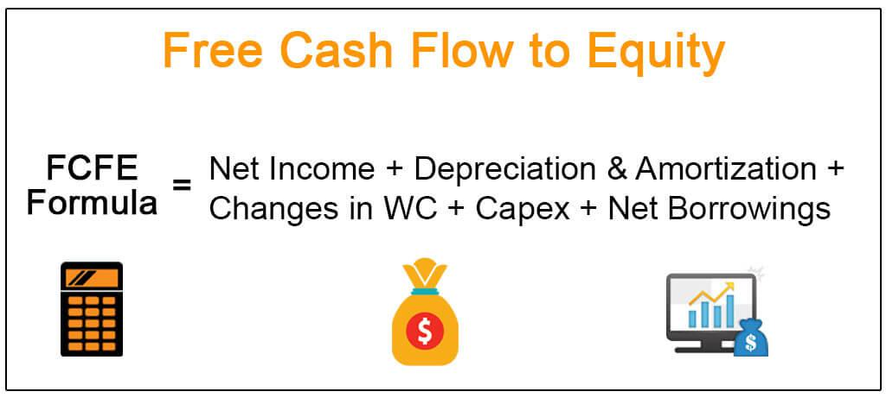

The world of finance continually evolves as new techniques and tools for equity valuation emerge. One such significant tool is Free Cash Flow to Equity (FCFE), which plays a crucial role in evaluating a company's financial health. The FCFE metric provides insights into the cash available to equity shareholders after accounting for reinvestments, expenses, and debt settlements. By understanding FCFE, investors can better gauge a company's capacity to distribute dividends and repurchase shares, offering a clearer picture of financial sustainability and shareholder value.

Alongside traditional valuation methods, algorithmic trading leverages quantitative techniques to enhance the precision and timing of trading activities. Algo trading utilizes automated systems that execute trades based on complex algorithms incorporating various financial indicators, including valuation parameters like FCFE. This intersection between FCFE and algorithmic trading presents novel opportunities for investors and analysts to optimize their strategies, capitalizing on real-time data and predictive modeling.



Integrating FCFE within algorithmic frameworks can significantly influence trading decisions by identifying undervalued stocks and predicting potential stock performance. This fusion of technology and finance empowers investors to make more informed and timely decisions, potentially increasing their investment returns.

This article explores the relationship between FCFE and algorithmic strategies, highlighting their roles in modern finance. Understanding these concepts equips investors with the tools necessary to navigate the increasingly complex financial landscape.

## Table of Contents

## Understanding Free Cash Flow to Equity (FCFE)

Free Cash Flow to Equity (FCFE) represents the cash available for distribution to equity shareholders after accounting for the necessary expenses, reinvestments, and debt obligations of a company. It is a vital metric that offers insights into a company's actual liquidity and its capability to provide dividend payouts to shareholders. 

FCFE takes into account several financial components to provide a comprehensive measure of available cash flow. The calculation begins with the net income of the company, which serves as the baseline profit after all expenses and taxes have been deducted. From here, adjustments are made to account for non-cash expenses, such as depreciation and amortization, ensuring the cash flow data reflects tangible liquidity. Capital expenditures (CapEx) are subtracted, given their role in long-term investments that consume cash resources. Changes in working capital, which represent the short-term liquidity of the company, are also factored into the equation. Finally, net borrowings—which include new debt issues minus debt repayments—are added to this formula to reflect the cash flow impact of financing activities.

The formula for FCFE can be expressed as:

$$

\text{FCFE} = \text{Net Income} + \text{Depreciation and Amortization} - \text{Capital Expenditures} - \Delta \text{Working Capital} + \text{Net Borrowings} 
$$

This calculation reveals the true availability of cash that could be distributed to equity holders, thereby providing a clearer picture of the company's financial standing beyond traditional profit metrics. By focusing on the cash that remains after all obligatory financial commitments have been met, FCFE allows stakeholders to assess both the [liquidity](/wiki/liquidity-risk-premium) and the fiscal health of the business. It is particularly useful for investors considering the sustainability of dividend payments or potential returns from equity investments. As a result, FCFE is a key indicator in evaluating a company's capacity to reward its shareholders and its overall financial management efficiency.

## The Formula for FCFE

The Free Cash Flow to Equity (FCFE) is calculated using a relatively straightforward formula:  
$$
\text{FCFE} = \text{Cash from Operations} - \text{Capital Expenditures} + \text{Net Debt Issued} \]  

This formula is instrumental in illustrating how free cash flow impacts a company's strategic financial decisions, particularly regarding dividends and capital investments. The formula essentially determines the amount of cash a company has available for equity shareholders after accounting for all necessary operational expenses, reinvestments, and adjustments for debts.

**Illustration of Corporate Strategy Influence**

To comprehend how FCFE can dictate corporate strategies, consider its components:

- **Cash from Operations**: This is the cash generated by the company's core business activities. It's a key indicator of financial health, reflecting the company's ability to generate sufficient revenue to meet operational costs.

- **Capital Expenditures (Capex)**: Refers to funds used by a company to acquire or upgrade physical assets such as buildings or machinery. These expenditures are necessary for maintaining or expanding a company's operations and thus have a direct impact on FCFE. High Capex can decrease FCFE, potentially limiting the company's ability to pay out dividends unless offset by increased debt issuance or operational cash flow.

- **Net Debt Issued**: Represents the net funds from debt transactions. Companies might issue debt to finance new projects or maintain liquidity, affecting the FCFE positively when the net debt issued is substantial.

**Example: Evaluating a Tech Company's Shareholder Value Creation**

Consider a technology company with the following financial data:

- Cash from operations: $500 million
- Capex: $300 million
- Net debt issued: $100 million

Using the FCFE formula:

$$
\text{FCFE} = 500M - 300M + 100M = 300M
$$

This indicates that the company has $300 million available to distribute to equity shareholders. For tech companies, with typically high capital expenditure needs due to rapid technological advancements and market competition, understanding FCFE is crucial. If the tech company's strategy includes maintaining investor confidence through regular dividends or share buybacks, a positive FCFE suggests that these strategies are financially sustainable.

To extrapolate further, if a technology company consistently has a robust FCFE, it signals potential for strong shareholder value creation, encouraging investors to regard it as a lucrative investment opportunity. By integrating such calculations into broader equity valuation models, analysts gain valuable insights into the company's long-term strategic and financial positioning.

## Significance of FCFE in Equity Valuation

Free Cash Flow to Equity (FCFE) serves as a crucial tool in evaluating a company's intrinsic value, particularly when traditional methods like dividend discount models may not apply. As FCFE focuses on the cash available to equity shareholders, it provides a more direct measure of a company's ability to create shareholder value through dividends and share repurchases.

Analysts leverage FCFE to gain insights into whether a company can sustain its current dividend policy or if it's positioning for future dividend increases. Sustainable dividend policies are essential as they signal financial health and management's confidence in the company's future cash flow generation capabilities. By comparing the FCFE to actual dividend payouts, analysts can assess whether a company is paying dividends within its means or potentially overstretching its financial resources. If a company consistently pays dividends higher than its FCFE, it might indicate the use of debt or the sale of assets to fund these payouts, which can be a red flag for future sustainability.

Moreover, FCFE's ability to highlight share repurchase capabilities adds another layer of significance. Companies often use excess cash flow to buy back shares, reducing the total number of outstanding shares in the market. This process can increase earnings per share (EPS) and potentially raise the stock price, benefitting existing shareholders. By analyzing FCFE, investors can discern a company's potential to engage in these shareholder-friendly activities without compromising its financial stability.

In summary, the use of FCFE in equity valuation allows analysts to evaluate a company's financial strategies more comprehensively, ensuring that dividends and share repurchases are backed by genuine free cash generation. This approach can provide investors with deeper insights into a company's financial management practices and its commitment to creating long-term shareholder value.

## Algorithmic Trading and FCFE

Algorithmic trading employs automated systems to execute trades based on clearly defined criteria, enabling quicker response times and the ability to process vast amounts of data efficiently. One method of enhancing [algorithmic trading](/wiki/algorithmic-trading) models is by incorporating Free Cash Flow to Equity (FCFE), which is instrumental in identifying undervalued stocks. FCFE represents the cash available to equity shareholders after expenses, reinvestments, and debts are settled, making it a valuable metric for determining a company’s financial health and potential for value creation.

Integrating FCFE into algorithmic strategies can provide a robust framework for pinpointing investment opportunities where valuations are not fully reflected in the stock price. Algo traders often leverage financial APIs and datasets to access historical and real-time data necessary for model training and execution. By using FCFE, traders can set algorithms to buy stocks when they are determined to be undervalued according to FCFE calculations, which in turn indicates that the market has not yet realized the inherent value based on future cash flows available to equity holders.

For instance, an algorithm could be built using Python, a popular tool in financial modeling, to filter and select stocks with high potential growth as indicated by favorable FCFE numbers. The following Python snippet illustrates a basic framework for identifying such opportunities:

```python
# Import necessary libraries
import pandas as pd

# Sample data: hypothetical stock data with FCFE
data = {
    'Stock': ['A', 'B', 'C'],
    'FCFE': [500, 200, 1000],  # in millions
    'Market_Cap': [4000, 1000, 9500]
}

# Create a DataFrame
df = pd.DataFrame(data)

# Define strategy: identify undervalued stocks using FCFE/Market Cap ratio
df['Value_Indicator'] = df['FCFE'] / df['Market_Cap']

# Filter stocks considered to be undervalued based on Value Indicator threshold
undervalued_stocks = df[df['Value_Indicator'] > 0.1]  # Example threshold

print(undervalued_stocks)
```

In this example, stocks with a high FCFE relative to their market capitalization are identified as undervalued, making them candidates for purchase within the algo trading strategy.

Furthermore, integrating FCFE into algorithmic trading requires constant refinement and validation to ensure the accuracy of predictions. Financial market conditions, such as economic downturns or unexpected expenses, can affect cash flow projections and thus impact the effectiveness of algorithms reliant on FCFE. Therefore, maintaining robust financial models that adapt to new data and market dynamics is crucial for extracting meaningful insights from FCFE incorporations in trading strategies.

Ultimately, aligning the analytical power of FCFE with the speed and precision of algorithmic trading presents a significant advantage for investors aiming to optimize returns while navigating the complexities of modern financial markets.

## Practical Applications of FCFE in Algo Trading

Traders seeking to automate stock purchases based on Free Cash Flow to Equity (FCFE) often develop systems that trigger transactions when stocks are deemed undervalued by this metric. The automation is commonly executed through algorithmic trading platforms utilizing programming languages such as Python and R for their flexibility and powerful libraries.

Python, for example, provides robust libraries like NumPy and Pandas for data manipulation and analysis, while libraries such as SciPy and StatsModels support statistical computations. The integration of Python with trading platforms is enhanced through APIs that facilitate real-time data analysis and trade execution. An example code snippet for implementing an FCFE-based stock evaluation model might involve the following:

```python
import pandas as pd

# Assume 'financial_data' is a DataFrame containing the relevant financial metrics
financial_data = pd.DataFrame({
    'cash_from_operations': [500000, 600000, 550000],
    'capex': [100000, 150000, 120000],
    'net_debt_issued': [20000, 30000, -10000]
})

# Calculate FCFE
financial_data['FCFE'] = financial_data['cash_from_operations'] - financial_data['capex'] + financial_data['net_debt_issued']

# Define an undervaluation threshold
undervaluation_threshold = 400000

# Generate buy signals
financial_data['buy_signal'] = financial_data['FCFE'] > undervaluation_threshold

print(financial_data)
```

This script calculates the FCFE for each entry in a dataset, applying a simple threshold to generate buy signals.

Incorporating FCFE into algorithmic trading is particularly beneficial under volatile market conditions, where quick responses to changing valuations are essential. A notable case study involved deploying algorithmic systems during periods of market turbulence, where FCFE metrics were used to identify stocks positioned for recovery or growth. By leveraging historical data and current market signals, these systems provided optimized trade recommendations and significantly improved returns on investment.

However, the success of such trading models depends on constantly updated and accurate financial data. Models must account for potential discrepancies in financial reporting and incorporate mechanisms to adjust for inaccuracies. Practical applications of FCFE in algorithmic trading thus rely on a careful balance of model complexity, data integrity, and real-world market insights to drive effective investment strategies.

## Challenges and Considerations

Free Cash Flow to Equity (FCFE) is a valuable metric for assessing a company's ability to generate cash flow available for distribution to shareholders. However, its reliability is contingent upon several factors that need careful consideration. 

Firstly, the calculation of FCFE relies heavily on the availability of accurate input data. Inaccuracies in financial statements, estimation errors, or lack of transparency can lead to misleading results. Ensuring the data's reliability is crucial to derive meaningful insights from FCFE. Realistic projections of the company's future performance are essential; unrealistic assumptions can skew FCFE calculations.

Moreover, market conditions can introduce significant variability to FCFE outcomes. Economic downturns, fluctuations in interest rates, or changes in industry dynamics can affect a company’s revenue generation, impacting FCFE predictions. Unexpected expenses, such as legal liabilities or unforeseen operational costs, can also alter the expected cash flows, thereby influencing the metric's precision.

Changes in capital investment plans pose another challenge. Companies frequently adjust their investment strategies based on market opportunities or shifts in business priorities, impacting capital expenditures and consequently FCFE. This dynamism necessitates continuous monitoring and updating of investment-related inputs to maintain FCFE accuracy.

For those integrating FCFE in algorithmic trading systems, achieving a balance between model complexity and interpretability is critical. Overly complex models might fit historical data well but can suffer from overfitting, reducing their effectiveness in real-world scenarios. Simpler models may be more interpretable but could lack the sophistication required to capture intricacies in market dynamics. Algorithmic traders often tackle these challenges by employing cross-validation techniques and stress testing their models under various market conditions to ensure robustness and reliability.

In conclusion, while FCFE is potent for evaluating shareholder value creation potential, recognizing its limitations and dependencies enhances its application in both traditional analysis and innovative algorithmic trading strategies.

## Conclusion

Free Cash Flow to Equity (FCFE) remains an integral metric for assessing a company's potential to create shareholder value. By providing a transparent view of the cash available for distribution to equity shareholders, FCFE helps investors gauge the sustainability and potential growth of dividends. Its role as a versatile tool is especially significant in equity valuation, highlighting a firm's financial health beyond traditional accounting measures.

Integrating FCFE into algorithmic trading can enhance investment strategies, allowing for precise execution based on robust data analysis. Algorithmic trading systems that utilize FCFE are capable of identifying intrinsic undervaluation in stocks by assessing real-time financial metrics, thus offering an edge in a competitive market landscape. For example, traders can construct algorithms in Python to automate the purchase of stocks when FCFE values suggest significant shareholder value potential.

As finance increasingly intersects with technology, the importance of understanding and applying FCFE is magnified. The ability to synthesize large data sets into actionable insights through advanced algorithms allows investors to navigate complex market dynamics with agility and foresight. This convergence of finance and technology exemplifies the transformative potential of leveraging quantitatively driven insights for optimized decision-making in modern financial practices.

## References & Further Reading

[1]: Damodaran, A. (2012). ["Investment Valuation: Tools and Techniques for Determining the Value of Any Asset."](https://books.google.com/books/about/Investment_Valuation.html?id=5SRHAAAAQBAJ) Wiley Finance.

[2]: ["Advances in Financial Machine Learning"](https://www.amazon.com/Advances-Financial-Machine-Learning-Marcos/dp/1119482089) by Marcos Lopez de Prado

[3]: ["Principles of Corporate Finance"](https://www.mheducation.com/highered/product/principles-corporate-finance-brealey-myers/M9781264080946.html) by Richard A. Brealey, Stewart C. Myers, and Franklin Allen

[4]: Ferri, R. A. (2011). ["Serious Money: Straight Talk About Investing for Retirement."](https://rickferri.com/wp-content/uploads/Serious-Money-Straight-Talk.pdf) Chicago Review Press.

[5]: ["Machine Learning for Algorithmic Trading"](https://github.com/PacktPublishing/Machine-Learning-for-Algorithmic-Trading-Second-Edition) by Stefan Jansen