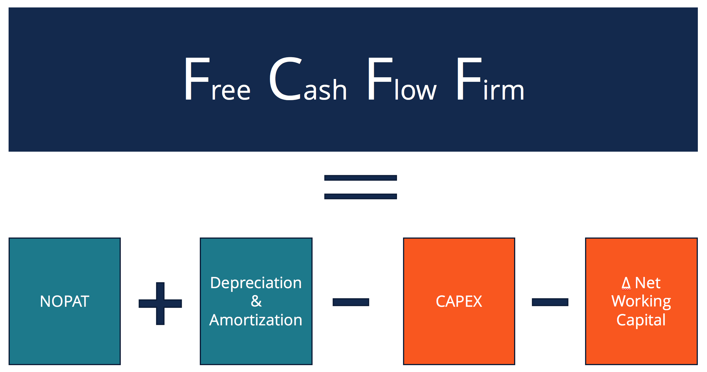

## Table of Contents

## What is Free Cash Flow to Firm (FCFF)?

Free Cash Flow to Firm (FCFF) is the money a company has left after it pays for everything it needs to keep running and growing. This includes costs like buying new equipment, paying workers, and keeping the lights on. FCFF is important because it shows how much cash a company can use to pay back investors, like shareholders and lenders, or to reinvest in the business.

Think of FCFF as the money left in the company's pocket after all the bills are paid. It's a key number that investors look at to see if a company is healthy and making good use of its money. If a company has a lot of FCFF, it means it's doing well and can pay dividends, buy back its own stock, or invest in new projects to grow even more.

## Why is FCFF important for businesses?

FCFF is really important for businesses because it shows how much cash they have left after paying for everything they need to run and grow. This is like the money a business has in its pocket after all the bills are paid. Knowing this number helps business owners and managers see if they are making enough money to keep the business going strong. If a business has a lot of FCFF, it means it's doing well and can use that extra cash to pay back investors, like the people who own shares in the company or the banks that lent them money.

Having a good amount of FCFF is also important because it gives a business the freedom to make big decisions. For example, they might decide to pay dividends to shareholders, buy back their own stock, or invest in new projects to make the business even bigger. If a business doesn't have much FCFF, it might struggle to do these things and could even face problems paying back what it owes. So, FCFF is a key number that helps everyone involved with the business understand its health and future possibilities.

## How is FCFF different from Free Cash Flow to Equity (FCFE)?

Free Cash Flow to Firm (FCFF) and Free Cash Flow to Equity (FCFE) are both important ways to measure how much cash a company has, but they look at it from different angles. FCFF is the cash left after a company pays for everything it needs to run and grow, including costs like buying new equipment and paying workers. This number shows how much money the whole company has before it pays back any investors, like shareholders or lenders. It's like looking at the total cash the business has in its pocket.

On the other hand, FCFE is the cash that's left just for the shareholders after the company has paid all its bills and also paid back any money it owes to lenders, like banks. So, FCFE is what's left for the owners of the company after everyone else gets paid. It's like looking at the cash that's specifically for the people who own the company, after all other obligations are taken care of.

In simple terms, FCFF is the cash available to everyone who has a stake in the company, while FCFE is the cash available just to the shareholders. FCFF gives a broader picture of the company's financial health, while FCFE focuses more on what's available for the owners. Both are useful, but they help answer different questions about the company's cash situation.

## What are the basic components needed to calculate FCFF?

To calculate Free Cash Flow to Firm (FCFF), you need to start with the company's earnings before interest and taxes (EBIT). This is the money the company makes from its normal business activities before it pays any interest on loans or taxes. Then, you need to add back any non-cash expenses like depreciation and amortization because these are costs that don't actually take cash out of the company's pocket. After that, you need to subtract the taxes the company would have to pay if it didn't have any interest expenses. This gives you the company's operating cash flow after taxes.

Next, you need to consider the company's investments in its business. You subtract the capital expenditures, which are the costs of buying new equipment or buildings that the company needs to keep growing. You also add back any money the company gets from selling old equipment or other long-term assets. Finally, you need to account for changes in working capital, which includes things like inventory and accounts receivable. If the company has to put more money into working capital, you subtract that amount; if it gets money back from working capital, you add it. When you put all these pieces together, you get the FCFF, which shows how much cash the company has left for all its investors after paying for everything it needs to run and grow.

## Can you provide a simple formula for calculating FCFF?

To calculate Free Cash Flow to Firm (FCFF), you start with the company's earnings before interest and taxes (EBIT). You add back any non-cash expenses like depreciation and amortization because these don't actually take cash out of the company's pocket. Then, you subtract the taxes the company would pay if it didn't have any interest expenses. This gives you the company's operating cash flow after taxes.

Next, you need to account for the company's investments in its business. You subtract the capital expenditures, which are the costs of buying new equipment or buildings. You also add back any money the company gets from selling old equipment or other long-term assets. Finally, you need to consider changes in working capital, which includes things like inventory and accounts receivable. If the company has to put more money into working capital, you subtract that amount; if it gets money back from working capital, you add it. The formula for FCFF can be written as: FCFF = EBIT + Depreciation - Taxes +/(-) Changes in Working Capital - Capital Expenditures + Proceeds from Sale of Assets.

## What adjustments might be necessary when calculating FCFF from financial statements?

When you're figuring out FCFF from a company's financial statements, you might need to make some tweaks to get the numbers right. Start with the income statement to find the EBIT, but remember to add back non-cash expenses like depreciation and amortization because these don't take actual cash out of the company's pocket. Then, look at the tax section. You'll need to adjust the taxes to reflect what the company would pay if it didn't have any interest expenses, since FCFF looks at cash flow before interest.

Next, you'll need to check the cash flow statement for capital expenditures and any money the company gets from selling assets. Subtract the capital expenditures because these are costs for buying new equipment or buildings. Add back any money from selling old stuff. Don't forget about working capital changes, which you can find in the balance sheet or cash flow statement. If the company has to put more money into things like inventory or accounts receivable, subtract that. If it gets money back from working capital, add it. These adjustments help make sure your FCFF calculation is as accurate as possible, showing the true cash the company has available for all its investors.

## How does depreciation and amortization affect FCFF?

Depreciation and amortization are important when figuring out a company's Free Cash Flow to Firm (FCFF). They are costs that show up on the income statement but don't actually take cash out of the company's pocket. Because of this, when you're calculating FCFF, you add back depreciation and amortization to the company's earnings before interest and taxes (EBIT). This step helps to show the true amount of cash the company has available, since these expenses don't reduce the cash on hand.

By adding back depreciation and amortization, you get a clearer picture of how much money the company has to pay back investors, reinvest in the business, or use for other purposes. These adjustments are crucial because they reflect the cash that's actually available, not just the accounting numbers. So, when you see depreciation and amortization in the FCFF calculation, remember they're there to give a more accurate view of the company's cash flow.

## What role does working capital play in the FCFF calculation?

Working capital is really important when you're figuring out a company's Free Cash Flow to Firm (FCFF). It's all about the money a company needs to keep its day-to-day operations running smoothly. Things like inventory, accounts receivable, and accounts payable make up working capital. When you're calculating FCFF, you need to look at how working capital changes over time. If the company has to put more money into working capital, like buying more inventory or waiting longer to get paid by customers, you subtract that amount from the FCFF. This is because that money is tied up and not available for other uses.

On the other hand, if the company gets money back from working capital, like selling off inventory or collecting payments faster, you add that amount to the FCFF. This shows that more cash is available for the company to use. So, working capital changes can either increase or decrease the FCFF, depending on whether the company is using more cash or getting cash back. By considering working capital, you get a better picture of how much cash the company truly has to work with after keeping the business running.

## Can you walk through a basic example of calculating FCFF for a hypothetical company?

Let's say we have a company called ABC Corp. They made $100,000 in earnings before interest and taxes (EBIT) last year. They also had $10,000 in depreciation expenses, which is a non-cash cost. Their tax rate is 30%, but since we're calculating FCFF, we need to find out what their taxes would be if they didn't have any interest expenses. Since their EBIT is $100,000, their taxes without interest would be $30,000 (30% of $100,000). So, we start with the EBIT, add back the depreciation, and then subtract the taxes to get their operating cash flow after taxes. That's $100,000 + $10,000 - $30,000 = $80,000.

Now, we need to consider ABC Corp's investments and working capital changes. Last year, they spent $20,000 on new equipment, which is their capital expenditure. They also sold some old equipment for $5,000, so we add that back. Their working capital increased by $5,000, meaning they had to put more money into things like inventory or accounts receivable, so we subtract that. Putting it all together, their FCFF is $80,000 - $20,000 + $5,000 - $5,000 = $60,000. This means ABC Corp has $60,000 in cash available for all its investors after paying for everything it needs to run and grow.

## How can FCFF be used in valuation models like Discounted Cash Flow (DCF)?

FCFF is really useful when you want to figure out how much a company is worth using a valuation model like Discounted Cash Flow (DCF). In a DCF model, you try to guess how much money the company will make in the future, and then you figure out how much that money is worth today. FCFF is important here because it shows the cash the company has left after paying for everything it needs to keep running and growing. By using FCFF, you can see the true cash that's available to all the company's investors, like shareholders and lenders. This helps you make a more accurate guess about the company's value.

To use FCFF in a DCF model, you start by making a guess about the company's future FCFF for several years. Then, you use a discount rate, which is like an [interest rate](/wiki/interest-rate-trading-strategies), to figure out how much those future cash flows are worth today. The discount rate takes into account things like how risky the company is and what other investment options are out there. By adding up all the discounted FCFF numbers, you get the present value of the company's future cash flows. This gives you a good idea of what the whole company might be worth, helping investors decide if the company is a good investment.

## What are common pitfalls or errors to avoid when calculating FCFF?

When calculating FCFF, one common mistake is not adding back non-cash expenses like depreciation and amortization. These expenses show up on the income statement but don't actually take cash out of the company's pocket. Forgetting to add them back can make it look like the company has less cash than it really does. Another error is not adjusting taxes correctly. You need to calculate taxes as if the company didn't have any interest expenses, which can be tricky if you're not careful. Getting this wrong can mess up your FCFF number.

Another pitfall is not paying attention to changes in working capital. If a company has to put more money into things like inventory or accounts receivable, you need to subtract that from the FCFF. If it gets money back from working capital, you add it. Ignoring these changes can lead to a wrong FCFF calculation. Also, be careful with capital expenditures and proceeds from selling assets. You have to subtract the money spent on new equipment but add back any money from selling old stuff. Missing these adjustments can give you a false picture of the company's cash flow.

## How do changes in tax rates or capital structure impact FCFF?

Changes in tax rates can have a big impact on FCFF. When tax rates go up, the company has to pay more in taxes, which means there's less cash left for everyone else. This reduces the FCFF because the company has less money after paying its bills. On the other hand, if tax rates go down, the company keeps more of its earnings, which increases the FCFF. So, when you're figuring out FCFF, you need to use the right tax rate to get an accurate picture of how much cash the company has.

Changes in the company's capital structure, like taking on more debt or paying off loans, also affect FCFF. When a company borrows more money, it has to pay more interest, but remember, FCFF looks at cash flow before interest payments. So, changes in debt don't directly change FCFF, but they can change how much money is left for shareholders after interest is paid. If a company pays off debt, it might have less interest to pay, which can make more cash available for other things, but again, this doesn't directly change the FCFF number. It's important to keep these things in mind when you're looking at a company's cash flow and overall financial health.

## What is Understanding Free Cash Flow to the Firm (FCFF)?

Free Cash Flow to the Firm (FCFF) is a pivotal metric in financial analysis, representing the cash available to investors after a company has covered its operating expenses and reinvestments in long-term assets. Essentially, FCFF is a measure of a firm's [liquidity](/wiki/liquidity-risk-premium) and ability to generate cash, independent of its capital structure.

The process of calculating FCFF starts with revenues, from which operating expenses and taxes are subtracted to determine the net operating profit after taxes (NOPAT). Subsequently, non-cash charges such as depreciation and amortization are added back to account for expenses that did not involve an actual outflow of cash. Further, necessary capital expenditures for maintaining or expanding the company's asset base are subtracted, as well as changes in working capital. The formula for FCFF can be expressed as:

$$
\text{FCFF} = \text{NOPAT} + \text{Depreciation and Amortization} - \text{Changes in Working Capital} - \text{Capital Expenditures}
$$

Positive FCFF indicates that a company is not only able to cover its operating and reinvestment needs but also has surplus cash available for distribution among shareholders and creditors. This is generally seen as a sign of financial health and operational efficiency. Conversely, a negative FCFF can suggest financial strain, where the firm is unable to generate sufficient free cash flow due to high costs, large capital expenditures, or strategic growth investments that have yet to yield returns.

Investors and analysts prioritize FCFF in their evaluations because it provides a comprehensive view of a company's ability to generate cash flows, factoring in both operational efficiency and investment strategies. Unlike metrics that are influenced by financing decisions, FCFF offers a clear insight into the economic performance of a company, allowing stakeholders to assess its capacity to generate value.

## How do you calculate FCFF?

Free Cash Flow to the Firm (FCFF) is calculated by considering several financial components that provide insight into a company's ability to generate cash. The general formula for FCFF is:

$$
\text{FCFF} = \text{Net Income} + \text{Non-cash Charges} + \text{Interest Expense} \times (1 - \text{Tax Rate}) - \text{Capital Expenditures} - \Delta \text{Working Capital}
$$

### Key Components:

1. **Net Income**: This is the starting point of the FCFF calculation and represents the company's profits after all expenses and taxes have been deducted from revenues.

2. **Non-cash Charges**: These include items such as depreciation and amortization which do not result in actual cash outflows but reduce net income. Adding them back is necessary to reflect the actual cash-generating capability.

3. **Interest Expense Adjusted for Tax**: Since FCFF represents cash available to all capital providers, interest expenses are added back to net income after adjusting for taxes. The adjustment is done by multiplying the interest expense with (1 - Tax Rate).

4. **Capital Expenditures**: These are investments made in long-term assets essential for maintaining or expanding a company’s capabilities. They represent the cash outflow necessary for business sustainability and growth.

5. **Change in Working Capital ($\Delta \text{Working Capital}$)**: This reflects the net change in a firm's current assets and current liabilities. Increases in working capital are cash outflows, while decreases are cash inflows.

### Variations of FCFF Calculation:

Different approaches exist for calculating FCFF based on the availability of data and specific business scenarios. For instance, one might derive FCFF from cash flows from operations (CFO) as follows:

$$
\text{FCFF} = \text{CFO} - \text{Capital Expenditures} + \text{Interest Expense} \times (1 - \text{Tax Rate})
$$

This variation highlights the flexibility analysts have, especially when different financial statements provide better access to cash flow data than net income. Capital expenditures and interest adjustments remain consistent in both formulae, ensuring comprehensive coverage of cash activities.

### Implementation Considerations:

When determining the most suitable FCFF formula, analysts must consider the following:

- **Data Availability**: Reliable data sources are critical. Analysts should opt for the FCFF calculation method that best matches their access to accurate financial information.
- **Business Context**: Industry-specific characteristics or unique business cycles may influence the choice of formula. For example, some industries may have atypical capital expenditure patterns due to regulatory changes or market dynamics.

By understanding these variations and their applicability, analysts can better assess a company's cash flow status and potential, enhancing the robustness of financial models used for valuation or strategic investment decisions.

## What is the role of FCFF in financial analysis and valuation?

Free Cash Flow to the Firm (FCFF) is integral to discounted cash flow (DCF) analysis, serving as a vital tool for assessing company valuation and guiding investment analysis. FCFF provides a comprehensive measure of a company's ability to generate cash flows, a fundamental [factor](/wiki/factor-investing) in assessing a firm's intrinsic value. 

The DCF model, a popular valuation technique, relies heavily on FCFF for projecting future cash flows, which are then discounted to their present value. This discounting reflects the time value of money, incorporating expected risk and return. The formula for FCFF is:

$$

\text{FCFF} = \text{Net Income} + \text{Non-Cash Charges} + \text{Interest} \times (1 - \text{Tax Rate}) - \text{Changes in Working Capital} - \text{Capital Expenditures}
$$

By incorporating these elements, FCFF accounts for the overall financial efficiency of a business, providing investors insight into the amount of cash available after accounting for reinvestment needs and operating expenses.

In DCF analysis, the projected free cash flows are discounted at the company's weighted average cost of capital (WACC) to estimate the present value of expected cash flows. The formula for DCF is:

$$

\text{DCF} = \sum_{t=1}^{n} \frac{\text{FCFF}_{t}}{(1 + \text{WACC})^{t}}
$$

Here, $\text{FCFF}_{t}$ represents the free cash flow estimated for each period, and $n$ signifies the number of periods considered in the projection. The sum of these discounted cash flows represents the enterprise value.

Analysts use FCFF derived from DCF to analyze whether a stock is overvalued or undervalued by comparing the intrinsic value with the market value. When the intrinsic value, derived from these computations, exceeds the market price, a stock is considered undervalued, providing a potential buy signal. Conversely, if the intrinsic value is less than the market price, it might signal that the stock is overvalued, suggesting caution or a potential sell position.

In essence, FCFF's role within DCF models is crucial for making informed investment decisions. It allows analysts to go beyond surface-level financial metrics and attain a deeper understanding of a company's financial health. Through accurately projecting and discounting future free cash flows, investors can make more strategic decisions about their portfolio compositions, aiming to maximize returns while managing risk.

## References & Further Reading

[1]: ["Corporate Finance: Theory and Practice"](https://www.amazon.com/Corporate-Finance-Practice-Pierre-Vernimmen/dp/1119424488) by Pierre Vernimmen, Pascal Quiry, Maurizio Dallocchio, Yann Le Fur

[2]: Damodaran, A. (1999). ["Valuing young, start-up and growth companies: Estimation issues and valuation challenges."](https://papers.ssrn.com/sol3/papers.cfm?abstract_id=1418687) NYU Working Paper FIN-99-021.

[3]: Tvede, L. (1998). ["The Psychology of Finance: Understanding the Behavioral Dynamics of Markets"](https://archive.org/details/psychologyoffina0000tved_v7e5) 

[4]: ["Principles of Corporate Finance"](https://en.wikipedia.org/wiki/Principles_of_Corporate_Finance) by Richard A. Brealey, Stewart C. Myers, Franklin Allen

[5]: Harris, R. S. (1986). ["Using Cash Flow Data to Value Firms."](https://www.jstor.org/stable/2328544) The Journal of Business, 59(4), pp. 457-485.

[6]: ["Investment Valuation: Tools and Techniques for Determining the Value of Any Asset"](https://archive.org/details/investmentvaluat0000damo_n6k9) by Aswath Damodaran