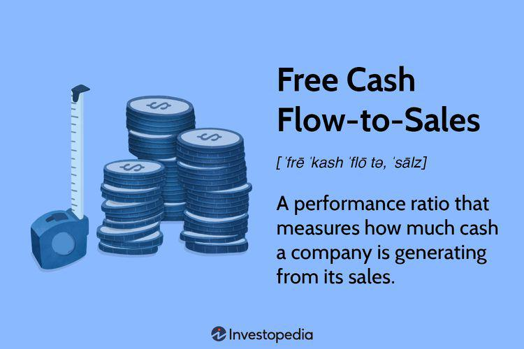

## Table of Contents

## What is the Free Cash Flow to Sales Ratio?

The Free Cash Flow to Sales Ratio is a financial metric that shows how much free cash flow a company generates for every dollar of sales. Free cash flow is the money a company has left after it pays for its operating expenses and capital expenditures. This ratio helps investors understand how efficiently a company is turning its sales into cash that can be used for growth, paying dividends, or reducing debt.

This ratio is calculated by dividing the company's free cash flow by its total sales or revenue. A higher ratio means the company is good at converting its sales into free cash flow, which is a positive sign for investors. On the other hand, a lower ratio might indicate that the company is not as efficient at generating cash from its sales, which could be a red flag. By comparing this ratio over time or against other companies in the same industry, investors can get a better sense of a company's financial health and performance.

## How is the Free Cash Flow to Sales Ratio calculated?

The Free Cash Flow to Sales Ratio is calculated by dividing a company's free cash flow by its total sales or revenue. Free cash flow is the money left after a company pays for its operating expenses and the money it spends on things like new equipment or buildings, which is called capital expenditures. So, you take the free cash flow number and divide it by the total sales number to get the ratio.

This ratio tells you how much free cash flow a company makes for every dollar of sales. If the ratio is high, it means the company is good at turning its sales into cash that can be used for growing the business, paying dividends to shareholders, or paying off debts. If the ratio is low, it might mean the company is not as good at making cash from its sales, which could be a warning sign for investors.

## Why is the Free Cash Flow to Sales Ratio important for investors?

The Free Cash Flow to Sales Ratio is important for investors because it shows how well a company is turning its sales into cash that it can use freely. This cash, called free cash flow, is what's left after the company pays for things like rent, salaries, and new equipment. When this ratio is high, it means the company is good at making money from its sales, which is a good sign for investors. They like to see this because it means the company can grow, pay dividends, or pay off debts without needing to borrow more money.

If the Free Cash Flow to Sales Ratio is low, it can be a warning sign for investors. It might mean the company is not doing a good job at turning its sales into cash. This could be because the company is spending too much on things like new equipment or because it's not managing its money well. Investors use this ratio to compare different companies and see which ones are better at making money from their sales. By looking at this ratio over time, investors can also see if a company is getting better or worse at generating free cash flow.

## What does a high Free Cash Flow to Sales Ratio indicate?

A high Free Cash Flow to Sales Ratio means a company is really good at turning its sales into cash that it can use freely. This cash, called free cash flow, is what's left after the company pays for things like rent, salaries, and new equipment. When this ratio is high, it shows that the company is efficient at making money from its sales. This is a good sign for investors because it means the company has more cash to grow the business, pay dividends to shareholders, or pay off debts without needing to borrow more money.

Investors like to see a high Free Cash Flow to Sales Ratio because it shows the company is in a strong financial position. A company that can generate a lot of free cash flow from its sales is likely to be more stable and have more opportunities for growth. By comparing this ratio across different companies or over time, investors can see which companies are better at making money from their sales and make smarter investment decisions.

## What does a low Free Cash Flow to Sales Ratio suggest?

A low Free Cash Flow to Sales Ratio means a company isn't very good at turning its sales into cash that it can use freely. This free cash flow is what's left after paying for things like rent, salaries, and new equipment. When the ratio is low, it shows that the company might be spending too much on things like new equipment or not managing its money well. This can be a warning sign for investors because it means the company might not have enough cash to grow the business, pay dividends to shareholders, or pay off debts without needing to borrow more money.

Investors look at a low Free Cash Flow to Sales Ratio and might worry that the company is not in a strong financial position. It could mean the company is struggling to make money from its sales, which can be a sign of bigger problems. By comparing this ratio across different companies or over time, investors can see which companies are not doing well at making money from their sales and might decide to be more careful about investing in those companies.

## How can the Free Cash Flow to Sales Ratio be used to compare companies within the same industry?

The Free Cash Flow to Sales Ratio can help investors compare how well different companies in the same industry are doing at turning their sales into cash. If one company has a higher ratio than another, it means that company is better at making money from its sales. This can be important because it shows which company is more efficient and might be a better investment. For example, if Company A has a ratio of 0.15 and Company B has a ratio of 0.10, Company A is better at turning its sales into free cash flow.

Investors can also use this ratio to see trends over time. If a company's Free Cash Flow to Sales Ratio is going up, it means they are getting better at making money from their sales. If it's going down, it might mean they are having trouble. By looking at these trends, investors can decide if a company is improving or getting worse compared to others in the same industry. This helps them make smarter choices about where to put their money.

## What are the limitations of using the Free Cash Flow to Sales Ratio as a financial metric?

The Free Cash Flow to Sales Ratio is a useful tool, but it has some limitations. One big problem is that it doesn't tell you everything about a company's financial health. For example, it doesn't show how much debt the company has or how much money it is making in profits. A company might have a high Free Cash Flow to Sales Ratio but still be in trouble because it has a lot of debt to pay off. So, it's important to look at other financial numbers too, like the debt-to-equity ratio or the profit margin, to get a full picture of how the company is doing.

Another limitation is that this ratio can be affected by things that don't happen every year. For example, a company might sell a big piece of equipment one year, which would make its free cash flow look higher than usual. This could make the Free Cash Flow to Sales Ratio look better than it really is. Also, different industries have different normal levels for this ratio. What might be a good ratio in one industry might not be good in another. So, it's important to compare companies in the same industry and to look at the ratio over several years to see if it's a real trend or just a one-time thing.

## How does the Free Cash Flow to Sales Ratio relate to other financial ratios like the Price to Earnings Ratio?

The Free Cash Flow to Sales Ratio and the Price to Earnings (P/E) Ratio are both important for investors, but they show different things about a company. The Free Cash Flow to Sales Ratio tells you how well a company is turning its sales into cash that it can use freely. This is important because it shows how efficient the company is at making money from its sales. On the other hand, the P/E Ratio shows how much investors are willing to pay for each dollar of the company's earnings. A high P/E Ratio might mean investors think the company will grow a lot in the future, while a low P/E Ratio might mean they think the company won't grow much.

These two ratios can help investors get a fuller picture of a company's financial health. If a company has a high Free Cash Flow to Sales Ratio and a low P/E Ratio, it might mean the company is good at making money from its sales but investors don't think it will grow much. On the other hand, if a company has a low Free Cash Flow to Sales Ratio and a high P/E Ratio, it might mean the company is not good at making money from its sales but investors still think it will grow a lot in the future. By looking at both ratios together, investors can make smarter choices about where to put their money.

## Can the Free Cash Flow to Sales Ratio be manipulated by company management, and if so, how?

Yes, company management can sometimes play around with the Free Cash Flow to Sales Ratio to make their company look better. One way they might do this is by changing when they pay for things. If they delay buying new equipment or paying bills, it can make their free cash flow look higher for a while. This makes the ratio look better because it's the free cash flow divided by sales. But it's not a good thing to do because it's just pushing the payments to later, which can cause problems down the road.

Another way management might mess with the ratio is by selling off assets like buildings or machinery. If they sell something big, it gives them a lot of cash right away, which can make their free cash flow and the ratio look better. But this is not a good long-term plan because they might need those things later. So, it's important for investors to look at more than just this one ratio and to watch out for these kinds of tricks.

## What are some real-world examples of companies with notably high or low Free Cash Flow to Sales Ratios?

Apple Inc. is a good example of a company with a high Free Cash Flow to Sales Ratio. Apple is really good at making money from its sales. In recent years, their ratio has been around 0.30 or even higher. This means for every dollar of sales, Apple makes about 30 cents in free cash flow. This is great because it shows Apple is efficient at turning its sales into cash that can be used for things like growing the business or paying dividends to shareholders.

On the other hand, Amazon has had a lower Free Cash Flow to Sales Ratio in the past. For example, it has been around 0.05 or less. This means for every dollar of sales, Amazon only makes about 5 cents in free cash flow. Amazon spends a lot of money on things like building new warehouses and developing new technology, which can make their free cash flow lower. But investors still like Amazon because they believe it will grow a lot in the future.

## How has the Free Cash Flow to Sales Ratio been used historically to predict company performance?

The Free Cash Flow to Sales Ratio has been used by investors to get a sense of how well a company might do in the future. If a company has a high ratio, it means they are good at turning their sales into cash that can be used for growing the business, paying dividends, or paying off debts. Historically, companies with high ratios have been seen as more likely to do well because they have the cash to invest in new projects or return money to shareholders. For example, in the late 1990s and early 2000s, tech companies like Microsoft were known for their high Free Cash Flow to Sales Ratios, which helped investors predict their strong performance in the years that followed.

However, a low Free Cash Flow to Sales Ratio doesn't always mean a company will do badly. Sometimes, companies with low ratios are investing a lot in new things like factories or technology, which can pay off in the long run. For instance, Amazon had a low ratio for many years because they were spending a lot on building their business. Investors who looked only at the ratio might have thought Amazon would struggle, but those who saw the bigger picture understood that Amazon was setting itself up for future growth. So, while the Free Cash Flow to Sales Ratio can be a helpful tool for predicting company performance, it's important to look at other factors too.

## What advanced analytical techniques can be applied to enhance the insights gained from the Free Cash Flow to Sales Ratio?

One way to get more out of the Free Cash Flow to Sales Ratio is by using something called trend analysis. This means looking at the ratio over many years to see if it's going up, down, or staying the same. If the ratio is getting higher, it might mean the company is getting better at turning its sales into cash. But if it's going down, it could be a sign that the company is having trouble. By looking at these trends, investors can see if a company is improving or if there might be problems coming up. This can help them make better guesses about how the company will do in the future.

Another way to get more insights is by using something called comparative analysis. This means comparing the Free Cash Flow to Sales Ratio of one company to other companies in the same industry. If one company has a much higher ratio than others, it might mean they are doing a better job at making money from their sales. But if their ratio is lower, it could mean they are not as good at it. By comparing these ratios, investors can see which companies are the best at turning sales into cash and might be better investments. It's also important to look at other financial numbers and things like what's happening in the industry to get a full picture of how a company is doing.

## How do you calculate the Free Cash Flow-to-Sales Ratio?

To calculate the Free Cash Flow-to-Sales (FCFS) ratio, the essential step is to divide the Free Cash Flow (FCF) by the sales revenue for the designated period. The mathematical representation of the FCFS ratio is expressed as:

$$
\text{FCFS} = \frac{\text{FCF}}{\text{Sales Revenue}}
$$

Where:
- **Free Cash Flow (FCF)** is derived by subtracting capital expenditures (CapEx) from operating cash flow. This reflects the actual cash that remains after necessary capital investments have been made. It can be calculated as:

  \[ \text{FCF} = \text{Operating Cash Flow} - \text{Capital Expenditures}
$$

- **Sales Revenue** denotes the total income generated from goods sold or services provided by the company over the same period.

To extract these figures, analysts typically refer to a company's financial statements. The cash flow statement is the primary source for retrieving the operating cash flow and capital expenditure data. On the other hand, sales revenue is prominently listed in the income statement.

Evaluating these statements and computing this ratio provides insight into a company's ability to convert sales into actual cash flow. This enables stakeholders to assess the company's operational efficiency and investment potential. By maintaining accuracy in calculations and referencing reliable financial documentation, investors and traders can effectively leverage the FCFS ratio in making informed financial analyses and decisions.

## References & Further Reading

[1]: ["Financial Ratios for Executives"](https://link.springer.com/book/10.1007/978-1-4842-0731-4) by Michael Rist, Stephen F. Teutsch.

[2]: Penman, S. H. (2013). ["Financial Statement Analysis and Security Valuation"](https://archive.org/details/financialstateme0000penm_m9z7_5thed). McGraw-Hill Education.

[3]: ["Free Cash Flow: Seeing Through the Accounting Fog Machine to Find Great Stocks"](https://www.amazon.com/Free-Cash-Flow-Through-Accounting/dp/0470391758) by George C. Christy and Benton E. Gup.

[4]: Hackel, K., & Livnat, J. (1992). ["The Implied Cost of Capital"](https://www.semanticscholar.org/paper/Cash-Flow-and-Security-Analysis-Hackel-Livnat/9b4c5f1b82812a1903faa04564c41825f0442d67). Financial Analysts Journal.

[5]: ["Principles of Corporate Finance"](https://proschoolonline.com/blog/core-principles-of-corporate-finance) by Richard A. Brealey, Stewart C. Myers, and Franklin Allen.