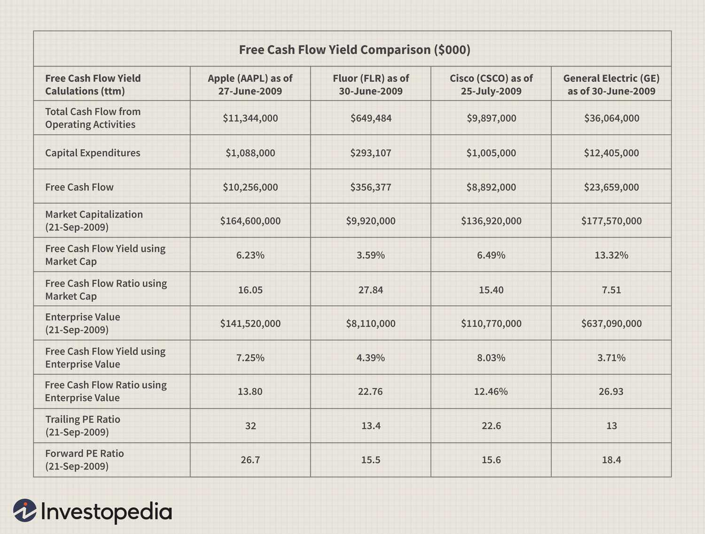

Investment indicators are vital tools in modern trading, offering insights that drive informed decision-making. Among these, free cash flow yield has emerged as a significant metric, providing investors with a measure of a company's ability to generate cash relative to its market value. This is calculated by dividing the free cash flow by the market capitalization, usually expressed as a percentage. Essentially, a higher free cash flow yield indicates a potentially undervalued company, offering investors a glimpse into the firm’s profitability and efficiency in generating cash flow after accounting for capital expenditures.

Fundamental analysis plays a crucial role in assessing investment opportunities by evaluating a company's intrinsic value. This method investigates into financial statements, economic indicators, and market conditions, focusing on metrics like free cash flow yield to gauge a firm's financial health and growth prospects. By understanding these metrics, investors can make more informed decisions, distinguishing between potentially lucrative investments and high-risk ventures.

Algorithmic trading, on the other hand, capitalizes on advanced computational methods to evaluate investment indicators and make trading decisions. By integrating various indicators, including free cash flow yield, algorithmic systems can rapidly process vast amounts of data, identifying patterns and opportunities that may not be immediately apparent through traditional analysis. This automated approach not only enhances the precision of trading strategies but also enables the execution of complex trades at optimal times.

This article will explore several key aspects. It will define free cash flow yield, detailing its calculation and significance against other financial metrics. We will investigate the function of fundamental analysis in scrutinizing a company's fiscal health and how these principles are employed to unveil growth potential. Furthermore, the rising influence of algorithmic trading will be discussed, highlighting how algorithms utilize financial indicators for strategic advantage. Lastly, we will examine the synthesis of these methodologies, providing insights into future trends and the continuous evolution of investment analysis techniques.

## Table of Contents

## What is Free Cash Flow Yield?

Free cash flow yield is a financial metric that evaluates a company's ability to generate cash flow relative to its market value. It is calculated by dividing the free cash flow (FCF) a company produces by its market capitalization. The formula for free cash flow yield is as follows:

$$
\text{Free Cash Flow Yield} = \frac{\text{Free Cash Flow}}{\text{Market Capitalization}}
$$

Free cash flow is derived by subtracting capital expenditures from operating cash flow. This figure represents the cash that a company has available for distribution to investors, reinvestment in the business, or for use in acquiring other businesses.

Free cash flow yield is important for comparing companies because it provides insight into the efficiency with which a company can generate cash flow relative to its market valuation. A higher free cash flow yield indicates that a company is generating substantial cash relative to its market value, which can be a signal of financial strength and efficient operations. This metric offers a more comprehensive view of financial performance compared to traditional profitability measures like net income or earnings per share (EPS), as it considers actual cash generation rather than accounting profits.

Unlike other financial metrics such as earnings yield or dividend yield, free cash flow yield focuses solely on cash flow, providing a clearer picture of a company's [liquidity](/wiki/liquidity-risk-premium) and ability to sustain operations without additional financing. Earnings yield, for instance, is based on net profit which can be influenced by non-cash accounting adjustments like depreciation or the capitalization of certain expenses. Dividend yield, on the other hand, only reflects cash paid to shareholders and doesn't account for cash retained by the company for growth.

To illustrate, consider a hypothetical company, Company XYZ, with an annual free cash flow of $200 million and a market capitalization of $2 billion. The free cash flow yield would be:

$$
\text{Free Cash Flow Yield} = \frac{\$200,000,000}{\$2,000,000,000} = 0.10 \text{ or } 10\%
$$

This indicates that Company XYZ is generating cash at a rate of 10% against its market value, suggesting the potential for strong financial health.

There are several advantages to using free cash flow yield as an investment indicator. First, it helps investors identify companies that are efficient at generating cash, which is critical for funding growth, paying down debt, and returning value to shareholders. Additionally, free cash flow yield can serve as a protective measure during economic downturns, as companies with strong cash flow are better equipped to withstand financial distress. Lastly, it enables investors to compare companies across different industries on a more consistent basis by focusing on cash generation rather than accounting profits that can vary significantly due to industry-specific factors.

## Fundamental Analysis and Its Role in Investment

Fundamental analysis is a method used by investors to evaluate a company's intrinsic value based on its financial statements, management practices, market position, and economic factors. It aims to determine the true worth of a company, thereby helping investors make informed decisions. The core components of [fundamental analysis](/wiki/fundamental-analysis) include the analysis of a company's financial statements, competitive position, industry dynamics, and macroeconomic factors.

A crucial aspect of fundamental analysis is the evaluation of financial metrics such as free cash flow yield. Free cash flow (FCF) represents the cash a company generates after accounting for capital expenditures necessary to maintain or expand its asset base. It is a key indicator of a company's financial health because it provides insight into whether the company can generate enough cash to fund operations, invest in growth, and return value to shareholders through dividends or share buybacks.

Free cash flow yield is calculated by taking the free cash flow per share and dividing it by the market price per share. This metric provides insight into the return on investment (ROI) that an investor can expect relative to the company’s current share price. For instance, if a company has a FCF of $500 million and a market capitalization of $5 billion, the free cash flow yield would be:

$$
\text{Free Cash Flow Yield} = \frac{\text{Free Cash Flow}}{\text{Market Capitalization}} = \frac{500,000,000}{5,000,000,000} = 10\%
$$

The significance of analyzing a company's financial health lies in its ability to reveal the sustainability of operations and potential for growth. Key indicators assessed during this analysis include profitability ratios, liquidity ratios, leverage ratios, and efficiency ratios. Together, these metrics provide a comprehensive picture of a company's operational performance and its ability to fulfill financial obligations.

Several case studies highlight the successful use of fundamental analysis. Warren Buffett's investment strategy, for example, heavily relies on fundamental analysis to identify undervalued stocks. By focusing on companies with strong financial health, positive cash flow, and robust business models, Buffett has been able to generate significant returns for decades.

Despite its benefits, fundamental analysis comes with challenges and limitations. It often requires considerable time and expertise to accurately interpret financial statements and market trends. Additionally, it depends on the availability and reliability of corporate disclosures, which can sometimes be manipulated. Moreover, fundamental analysis might not capture short-term market sentiments, making it less effective during volatile market conditions where stock prices can be influenced by external factors unrelated to company fundamentals.

In conclusion, while fundamental analysis offers a robust framework for assessing a company's economic value and growth potential, investors must consider its limitations and often complement it with other forms of analysis to optimize their investment decisions.

## Algorithmic Trading and Investment Indicators

Algorithmic trading has become an integral part of the financial markets, marked by its growing popularity and increasing influence on trading volumes globally. It involves the use of computer algorithms to automate trading decisions, enabling the execution of trades at a speed and frequency that human traders cannot match. This automation is largely driven by investment indicators, which help algorithmic traders make informed decisions.

Investment indicators, such as moving averages, [volume](/wiki/volume-trading-strategy) trends, and oscillators, are fundamental to [algorithmic trading](/wiki/algorithmic-trading). These indicators provide quantitative data that algorithms can analyze to identify trading opportunities. Free cash flow yield, a key financial metric, is increasingly being integrated into trading algorithms.

Free cash flow yield, calculated as the free cash flow per share divided by the current market price per share, offers valuable insights into a company’s financial health. Incorporating this metric into algorithms allows traders to assess the efficiency with which a company generates cash relative to its market value, aiding in the identification of undervalued stocks.

algorithmic trading presents several benefits for investors. First, it enhances efficiency by allowing for the rapid execution of trades, reducing transaction costs and taking advantage of arbitrage opportunities. Second, algorithms can operate 24/7, enabling continuous market monitoring. Moreover, algorithms remove emotional biases from trading, leading to more consistent decision-making.

Despite these advantages, algorithmic trading is not without risks. One major concern is the potential for increased market [volatility](/wiki/volatility-trading-strategies), as high-frequency trading can exacerbate price fluctuations. The complexity of algorithmic systems also raises the risk of technical failures, which could lead to significant financial losses. Additionally, the reliance on historical data means algorithms might not react swiftly to unprecedented market events.

In conclusion, while algorithmic trading offers substantial benefits in terms of efficiency and consistency, it also poses risks that need careful management. Incorporating indicators like free cash flow yield into trading strategies can enhance decision-making, but traders must remain vigilant about the potential pitfalls in this fast-evolving sector.

## Developing an Algorithmic Trading Strategy with Free Cash Flow Yield

Creating an algorithmic trading strategy involves several critical steps, especially when integrating financial metrics such as Free Cash Flow Yield (FCF Yield). FCF Yield, which measures a company's free cash flow relative to its market capitalization, is an indicator of business efficiency and potential investment value. Its integration into trading algorithms can aid in identifying undervalued stocks with strong cash flows. Below is a structured guide to developing an algorithmic trading strategy using FCF Yield.

### Steps to Create a Basic Algorithm Using Free Cash Flow Yield

1. **Data Collection and Preparation**: 
   - Gather historical financial data, including free cash flow and market capitalization, for the companies in your universe.
   - Calculate the Free Cash Flow Yield using the formula:
$$
     \text{Free Cash Flow Yield} = \frac{\text{Free Cash Flow}}{\text{Market Capitalization}}

$$

   - Ensure data quality by cleaning and normalizing it for consistency.

2. **Indicator Selection**:
   - Select complementary indicators to FCF Yield, such as Price to Earnings (P/E) ratio or Return on Equity (ROE).
   - Consider the macroeconomic environment and sector-specific considerations that might impact FCF Yield.

3. **Algorithm Design**:
   - Develop rules for buying and selling based on FCF Yield thresholds. For example, buy when FCF Yield is above a certain percentage and sell when it falls below.
   - Incorporate other financial indicators to refine entry and exit points.

4. **Backtesting and Optimization**:
   - Use historical data to simulate how your algorithm would have performed.
   - Adjust parameters for FCF Yield thresholds and other indicators based on backtesting results to optimize performance.

5. **Execution and Monitoring**:
   - Deploy your algorithm on a trading platform.
   - Continuously monitor performance and adjust the algorithm as market conditions and company fundamentals change.

### Key Considerations for Selecting Investment Indicators

- **Relevance**: Ensure the indicators align with your investment goals and complement each other.
- **Simplicity**: Start with a simple model and avoid overfitting by using too many indicators.
- **Robustness**: Choose indicators that remain reliable across different market conditions.

### Tools and Platforms for Developing Trading Algorithms

- **Python**: A preferred language for algorithm development due to its extensive libraries such as Pandas, NumPy, and TA-Lib for financial analysis.
- **Broker APIs**: Many brokers offer APIs (e.g., Interactive Brokers, Alpaca) that allow for automated trading.
- **Quartz or TradeStation**: Platforms providing integrated environments for backtesting and live trading.

### Testing and Refining Your Algo Strategy for Optimal Performance

- **Backtesting**: Test your algorithm against historical data to evaluate performance metrics like Sharpe ratio and max drawdown.
- **Paper Trading**: Simulate real-market conditions without risking capital to identify flaws and make improvements.
- **Parameter Tuning**: Continuously refine your algorithm by adjusting parameters and incorporating new data.

### Real-World Examples of Successful Strategies Using Free Cash Flow Yield

- **Value Investing Models**: Use FCF Yield to filter for financially healthy companies trading at a discount, following the principles of value investing.
- **Growth at a Reasonable Price (GARP) Strategy**: Combine FCF Yield with growth metrics to find companies with both strong cash flows and growth potential.

In conclusion, integrating Free Cash Flow Yield into an algorithmic trading strategy involves a meticulous process of data collection, indicator selection, algorithm design, and rigorous testing. By leveraging robust tools and adhering to thoughtful strategies, investors can potentially enhance their trading outcomes.

## Conclusion

Free cash flow yield stands out as a vital metric in investment analysis, providing insights into a company's financial health beyond traditional earnings measures. It allows investors to gauge the actual cash generated relative to the market valuation, thereby offering a more comprehensive view of performance. Unlike earnings, which can be influenced by accounting practices, free cash flow yield presents a clearer picture of a company's ability to generate cash for reinvestment, debt reduction, and shareholder returns. This makes it a powerful tool when deciding where to allocate capital, especially in uncertain financial climates.

Fundamental analysis plays an essential role in comprehensively evaluating investment opportunities. By including free cash flow yield as one of the key indicators, investors can better assess a company’s operational efficiency and financial stability. When combined with other aspects of fundamental analysis, such as balance sheet examination and revenue trends, investors gain a holistic view that aids in making informed decisions. The integration of free cash flow yield into this analysis creates a robust framework that balances in-depth research with practical insights.

Algorithmic trading has become increasingly significant in modern markets, with algorithms designed to process large datasets efficiently to generate trading signals. Investment indicators like free cash flow yield are now being integrated into these algorithms, providing a quantitative basis for decision-making. The synergy between fundamental analysis and algorithmic trading enhances strategy development, ensuring that investment decisions are based on sound data analysis and systematic processes. This hybrid approach is likely to dominate future trends in investment analysis, with advances in [machine learning](/wiki/machine-learning) and data analytics propelling these strategies forward.

Looking ahead, the continuous evolution of technology and data science will inevitably influence investment analysis and algorithmic trading. The growing accessibility to advanced analytical tools and platforms will enable more investors to design and refine their strategies using nuanced indicators like free cash flow yield. As markets become more sophisticated, the blending of traditional analysis with algorithmic precision will present new opportunities and challenges, demanding continuous learning and adaptability.

As these strategies develop, investors who adopt a dynamic mindset—coupling a deep understanding of financial metrics with technological innovation—are likely to achieve better outcomes. Current market dynamics necessitate a willingness to learn and adapt, embracing emerging methodologies while maintaining the foundational principles of investment analysis. By staying informed and open to advancements, investors can position themselves advantageously in an ever-evolving landscape.

## Additional Resources

### Additional Resources

#### Recommended Books and Articles on Fundamental Analysis
1. **"The Intelligent Investor" by Benjamin Graham** - This classic book provides insights into value investing and is considered essential reading for understanding fundamental analysis. Graham's strategies emphasize the importance of thorough financial research.

2. **"Financial Statement Analysis" by Martin Fridson and Fernando Alvarez** - This book offers a deep dive into interpreting financial information, essential for investors interested in evaluating a company's financial health.

3. **"Security Analysis" by Benjamin Graham and David L. Dodd** - Another seminal work by Graham, co-authored with Dodd, which lays the foundation for evaluating securities based on their fundamental value.

4. **Articles from the Journal of Finance** - The Journal often publishes research papers exploring various aspects of fundamental analysis which are useful for staying abreast of academic developments.

#### Online Courses for Learning Algorithmic Trading
1. **Coursera - "Machine Learning for Trading"** - Offered by Georgia Tech, this course provides students with a comprehensive understanding of how machine learning can be applied to trading strategies.

2. **Udacity - "AI for Trading"** - This is an advanced course that requires some prior knowledge and focuses on predictive modeling and reinforcement learning in trading.

3. **edX - "Algorithmic Trading and Finance Models with Python, R, and Stata"** - Offers hands-on experience with programming in multiple languages for developing trading strategies.

#### Websites and Tools for Tracking Free Cash Flow Yield
1. **Yahoo Finance** - Provides comprehensive financial data on publicly traded companies, including free cash flow metrics in a user-friendly format.

2. **GuruFocus** - Offers detailed financial data and analysis tools, helping investors evaluate companies based on metrics like free cash flow yield.

3. **Morningstar** - An investment research platform providing data on stock performance and financial health indicators.

#### Communities and Forums for Traders to Share Strategies
1. **r/algotrading on Reddit** - A popular subreddit where users discuss algorithmic trading strategies, share insights, and provide feedback.

2. **QuantConnect Community Forum** - Primarily for users of the QuantConnect platform, this forum is a resource for sharing strategies and coding advice.

3. **Elite Trader** - A forum that covers a wide range of trading topics including algorithmic trading strategies and fundamentals.

#### Further Reading Suggestions for Those Interested in Deepening Their Knowledge
1. **"Quantitative Trading: How to Build Your Own Algorithmic Trading Business" by Ernie Chan** - As a practical guide for developing and deploying trading algorithms, this book offers valuable insights into creating and running your own trading systems.

2. **"Algorithmic and High-Frequency Trading" by Álvaro Cartea, Sebastian Jaimungal, and José Penalva** - For readers interested in the complexities of high-frequency trading, this book provides an academic yet accessible approach to the subject.

3. **Research Papers on arXiv.org** - A repository of open-access research papers, many covering the latest developments in algorithmic trading and financial analysis.

4. **"Python for Finance: Analyze Big Financial Data" by Yves Hilpisch** - Helps readers learn how to apply Python programming in the finance industry, focusing on data analysis and algorithmic trading strategies.

## References & Further Reading

[1]: ["The Intelligent Investor" by Benjamin Graham](https://www.amazon.com/Intelligent-Investor-Definitive-Investing-Essentials/dp/0060555661)

[2]: ["Financial Statement Analysis" by Martin Fridson and Fernando Alvarez](https://onlinelibrary.wiley.com/doi/book/10.1002/9781119457176)

[3]: ["Security Analysis" by Benjamin Graham and David L. Dodd](https://www.amazon.com/Security-Analysis-Seventh-Principles-Techniques/dp/1264932405)

[4]: ["Quantitative Trading: How to Build Your Own Algorithmic Trading Business"](https://www.amazon.com/Quantitative-Trading-Build-Algorithmic-Business/dp/1119800064) by Ernest P. Chan

[5]: ["Machine Learning for Trading" Coursera Course](https://www.coursera.org/specializations/machine-learning-trading)

[6]: ["AI for Trading" Udacity Nanodegree Program](https://www.udacity.com/course/ai-for-trading--nd880)

[7]: ["Algorithmic Trading and Finance Models with Python, R, and Stata" edX Course](https://www.linkedin.com/learning/algorithmic-trading-and-finance-models-with-python-r-and-stata-essential-training)

[8]: ["Quantitative Value: A Practitioner's Guide to Automating Intelligent Investment and Eliminating Behavioral Errors"](https://www.amazon.com/Quantitative-Value-Web-Site-Practitioners/dp/1118328078) by Wesley R. Gray and Tobias E. Carlisle