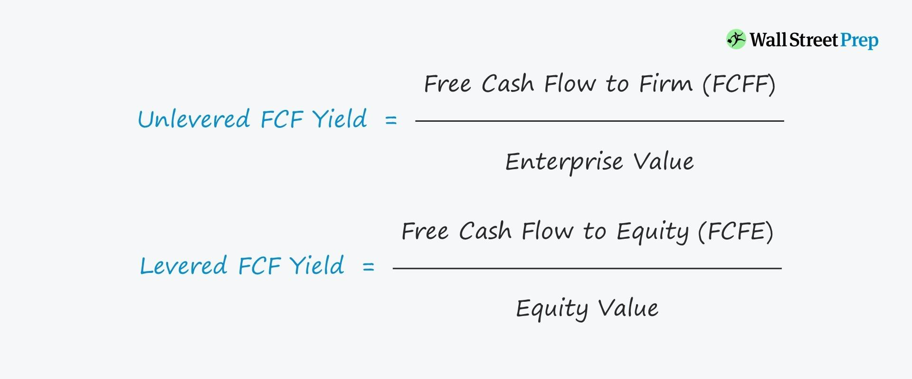

## Table of Contents

## What is Free Cash Flow Yield?

Free Cash Flow Yield is a financial measure that shows how much cash a company generates relative to its market value. It is calculated by dividing the company's free cash flow by its market capitalization. Free cash flow is the money left over after a company pays for its operating expenses and capital expenditures. Market capitalization is the total value of a company's outstanding shares. This ratio helps investors see if a company is generating enough cash to cover its costs and potentially return money to shareholders.

This measure is useful for investors because it can indicate whether a stock is undervalued or overvalued. If a company has a high free cash flow yield, it might mean the stock is undervalued because the company is generating a lot of cash compared to its market value. On the other hand, a low free cash flow yield might suggest that the stock is overvalued. Investors often use this metric along with other financial ratios to make better investment decisions.

## Why is Free Cash Flow Yield important for investors?

Free Cash Flow Yield is important for investors because it tells them how much cash a company is making compared to its total value. This helps investors figure out if a company is a good buy. If a company has a high Free Cash Flow Yield, it means the company is making a lot of cash compared to what it's worth on the market. This could mean the stock is a good deal because the company has plenty of cash to pay for things like growing the business or giving money back to shareholders.

On the other hand, if a company has a low Free Cash Flow Yield, it might mean the stock is too expensive. The company isn't making enough cash compared to its market value, which could be a warning sign for investors. By looking at Free Cash Flow Yield, investors can get a clearer picture of a company's financial health and decide if it's a smart investment. This measure is just one piece of the puzzle, but it's a helpful one for making informed decisions.

## How do you calculate Free Cash Flow Yield?

To calculate Free Cash Flow Yield, you need to know two things: the company's free cash flow and its market capitalization. Free cash flow is the money a company has left after it pays for running the business and buying things it needs to keep going. Market capitalization is how much the company is worth on the stock market, which you find by multiplying the number of its shares by the price of one share. Once you have these numbers, you divide the free cash flow by the market capitalization. The result is the Free Cash Flow Yield, which shows how much cash the company is making compared to its total value.

This number is important because it helps investors see if a company's stock is a good deal. If the Free Cash Flow Yield is high, it means the company is making a lot of cash compared to what it's worth, which could mean the stock is undervalued. A low Free Cash Flow Yield might mean the stock is overvalued because the company isn't making enough cash compared to its market value. By looking at this number, investors can make better choices about whether to buy or sell a stock.

## What are the components needed to calculate Free Cash Flow Yield?

To calculate Free Cash Flow Yield, you need to know a company's free cash flow and its market capitalization. Free cash flow is the money left over after the company pays for its daily operations and the things it needs to keep running, like new equipment or buildings. Market capitalization is how much the company is worth on the stock market. You find this by multiplying the number of shares the company has by the price of one share.

Once you have these two numbers, you can calculate the Free Cash Flow Yield by dividing the free cash flow by the market capitalization. This gives you a percentage that shows how much cash the company is making compared to its total value. A high Free Cash Flow Yield means the company is making a lot of cash compared to what it's worth, which could mean the stock is a good deal. A low Free Cash Flow Yield might mean the stock is too expensive because the company isn't making enough cash compared to its market value.

## Can you explain the difference between Free Cash Flow and Free Cash Flow Yield?

Free Cash Flow is the money a company has left over after it pays for all its bills and the things it needs to keep the business going. It's like the extra cash a company has in its pocket after taking care of everything it needs to do. This money can be used for things like growing the business, paying off debts, or giving money back to people who own shares in the company.

Free Cash Flow Yield, on the other hand, is a way to see how much of that extra cash a company makes compared to how much the company is worth on the stock market. You find it by dividing the Free Cash Flow by the company's total value, which is called market capitalization. A high Free Cash Flow Yield means the company is making a lot of extra cash compared to what it's worth, which can be a good sign for people thinking about buying the company's stock. A low Free Cash Flow Yield might mean the stock is too expensive because the company isn't making enough extra cash compared to its market value.

## How does Free Cash Flow Yield compare to other valuation metrics like P/E ratio?

Free Cash Flow Yield and the Price-to-Earnings (P/E) ratio are both used by investors to figure out if a company's stock is a good buy, but they look at different things. Free Cash Flow Yield tells you how much cash a company makes compared to how much it's worth on the stock market. It's like checking if the company has a lot of extra money after paying all its bills. If the Free Cash Flow Yield is high, it could mean the stock is a good deal because the company has a lot of cash compared to its value. On the other hand, the P/E ratio looks at how much you pay for each dollar of the company's earnings. A low P/E ratio might mean the stock is cheap compared to how much money the company makes.

Both metrics are helpful, but they give different information. Free Cash Flow Yield focuses on the cash the company has left over, which is important because cash can be used for things like growing the business or giving money back to shareholders. The P/E ratio, however, focuses on the company's earnings, which is the profit it makes. Investors often use both metrics together to get a fuller picture of a company's value. By looking at both the cash flow and the earnings, investors can make better decisions about whether a stock is a good investment.

## What is considered a good Free Cash Flow Yield?

A good Free Cash Flow Yield depends on the industry and the overall market conditions, but generally, a higher yield is considered better. If a company has a Free Cash Flow Yield of around 8% or higher, it might be seen as a good deal because it means the company is making a lot of extra cash compared to its value on the stock market. This high yield can suggest that the stock is undervalued, which could be attractive to investors looking for a bargain.

However, what's considered "good" can vary a lot. In some industries, a Free Cash Flow Yield of 5% might be seen as good, while in others, investors might look for yields over 10%. It's also important to compare the yield to other companies in the same industry and to look at other financial measures too. A high Free Cash Flow Yield alone doesn't mean a stock is a great investment; it's just one piece of the puzzle that investors use to make decisions.

## How can Free Cash Flow Yield be used to assess a company's financial health?

Free Cash Flow Yield helps investors see if a company is doing well with its money. It tells you how much extra cash a company makes compared to how much it's worth on the stock market. If a company has a high Free Cash Flow Yield, it means it's making a lot of extra cash. This is a good sign because it shows the company can pay its bills, grow the business, or give money back to people who own its shares. A high yield might mean the stock is a good deal because the company is doing well with its money.

On the other hand, a low Free Cash Flow Yield might mean the company isn't making enough extra cash compared to its value. This could be a warning sign that the company might have trouble paying its bills or growing. Investors use Free Cash Flow Yield along with other numbers to get a full picture of a company's money health. By looking at this yield, investors can decide if a company is a smart choice for their money.

## What are the limitations of using Free Cash Flow Yield as an investment metric?

Using Free Cash Flow Yield as an investment metric has some limitations. One big problem is that it only looks at how much cash a company has left over after paying its bills. It doesn't tell you about other important things like how much debt the company has or if it's making money in other ways. Also, Free Cash Flow Yield can change a lot from year to year, so it might not give a good picture of how the company will do in the future.

Another limitation is that what counts as a "good" Free Cash Flow Yield can be different depending on the industry. A high yield in one industry might be normal in another, so it's hard to compare companies from different sectors. Plus, Free Cash Flow Yield doesn't tell the whole story by itself. Investors need to look at other numbers and information too, like the company's growth plans or how it's doing compared to other companies in the same industry. So while Free Cash Flow Yield can be helpful, it's not enough on its own to decide if a company is a good investment.

## How does Free Cash Flow Yield vary across different industries?

Free Cash Flow Yield can be very different from one industry to another. Some industries, like technology or software companies, might have high Free Cash Flow Yields because they don't need to spend as much money on things like factories or heavy equipment. These companies can make a lot of extra cash compared to their market value, which means their Free Cash Flow Yield is high. On the other hand, industries like manufacturing or energy might have lower Free Cash Flow Yields. These businesses need to spend a lot of money on big machines and buildings, so they don't have as much extra cash left over after paying their bills.

Because Free Cash Flow Yield can vary so much across industries, it's important for investors to compare companies within the same sector. A high Free Cash Flow Yield in the tech industry might be normal, but the same yield in the energy sector could be seen as very good. Investors need to understand these differences to make smart choices about where to put their money. By looking at Free Cash Flow Yield along with other financial measures, investors can get a better idea of a company's value and health, no matter what industry it's in.

## What are some common pitfalls when analyzing Free Cash Flow Yield?

One common pitfall when analyzing Free Cash Flow Yield is relying on it too much. Free Cash Flow Yield is just one number that tells you how much extra cash a company has compared to its value. It doesn't tell you everything about a company's health. For example, it doesn't show how much debt the company has or if it's making money in other ways. If you only look at Free Cash Flow Yield, you might think a company is doing well when it's actually struggling with other problems.

Another pitfall is not understanding how Free Cash Flow Yield can change from year to year. A company might have a high yield one year but a low one the next because of changes in its business or the economy. This can make it hard to predict how the company will do in the future. Also, what's considered a good Free Cash Flow Yield can be different in different industries. A high yield in one industry might be normal in another, so comparing companies from different sectors can be tricky. It's important to look at other financial measures and understand the industry to get a full picture of a company's value.

## How can Free Cash Flow Yield be integrated into a broader investment strategy?

Free Cash Flow Yield can be a helpful tool when you're figuring out where to put your money. It tells you how much extra cash a company makes compared to what it's worth on the stock market. If you see a company with a high Free Cash Flow Yield, it might mean the stock is a good deal because the company has a lot of cash left over after paying its bills. But, you shouldn't just look at this number alone. It's smart to use Free Cash Flow Yield along with other things like the company's debt, how fast it's growing, and what's going on in its industry. By looking at all these pieces together, you can get a better idea of whether a company is a good investment.

When you're building your investment plan, Free Cash Flow Yield can help you find companies that are doing well with their money. But remember, this number can change a lot from year to year, so it's not a perfect way to predict the future. That's why it's important to look at other numbers too, like the company's earnings, how much it's worth compared to other companies in its industry, and what the overall market is doing. By mixing Free Cash Flow Yield with these other measures, you can make smarter choices about where to invest your money and build a strong investment strategy.

## What is Understanding Free Cash Flow Yield?

Free Cash Flow Yield (FCF Yield) is a financial metric that provides insight into a company's financial health by expressing the relationship between its free cash flow and its market value. It is calculated using the formula:

$$
\text{Free Cash Flow Yield} = \frac{\text{Free Cash Flow per Share}}{\text{Market Price per Share}}
$$

Free cash flow (FCF) represents the cash a company generates after accounting for capital expenditures necessary to maintain or expand its asset base. It is a crucial measure of financial health because it highlights the cash available for the company to return to shareholders, pay down debt, or reinvest in business activities. FCF is calculated as:

$$
\text{Free Cash Flow} = \text{Operating Cash Flow} - \text{Capital Expenditures}
$$

The significance of free cash flow as a metric lies in its ability to provide a more accurate picture of a company's financial flexibility compared to traditional earnings metrics. Earnings can often be influenced by non-cash items like depreciation or subject to accounting adjustments, whereas free cash flow presents a clear picture of actual cash earnings.

Investors often prioritize FCF Yield over other valuation metrics like price-to-earnings or price-to-book ratios because it offers a direct insight into the cash returns they might expect relative to their investment. The FCF Yield can reveal undervalued companies that generate significant cash flow but may not be well-appreciated by the market yet, thus highlighting potentially lucrative investment opportunities.

Investment decisions are increasingly being influenced by free cash flow yield particularly in sectors with substantial capital expenditures, such as utilities or telecommunications. For example, a company with a high free cash flow yield compared to its peers might be more attractive to investors looking for stability and potential for dividend growth. Conversely, if a company has a low or negative free cash flow yield, it might suggest financial struggles or significant reinvestment needs that could deter investment.

Through these perspectives, free cash flow yield assists investors in making informed decisions by providing a clearer picture of a company's financial performance and potential for generating shareholder value.

## References & Further Reading

[1]: Damodaran, A. (2012). [Investment Valuation: Tools and Techniques for Determining the Value of Any Asset.](https://books.google.com/books/about/Investment_Valuation.html?id=5SRHAAAAQBAJ) Wiley Finance.

[2]: Bodie, Z., Kane, A., & Marcus, A. J. (2017). [Investments.](https://www.mheducation.com/highered/product/Investments-Bodie.html) McGraw-Hill Education.

[3]: Koller, T., Goedhart, M., & Wessels, D. (2015). [Valuation: Measuring and Managing the Value of Companies.](https://books.google.com/books/about/Valuation.html?id=fGXjDwAAQBAJ) Wiley Finance.

[4]: Graham, B., & Dodd, D. (2008). [Security Analysis: Principles and Techniques.](https://www.amazon.com/Security-Analysis-Seventh-Principles-Techniques/dp/1264932405) McGraw-Hill Education.

[5]: Engel, T., Brodersen, M., & Vogel, C. (2021). [Algorithmic Trading and Quantitative Strategies.](https://www.researchgate.net/publication/378548435_Algorithmic_Trading_and_AI_A_Review_of_Strategies_and_Market_Impact) Springer Finance.