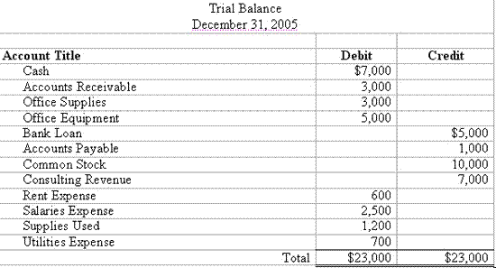

## Table of Contents

## What is a free credit balance in a financial account?

A free credit balance in a financial account is the amount of money that you have available to use or withdraw at any time. It's like the money sitting in your account that you haven't spent or invested yet. This balance is important because it shows how much cash you have on hand, which you can use for any purpose, such as paying bills, making purchases, or investing.

For example, if you have $1,000 in your bank account and you haven't used any of it, your free credit balance is $1,000. This is different from money that might be tied up in investments or pending transactions. Keeping track of your free credit balance helps you manage your finances better, ensuring you know exactly how much money you can access whenever you need it.

## How does a free credit balance differ from other types of balances in an account?

A free credit balance is the money in your account that you can use right away. It's like the cash you have in your pocket that you can spend on anything you want. This balance is different from other types of balances because it's not tied up in investments or waiting for transactions to finish. For example, if you have $500 in your account and you haven't spent it or invested it, that $500 is your free credit balance.

Other types of balances in an account can include money that's already committed to something else. For instance, if you've bought stocks with some of your money, that amount is not part of your free credit balance because it's invested. There might also be a pending balance, which is money that's on its way to or from your account but isn't available yet. Understanding the difference helps you know exactly how much money you can use at any moment.

## What are the common sources of a free credit balance?

A free credit balance comes from money that you put into your account and haven't used yet. This can be from your paycheck that you deposit into your bank account. When you get paid, the money goes into your account and becomes part of your free credit balance until you spend it or invest it. Another common source is money that someone else sends you, like a gift or a payment for a service you provided. These funds also add to your free credit balance.

Sometimes, a free credit balance can come from refunds or returns. If you buy something and then return it, the money you get back goes into your account as part of your free credit balance. Interest from savings accounts can also add to it. If your bank pays you interest on the money you keep in your savings account, that interest becomes part of your free credit balance. Keeping track of these sources helps you understand where your available money is coming from.

## How can one identify a free credit balance in their financial statements?

To find your free credit balance in your financial statements, look at the part of the statement that shows how much money you have in your account right now. This is usually labeled as "available balance" or "current balance." This number tells you how much money you can use right away, without any restrictions. It's the money that hasn't been spent or invested yet, so it's your free credit balance.

Sometimes, financial statements might show other balances too, like money that's waiting to be used for something specific or money that's already been spent but hasn't left your account yet. These other balances are not part of your free credit balance. For example, if you see a "pending balance" or "invested balance," those amounts are not available for you to spend freely. By focusing on the "available balance" or "current balance," you can easily see how much money you can use at any time.

## What are the benefits of maintaining a free credit balance?

Keeping a free credit balance in your account has many good points. It's like having cash in your pocket that you can use whenever you need it. This money can help you pay for things right away, like bills or groceries, without having to wait for money to come in or take money out of investments. It's also great for emergencies. If something unexpected happens, like your car breaking down, you can use your free credit balance to fix it without worrying about where the money will come from.

Another benefit is that it helps you manage your money better. When you know how much free money you have, you can plan your spending and saving more easily. It's easier to stick to a budget and avoid spending money you don't have. Plus, if your account pays interest, keeping a free credit balance can help you earn a little extra money over time. This way, your money can work for you while still being available when you need it.

## Are there any risks associated with having a free credit balance?

Having a free credit balance in your account is usually a good thing, but there can be some risks too. One risk is that the money might not be [earning](/wiki/earning-announcement) as much interest as it could if it were invested. If you keep a lot of money sitting in your account without using it, you might miss out on earning more money from investments like stocks or bonds.

Another risk is that if your account isn't protected well, someone might steal your money. This can happen through things like hacking or fraud. It's important to keep your account safe with strong passwords and to watch out for any strange activity. Keeping a free credit balance is helpful, but it's good to be aware of these risks and take steps to protect your money.

## How is a free credit balance treated for tax purposes?

A free credit balance in your account is usually not taxed directly. This is because it's just the money you have available to use, like cash in your pocket. When you earn money, like from your job or selling something, that's what you pay taxes on. The free credit balance is what's left after you've paid taxes on your earnings. So, having money in your account doesn't mean you have to pay more taxes just because it's there.

However, if you earn interest on your free credit balance, that interest might be taxable. For example, if your bank pays you interest for keeping money in your savings account, you'll need to report that interest as income on your tax return. The free credit balance itself isn't taxed, but any money you earn from it, like interest, could be. It's a good idea to keep track of any interest you earn so you can report it correctly when you file your taxes.

## What are the best practices for managing a free credit balance?

Managing a free credit balance well means keeping an eye on how much money you have that you can use right away. It's important to know your free credit balance so you can plan your spending and saving. Make sure to check your account often to see how much money you have available. This helps you avoid spending more than you can afford and sticking to your budget. Also, think about setting up alerts or notifications from your bank to let you know when your balance goes above or below certain amounts. This way, you can make sure you always have enough money for what you need.

Another good practice is to use your free credit balance wisely. If you have extra money, think about putting some of it into savings or investments. This can help your money grow over time. But, always keep enough in your free credit balance for emergencies or unexpected expenses. It's also a good idea to protect your account by using strong passwords and watching out for any unusual activity. By managing your free credit balance carefully, you can make sure you have money when you need it and also make the most of what you have.

## How does a free credit balance affect liquidity and cash flow management?

A free credit balance is like having cash in your pocket that you can use anytime. It's really important for [liquidity](/wiki/liquidity-risk-premium), which means having enough money to pay for things when you need to. When you have a good free credit balance, you can easily cover your bills, buy things you need, or deal with unexpected costs without having to wait for money to come in or sell investments. This makes your life easier because you don't have to worry about running out of money at the wrong time.

Managing cash flow, which is about keeping track of money coming in and going out, also gets better with a healthy free credit balance. If you know you have money available, you can plan your spending and saving better. You can pay your bills on time, avoid late fees, and maybe even put some money into savings or investments. But, it's also smart to keep an eye on your free credit balance and not let it get too low, so you always have enough cash for what you need.

## Can a free credit balance be used as collateral for loans or other financial instruments?

A free credit balance can sometimes be used as collateral for loans or other financial instruments. Collateral is something valuable that you promise to give to the lender if you can't pay back the loan. Since a free credit balance is like cash you can use anytime, some lenders might accept it as collateral. This is because they know they can take the money if you don't pay them back.

However, not all lenders will accept a free credit balance as collateral. It depends on the lender's rules and the type of loan or financial instrument you're looking at. Some might prefer more traditional forms of collateral, like a house or a car. But if a lender does accept your free credit balance, it can be a quick and easy way to get a loan without having to use other assets.

## What are the regulatory requirements concerning free credit balances?

There are rules that banks and financial companies have to follow about free credit balances. These rules are there to protect your money and make sure it's handled the right way. For example, the Federal Reserve in the United States has rules that say banks need to tell you about any interest they're paying on your free credit balance. They also have to keep your money safe and make sure it's available when you need it.

Different countries might have their own rules about free credit balances. In the European Union, there are laws like the Payment Services Directive that say banks have to give you clear information about your account, including your free credit balance. These rules help make sure that no matter where you are, your money is protected and you know what's going on with your account.

## How do financial institutions utilize free credit balances, and what are the implications for account holders?

Financial institutions often use free credit balances to make money for themselves. They might lend out the money to other customers or invest it in different ways. This is called "sweeping" the funds into accounts where they can earn interest or be used for other financial activities. By doing this, banks can make a profit from the money that's just sitting in your account. They might pay you a little bit of interest, but usually, they keep most of the profit for themselves.

For account holders, this means that their money might not be earning as much interest as it could if they put it into other investments. On the positive side, having a free credit balance means you can easily access your money when you need it, which is good for paying bills or handling emergencies. However, if you're not careful, you might miss out on earning more money because your cash is just sitting in your account. It's important to keep an eye on your free credit balance and think about how you can use it to your advantage, maybe by putting some of it into savings or investments.

## What are Investment Accounts and Free Credit Balances?

Investment accounts, particularly margin accounts, are intricately linked to free credit balances—a critical component for traders aiming to optimize their buying power and meet margin requirements. To fully grasp this relationship, it's essential to understand the fundamental mechanics of margin accounts and how trade activities influence free credit balances.

### Margin Accounts and Buying Power

A margin account allows investors to borrow funds from a broker to purchase securities, which amplifies their buying power. The free credit balance in these accounts directly impacts the amount of capital available for investing or trading. Buying power can be defined as:

$$
\text{Buying Power} = \text{Free Credit Balance} + \text{Available Margin}
$$

Here, the free credit balance represents the excess cash or settled funds that an investor can withdraw or use for additional trading. By effectively managing this balance, traders can ensure they maximize their potential returns while minimizing risks associated with margin calls.

### Influence of Trade Activities

Trade activities such as buying or selling securities affect free credit balances in several ways:

1. **Purchase of Securities**: When an investor buys securities, the purchase amount decreases the free credit balance until the trade settles. Should the purchase exceed the current free credit balance, the investor leverages the margin facility provided by the broker, subject to interest charges.

2. **Sale of Securities**: Selling securities generates proceeds that credit the investor's account, increasing the free credit balance available for future trades or withdrawal.

3. **Pending Settlements**: Trades awaiting settlement temporarily adjust the free credit balance until the transaction is completed. This period, known as the settlement period, typically spans two business days (T+2) in U.S. markets.

By tracking these transactions and understanding their timing, investors can efficiently manage their free credit balances to prevent unexpected shortfalls or margin calls.

### Best Practices for Managing Free Credit Balances

Effective management of free credit balances is pivotal for both short-term trades and long-term investment strategies. Here are some best practices:

- **Regular Monitoring**: Investors should frequently review their account statements and transaction details to remain aware of their free credit balances and any pending settlements.

- **Understanding Settlements**: Familiarity with settlement dates for trades is crucial to anticipate changes in buying power accurately.

- **Strategic Use of Cash**: Deciding when to utilize free credit balances for new trades or when to retain them for potential opportunities can help maximize returns while ensuring financial safety.

- **Leveraging Broker Tools**: Many brokers offer tools or alerts to help investors monitor their cash positions and margin requirements, enabling proactive financial management.

In conclusion, free credit balances play a vital role in shaping an investor's strategy by influencing buying power and margin requirements. By effectively understanding and managing these balances, investors can not only enhance their trading strategies but also safeguard against potential financial pitfalls.

## What are the financial considerations in algorithmic trading?

Algorithmic trading, often termed automated trading, employs computer algorithms to execute orders in the financial markets at high speed and frequency. These algorithms can dramatically influence free credit balances, which represent the cash that remains in a trader's account after factoring in margin requirements, pending settlements, and other financial liabilities.

### Optimization of Algorithmic Strategies

Optimizing algorithmic strategies requires a deep understanding of how free credit balances can be utilized efficiently. By monitoring these balances, traders can adjust their algorithms to maximize their buying power without overstretching available resources. For instance, maintaining a higher free credit balance enhances a trader’s flexibility to seize market opportunities, as it directly influences buying power (BP):

$$
BP = (Equity \times Leverage) - Margin
$$

Where:
- Equity represents the cash and stock owned outright in the account.
- Leverage multiplies the buying power based on the broker's terms.
- Margin is the amount required to be maintained in the account for open positions.

### Financial Regulations and Algorithmic Trades

Financial regulations, which govern [algorithmic trading](/wiki/algorithmic-trading), ensure that the practices are fair and transparent. The U.S. Securities and Exchange Commission (SEC) and the Financial Industry Regulatory Authority (FINRA) impose strict guidelines on algorithmic trading activities. These regulations require traders to maintain sufficient collateral in their accounts to cover potential losses, affecting how free credit balances are managed.

Moreover, algorithms must be designed to comply with requirements such as circuit breakers, which temporarily halt trading on an exchange to prevent market crashes. These factors necessitate careful planning and management of credit balances to meet regulatory demands without reducing trading efficacy.

### Integration in Trading Environments

Case studies exemplify the successful integration of algorithmic strategies by focusing on free credit balances. A notable example involves a trading firm that used advanced data analytics to track intraday fluctuations of credit balances, leading to adjustments in their high-frequency trading algorithms. By aligning algorithmic actions with real-time monitoring, the firm minimized risk and optimized liquidity usage, resulting in significant cost savings and enhanced trading performance.

Additionally, algorithmic platforms often employ [machine learning](/wiki/machine-learning) models that predict market movements and adjust trading strategies accordingly. By leveraging historical and live data on credit balances, these systems can dynamically allocate funds, maintaining optimal balance levels that accommodate anticipated trade volumes and market conditions.

In conclusion, the role of free credit balances in algorithmic trading cannot be overstated. They are integral to optimizing strategies, ensuring regulatory compliance, and maximizing trading efficiency. As technology and financial markets continue to evolve, the dynamic relationship between algorithmic trading and credit balances will further define the landscape of modern investing.

## References & Further Reading

[1]: ["Understanding Mark-to-Market and Free Credit Balances"](https://www.investopedia.com/terms/m/marktomarket.asp) by the U.S. Securities and Exchange Commission (SEC).

[2]: ["The Role of Margin in Investment Strategies"](https://tickeron.com/trading-investing-101/what-margin/) by the Financial Industry Regulatory Authority (FINRA).

[3]: ["Regulation of Broker-Dealer Practices"](https://www.pli.edu/catalog/publications/treatise/broker-dealer-regulation) by the U.S. SEC and FINRA.

[4]: Stromberg, Joseph. ["Algorithmic Trading in Practice"](https://academic.oup.com/edited-volume/41262/chapter/350850196) via ResearchGate, 2018.

[5]: ["Advances in Financial Machine Learning"](https://www.amazon.com/Advances-Financial-Machine-Learning-Marcos/dp/1119482089) by Marcos Lopez de Prado.

[6]: Capponi, Agostino, and Böhm, Peter. ["Systemic Risk and Macroprudential Regulations: The Cross-Section Contract Design"](https://papers.ssrn.com/sol3/papers.cfm?abstract_id=2805773) in The Review of Financial Studies, 2017.