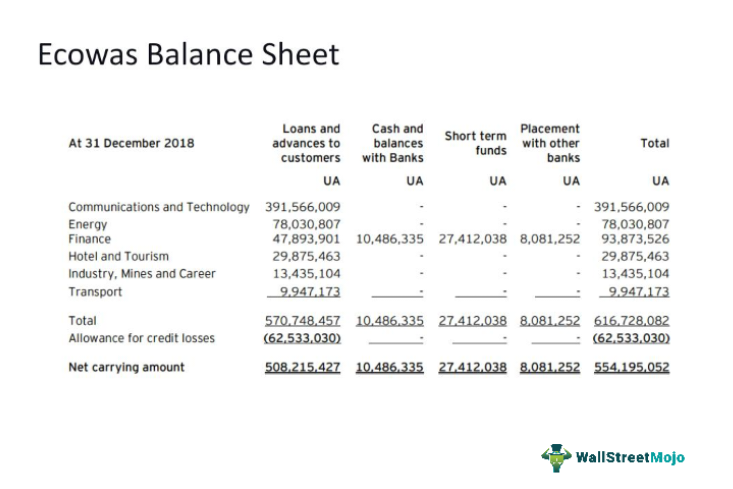

In today's dynamic financial landscape, understanding various investment tools and their regulation is crucial for both new and seasoned investors. As markets continue to evolve, having a firm grasp of how different instruments function and are governed provides a critical edge in decision-making processes.

This article focuses on free credit balances, a fundamental component in investment accounts. Essentially, a free credit balance represents the cash portion of an investor's margin account that is available for withdrawal at any time. This balance remains after accounting for any margin requirements, outstanding purchases, and proceeds from short sales. By retaining a free credit balance, investors can enhance their market agility and capitalize on immediate investment opportunities.

Financial regulations play a significant role in managing these balances, ensuring the protection of customer assets and maintaining market stability. Regulatory bodies like the U.S. Securities and Exchange Commission (SEC) enforce strict guidelines for broker-dealers, requiring meticulous calculation and regular reporting of free credit balances. For investors, these regulations offer transparency and security, instilling confidence in their financial transactions.

The impact of free credit balances extends to algorithmic trading—an area increasingly dominated by sophisticated computational strategies. An understanding of how free credit balances influence trade executions can greatly optimize these algorithms, offering potential advantages in speed and efficiency.

In summary, knowledge of free credit balances not only enhances individual investment strategies but also informs broader market interactions. By exploring these elements, we aim to provide insights that empower investors in navigating the complexities of contemporary financial markets.

## Table of Contents

## Understanding Free Credit Balance

Free credit balance refers to the amount of cash in a customer's margin account with a broker-dealer that is readily available for withdrawal. This balance arises from various transactions and accounting entries within the margin account. Principally, the free credit balance is determined by the excess cash present in the account after meeting all outstanding obligations such as margin requirements, short sale proceeds, dividends received, and pending settlements for purchases.

To understand how free credit balances are calculated, it's essential to consider the individual components involved:

1. **Margin Requirements**: When securities are purchased on margin, the investor is required to maintain a minimum equity level – a margin requirement. The free credit balance is, therefore, the cash left in the account after ensuring these requirements are met.

2. **Short Sale Proceeds**: In the case of short selling, investors sell securities they do not own, with the proceeds temporarily credited to their margin account. These proceeds contribute to the free credit balance until the short position is closed.

3. **Dividends Received**: Dividends that accrue to an investor from securities held within the margin account are also added to the free credit balance. These dividends are deposited as cash into the account, thus increasing the balance available for withdrawal or further investment.

4. **Pending Purchases**: When securities are purchased, the cash required for these transactions is earmarked but not immediately deducted until settlement occurs. Only after these settlements is the free credit balance adjusted to reflect actual available cash.

Some brokers offer interest on free credit balances. The opportunity to earn interest makes these balances more valuable for investors, as they not only provide [liquidity](/wiki/liquidity-risk-premium) but also the potential to generate returns. This consideration can be an influential [factor](/wiki/factor-investing) when deciding on a brokerage service.

Factors that may influence the free credit balance include trade activity, market conditions, and specific broker-dealer policies. A high [volume](/wiki/volume-trading-strategy) of trading can frequently alter the free credit balance as settlement periods play out and margin requirements adjust. Market [volatility](/wiki/volatility-trading-strategies) might also affect short positions and margin requirements, thus changing the balance. Lastly, each brokerage firm may have distinct procedures or terms related to calculation and treatment of free credit balances, impacting how they are managed and reported.

## Regulatory Framework for Free Credit Balances

Free credit balances are critical components of financial markets due to their implications for both investor security and market integrity. To ensure these balances are adequately protected and transparently managed, regulatory frameworks impose stringent guidelines and requirements on broker-dealers. These regulations aim to prevent the misuse of client funds and enhance trust in financial systems.

The U.S. Securities and Exchange Commission (SEC) plays a pivotal role in overseeing the handling of free credit balances. It mandates brokers to perform regular, typically weekly, computations to ascertain the accuracy of client free credit balances. This involves reconciling the actual funds held by the broker with the recorded free credit balances in their clients' accounts. The objective is to detect and rectify any discrepancies promptly, thereby ensuring that customer funds remain secure and intact.

Additionally, the Financial Industry Regulatory Authority (FINRA) supplements SEC's oversight by enforcing further transparency and accountability measures. Under FINRA regulations, broker-dealers must furnish their clients with quarterly statements detailing account activities and free credit balance status. Moreover, they are obligated to report monthly holdings, providing comprehensive visibility into the management of such balances. These statements and reports serve to maintain robust communication between the broker and the client, mitigating risks of miscommunication or errors that might lead to financial disputes or loss.

Protecting investor interests is at the core of these regulatory frameworks. By implementing rigorous checks and balances, the authorities aim to prevent brokers from utilizing client funds for their operational needs or speculative investments without explicit client consent. This is crucial in maintaining financial market stability and investor confidence.

In summary, the regulatory framework governing free credit balances is designed to fortify investor protection through diligent oversight by the SEC and FINRA. Regular calculations, quarterly statements, and monthly holdings reports are vital components of this framework, ensuring that brokers adhere to high standards of financial integrity and transparency.

## Investment Accounts and Free Credit Balances

Investment accounts, particularly margin accounts, are intricately linked to free credit balances—a critical component for traders aiming to optimize their buying power and meet margin requirements. To fully grasp this relationship, it's essential to understand the fundamental mechanics of margin accounts and how trade activities influence free credit balances.

### Margin Accounts and Buying Power

A margin account allows investors to borrow funds from a broker to purchase securities, which amplifies their buying power. The free credit balance in these accounts directly impacts the amount of capital available for investing or trading. Buying power can be defined as:

$$
\text{Buying Power} = \text{Free Credit Balance} + \text{Available Margin}
$$

Here, the free credit balance represents the excess cash or settled funds that an investor can withdraw or use for additional trading. By effectively managing this balance, traders can ensure they maximize their potential returns while minimizing risks associated with margin calls.

### Influence of Trade Activities

Trade activities such as buying or selling securities affect free credit balances in several ways:

1. **Purchase of Securities**: When an investor buys securities, the purchase amount decreases the free credit balance until the trade settles. Should the purchase exceed the current free credit balance, the investor leverages the margin facility provided by the broker, subject to interest charges.

2. **Sale of Securities**: Selling securities generates proceeds that credit the investor's account, increasing the free credit balance available for future trades or withdrawal.

3. **Pending Settlements**: Trades awaiting settlement temporarily adjust the free credit balance until the transaction is completed. This period, known as the settlement period, typically spans two business days (T+2) in U.S. markets.

By tracking these transactions and understanding their timing, investors can efficiently manage their free credit balances to prevent unexpected shortfalls or margin calls.

### Best Practices for Managing Free Credit Balances

Effective management of free credit balances is pivotal for both short-term trades and long-term investment strategies. Here are some best practices:

- **Regular Monitoring**: Investors should frequently review their account statements and transaction details to remain aware of their free credit balances and any pending settlements.

- **Understanding Settlements**: Familiarity with settlement dates for trades is crucial to anticipate changes in buying power accurately.

- **Strategic Use of Cash**: Deciding when to utilize free credit balances for new trades or when to retain them for potential opportunities can help maximize returns while ensuring financial safety.

- **Leveraging Broker Tools**: Many brokers offer tools or alerts to help investors monitor their cash positions and margin requirements, enabling proactive financial management.

In conclusion, free credit balances play a vital role in shaping an investor's strategy by influencing buying power and margin requirements. By effectively understanding and managing these balances, investors can not only enhance their trading strategies but also safeguard against potential financial pitfalls.

## Algorithmic Trading and Financial Considerations

Algorithmic trading, often termed automated trading, employs computer algorithms to execute orders in the financial markets at high speed and frequency. These algorithms can dramatically influence free credit balances, which represent the cash that remains in a trader's account after factoring in margin requirements, pending settlements, and other financial liabilities.

### Optimization of Algorithmic Strategies

Optimizing algorithmic strategies requires a deep understanding of how free credit balances can be utilized efficiently. By monitoring these balances, traders can adjust their algorithms to maximize their buying power without overstretching available resources. For instance, maintaining a higher free credit balance enhances a trader’s flexibility to seize market opportunities, as it directly influences buying power (BP):

$$
BP = (Equity \times Leverage) - Margin
$$

Where:
- Equity represents the cash and stock owned outright in the account.
- Leverage multiplies the buying power based on the broker's terms.
- Margin is the amount required to be maintained in the account for open positions.

### Financial Regulations and Algorithmic Trades

Financial regulations, which govern [algorithmic trading](/wiki/algorithmic-trading), ensure that the practices are fair and transparent. The U.S. Securities and Exchange Commission (SEC) and the Financial Industry Regulatory Authority (FINRA) impose strict guidelines on algorithmic trading activities. These regulations require traders to maintain sufficient collateral in their accounts to cover potential losses, affecting how free credit balances are managed.

Moreover, algorithms must be designed to comply with requirements such as circuit breakers, which temporarily halt trading on an exchange to prevent market crashes. These factors necessitate careful planning and management of credit balances to meet regulatory demands without reducing trading efficacy.

### Integration in Trading Environments

Case studies exemplify the successful integration of algorithmic strategies by focusing on free credit balances. A notable example involves a trading firm that used advanced data analytics to track intraday fluctuations of credit balances, leading to adjustments in their high-frequency trading algorithms. By aligning algorithmic actions with real-time monitoring, the firm minimized risk and optimized liquidity usage, resulting in significant cost savings and enhanced trading performance.

Additionally, algorithmic platforms often employ [machine learning](/wiki/machine-learning) models that predict market movements and adjust trading strategies accordingly. By leveraging historical and live data on credit balances, these systems can dynamically allocate funds, maintaining optimal balance levels that accommodate anticipated trade volumes and market conditions.

In conclusion, the role of free credit balances in algorithmic trading cannot be overstated. They are integral to optimizing strategies, ensuring regulatory compliance, and maximizing trading efficiency. As technology and financial markets continue to evolve, the dynamic relationship between algorithmic trading and credit balances will further define the landscape of modern investing.

## Future Trends and Free Credit Balances

As financial markets develop, managing free credit balances is likely to encounter both challenges and opportunities. Technological advancements and regulatory changes are poised to significantly influence how these balances are handled, affecting investment strategies and the broader financial framework.

### Technological Advances and Regulatory Changes

The integration of cutting-edge technologies such as blockchain, [artificial intelligence](/wiki/ai-artificial-intelligence), and machine learning is transforming financial markets. These technologies improve transaction speed, reduce costs, and enhance transparency. **Decentralized Finance (DeFi)**, in particular, offers innovative solutions for managing free credit balances. DeFi platforms enable peer-to-peer financial services without traditional intermediaries, potentially affecting how credit balances are maintained and utilized. This democratization of finance could lead to more accessible and user-controlled financial services, impacting free credit balance dynamics.

Regulatory changes are also crucial. As these technologies evolve, regulatory bodies are updating frameworks to ensure they are used responsibly. For example, the U.S. Securities and Exchange Commission (SEC) and the Financial Industry Regulatory Authority (FINRA) may develop new guidelines for managing free credit balances in digital landscapes. Enhanced regulations will likely address risks while ensuring investor protection and market stability.

### Emerging Trends: DeFi and Digital Brokerages

DeFi is decentralizing traditional finance, granting users more control over their financial assets, including free credit balances. This shift is expected to redefine investment strategies, providing investors with new opportunities to diversify and optimize their portfolios. However, DeFi also introduces challenges such as security vulnerabilities, necessitating robust risk management practices.

Digital brokerages are another trend reshaping the management of free credit balances. Such platforms offer automated services that streamline trading and investment processes. By employing advanced algorithms and big data analytics, they optimize credit balance utilization, enhancing investment returns.

### Influence on Investment Strategies and Financial Regulation

These emerging trends will likely influence investment strategies by encouraging diversification and greater reliance on technology-driven solutions. Investors may integrate DeFi assets into their portfolios, necessitating a shift in how they perceive and manage free credit balances. Additionally, algorithmic trading systems might be adapted to exploit new opportunities presented by these technologies.

Regulatory frameworks will evolve alongside these trends to address emerging risks and ensure market participants' safety. Policymakers may introduce measures to monitor and regulate DeFi activities and digital brokerages more effectively, ensuring they align with existing financial regulations.

Overall, as technological advances and regulatory changes continue to shape the financial landscape, the management of free credit balances will need to adapt. Investors and market participants who stay informed and agile in response to these developments are better positioned to leverage the opportunities that arise.

## Conclusion

Free credit balances play a pivotal role in financial markets, influencing both personal investment accounts and sophisticated algorithmic trading operations. Understanding and effectively managing these balances can significantly enhance an investor's capability to navigate the complexities of the financial landscape. By maintaining a close watch on free credit balances, investors and traders can optimize their financial strategies, ensuring they derive maximum value from their investment accounts.

Staying informed about the ever-evolving regulatory frameworks and market trends is crucial for making sound investment decisions. Regulations from authorities such as the U.S. Securities and Exchange Commission (SEC) and the Financial Industry Regulatory Authority (FINRA) are designed to safeguard investor interests, making it essential for investors to stay updated with these changes.

This article aims to provide readers with the essential knowledge needed to leverage free credit balances effectively. By understanding the dynamics of these balances and the associated regulatory landscape, investors can strategically manage their investments, enhancing both profitability and security. Whether managing personal portfolios or engaging in algorithmic trading, the insights provided herein are intended to empower investors with the tools needed to succeed in today's dynamic financial environment.

## References & Further Reading

[1]: ["Understanding Mark-to-Market and Free Credit Balances"](https://www.investopedia.com/terms/m/marktomarket.asp) by the U.S. Securities and Exchange Commission (SEC).

[2]: ["The Role of Margin in Investment Strategies"](https://tickeron.com/trading-investing-101/what-margin/) by the Financial Industry Regulatory Authority (FINRA).

[3]: ["Regulation of Broker-Dealer Practices"](https://www.pli.edu/catalog/publications/treatise/broker-dealer-regulation) by the U.S. SEC and FINRA.

[4]: Stromberg, Joseph. ["Algorithmic Trading in Practice"](https://academic.oup.com/edited-volume/41262/chapter/350850196) via ResearchGate, 2018.

[5]: ["Advances in Financial Machine Learning"](https://www.amazon.com/Advances-Financial-Machine-Learning-Marcos/dp/1119482089) by Marcos Lopez de Prado.

[6]: Capponi, Agostino, and Böhm, Peter. ["Systemic Risk and Macroprudential Regulations: The Cross-Section Contract Design"](https://papers.ssrn.com/sol3/papers.cfm?abstract_id=2805773) in The Review of Financial Studies, 2017.