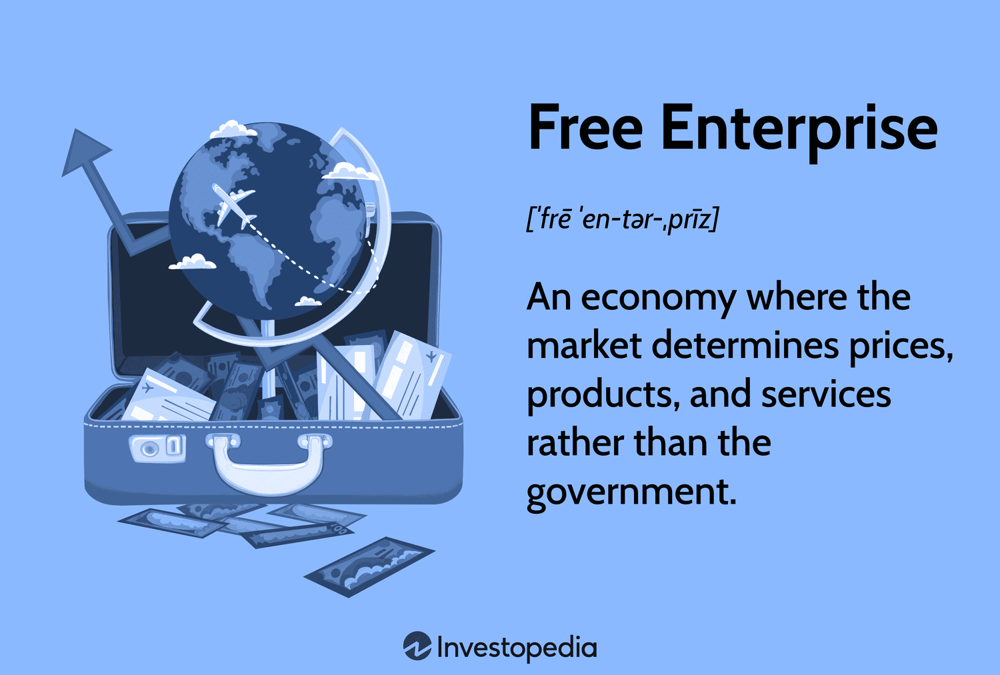

Understanding the foundations of our modern economic system is crucial for navigating today's financial landscape. Two primary components—capitalism and free enterprise—have historically driven innovation, efficiency, and economic growth across nations. These components have established the structure within which markets operate, facilitating competition and incentivizing advancement. The 21st century has seen an unprecedented rise in technological advancements that have significantly impacted these traditional economic systems. Among the most transformative of these advancements is algorithmic trading, a process that uses computer algorithms to make trading decisions in financial markets, effectively becoming an influential force within capitalism and free enterprise.

Capitalism, characterized by private ownership and the operation of production for profit, relies on market forces to allocate resources efficiently. Free enterprise complements this system by enabling individuals and businesses to operate with minimal governmental interference, fostering an environment ripe for competition and innovation. These principles have long stood as the pillars of many modern economies, underpinning the ways in which economic activities are conducted.

Algorithmic trading, a relatively recent development, integrates seamlessly into these foundational economic principles by embodying the ideals of innovation and efficiency. The use of sophisticated algorithms in trading demonstrates capitalism's ability to adapt to new technological paradigms, driving improvements in market liquidity, reducing transaction costs, and enhancing the speed and precision with which trades are executed. However, the intersection of algorithmic trading with these economic frameworks also presents challenges, including issues of market volatility and ethical concerns, highlighting the need for continuous dialogue and regulation.

This article examines the intricate relationship between capitalism, free enterprise, and algorithmic trading. It explores how these elements interact to shape financial markets today, offering insights into the dynamic interplay of economic philosophies and technological advancements that define contemporary financial systems. Understanding these relationships is essential for investors, policymakers, and technology developers alike, as they navigate the complexities of modern economic landscapes and strive for a balance between fostering innovation and ensuring market stability.

## Table of Contents

## Defining Capitalism and Free Enterprise

Capitalism stands as a cornerstone of modern economic thought, characterized by the private ownership of the means of production and the operation of these assets for profit. This economic system hinges on the notion that individuals, rather than the state, are the primary drivers of economic activity, utilizing property and resources to generate wealth. The fundamental elements of capitalism—private property, capital accumulation, wage labor, voluntary exchange, and competitive markets—facilitate the efficient allocation of resources, thus promoting innovation and economic growth.

Private ownership in capitalism allows individuals and corporations to own and manage assets like land, labor, and capital. The market functions primarily through supply and demand dynamics, where voluntary exchanges occur within a competitive marketplace. This competition leads to innovation and productivity improvements, as firms strive to develop better products and services.

Free enterprise, a term often used interchangeably with capitalism, specifically pertains to the economic freedom afforded to individuals and businesses to operate competitively with minimal governmental oversight. This liberty encourages entrepreneurship, as businesses are free to enter and [exit](/wiki/exit-strategy) the market according to their strategic interests. The government's role in a free enterprise system is generally limited to enforcing contracts, protecting property rights, and ensuring a functional market environment.

Historically, the concepts of capitalism and free enterprise began emerging during the late Middle Ages and gained [momentum](/wiki/momentum) with the advent of the Industrial Revolution in the 18th century. The industrial age catalyzed the shift from agrarian economies to industrial ones, underscoring the effectiveness of market-driven economic systems. Adam Smith, in his seminal work "The Wealth of Nations" (1776), articulated the benefits of a self-regulating market, where the 'invisible hand' guides the allocation of resources to their most productive uses. Smith's ideas laid the theoretical groundwork for capitalist economies, highlighting the efficiency of market forces in resource allocation and wealth creation.

In contemporary times, capitalism and free enterprise are integral to many of the world's leading economies, including the United States, Germany, and Japan. These systems form the backbone of economic policy in these regions, where market mechanisms are entrusted to drive growth and prosperity. However, the application of capitalism and free enterprise varies, with some nations implementing measures to address market failures and inequality.

The principles of capitalism and free enterprise reveal their interconnectedness: both systems rely on competitive markets to allocate resources efficiently. Competition fosters innovation as companies vie to produce superior goods and services, resulting in technological advancements and increased consumer welfare. This relationship forms the core of many modern economic systems, providing a framework that supports dynamic, innovative, and robust markets while advocating for the entrepreneurial spirit.

## The Role of Algorithmic Trading in Modern Capitalism

Algorithmic trading, also known as algo trading, is the process of using computer algorithms to manage trading activities in financial markets, such as stocks and commodities. This approach to trading exemplifies the principles of efficiency and innovation inherent in capitalism, as it allows for faster and more precise execution of trades than manual methods. Algorithms can analyze vast amounts of data to make informed decisions, leading to increased market efficiency and the discovery of new trading opportunities.

One of the main benefits of [algorithmic trading](/wiki/algorithmic-trading) is increased market [liquidity](/wiki/liquidity-risk-premium). Thanks to the rapid execution of high-frequency trades, markets can benefit from tighter bid-ask spreads, making it easier for participants to enter and exit positions. This higher liquidity contributes to a more stable market environment, as it reduces the impact of large orders on price movements.

Algo trading also leads to reduced transaction costs. By automating the trading process, algorithms can execute trades at optimal times, taking advantage of slight price fluctuations. These algorithms minimize the need for human intervention, reducing costs related to staffing and errors caused by human judgment. Consequently, transactions are executed with greater precision and lower operational expenses.

However, algorithmic trading is not without its risks and challenges. Market [volatility](/wiki/volatility-trading-strategies) can be exacerbated by the sheer [volume](/wiki/volume-trading-strategy) of trades executed by algorithms, which can sometimes result in flash crashes, where markets experience sharp and sudden declines before quickly recovering. The 2010 Flash Crash, for example, was partly attributed to algorithmic trading activities that amplified market fluctuations.

Ethical concerns also arise in the context of algo trading. The use of complex algorithms to gain trading advantages has led to debates about fairness and transparency in the financial markets. Questions have been raised about whether these advanced systems create an uneven playing field, where firms with the resources to develop sophisticated algorithms have a distinct advantage over smaller investors.

The impact of algorithmic trading on traditional investment and trading methods is significant. It has disrupted conventional broker models, where human brokers executed trades based on individual judgment and relationships. In today's markets, the reliance on brokers has diminished as algorithmic systems can execute trades more efficiently and cost-effectively. However, despite this shift, there remains a role for traditional investment strategies, particularly those that focus on long-term value and fundamentals rather than short-term market movements.

In conclusion, algorithmic trading embodies both the efficiency and innovation championed by capitalism, providing significant benefits while introducing challenges that must be managed. Its impact on traditional trading forms underscores the need for ongoing adaptation and regulation to ensure fair and stable markets.

## Free Enterprise and Innovation: The Birthplace of Algo Trading

Free enterprise has long been a breeding ground for innovation, allowing businesses and entrepreneurs to explore and implement groundbreaking ideas. This creative liberty is pivotal in the development of algorithmic trading, a revolutionary force in modern finance. Algorithmic trading reflects the entrepreneurial spirit ingrained in free enterprise, driven by technological advancements and the pursuit of efficiency.

Historically, the financial sector has been quick to adopt innovations that enhance trading efficiency and decision-making accuracy. The freedom inherent in free enterprise systems has led to the emergence of algorithmic trading, primarily driven by technological progress and the reduction of barriers to entry. Entrepreneurs and new firms have capitalized on the availability of computing power, sophisticated mathematical models, and extensive financial data to develop complex algorithms that execute trades at high speed and volume.

A notable example of free enterprise facilitating technological advancement in finance is the rise of [quantitative trading](/wiki/quantitative-trading) firms and hedge funds. These organizations employ teams of mathematicians, data scientists, and software developers to design and refine algorithms that identify and exploit market opportunities. Renaissance Technologies, a pioneering quantitative [hedge fund](/wiki/hedge-fund-trading-strategies), exemplifies this trend. Founded by former mathematician Jim Simons, the firm uses proprietary algorithms to achieve outstanding returns, demonstrating how innovation can thrive in an environment where market forces dictate progress.

Moreover, tech companies and startups have played a crucial role in transforming the trading industry. Firms such as Trading Technologies and QuantConnect have developed platforms and tools that democratize access to algorithmic trading strategies, enabling individual traders and smaller institutions to participate in markets traditionally dominated by large financial firms. These companies provide services ranging from market data analysis to [backtesting](/wiki/backtesting) and execution, showcasing how entrepreneurship and technological innovation can lower entry barriers and foster competition.

Free markets have created an ecosystem where technological breakthroughs in finance are not only possible but actively encouraged. The continual drive for efficiency and profit in a competitive marketplace pushes innovators to develop and refine trading algorithms, contributing to a dynamic and evolving financial landscape. Free enterprise facilitates a cycle of innovation, where successful ideas attract investment, leading to further advancements and refinements.

In conclusion, the free enterprise system has nurtured the rise and development of algorithmic trading by granting economic [agents](/wiki/agents) the liberty to innovate. Through case studies and the significant roles played by tech companies and startups, it is evident that free markets have encouraged technological breakthroughs, revolutionizing the trading industry and shaping modern financial markets.

## Challenges and Opportunities in Combining Capitalism, Free Enterprise, and Algo Trading

Integrating algorithmic trading (algo trading) within the frameworks of capitalism and free enterprise presents both significant challenges and opportunities. This integration underscores the complexities of balancing innovation with the structural systems traditionally governing financial markets.

One notable challenge is the regulatory framework required to effectively manage risks associated with algo trading. The speed and volume at which these transactions occur can exacerbate market volatility, as seen in incidents like the 2010 "Flash Crash."[1] The regulatory issues center around ensuring transparency and fairness in markets, preventing manipulative practices such as "spoofing,"[2] and avoiding systemic risks. Regulatory bodies, such as the Securities and Exchange Commission (SEC) in the United States and the European Securities and Markets Authority (ESMA), continually refine their approaches to keep pace with technological advancements.[3] Robust frameworks must balance fostering innovation while mitigating risks that could lead to market instability.

Conversely, the intersections of capitalism, free enterprise, and algo trading present numerous opportunities for economic growth and innovation. Algo trading enhances market efficiency by providing liquidity and reducing transaction costs, thereby enabling more dynamic capital allocation. The algorithms can process massive datasets, identifying trends and opportunities that may be imperceptible to human traders, thus pushing the boundaries of market analysis and investment strategies.[4]

Furthermore, these elements can foster equitable and sustainable growth by democratizing access to complex trading strategies that were once exclusive to major financial institutions. Retail investors can utilize platforms that offer algorithmic trading capabilities, broadening participation in capital markets. This democratization aligns with the principles of free enterprise, promoting competition and innovation.

The future of financial systems is likely to be significantly shaped by ongoing developments in algo trading. As technology continues to evolve, we can expect more sophisticated algorithms that leverage [artificial intelligence](/wiki/ai-artificial-intelligence) and [machine learning](/wiki/machine-learning) to refine both predictive accuracy and decision-making processes.[5] These advancements could redefine market dynamics, impacting everything from asset valuation to risk management.

To optimize these advancements, stakeholders must engage in ongoing dialogue and research. The collaboration between technologists, regulators, and market participants is imperative to ensure that the benefits of algo trading are realized while maintaining market stability and integrity.

---

[1] Kirilenko, A., & Lo, A. W. (2013). "Moore's Law versus Murphy's Law: Algorithmic Trading and Its Discontents." Journal of Economic Perspectives.

[2] SEC.gov. "SEC Charges Group of 30 Traders in $75 Million Scheme to Manipulate Open Market."

[3] European Securities and Markets Authority (ESMA). "ESMA’s Guidelines on Algorithmic Trading."

[4] Hasbrouck, J., & Saar, G. (2013). "Low-Latency Trading." Journal of Financial Markets.

[5] Narang, R. K. (2011). "Inside the Black Box: The Simple Truth About Quantitative Trading." Wiley Trading.

## Conclusion

Capitalism, free enterprise, and algorithmic trading collectively shape the dynamics of modern economies. By relying on the principles of private ownership and competition, capitalism provides the structural framework that incentivizes innovation and efficiency. Free enterprise fosters an environment where entrepreneurial ventures, like algorithmic trading, can thrive and introduce cutting-edge technologies into financial markets.

Algorithmic trading epitomizes the intersection of these elements by maximizing trading efficiency and reducing costs, thereby enhancing market liquidity. However, it also introduces complexities, such as increased market volatility and ethical considerations that demand a careful balance between innovation and regulation. Ensuring market stability necessitates regulatory frameworks that mitigate risks without stifling technological advancements. This balance is crucial, as illustrated by frameworks like the Volcker Rule or Markets in Financial Instruments Directive (MiFID II), which aim to safeguard financial markets while encouraging innovation.

To fully harness the advantages these systems offer, continuing dialogue and research are essential. Collaborative efforts among policymakers, technology developers, and investors can optimize the benefits, ensuring that financial markets remain competitive and equitable. Policymakers and regulatory bodies must adapt to technological shifts, while educating stakeholders about the benefits and risks associated with algorithmic trading.

As the global financial landscape evolves, the integration of machine learning, artificial intelligence, and blockchain in trading algorithms may further transform markets. These innovations could lead to more sophisticated models that predict market behaviors with greater accuracy, providing opportunities for growth and efficiency. Investors and technologists must stay abreast of these developments, while regulators craft adaptable policies to ensure markets remain both innovative and stable.

In conclusion, understanding the interplay between capitalism, free enterprise, and algorithmic trading is pivotal for shaping resilient and dynamic economies. The future of financial systems will undoubtedly be influenced by the ongoing developments in these areas, requiring a cooperative approach to harness their full potential while safeguarding against potential disruptions.

## References & Further Reading

[1]: ["The Wealth of Nations"](https://en.wikipedia.org/wiki/The_Wealth_of_Nations) by Adam Smith

[2]: Johnson, B., & Todd, J. (2013). ["Algorithmic Trading and the Flash Crash: Computerized Trading, Stock Market, and Technology."](https://www.sciencedirect.com/science/article/pii/S2214845013000082) CreateSpace Independent Publishing Platform.

[3]: Kirilenko, A., & Lo, A. W. (2013). ["Moore's Law versus Murphy's Law: Algorithmic Trading and Its Discontents."](https://www.aeaweb.org/articles?id=10.1257/jep.27.2.51) Journal of Economic Perspectives, 27(2), 51-72.

[4]: Hasbrouck, J., & Saar, G. (2013). ["Low-Latency Trading."](https://papers.ssrn.com/sol3/papers.cfm?abstract_id=1695460) Journal of Financial Markets, 16(4), 646-679.

[5]: Narang, R. K. (2011). ["Inside the Black Box: The Simple Truth About Quantitative Trading."](https://onlinelibrary.wiley.com/doi/book/10.1002/9781118267738) Wiley Trading.

[6]: SEC.gov. ["SEC Charges Group of 30 Traders in $75 Million Scheme to Manipulate Open Market."](https://www.sec.gov/newsroom/press-releases/2024-98)

[7]: European Securities and Markets Authority (ESMA). ["ESMA’s Guidelines on Algorithmic Trading."](https://www.esma.europa.eu/press-news/esma-news/esma-announces-further-guidance-exclusion-criteria-selection-consolidated-tape)