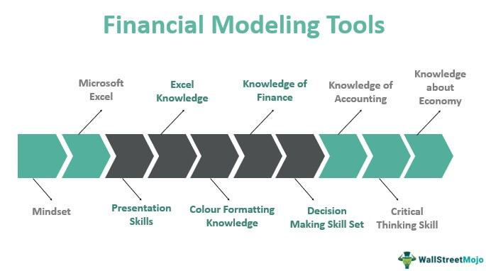

In the digital age, efficiently managing personal finances is essential for maintaining financial well-being and achieving long-term financial goals. This article examines a variety of financial tools available today, which include budgeting apps, money management platforms, and algorithmic trading solutions. These tools are designed to provide individuals with greater control over their personal finances and to enhance their investment strategies.

Budgeting apps play a crucial role in helping individuals track their spending, set up budgets, and identify opportunities for savings. These applications typically offer features such as expense tracking, budget alerts, and customizable categories, which aid users in maintaining financial discipline. Popular apps like Mint and Yodlee exemplify such comprehensive budgeting solutions.



In addition to budgeting tools, comprehensive money management platforms provide a more extensive approach by incorporating investment tracking and financial insights. These platforms enable users to manage various aspects of their financial lives in one place, such as investments, loans, and savings accounts. Tools like MoneyStrands and MyMoneyCircles deliver integrated financial planning services and often include educational resources to promote financial literacy.

Algorithmic trading represents a cutting-edge approach to investment by utilizing automated trading strategies to execute trades efficiently. This method offers the advantages of precision, speed, and emotionless execution, aligning well with various risk profiles and investment goals. Understanding the principles of algorithmic trading is crucial for investors looking to leverage technology to enhance their portfolio performance.

Together, the synergy of budgeting apps, money management platforms, and algorithmic trading solutions forms a holistic approach to personal finance. This integrated strategy ensures comprehensive financial control, allowing individuals to not only monitor their cash flow and optimize their financial health but also grow their investments effectively. By embracing these tools and consistently applying best practices, individuals can achieve financial independence and long-term success.

## Table of Contents

## The Importance of Budgeting Apps

Budgeting apps are critical tools for effective financial management, particularly in an age where financial transactions increasingly occur on digital platforms. These apps provide an organized system for tracking spending habits and aligning them with financial goals, thereby aiding users in gaining control over their personal finances.

Fundamentally, budgeting apps facilitate the process of setting up budgets, monitoring expenses, and pinpointing opportunities to save. Through the automation of these tasks, they significantly reduce the manual labor involved in maintaining financial discipline. By categorizing expenditures, these apps allow users to recognize patterns in their spending and make more informed decisions to adjust their habits accordingly.

Several budgeting tools have become popular due to their comprehensive capabilities. Mint, for example, offers features that include the consolidation of multiple financial accounts, provision of alerts to avoid overspending, and insights into spending behavior. Yodlee, another recognized name, provides extensive financial management solutions and real-time spending analysis. These applications not only streamline the budgeting process but also serve as educational tools, enhancing users' overall financial literacy.

Essential features to consider when choosing a budgeting app include expense tracking, automated budget alerts, and customizable budget categories. Expense tracking ensures that users have a complete view of their transaction history, which is vital for generating accurate reports and identifying spending trends. Budget alerts, on the other hand, are a proactive feature, notifying users when they approach or exceed their defined budget limits. Customizable categories allow users to tailor the app to their unique financial situations, making it more relevant and effective.

Implementing budgeting apps is a proactive step towards mastering financial discipline. By empowering individuals with data and tools to track and manage their finances in real-time, these apps lay the groundwork for achieving larger financial objectives, such as building savings, paying off debt, and planning for future expenses. They act as the foundation upon which more sophisticated financial strategies can be developed, enabling users to work towards financial stability and security.

## Comprehensive Money Management Tools

Money management tools have evolved to become essential components in an individual's financial toolkit, offering functionalities beyond basic budgeting. These tools integrate various financial elements, such as investments, loans, and savings accounts, onto a single platform, empowering users with a holistic view of their financial health. This comprehensive capability enables individuals to make informed decisions that are crucial for wealth accumulation and financial stability.

Contemporary money management solutions, such as MoneyStrands and MyMoneyCircles, exemplify the shift towards integrated financial planning services. These platforms offer users the ability to track and manage their finances comprehensively, providing insights that extend to spending patterns, investment performance, and liability management. The integration ensures that users can seamlessly monitor their financial activities, identify potential opportunities for improvement, and stay aligned with their financial goals.

Moreover, many of these tools are equipped with educational resources aimed at enhancing financial literacy. By understanding the nuances of financial management, users can make better-informed choices, tailor their financial strategies to their specific circumstances, and effectively mitigate risks. Financial literacy initiatives within these platforms often include articles, webinars, and tutorials covering a wide array of topics, from basic saving techniques to complex investment strategies.

Utilizing money management tools can have a profound impact on an individual's financial trajectory. By offering visibility and insights into personal finances, these tools help users allocate their resources more efficiently, optimize their investment strategies, and reduce unnecessary expenses. Over time, these improvements contribute to smarter financial decisions, resulting in long-term wealth growth and financial security.

In conclusion, money management tools are indispensable in today's financial landscape, providing the necessary frameworks for individuals to take control of their finances comprehensively. By leveraging these tools, individuals can enhance their financial literacy, make strategic decisions, and ultimately achieve sustainable financial success.

 to Algorithmic Trading

Algorithmic trading, often referred to as algo trading, utilizes computer algorithms to execute trading decisions based on predefined strategies. This technological advancement allows for efficient and systematic investment execution by harnessing computational power to analyze market data. The primary advantage of [algorithmic trading](/wiki/algorithmic-trading) lies in its precision, speed, and the absence of emotional interference in trading decisions. These characteristics enable traders to capitalize on fleeting market opportunities that might be missed in manual trading.

One of the key benefits of algorithmic trading is its ability to process vast amounts of data with high-speed accuracy. Algorithms can be designed to monitor real-time market conditions, identify patterns, and execute trades autonomously without human intervention, which drastically reduces the response time to market changes. Additionally, the emotionless nature of algorithmic trading helps avoid common human trading errors such as panic selling or impulsive buying.

Popular trading platforms offer a variety of algorithms tailored to different risk profiles and investment objectives. For instance, some algorithms focus on minimizing market impact and ensuring cost efficiency, such as VWAP (Volume Weighted Average Price) and TWAP (Time Weighted Average Price) strategies. Others might be designed for [arbitrage](/wiki/arbitrage), [trend following](/wiki/trend-following), or [market making](/wiki/market-making). Each algorithm can be backtested using historical data to assess its potential performance and risk profile.

For modern investors, understanding the basics of algorithmic trading is essential to leveraging technology for enhanced portfolio management. Knowledge of programming languages such as Python, R, or C++ can be beneficial since it allows investors to customize their strategies. Python, in particular, provides a rich ecosystem for financial analysis, with libraries such as NumPy, pandas, and TA-Lib that aid in developing and testing trading algorithms.

Incorporating algorithmic trading strategies can enhance portfolio performance by optimizing trade execution and offering diversification through systematic approaches. These strategies can include quantitative methods such as mean reversion, where the algorithm buys or sells based on the assumption that asset prices will revert to their historical average. Here's a simple example of a mean reversion strategy in Python:

```python
import numpy as np
import pandas as pd

# Assume 'data' is a DataFrame containing 'Close' prices of a stock
data['SMA'] = data['Close'].rolling(window=20).mean()  # 20-day simple moving average
data['signal'] = 0
data['signal'][19:] = np.where(data['Close'][19:] > data['SMA'][19:], 1, -1)

# 'signal' column now contains 1 for buy signal and -1 for sell signal
```

This code calculates a 20-day simple moving average (SMA) and generates a buy signal when the closing price is above the SMA and a sell signal when it is below.

In conclusion, algorithmic trading represents a significant advancement in the field of investment management, providing tools and methodologies that enhance decision-making processes and improve trade execution. By employing automated trading systems, investors can potentially achieve higher returns and better manage risks, thereby aligning their strategies more closely with their financial goals.

## Combining Budgeting, Management, and Trading for Financial Success

Integrating budgeting, management, and trading strategies is key to achieving comprehensive financial control. Each component plays a critical role in ensuring financial stability and growth. Budgeting is essential for monitoring cash flow. By setting clear budgets, individuals can track income and expenses, ensuring they do not exceed their financial limits. This transparency allows for identifying spending patterns and can highlight areas where cost reductions or reallocations are beneficial.

Management tools optimize financial health by offering a centralized platform to oversee all financial accounts, including savings, investments, and debts. These tools help in tracking financial goals and assessing progress over time. Features such as investment tracking, debt management, and savings optimization aid in keeping the financial picture balanced and forward-moving. 

Trading tools are primarily used to grow investments. Algorithmic trading, for instance, brings precision and consistency to trading activities. By using predefined strategies, these tools can execute trades at optimal times, helping maximize returns. 

A holistic approach to financial management ensures no aspect of personal finance is ignored. By seamlessly integrating budgeting, management, and trading, individuals gain a comprehensive view of their financial status. This enables informed decision-making and allows for the proactive addressing of any financial issues.

The successful integration of these strategies requires both knowledge and the consistent application of best practices. For budgeting, regular reviews and adjustments based on spending habits and financial goals are necessary. In management, maintaining up-to-date records and leveraging insights provided by financial management tools can enhance one’s ability to make informed choices. Trading necessitates understanding market dynamics and continuously refining strategies in response to changing conditions.

This synergy between budgeting, management, and trading empowers individuals to achieve financial independence and success. By mastering these tools, one can establish a strong foundation for long-term financial well-being and security, ultimately leading to financial independence.

## Conclusion

Effective financial management is attainable with the right tools and strategies. Utilizing budgeting apps, financial management platforms, and algorithmic trading can significantly transform personal finance. Budgeting apps provide a structured approach to tracking expenses, setting budgets, and identifying opportunities for savings. This foundation allows individuals to adapt their spending habits to align with their financial goals. Financial management platforms serve as comprehensive tools that integrate various financial elements such as investments, loans, and savings, offering users a cohesive view of their financial health. These platforms often include educational resources, enhancing financial literacy and empowering users to make informed decisions.

Algorithmic trading introduces an element of technological sophistication to personal finance by leveraging automation for precision, speed, and unemotional trade execution. By incorporating algorithmic strategies, investors can optimize their portfolio's performance, aligning execution with specific risk profiles and investment objectives.

Staying informed about the latest technological advancements is key to ensuring long-term financial health. As new tools and features become available, individuals must be prepared to adapt and integrate these into their financial strategy, ensuring they remain effective and relevant.

Choosing the right tools is a personalized process, heavily dependent on individual financial needs and goals. Identifying these requirements helps in selecting the most beneficial tools and platforms, allowing for a customized approach to financial management. The journey to financial mastery begins with this choice and requires a commitment to using these tools correctly and consistently. By adopting best practices and maintaining a proactive approach, individuals can achieve financial independence and success. 

In conclusion, technology provides the means to not only manage but enhance personal finance, ensuring that with dedication and the right resources, financial well-being is within reach.

## References & Further Reading

[1]: ["Advances in Financial Machine Learning"](https://www.amazon.com/Advances-Financial-Machine-Learning-Marcos/dp/1119482089) by Marcos Lopez de Prado

[2]: ["Machine Learning for Algorithmic Trading"](https://www.amazon.com/Machine-Learning-Algorithmic-Trading-alternative/dp/1839217715) by Stefan Jansen

[3]: ["Quantitative Trading: How to Build Your Own Algorithmic Trading Business"](https://www.amazon.com/Quantitative-Trading-Build-Algorithmic-Business/dp/1119800064) by Ernest P. Chan

[4]: ["Evidence-Based Technical Analysis: Applying the Scientific Method and Statistical Inference to Trading Signals"](https://www.amazon.com/Evidence-Based-Technical-Analysis-Scientific-Statistical/dp/0470008741) by David Aronson

[5]: Domingos, P. (2015). ["The Master Algorithm: How the Quest for the Ultimate Learning Machine Will Remake Our World"](https://psycnet.apa.org/record/2015-43168-000). Basic Books.