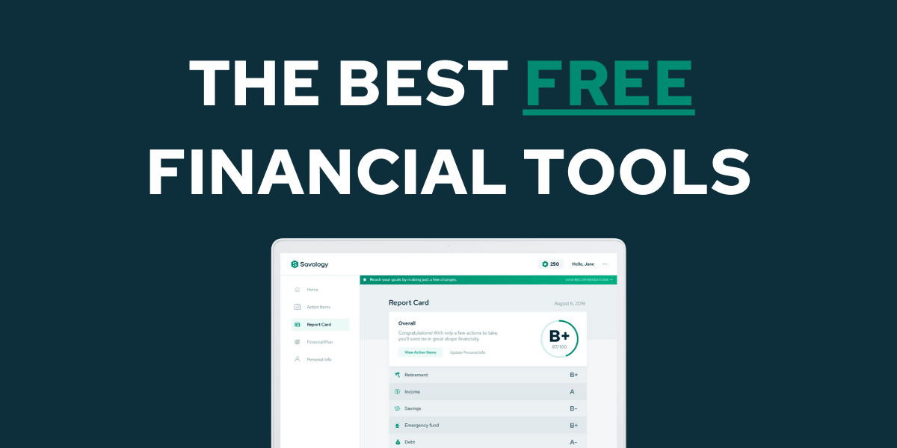

## Table of Contents

## What are free financial management tools and why are they important?

Free financial management tools are software or apps that help you keep track of your money without costing you anything. Some popular ones include Mint, YNAB (You Need A Budget), and Personal Capital. These tools let you connect your bank accounts, credit cards, and investments so you can see all your money in one place. They also help you make budgets, set financial goals, and track your spending. This makes it easier to manage your money and stay on top of your finances.

These tools are important because they make managing money easier and less stressful. Many people find it hard to keep track of their spending and savings, especially if they have multiple accounts. Free financial management tools help by showing you exactly where your money is going and helping you plan for the future. By using these tools, you can avoid overspending, save more money, and reach your financial goals faster. Plus, since they are free, anyone can use them to improve their financial health.

## How can beginners start using free financial management tools effectively?

To start using free financial management tools effectively, beginners should first choose a tool that fits their needs. Popular options like Mint, YNAB, and Personal Capital are user-friendly and can be used on a computer or a phone. Once you pick a tool, sign up for an account and link your bank accounts, credit cards, and any investments. This lets the tool gather all your financial information in one place, making it easier to see where your money is going.

After setting up, take some time to explore the tool's features. Most tools let you make a budget, which means setting limits on how much you want to spend in different areas like food, fun, and bills. Start by looking at your past spending to set realistic budgets. Then, use the tool to track your spending and see if you're sticking to your budget. If you're not, the tool can help you figure out where you can cut back. Remember, it's okay to adjust your budget as you learn more about your spending habits.

Using these tools regularly is key to getting the most out of them. Check your accounts and budgets often to stay on top of your money. Many tools also send alerts if you're spending too much or if a bill is due soon. By paying attention to these alerts and making changes when needed, you'll get better at managing your money. Over time, you'll find it easier to save more and reach your financial goals.

## What are the most popular free budgeting apps available?

Some of the most popular free budgeting apps are Mint, YNAB (You Need A Budget), and Personal Capital. Mint is easy to use and helps you see all your money in one place. You can connect your bank accounts, credit cards, and investments to track your spending and make a budget. YNAB is another great app that focuses on helping you plan your money ahead of time. It's free for the first year, then you can choose if you want to keep using it. Personal Capital is good if you want to keep an eye on your investments as well as your daily spending.

These apps are important because they make it simple to manage your money. Mint helps you set goals and gives you tips on how to save more. YNAB teaches you to give every dollar a job, so you know exactly where your money is going. Personal Capital not only helps with budgeting but also shows you how your investments are doing. By using these apps, you can keep track of your money better, spend less, and save more easily.

## How do free investment tracking tools work and which ones are recommended?

Free investment tracking tools help you keep an eye on your money that you've put into things like stocks, bonds, and funds. They work by connecting to your investment accounts, so you can see all your investments in one place. These tools show you how much your investments are worth right now, how they've done over time, and how they're doing compared to the market. They also give you reports and charts to help you understand your investments better. Some tools even let you set goals and alerts, so you know when to buy or sell.

Some recommended free investment tracking tools are Personal Capital and Morningstar. Personal Capital is easy to use and shows you a clear picture of your investments. It also gives you advice on how to make your money grow. Morningstar is another good choice because it has a lot of information about different investments. It helps you see how your investments are doing and gives you ideas on what to invest in next. Both tools are free and can help you make smart choices about your money.

## What features should I look for in a free expense tracking tool?

When looking for a free expense tracking tool, you should make sure it's easy to use. The tool should let you connect your bank accounts and credit cards so you can see all your money in one place. It should also let you make a budget, which means setting limits on how much you want to spend on things like food, fun, and bills. Another important feature is the ability to see your spending in different categories. This helps you understand where your money is going and where you might be spending too much.

Also, look for a tool that gives you reports and charts. These can show you how you're doing with your budget and help you see your spending over time. Alerts are another useful feature because they can remind you when you're close to going over your budget or when a bill is due. Lastly, the tool should be safe and protect your information. Make sure it uses strong security to keep your money details private. By choosing a tool with these features, you can keep track of your expenses better and make smarter choices with your money.

## How can free financial management tools help with debt reduction?

Free financial management tools can help with debt reduction by showing you exactly where your money is going. When you connect your bank accounts and credit cards to a tool like Mint or YNAB, you can see all your spending in one place. This makes it easier to find out if you're spending too much on things you don't need. Once you know where your money is going, you can make a budget to cut back on those extra expenses and put more money towards paying off your debts.

These tools also help you make a plan to pay off your debts faster. For example, you can use the tool to set up a debt payoff plan, where you focus on paying off one debt at a time while still making minimum payments on the others. Many tools will send you alerts to remind you when payments are due, so you never miss one. By sticking to your budget and following your debt payoff plan, you can get out of debt quicker and save money on interest.

## What are the limitations of using free versions of financial management software?

Free versions of financial management software can have some limits. They might not have all the fancy features that you get with the paid versions. For example, you might not be able to connect to as many banks or see as many details about your investments. Some free tools also show ads, which can be annoying. Plus, they might not let you track as many accounts or give you as many reports and charts as the paid ones do.

Another thing to think about is that free versions might not keep your information as safe. They might not use the strongest security, which could put your money details at risk. Also, free tools might not give you as much help or advice as paid ones. If you want someone to help you make a plan or give you tips on how to save more, you might need to pay for it. So, while free tools are good for keeping track of your money, they might not have everything you need to manage your finances perfectly.

## How can advanced users customize free financial tools to meet their specific needs?

Advanced users can customize free financial tools to meet their specific needs by taking advantage of the features that allow for more detailed tracking and analysis. For example, in tools like Mint, users can create custom categories for their expenses, allowing them to track spending in ways that are most meaningful to them. They can also set up multiple budgets for different goals, such as saving for a vacation or paying off a specific debt. By using these features, advanced users can tailor the tool to focus on the areas of their finances that matter most to them.

Additionally, advanced users can often import data from other sources or use the tool's API to integrate with other apps and services. This means they can pull in more detailed investment data or connect with other financial tools they use. By setting up custom alerts and notifications, they can stay on top of their finances in real-time, making it easier to adjust their strategies as needed. These customizations help advanced users get the most out of free financial tools, making them more effective for their specific financial management needs.

## What security measures should be considered when using free financial management tools?

When using free financial management tools, it's important to think about security. Make sure the tool uses strong encryption to keep your information safe. Encryption is like a secret code that protects your data from being seen by others. Also, check if the tool follows good security practices, like two-[factor](/wiki/factor-investing) authentication. This means you need more than just a password to log in, like a code sent to your phone, which makes it harder for someone else to get into your account.

Another thing to consider is how the tool handles your data. Some free tools might share your information with other companies for ads or other reasons. Make sure you read the privacy policy to understand what they do with your data. It's also a good idea to use strong, different passwords for each financial tool and change them often. By taking these steps, you can use free financial management tools more safely and protect your money information.

## How do free financial management tools integrate with other financial services?

Free financial management tools often work well with other financial services to help you keep track of your money better. They do this by letting you connect your bank accounts, credit cards, and investments all in one place. For example, if you use Mint, you can link your accounts from different banks and see all your money at once. This makes it easier to see where your money is going and helps you make a budget. Some tools also let you bring in information from other apps, like investment tracking apps, so you have a full picture of your finances.

Many of these tools use something called an API, which is like a special way for different apps to talk to each other. This lets the financial management tool pull in data from other services you use, like your investment accounts or loan information. By connecting these services, you can get reports and charts that show you everything about your money in one spot. This can help you make smart choices about saving, spending, and investing without having to switch between different apps all the time.

## Can free tools provide accurate financial forecasting and planning?

Free financial management tools can help with financial forecasting and planning, but they might not be as detailed or accurate as paid tools. These free tools use the information you give them about your income, spending, and savings to make guesses about your future money situation. They can show you how much money you might have in the future if you keep spending and saving the way you do now. But, because they are free, they might not have all the fancy math and models that paid tools use to make their guesses more accurate.

Still, free tools can be really helpful for basic planning. They can help you set goals, like saving for a big purchase or paying off debt, and show you how to reach those goals. By using these tools regularly, you can see if you're on track and make changes if you need to. While they might not give you the most exact numbers, they can still give you a good idea of where your money is going and help you plan better for the future.

## What are the future trends in free financial management tools and how can users prepare for them?

Free financial management tools are getting better and will keep changing in the future. One big trend is that these tools will use more smart technology, like [artificial intelligence](/wiki/ai-artificial-intelligence) (AI). This means they will be able to give you better advice and help you make smarter choices about your money. They might also connect with more other apps and services, so you can see all your money stuff in one place even easier. Another trend is that these tools will focus more on teaching you about money. They will have more tips and lessons to help you learn how to save, spend, and invest better.

To get ready for these changes, you should start using free financial tools now and get used to them. Try different tools to see which ones you like best and learn how they work. As these tools get smarter, you can use their new features to help you plan your money better. Also, keep learning about money on your own. Read [books](/wiki/algo-trading-books), watch videos, or take classes to understand more about saving, spending, and investing. This way, when the tools get better, you'll be ready to use them to reach your money goals.

## References & Further Reading

[1]: ["Advances in Financial Machine Learning"](https://www.amazon.com/Advances-Financial-Machine-Learning-Marcos/dp/1119482089) by Marcos Lopez de Prado

[2]: ["Machine Learning for Algorithmic Trading"](https://www.amazon.com/Machine-Learning-Algorithmic-Trading-alternative/dp/1839217715) by Stefan Jansen

[3]: ["Quantitative Trading: How to Build Your Own Algorithmic Trading Business"](https://www.amazon.com/Quantitative-Trading-Build-Algorithmic-Business/dp/1119800064) by Ernest P. Chan

[4]: ["Evidence-Based Technical Analysis: Applying the Scientific Method and Statistical Inference to Trading Signals"](https://www.amazon.com/Evidence-Based-Technical-Analysis-Scientific-Statistical/dp/0470008741) by David Aronson

[5]: Domingos, P. (2015). ["The Master Algorithm: How the Quest for the Ultimate Learning Machine Will Remake Our World"](https://psycnet.apa.org/record/2015-43168-000). Basic Books.