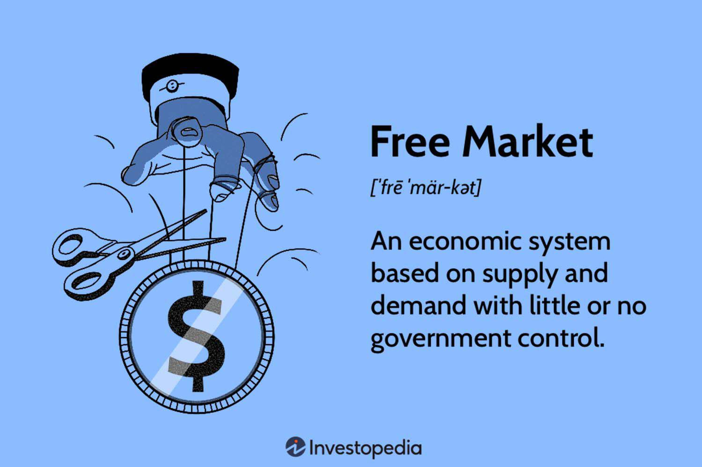

The global economy is undergoing rapid transformation, with the free market economy maintaining its pivotal role. Characterized by minimal governmental intervention, free markets rely on the dynamics of supply and demand to shape the production and distribution of goods and services. This self-regulating nature of free markets is integral to encouraging competition, innovation, and efficiency, all of which are key drivers of economic growth.

Algorithmic trading, often referred to as algo trading, has emerged as a significant technological advancement within these free market frameworks. Algo trading uses sophisticated mathematical models and algorithms to execute trades at speeds and efficiencies far beyond the capabilities of human traders. Its adoption has surged due to the advantages it offers, such as reducing transaction costs, enhancing liquidity, and improving price discovery. In major global exchanges, algorithmic trading constitutes a substantial portion of trading volume, underscoring its critical role in contemporary financial markets.

This article aims to examine the economic implications of integrating algorithmic trading into free market economies. By analyzing both the benefits and the potential challenges of this innovation, we provide insights into the dynamic interplay between technology and market structures. Such understanding is essential for policymakers, traders, and market participants who must navigate the complexities of modern financial landscapes, ensuring the continued robustness and vitality of free market systems in an era defined by technological progression.

## Table of Contents

## Understanding Free Market Economies

A free market economy is characterized by the interplay of supply and demand in determining the production and pricing of goods and services, operating with minimal governmental interference. This economic system relies on the forces of competition to allocate resources efficiently, with the primary aim of maximizing consumer satisfaction and driving economic growth. One of the quintessential features of a free market is the private ownership of property, which grants individuals and businesses the autonomy to own, control, and utilize their resources as they see fit. This ownership is complemented by voluntary exchanges, where transactions occur by mutual consent, ensuring that parties trade goods or services because it benefits them.

Competitive markets form the backbone of free market economies. Competition pushes firms to innovate, enhance product quality, and reduce prices, fostering an environment that encourages entrepreneurship and economic dynamism. It propels businesses to adopt new technologies and methodologies, often leading to significant advancements and efficiencies in production and service delivery. Furthermore, the absence of excessive regulatory barriers allows for the fluidity and flexibility necessary to adapt to changing economic conditions promptly.

However, free market economies are not without challenges. While they can lead to vibrant economic conditions, they can also result in significant income inequality. The unregulated nature of these markets often means that resources and wealth can become concentrated in the hands of a few, leading to disparities in income distribution. Additionally, market failures, such as monopolies or externalities like pollution, can occur, complicating the notion of efficiency in resource allocation.

These challenges necessitate careful oversight and intervention. Governments, while maintaining a minimal role, may introduce regulatory frameworks and policies aimed at addressing these market failures to ensure a balanced and fair economic system. Balancing these dynamics remains a continual process, requiring a keen understanding of economic principles and the ever-evolving market landscape.

## The Rise of Algorithmic Trading

Algorithmic trading, often referred to as algo trading, has become a cornerstone of modern financial markets, leveraging complex mathematical models and sophisticated software to execute high-speed trading decisions. This advanced trading method is characterized by its ability to process vast amounts of data and execute orders in fractions of a second, a feat unattainable by human traders.

The genesis of [algorithmic trading](/wiki/algorithmic-trading) can be traced back to the 1970s, during which electronic communication networks (ECNs) began to facilitate automated trading. Over the decades, as technology and data analytics have advanced exponentially, algo trading has evolved significantly, now pervading major stock exchanges worldwide. Today, it is estimated that algorithmic trading comprises a substantial portion of the trading [volume](/wiki/volume-trading-strategy) on these exchanges, reflecting its entrenched role in financial markets.

The primary advantages of algorithmic trading include the optimization of execution costs and the reduction of human errors. Algorithms can scrutinize multiple market conditions simultaneously, enabling traders to achieve the best possible execution prices. This reduction in transaction costs is crucial for high-frequency trading ([HFT](/wiki/high-frequency-trading-strategies)) strategies that rely on minimal profit margins per trade.

Further, the speed of algorithmic trading minimizes the time gap between identifying an opportunity and executing a trade, which enhances market efficiency. By processing trades at such high velocity, algo trading contributes to improved price discovery. It ensures that security prices more accurately reflect the latest information, thus benefiting the overall transparency and fairness of the market.

However, the rise of algorithmic trading is not without its challenges. The rapid and automated nature of these trades can lead to increased market [volatility](/wiki/volatility-trading-strategies). A well-documented example of this is the "Flash Crash" of May 6, 2010, when the U.S. stock market experienced a sudden and severe drop in prices, primarily attributed to algorithmic trades. This event underscored the potential for systemic risks inherent in high-frequency trading.

Despite these concerns, algorithmic trading continues to thrive due to its efficiency and effectiveness. The ongoing challenge lies in balancing these benefits with adequate regulatory oversight to mitigate associated risks and preserve market stability.

## Positive Economic Impacts of Algo Trading in Free Markets

Algorithmic trading, often leveraged in free market environments, has been instrumental in transforming market dynamics through its positive economic impacts. A cornerstone of its influence lies in the enhancement of market [liquidity](/wiki/liquidity-risk-premium). By employing algorithms capable of executing trades at high speeds and large volumes, markets become more liquid. This increased liquidity facilitates easier buying and selling of securities, thus minimizing the impact on asset prices. Securities can thus be traded with smaller spreads between buy and sell orders, reducing the potential for large price fluctuations when executing sizable trades.

In addition to boosting liquidity, algorithmic trading significantly enhances price discovery processes. Price discovery refers to the mechanism through which market prices are determined based on supply and demand. Algo trading systems rapidly analyze vast amounts of market data, integrate news, and react to developments swiftly, ensuring asset prices reflect available information accurately and promptly. This high-frequency data processing ensures that markets operate more efficiently, aligning asset valuations closer to their intrinsic values.

A notable advantage of algorithmic trading is its potential to reduce transaction costs. Traditionally, trading involves a variety of direct costs (e.g., broker fees) and indirect costs (e.g., market impact costs). Algorithms optimize trade execution by minimizing these expenses. By reducing inefficiencies, algorithmic trading opens financial markets to a broader audience, including both individual and institutional investors, who may have previously been deterred by high transaction costs.

Moreover, the adoption of algorithmic trading stimulates innovation in financial products and services. The need for sophisticated trading technologies and analytics fosters competition among financial institutions and technology providers. This competition drives advancements in algorithmic strategies, execution platforms, and risk management solutions, all contributing to economic growth. As financial institutions strive to outperform each other, they continually push the boundaries of what's possible, leading to the development of more efficient and innovative market solutions.

Lastly, algorithmic trading provides substantial benefits in terms of risk management and portfolio diversification. Advanced algorithms can model complex financial scenarios, identify potential risks, and execute hedging strategies with precision. By automating these processes, investors are better equipped to diversify their portfolios and manage risks effectively, which is crucial for maintaining financial stability and resilience. Automated systems can continually monitor markets and adjust portfolios in real time, offering a level of agility and control that manual trading simply cannot match.

Overall, the integration of algorithmic trading in free market economies introduces several positive economic impacts that enhance market efficiency, promote innovation, and improve financial stability. As technology advances, these benefits are likely to expand, further transforming the economic landscape.

## Challenges and Risks of Algorithmic Trading

Algorithmic trading, while revolutionary, presents several challenges and risks that can significantly impact financial markets. Its inherent speed and complexity enable high-frequency trades that can precipitate events such as flash crashes. Flash crashes are sudden, severe drops in security prices occurring within minutes, driven by automated trading algorithms executing orders faster than human traders can respond. A notable instance is the May 6, 2010, flash crash, where the Dow Jones Industrial Average plunged approximately 1,000 points within minutes before quickly recovering. Such incidents highlight the potential for increased market volatility, which can erode investor confidence and market stability.

Moreover, algorithmic trading might exacerbate competitive imbalances within financial markets. Institutions equipped with sophisticated technology and exclusive data access have a distinct advantage over those relying on traditional trading methods. This technological disparity can result in significant profits concentrated within tech-savvy firms, marginalizing smaller or less technologically advanced participants. Consequently, the fairness of market access is called into question, raising ethical and economic concerns about equity in market participation.

Algorithmic pre-programming is another area of concern, as it may be vulnerable to strategic manipulation. Traders may deliberately design algorithms to exploit specific market conditions, leading to practices like spoofing—placing large orders with the intent to cancel them before execution to sway prices. Such strategies can distort market signals, undermining the price discovery process that is fundamental to free markets.

The lack of transparency and regulatory oversight in algorithmic trading further compounds these risks. Algorithms are often proprietary, obscuring their strategies and potential impacts on the market. This opacity poses systemic risks, as undetected flaws or intentional malfeasance in algorithms can ripple through interconnected global markets, exacerbating crises.

To mitigate these challenges, developing robust regulatory frameworks and ethical standards is imperative. Regulatory bodies must evolve to oversee algorithmic trading practices effectively, ensuring they safeguard market integrity and protect investors. This may include requiring greater transparency in algorithmic strategies, mandating stress tests to evaluate algorithm resilience, and implementing circuit breakers to halt trading during extreme volatility.

The ethical responsibility of traders also plays a crucial role. Market participants must prioritize fairness and avoid strategies that manipulate or unduly influence markets. Encouraging a culture of ethical trading and technological accountability can foster a more equitable trading environment.

In conclusion, while algorithmic trading offers significant efficiencies, addressing its challenges and risks through strategic regulation and ethical conduct is vital for maintaining fair and stable financial markets.

## Regulatory and Ethical Considerations

Regulators must adapt to rapidly advancing technologies in algorithmic trading to ensure that market integrity is preserved and investors are protected. As algorithmic trading systems become increasingly sophisticated, the challenge for regulators is to establish frameworks that comprehend and govern both the complexity and opacity of these systems. Regulatory bodies need to design policies that prevent market manipulation and curb excessive risk-taking by traders. This includes curbing practices like front-running and spoofing, which have been linked to algorithmic strategies.

Ethical considerations also play a vital role, as trading organizations must be held accountable for ethical conduct in deploying their algorithmic strategies. Traders have a responsibility to ensure that their strategies do not exploit systemic loopholes or create unfair advantages over other market participants. This is particularly pertinent given that advanced algorithms can execute trades at speeds and volumes beyond human capability, which poses both ethical and regulatory challenges.

International collaboration is essential due to the interconnected nature of global financial markets. Harmonizing regulatory standards and practices across jurisdictions can help manage the risks associated with cross-border trading activities. Such cooperation facilitates the development of a robust international framework capable of addressing the impact of algorithmic trading across markets worldwide. 

Educational initiatives play a significant role in preparing traders and policymakers to understand and manage algorithmic trading complexities. Curricula that include financial technology, AI, and data analytics can equip the next generation of traders and regulators with the necessary tools to navigate this evolving landscape strategically. 

Balancing innovation with regulation remains crucial to harness the benefits presented by algorithmic trading while mitigating its associated risks. A regulatory approach that fosters innovation yet imposes strict compliance guidelines can ensure market stability and investor protection. This delicate balance ensures that the adoption of cutting-edge trading technologies continues to promote economic growth without compromising market integrity or security.

## Conclusion

Algorithmic trading represents a significant transformative force within free market economies. It influences various dimensions of economic activity, offering prospects for growth while also presenting challenges that need careful management. The integration and regulation of these systems are crucial determinants of their future impact on economic landscapes. Successful integration involves ensuring that algorithmic trading contributes positively to market liquidity, price discovery, and transaction efficiency, while simultaneously minimizing risks related to market volatility and systemic instability. 

Stakeholders, including regulators, market participants, and policymakers, share the responsibility for fostering the responsible development of algorithmic trading. Collaboration among these groups is vital for establishing robust regulatory frameworks that maintain market integrity, protect investors, and encourage ethical trading practices. Additionally, it is essential to raise awareness and understanding of these systems through educational initiatives, equipping both new traders and policymakers with the necessary tools to navigate the complexities of algorithmic trading.

Ultimately, a comprehensive understanding of the economic impacts of algorithmic trading will inform strategies aimed at enhancing market efficiency and stability. This requires striking a delicate balance between encouraging technological innovation and implementing effective regulatory measures. As algorithmic trading continues to evolve, its role in transforming free market economies is set to expand, making concerted efforts to manage its growth both a challenge and an opportunity.

## References & Further Reading

[1]: Aldridge, I. (2010). ["High-Frequency Trading: A Practical Guide to Algorithmic Strategies and Trading Systems"](https://www.ahmetbeyefendi.com/wp-content/uploads/2020/07/High-Frequency-Trading-Irene-Aldridge.pdf). Wiley.

[2]: Griffiths, M.D., & Winters, D.B. (2005). ["The Turn of the Month Effect in the World's Largest Stock Markets."](https://scholar.google.com/citations?user=om2vLXgAAAAJ) Journal of Financial and Quantitative Analysis.

[3]: Harris, L. (2003). ["Trading and Exchanges: Market Microstructure for Practitioners"](https://academic.oup.com/book/52292). Oxford University Press.

[4]: Patterson, S. (2012). ["Dark Pools: The Rise of the Machine Traders and the Rigging of the U.S. Stock Market"](https://www.amazon.com/Dark-Pools-Machine-Traders-Rigging/dp/0307887189). Crown Business.

[5]: Hasbrouck, J. (2007). ["Empirical Market Microstructure: The Institutions, Economics, and Econometrics of Securities Trading"](https://archive.org/details/empiricalmarketm0000hasb). Oxford University Press.