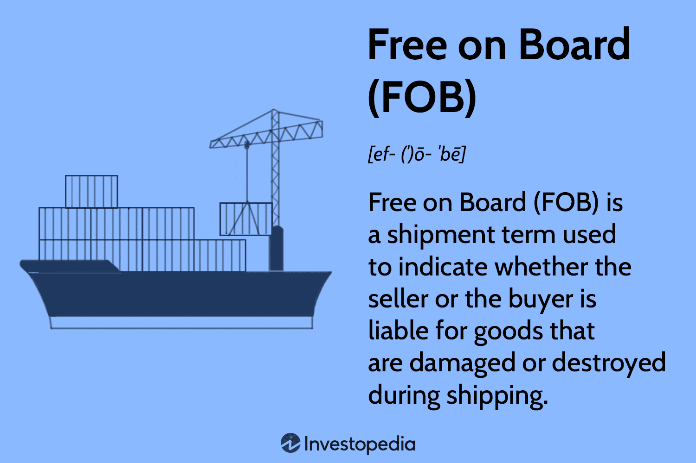

## Table of Contents

## What does Free on Board (FOB) mean in shipping terms?

Free on Board (FOB) is a term used in shipping that means the seller is responsible for the goods until they are loaded onto the ship at the port of origin. Once the goods are on the ship, the buyer takes over the responsibility. This includes paying for the shipping costs and handling any issues that might happen during the transport.

FOB is important because it clearly defines who pays for what and who is responsible for the goods at different stages of the shipping process. For example, if the goods get damaged before they are loaded onto the ship, the seller has to deal with it. But if the damage happens after the goods are on the ship, it's the buyer's problem. This helps both the buyer and the seller know exactly what they need to do and what costs they need to cover.

## How does FOB affect the responsibilities of the buyer and seller?

FOB, or Free on Board, changes how the buyer and seller handle their duties. When goods are sold FOB, the seller must get the goods to the port and load them onto the ship. This means the seller pays for everything up to that point, like transport to the port and loading costs. If anything goes wrong before the goods are on the ship, it's the seller's job to fix it.

Once the goods are on the ship, the buyer takes over. The buyer then has to pay for the shipping from the port of origin to the destination and handle any problems that happen during the trip. This includes any damage or loss that occurs after the goods are loaded. So, FOB helps both the buyer and seller know exactly when their responsibilities start and end.

## What are the different types of FOB terms?

FOB has different types that change how the buyer and seller handle their duties. FOB Origin means the buyer takes over as soon as the goods leave the seller's place. The seller just needs to get the goods ready and load them onto the first transport, like a truck. After that, the buyer pays for everything and handles any problems. FOB Destination is different. Here, the seller keeps the responsibility until the goods reach the buyer's place. The seller pays for all the transport and takes care of any issues until the goods are delivered.

There's also FOB Shipping Point, which is similar to FOB Origin. The seller's job is done once the goods are given to the carrier at the shipping point. From there, the buyer takes over. Another type is FOB Vessel, where the seller's responsibility ends when the goods are loaded onto the ship. After that, the buyer deals with everything. These different FOB terms help both the buyer and seller know exactly when their duties start and end, making trade easier and clearer.

## At what point does the risk transfer from the seller to the buyer under FOB?

Under FOB, the risk transfers from the seller to the buyer when the goods are loaded onto the ship at the port of origin. This means that once the goods are on the ship, the buyer is responsible for them.

If anything goes wrong after the goods are loaded, like damage or loss, it's the buyer's problem. Before the goods are on the ship, the seller has to handle any issues. This clear point of transfer helps both the buyer and seller know exactly when their responsibilities change.

## How does FOB impact the cost of shipping for both parties?

FOB impacts the cost of shipping by dividing the expenses between the buyer and the seller. Under FOB, the seller pays for getting the goods to the port and loading them onto the ship. This means the seller covers the costs of transport to the port, any fees for loading, and any other expenses up to that point. If the goods are sold FOB Origin or FOB Shipping Point, the seller's costs end once the goods are handed over to the carrier or loaded onto the first transport.

Once the goods are on the ship, the buyer takes over and pays for the rest of the shipping. This includes the cost of the sea freight from the port of origin to the destination, as well as any other charges that come up during the journey. If the goods are sold FOB Destination, the seller pays for all the shipping costs until the goods reach the buyer's location. This clear division of costs helps both the buyer and the seller plan their budgets and know exactly what they need to pay for.

## What documentation is required when using FOB shipping terms?

When using FOB shipping terms, certain documents are needed to make sure everything goes smoothly. The main document is the Bill of Lading, which shows that the goods have been loaded onto the ship. It's like a receipt that the carrier gives to the seller, and it helps move the goods from the seller to the buyer. The Bill of Lading also includes important details like the type of goods, where they're going, and how they should be handled.

Another important document is the Commercial Invoice, which lists the price of the goods and other details about the sale. This helps with customs and makes sure the buyer knows exactly what they're paying for. Sometimes, an Export License is needed if the goods being shipped have special rules or need permission to be exported. These documents help both the buyer and seller keep track of the goods and make sure all the rules are followed.

## Can FOB terms be used for all modes of transportation?

FOB terms are mainly used for shipping goods by sea. They are very clear about when the seller's job ends and the buyer's job starts, which is when the goods are loaded onto the ship. This makes FOB perfect for sea transport because it helps everyone know exactly who is responsible for what.

However, FOB terms are not usually used for other types of transport like trucks, trains, or planes. For these, other terms like FCA (Free Carrier) or CPT (Carriage Paid To) are more common. These terms work better for land and air transport because they can handle different situations and rules that come with these types of shipping.

## How do FOB terms affect insurance responsibilities?

FOB terms change who needs to get insurance for the goods. When goods are sold FOB, the seller needs to have insurance until the goods are loaded onto the ship. If anything bad happens before that, like the goods getting damaged, the seller's insurance should cover it. Once the goods are on the ship, the buyer takes over and needs to get their own insurance. This means if something goes wrong during the sea journey, like the ship sinking, the buyer's insurance should help.

This clear switch in insurance responsibility helps both the buyer and the seller know exactly when they need to have insurance. It makes things easier because everyone knows what they need to do. If the goods are sold FOB Origin or FOB Shipping Point, the buyer needs to get insurance as soon as the goods leave the seller's place. But if it's FOB Destination, the seller keeps the insurance until the goods reach the buyer's location.

## What are the common challenges or disputes that arise with FOB shipments?

One common challenge with FOB shipments is figuring out who is responsible if the goods get damaged or lost. Since the seller's job ends when the goods are loaded onto the ship, any problems before that are the seller's responsibility. But if something goes wrong after the goods are on the ship, it's the buyer's problem. Sometimes, it's hard to tell exactly when the damage happened, which can lead to disagreements between the buyer and seller about who should pay for the damage.

Another issue can be about the timing of when the goods are loaded onto the ship. If the seller is late getting the goods to the port, the buyer might have to wait longer and could lose money. On the other hand, if the buyer doesn't have the right documents ready when the ship arrives, it can cause delays and extra costs for the seller. These timing issues can lead to disputes about who should pay for the extra time and costs.

Sometimes, there can also be confusion about the costs. The seller needs to pay for getting the goods to the port and loading them, but the buyer pays for the rest of the shipping. If these costs are not clear in the contract, it can lead to arguments about who should pay for what. Clear communication and a detailed contract can help avoid these kinds of disputes.

## How do international regulations influence FOB terms?

International regulations can change how FOB terms work. These rules can affect things like customs, safety, and how goods are shipped. For example, some countries have strict rules about what goods can be exported or imported. If the goods need special permission to be shipped, this can change when the seller's job ends and the buyer's job starts. Also, different countries might have different rules about how goods need to be packed or labeled, which can affect the costs and responsibilities under FOB terms.

Another way international regulations influence FOB terms is through safety and environmental rules. Some countries have strict rules about how ships can be loaded and how goods need to be secured. These rules can add to the seller's costs and responsibilities before the goods are loaded onto the ship. If the seller doesn't follow these rules, it could delay the shipment or even stop it from happening. This means that both the buyer and seller need to know these regulations well to make sure everything goes smoothly and to avoid any extra costs or disputes.

## What are the best practices for managing FOB shipments effectively?

To manage FOB shipments effectively, it's important to have clear communication between the buyer and seller. They should talk about all the details, like when the goods will be ready, how they will be packed, and what documents are needed. A detailed contract can help. It should say exactly who pays for what and who is responsible for the goods at different times. This way, everyone knows what to do and there are fewer surprises.

It's also a good idea to keep an eye on the goods during the whole shipping process. Using tracking systems can help both the buyer and seller know where the goods are and if there are any problems. If something goes wrong, like the goods getting damaged, it's easier to figure out who should fix it if everyone has been keeping track. Also, understanding the rules of the countries involved can prevent delays and extra costs. By following these steps, FOB shipments can go smoothly and everyone can be happy with how things turn out.

## How do FOB terms integrate with other Incoterms in complex shipping scenarios?

FOB terms work well with other Incoterms to handle different parts of shipping. For example, if goods need to be moved by truck to the port before they are loaded onto a ship, the seller and buyer might use FCA (Free Carrier) terms for the truck part and FOB for the sea part. This way, the seller's job ends when the goods are given to the truck, and the buyer's job starts when the goods are loaded onto the ship. Using different Incoterms like this helps everyone know exactly who does what at each step of the journey.

In more complex scenarios, like when goods need to go through several countries or use different types of transport, other Incoterms like CPT (Carriage Paid To) or CIF (Cost, Insurance, and Freight) can be used along with FOB. For instance, if the seller wants to pay for the shipping to the buyer's country but not the insurance, they might use CPT for the whole journey and FOB for the sea part. This combination makes sure the seller pays for the transport to the destination, but the buyer takes over once the goods are on the ship. By mixing and matching Incoterms, buyers and sellers can create a plan that fits their needs and makes the shipping process clear and easy to manage.

## References & Further Reading

[1]: Peleg-Gillai, B., Bhat, G., & Sept, L. (2006). ["Innovations in global logistics: Managing risk and complexity."](https://www.researchgate.net/publication/267818712_Innovators_in_Supply_Chain_Security_Better_Security_Drives_Business_Value) Stanford Graduate School of Business.

[2]: Inderjit, M. (2012). ["Supply chain management under the threat of international terrorism: A research agenda."](https://www.emerald.com/insight/content/doi/10.1108/09574090110806262/full/html) Service Oriented Computing and Applications.

[3]: ["International Trade Operations, third edition."](https://www.amazon.com/International-Logistics-Management-Trade-Operations/dp/1111219559) by Douglas Menze

[4]: Handfield, R., & Nichols, E. (2002). ["Supply Chain Redesign: Converting Your Supply Chain Into an Integrated Value System."](https://archive.org/details/supplychainredes0000hand) Prentice Hall.

[5]: Stopford, M. (2009). ["Maritime Economics."](https://www.taylorfrancis.com/books/mono/10.4324/9780203891742/maritime-economics-3e-martin-stopford) Routledge.