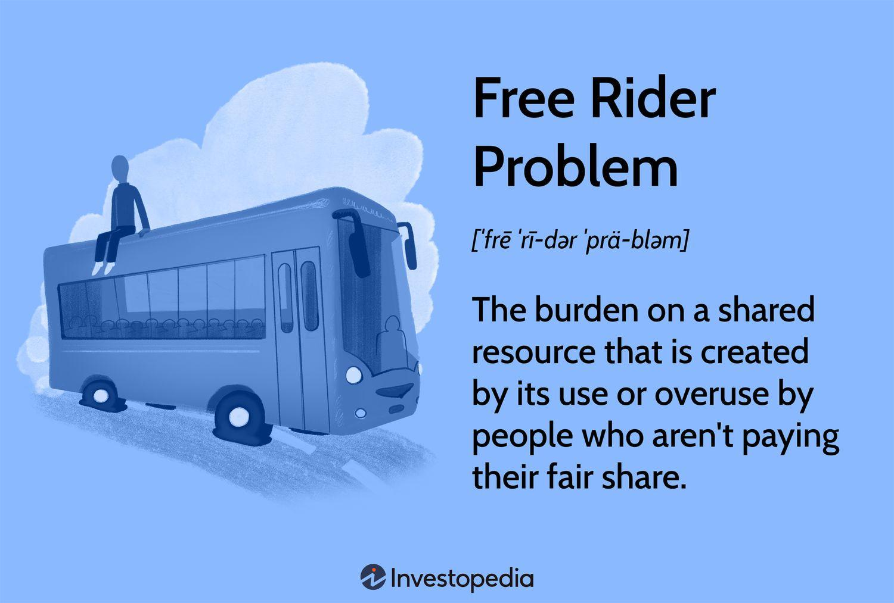

The free rider problem is a fundamental concept in economic theory, particularly concerning public goods. Public goods are characterized by their non-excludability and non-rivalrous consumption, meaning individuals can benefit without directly contributing to their provision. This can lead to challenges in maintaining and distributing these resources effectively. The free rider problem impacts various domains, including automated trading strategies, economic policies, and broader resource management.

Economic theory suggests that the free rider problem often results from market failures, where the incentives for individuals to contribute to the cost of public goods diminish. This issue hinders the optimal allocation of resources, as those benefiting from the public good do not necessarily bear the associated costs. Consequently, understanding and addressing the free rider problem is crucial for optimizing shared resources and developing efficient policy solutions.

In automated trading, particularly algorithmic trading, the free rider problem is evident when strategies rely on publicly available signals without directly contributing to market efficiency, potentially leading to increased volatility and systemic risks. Recognizing how this problem influences financial markets can help create mechanisms that ensure fair conditions and equitable resource distribution.

Throughout this article, we draw on economic theories and practical examples to offer a comprehensive understanding of the free rider problem. This approach not only illuminates its implications for economic policies and financial markets but also highlights the necessity of innovative solutions to balance shared benefits with individual responsibilities.

## Table of Contents

## Understanding the Free Rider Problem

The free rider problem is a fundamental issue in economics that arises when individuals are able to benefit from resources, goods, or services without having to pay for them. This lack of payment leads to potential overuse and depletion of the resource. At its core, the problem represents a form of market failure, occurring primarily because of the non-excludable and non-rivalrous properties of certain goods, commonly referred to as public goods.

Public goods, such as clean air, street lighting, and national defense, exemplify the free rider problem. These goods are non-excludable, meaning that it is not feasible to prevent individuals from utilizing them, and non-rivalrous, indicating that one individual's use does not reduce availability to others. For instance, the enjoyment of clean air by one person does not diminish another's ability to enjoy the same air. However, because these goods are accessible to all without direct payment, individuals often have little to no incentive to contribute to their maintenance or provision, assuming that others will cover the cost. This reliance on others can lead to a shortfall in funding or resources necessary to sustain the public good at an optimal level.

The essence of the free rider problem is encapsulated within the economic principle of externalities. Externalities occur when a third party is affected by an economic transaction in which they are not directly involved. Positive externalities exist when the benefits of a transaction or activity are enjoyed by others not involved in the decision-making process. The issue arises because these externalities are not reflected in the market price, leading to decisions that do not maximize societal welfare.

The consumption and provision of public goods are affected by this misalignment of private incentives and collective need. If individuals act in their self-interest, they opt not to contribute, creating an inefficiency where the good is underprovided or overused. This inefficiency is especially evident in scenarios where public goods require collective action for their provision and maintenance, yet reliance on voluntary contributions typically falls short of what is required to sustain these goods.

Economic theory suggests various solutions to address the free rider problem, such as government interventions or alternative funding mechanisms, to ensure adequate provision of public goods. These strategies aim to align individual incentives with collective welfare, thereby mitigating the inefficiencies caused by free riding. However, understanding the intricacies of the problem is essential to implement effective solutions that balance the need for public goods with the sustainability of their provision.

## The Free Rider Problem in Economic Theory

Economic theories offer a comprehensive framework for examining the free rider problem, highlighting its detrimental effects on resource allocation in market economies. The core issue arises when individuals benefit from resources without proportionately contributing to their maintenance or production, thereby creating inefficiencies. This phenomenon is deeply examined through various theoretical lenses, including game theory, public goods theory, and the analysis of information asymmetry and transaction costs.

Game theory, specifically the prisoner's dilemma, is instrumental in illustrating strategic interactions that give rise to the free rider problem. In a typical prisoner's dilemma scenario, two individuals acting in their own self-interest choose not to cooperate, even though cooperation would lead to a better collective outcome. When applied to the free rider problem, this model reveals why individuals may choose not to contribute to the provision of a public good, anticipating they can still reap benefits without incurring any cost. This strategic non-cooperation captures the essence of the free rider issue, resulting in under-provision of goods and suboptimal resource allocation.

The theory of public goods further elucidates the necessity for mechanisms that counteract free riding. Public goods are characterized by their non-excludable and non-rivalrous nature, meaning that no individual can be effectively excluded from their use, and one person's use does not diminish availability to others. These characteristics make public goods susceptible to free riding, as people can benefit without directly paying for them. Economists advocate for solutions such as government intervention, which could involve taxation and regulations to ensure that all beneficiaries of a public good contribute to its sustenance. Alternatively, privatization or creating excludable club goods can reduce the incentive to free ride, as access becomes contingent on payment.

Information asymmetry and transaction costs are additional factors that exacerbate the free rider problem. Information asymmetry occurs when one party has more or better information than the other, leading to imbalances in decision-making. This can hinder effective collective action necessary for the provision of public goods. For instance, if individuals are unaware of the actual benefits they receive from a public good, they may undervalue it and free ride. Similarly, high transaction costs—expenses incurred in making an economic exchange—can deter individuals from contributing to public goods, as the cost of organizing and executing collective contributions outweighs perceived benefits.

By dissecting these theoretical constructs, economists are better equipped to formulate solutions and systems that manage public goods efficiently. Addressing free riding requires a nuanced understanding of incentives and collective welfare, combined with policy measures that appropriately balance individual interests with societal needs. As such, insights from economic theory are paramount in crafting strategies that mitigate the adverse effects of free riding, ensuring optimal resource distribution and sustainability within the market economy.

## Algorithmic Trading and the Free Rider Problem

Algorithmic trading utilizes automated systems to execute trades based on pre-defined criteria, significantly influencing market dynamics. This approach leverages algorithms that analyze market data and execute large volumes of trades at speeds and frequencies impossible for human traders. The free rider problem surfaces when these algorithms rely on public signals or information that is freely available, allowing traders to benefit without directly incurring the costs associated with generating or disseminating that information.

In particular, certain high-frequency trading ([HFT](/wiki/high-frequency-trading-strategies)) strategies can exploit these publicly available signals to their advantage. HFT firms may engage in practices such as latency [arbitrage](/wiki/arbitrage), where they capitalize on small differences in the speed of information dissemination to trade ahead of other market participants. These strategies can lead to a scenario where HFT firms benefit from market information without directly contributing to its accuracy or the price discovery process. Consequently, this can result in market inefficiencies where the true value of securities is obscured, leading to potential distortions in trading prices.

Such exploitation of public information can exacerbate market [volatility](/wiki/volatility-trading-strategies). Rapid execution and high-[volume](/wiki/volume-trading-strategy) trading can create excessive [liquidity](/wiki/liquidity-risk-premium) demands and price fluctuations, which, under certain conditions, might evolve into systemic risks. These risks arise when the actions of a few players in the [algorithmic trading](/wiki/algorithmic-trading) landscape have disproportionate effects on overall market stability, potentially leading to events such as flash crashes.

Consequently, there is a growing demand for regulatory scrutiny and innovative solutions to address these challenges. Regulatory bodies globally have been considering various measures, such as imposing minimum resting times for orders or implementing transaction taxes, to curtail the unfettered advantage that certain algorithmic strategies might have due to their ability to "ride free" on public information.

To maintain fair and equitable market conditions, it is crucial to understand how automated trading systems interact with the free rider problem. This understanding involves recognizing the need for robust regulatory frameworks that ensure these systems contribute positively to market efficiency and stability. Additionally, market participants are encouraged to adopt technological solutions that enhance transparency and reduce the potential for exploitation. These solutions might include employing [machine learning](/wiki/machine-learning) techniques to predict and preemptively adjust for potential market impacts, thereby aligning individual trading strategies with collective market interests.

Ultimately, balancing the benefits of technology-driven efficiencies with the need for equitable market conditions remains a central challenge in addressing the free rider problem in algorithmic trading. As the landscape of financial markets continues to evolve, finding effective mechanisms to manage these dynamics will be essential for ensuring the integrity and stability of financial systems worldwide.

## Solutions to the Free Rider Problem

To address the free rider problem effectively, various solutions have been proposed, each tailored to mitigating the inefficiencies associated with public goods.

Governments can play a crucial role by implementing regulations or taxes that ensure individuals and businesses contribute to the funding of public goods. These regulatory measures can include compulsory taxes specifically aimed at generating revenue for the provision and maintenance of these resources. For instance, public goods such as national defense and infrastructure can be funded through taxes collected from citizens, ensuring that the cost is shared equitably among all beneficiaries.

Another potential solution involves the establishment of private ownership or club systems. In these systems, access to the resource is conditional upon payment or membership, effectively mitigating the free rider problem by aligning individual costs with benefits. For example, access to private parks or recreational facilities could be restricted to members who pay a subscription fee, ensuring that only contributors benefit from the resource.

While formal mechanisms are essential, altruistic behavior and social norms can also play a significant role in alleviating the free rider problem. In certain communities, norms of cooperation and reciprocity can naturally evolve, encouraging individuals to contribute voluntarily to public goods. Such societal dynamics can be observed in volunteer-based initiatives and community-driven projects, where social pressure and a sense of collective responsibility motivate participation.

Technological innovations provide new avenues for addressing the free rider problem efficiently. Blockchain technology and smart contracts represent notable advancements in this domain. Blockchain can ensure transparency and security in managing contributions to public goods, while smart contracts can automate the execution of pre-defined rules, ensuring compliance and reducing the reliance on trust-based systems. For example, a decentralized platform for funding public infrastructure could utilize smart contracts to automatically allocate funds based on real-time data of contributions from its users.

The complexity of the free rider problem necessitates a multifaceted approach that combines both policy interventions and technological advancements. A holistic strategy that integrates regulatory frameworks, private initiatives, cultural shifts, and innovative technologies is essential to effectively manage and optimize the provision of public goods. Through this comprehensive approach, it is possible to strike a balance between individual incentives and collective welfare, ensuring sustainable and equitable access to vital resources.

## Conclusion

The free rider problem presents a persistent challenge within economic theory and its practical applications, such as algorithmic trading. This issue fundamentally revolves around the misalignment between individual incentives and collective welfare, where individuals benefit from shared resources without contributing to their provision. Understanding and addressing the root causes of the free rider problem is crucial to fostering efficient and equitable systems.

In economic theory, the free rider problem is a classic example of a market failure, often necessitating external interventions to ensure the optimal distribution of resources. By integrating insights from economics and harnessing the potential of modern technology, it is possible to devise systems that enhance the management and consumption of public goods. For instance, technologies like blockchain and smart contracts offer promising solutions by ensuring transparent and fair resource allocation through decentralized networks.

Ongoing research and innovative policy designs are essential to maintain a balance between shared benefits and individual responsibilities. Policymakers can implement measures such as regulations, taxes, or incentives to encourage contributions to public goods, while technological advancements continue to open new avenues for addressing this pervasive issue.

The implications of the free rider problem extend beyond economics into broader societal issues, touching upon concepts of justice, responsibility, and the social contract. By studying this problem, we gain valuable insights into how societies can better manage shared resources, thereby promoting collective prosperity and accountability. The lessons garnered from understanding the free rider problem offer a roadmap for resolving similar dilemmas across various domains, ensuring that both individual and collective interests are harmonized for the overall benefit of society.

## References & Further Reading

[1]: Hardin, G. (1968). ["The Tragedy of the Commons."](https://pages.mtu.edu/~asmayer/rural_sustain/governance/Hardin%201968.pdf) Science, 162(3859), 1243-1248.

[2]: Olson, M. (1965). ["The Logic of Collective Action: Public Goods and the Theory of Groups."](https://www.jstor.org/stable/j.ctvjsf3ts) Harvard University Press.

[3]: Stiglitz, J. E. (1988). ["Economics of the Public Sector."](https://wwnorton.com/books/9780393925227) W.W. Norton & Company.

[4]: Varian, H. R. (1992). ["Microeconomic Analysis."](https://wwnorton.com/books/Microeconomic-Analysis/) W.W. Norton & Company.

[5]: Friedman, B. M. (1999). ["The Future of Monetary Policy: The Central Bank as an Army with Only a Signal Corps?"](https://www.nber.org/papers/w7420) International Finance, 2(3), 321-338.

[6]: Fama, E. F. (1970). ["Efficient Capital Markets: A Review of Theory and Empirical Work."](https://www.jstor.org/stable/2325486) The Journal of Finance, 25(2), 383-417.

[7]: Scholes, M. (1972). ["The Market for Securities: Substitution Versus Price Pressure and the Effects of Information on Share Prices."](https://www.jstor.org/stable/2352030) The Quarterly Journal of Economics, 86(1), 3-21.

[8]: Haldane, A. G., & Madouros, V. (2012). ["The Dog and the Frisbee."](https://www.bis.org/review/r120905a.pdf) Federal Reserve Bank of Kansas City, Economic Policy Symposium.

[9]: O'Hara, M. (2015). ["High Frequency Market Microstructure."](https://www.sciencedirect.com/science/article/pii/S0304405X15000045) Journal of Financial Economics, 116(2), 257-270.

[10]: Chiu, C. W., & Koeppl, T. V. (2011). ["Trading Dynamics with Private Information in High-Frequency Markets."](https://papers.ssrn.com/sol3/papers.cfm?abstract_id=3203917) Queen’s Economics Department Working Paper No. 1323.