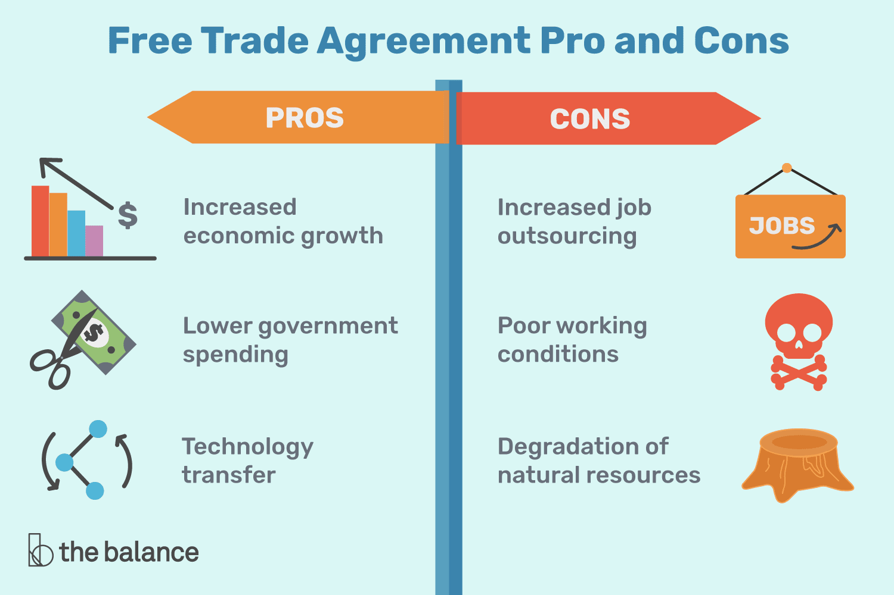

## Table of Contents

## What is a Free Trade Area?

A Free Trade Area is a group of countries that agree to trade with each other without any restrictions. This means they don't put taxes or limits on the goods and services they exchange. The main goal is to help businesses in these countries grow by making it easier and cheaper to buy and sell things across borders.

By removing trade barriers, a Free Trade Area can help increase the amount of trade between the member countries. This can lead to more jobs and lower prices for consumers. However, it can also create challenges, like competition from foreign companies that might affect local businesses. Overall, the idea is to create a win-win situation where all countries benefit from increased trade and economic growth.

## How does a Free Trade Area differ from other trade agreements?

A Free Trade Area is different from other trade agreements because it focuses on removing all tariffs and quotas between the member countries. This means that goods and services can move freely without any extra costs or limits. Other trade agreements might only reduce tariffs or focus on specific industries, like agriculture or technology. For example, a preferential trade agreement might lower tariffs on certain products but not eliminate them completely.

Another key difference is that in a Free Trade Area, each country can still set its own trade policies with non-member countries. This is different from a Customs Union, where member countries also agree on a common external tariff for countries outside the union. In a Free Trade Area, if Country A wants to put a high tariff on imports from Country C, it can do so, but it must still allow free trade with other members of the Free Trade Area. This flexibility can be good for individual countries but can also make trade more complicated overall.

## What are the primary benefits of Free Trade Areas for participating countries?

Free Trade Areas help countries by making it easier and cheaper for them to trade with each other. When countries remove tariffs and quotas, businesses can sell their products to more people in other countries without extra costs. This can lead to more jobs because companies need more workers to make and sell more goods. It also means that people can buy things for less money, which is good for everyone.

Another benefit is that Free Trade Areas can help countries grow their economies. When businesses in one country can easily sell to other countries in the Free Trade Area, they can become bigger and more successful. This can attract more investment, which means more money coming into the country to build new factories or start new businesses. Overall, Free Trade Areas can make countries stronger and more prosperous by helping them work together and trade more freely.

## Can you explain the concept of trade liberalization in the context of Free Trade Areas?

Trade liberalization means making it easier for countries to trade with each other by removing barriers like tariffs and quotas. In the context of Free Trade Areas, trade liberalization happens when countries in the group agree to trade freely among themselves without any restrictions. This means that businesses can sell their products to other countries in the Free Trade Area without having to pay extra taxes or face limits on how much they can sell.

By liberalizing trade, Free Trade Areas help businesses grow because they can reach more customers in other countries. This can lead to more jobs and lower prices for consumers. For example, if a company in one country can sell its products to another country without tariffs, it can sell more, hire more workers, and offer lower prices to buyers. Overall, trade liberalization in Free Trade Areas aims to make trade smoother and boost the economies of all the countries involved.

## What are some common examples of Free Trade Areas around the world?

One well-known Free Trade Area is the North American Free Trade Agreement (NAFTA), which includes the United States, Canada, and Mexico. This agreement lets these countries trade with each other without tariffs or quotas. It helps businesses in these countries sell more products to their neighbors, which can create jobs and lower prices for people buying things.

Another example is the Association of Southeast Asian Nations (ASEAN) Free Trade Area. This group includes countries like Indonesia, Malaysia, the Philippines, Singapore, and Thailand. They work together to make it easier to trade goods and services among themselves. This can help their economies grow by making it simpler for businesses to sell to other countries in the group.

The European Free Trade Association (EFTA) is another example. It includes countries like Norway, Iceland, Liechtenstein, and Switzerland. These countries trade freely with each other, which helps their businesses reach more customers and can lead to more jobs and economic growth.

## How do Free Trade Areas affect local industries and employment?

Free Trade Areas can help local industries by giving them a bigger market to sell their products. When countries in a Free Trade Area trade without tariffs or quotas, businesses can sell to more people in other countries. This can lead to more jobs because companies need more workers to make and sell more goods. For example, a car factory in one country might hire more people to meet the demand from other countries in the Free Trade Area.

However, Free Trade Areas can also create challenges for local industries. When businesses from other countries can sell their products without tariffs, they might compete with local companies. This competition can be tough for some local businesses, especially if they can't match the prices or quality of foreign products. As a result, some local industries might struggle, and some workers might lose their jobs. Overall, while Free Trade Areas can bring more opportunities, they can also bring more competition, which can affect local industries and employment in different ways.

## What are the potential disadvantages of Free Trade Areas for member countries?

Free Trade Areas can be tough on some local businesses. When countries in a Free Trade Area trade without tariffs, businesses from other countries can sell their products more easily. This can make it hard for local companies to compete, especially if they can't match the prices or quality of foreign products. As a result, some local businesses might struggle or even close down, which can lead to job losses. This can be a big problem for workers in those industries, who might find it hard to find new jobs.

Another issue is that Free Trade Areas can make income inequality worse. When businesses can sell to other countries without tariffs, the companies that do well often get bigger and richer. But the benefits might not reach everyone equally. Some people, like workers in struggling industries, might not see any gains and could even be worse off. This can make the gap between rich and poor even bigger, which can cause social problems. So, while Free Trade Areas can help some parts of the economy, they can also create challenges for others.

## How do Free Trade Areas impact economic inequality within and between countries?

Free Trade Areas can make economic inequality worse within countries. When businesses can sell to other countries without tariffs, the companies that do well often get bigger and richer. But the benefits might not reach everyone equally. Some people, like workers in struggling industries, might not see any gains and could even be worse off. This can make the gap between rich and poor even bigger. For example, if a factory closes because it can't compete with cheaper imports, the workers might lose their jobs and struggle to find new ones, while the owners of successful companies get richer.

Between countries, Free Trade Areas can also increase inequality. Countries that are already rich and have strong industries might benefit more from free trade because their businesses can easily sell to other countries. On the other hand, poorer countries might struggle to compete. They might not have the same level of technology or education, so their businesses might not be able to take advantage of the free trade as much. This can make the economic gap between rich and poor countries even wider. So, while Free Trade Areas can help some countries grow, they can also make economic inequality worse both within and between countries.

## What role do tariffs and quotas play in Free Trade Areas?

In Free Trade Areas, tariffs and quotas are important because they are the things that countries agree to get rid of. Tariffs are like taxes that countries put on goods coming from other places. Quotas are limits on how much of a certain product can come into a country. When countries in a Free Trade Area remove these tariffs and quotas, it means businesses can sell their products to other countries in the group without extra costs or limits. This makes it easier and cheaper for them to trade with each other.

But tariffs and quotas still matter outside of the Free Trade Area. Each country in the group can still decide what tariffs and quotas to put on goods coming from countries that are not part of the Free Trade Area. This can be good because it lets countries protect their own businesses from too much competition from outside. But it can also make trade more complicated because different countries might have different rules for goods coming from outside the Free Trade Area.

## How do rules of origin affect trade within Free Trade Areas?

Rules of origin are important in Free Trade Areas because they help decide if a product can be traded without tariffs. These rules say where a product comes from, and they make sure that only goods made in the countries of the Free Trade Area can get the benefits of free trade. If a product is made in a country that is not part of the Free Trade Area, it might have to pay tariffs when it is sold to countries in the group. This helps keep the trade benefits for the countries that agreed to the Free Trade Area.

Sometimes, rules of origin can make trade a bit harder. Businesses have to prove where their products come from, which can mean more paperwork and time. If a product is made with parts from different countries, it can be tricky to figure out if it meets the rules of origin. But these rules are important because they stop countries outside the Free Trade Area from taking advantage of the free trade benefits. Overall, rules of origin help make sure that the Free Trade Area works fairly for all the countries involved.

## What are the challenges in negotiating and implementing Free Trade Areas?

Negotiating and implementing Free Trade Areas can be tough because countries have to agree on a lot of things. Each country wants to protect its own businesses and workers, so they might not want to get rid of all tariffs and quotas right away. They also have to figure out rules of origin, which can be complicated. These rules help decide if a product can be traded without tariffs, but they can lead to a lot of paperwork and disagreements about where products come from. Plus, countries might have different goals and priorities, so finding a deal that everyone is happy with can take a long time.

Once a Free Trade Area is agreed upon, putting it into action can be hard too. Countries need to change their laws and set up new systems to make sure the agreement works. This can be a lot of work and can cost money. Also, businesses need to learn about the new rules and figure out how to use them. Sometimes, people might not like the changes and might protest or try to stop them. So, even after the agreement is signed, making it actually work can be a big challenge.

## How do Free Trade Areas influence global trade patterns and economic integration?

Free Trade Areas make a big difference in how countries trade with each other. When countries in a Free Trade Area agree to trade without tariffs or quotas, it becomes easier and cheaper for them to buy and sell things. This can lead to more trade between these countries because businesses can reach more customers. Over time, this can change the way goods and services move around the world. For example, if a country in a Free Trade Area starts making more cars because it can sell them easily to other countries in the group, it might become a big car exporter. This can shift trade patterns and make some countries more important in global trade.

Free Trade Areas also help bring countries closer together economically. When countries trade more with each other, they start to rely on each other more. This can lead to more investment and cooperation between the countries in the group. For example, a company in one country might decide to build a factory in another country in the Free Trade Area to be closer to its customers. This kind of economic integration can make the countries in the Free Trade Area stronger and more connected. Overall, Free Trade Areas can change how countries work together and help them grow their economies by making trade easier.

## References & Further Reading

[1]: Bergstra, J., Bardenet, R., Bengio, Y., & Kégl, B. (2011). ["Algorithms for Hyper-Parameter Optimization."](https://papers.nips.cc/paper/4443-algorithms-for-hyper-parameter-optimization) Advances in Neural Information Processing Systems 24.

[2]: ["Advances in Financial Machine Learning"](https://www.amazon.com/Advances-Financial-Machine-Learning-Marcos/dp/1119482089) by Marcos Lopez de Prado

[3]: ["Evidence-Based Technical Analysis: Applying the Scientific Method and Statistical Inference to Trading Signals"](https://www.amazon.com/Evidence-Based-Technical-Analysis-Scientific-Statistical/dp/0470008741) by David Aronson

[4]: ["Machine Learning for Algorithmic Trading"](https://github.com/stefan-jansen/machine-learning-for-trading) by Stefan Jansen

[5]: ["Quantitative Trading: How to Build Your Own Algorithmic Trading Business"](https://www.amazon.com/Quantitative-Trading-Build-Algorithmic-Business/dp/1119800064) by Ernest P. Chan