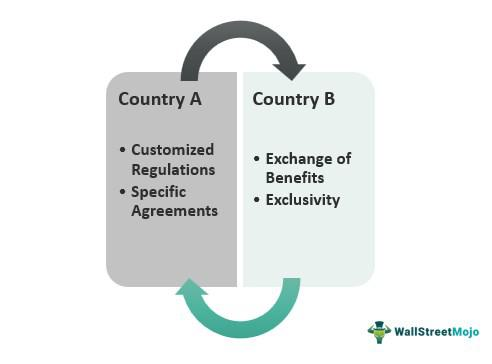

Global trade has been a cornerstone of economic development, fostering interconnectedness among nations through mechanisms such as free trade areas and technological advancements. One significant advancement in recent years is algorithmic trading, which has drastically transformed financial markets. These frameworks not only shape economies but also require a nuanced understanding of their advantages and shortcomings. 

Free trade areas, established through agreements between nations, aim to reduce or eliminate tariffs and quotas, thereby enhancing trade flows. Such regions enable countries to leverage their comparative advantages, allowing specialization that increases overall economic efficiency. Notable examples include the North American Free Trade Agreement (NAFTA) and its successor, the United States-Mexico-Canada Agreement (USMCA). These frameworks promote increased market access, incentivizing producers and consumers through more affordable goods and improved choices.

Concurrently, algorithmic trading leverages computer algorithms to execute trades at speeds and volumes unimaginable by human traders. This technology-driven approach enhances market liquidity and accuracy, reducing transaction times and costs. However, it is not without challenges, such as increased market volatility and the emergence of systemic risks that require robust regulatory measures.

The dynamics of free trade and algorithmic trading hold significant relevance in today's global economies. While free trade areas facilitate economic development and innovation, they also pose risks, including job displacement to lower-cost regions and pressures on emerging industries. Similarly, algorithmic trading provides efficiency gains but comes with the downside of market manipulation risks. Balancing these benefits and drawbacks is crucial for policymakers and stakeholders alike.

This article aims to provide detailed insights into free trade areas, their economic benefits, and the role of algorithmic trading in modern markets, setting a foundation for a comprehensive understanding of contemporary global trade and financial interactions.

## Table of Contents

## Understanding Free Trade Areas

Free trade areas (FTAs) are regions where a group of countries agrees to reduce or eliminate trade barriers, such as tariffs and quotas, among themselves. These agreements are established to foster economic integration by allowing goods and services to flow more freely across borders. The formation of FTAs is often motivated by the desire to enhance trade relationships, increase economic growth, and improve access to resources and markets.

Key features of free trade areas include the removal of tariffs and quotas on a wide range of products. This elimination of duties encourages trade by reducing the cost of importing and exporting goods. While the primary goal is to dismantle barriers between member nations, FTAs typically allow each country to maintain its own trade policies with non-member countries. This distinguishes them from customs unions, where members not only eliminate internal tariffs but also adopt a common external tariff on imports from non-members.

The concept of comparative advantage plays a significant role in the formation of free trade agreements. Comparative advantage refers to the ability of a country to produce a particular good or service at a lower opportunity cost than other countries. By leveraging comparative advantage, countries can specialize in the production of goods in which they are most efficient, leading to increased overall production and consumption. This specialization promotes efficiency and innovation, contributing to the economic benefits expected from FTAs.

Among the most well-known free trade agreements is the North American Free Trade Agreement (NAFTA), which was established in 1994 between the United States, Canada, and Mexico. NAFTA aimed to eliminate barriers to trade and investment between the three countries, creating a trilateral trade bloc in North America. In 2020, NAFTA was replaced by the United States-Mexico-Canada Agreement (USMCA), which updated and modified the terms of the original agreement to address issues such as digital trade, labor, and environmental standards.

By establishing preferential trade terms among member countries, FTAs seek to create economic zones where member nations can benefit from reduced trade barriers, thus expanding market access and fostering competition. This framework aims to not only improve trade volumes but also encourage economic cooperation and interdependence among the participating nations.

## Economic Benefits of Free Trade Areas

Free trade areas (FTAs) offer significant economic benefits by facilitating increased market access and enhancing efficiency for both producers and consumers. By eliminating tariffs and quotas, FTAs allow goods and services to move more freely across borders, expanding available markets for producers and offering consumers a wider array of choices at competitive prices. This liberalization of trade encourages economic development, fostering rising living standards through increased consumer purchasing power and business growth opportunities.

A key benefit of FTAs is their ability to stimulate competition, a crucial driver of innovation and efficiency. When businesses are exposed to international competitors, there is a powerful incentive to innovate, improve product quality, and optimize production processes to maintain market share. This heightened competition can lead to technological advancements and productivity gains, contributing to overall economic growth.

Moreover, FTAs facilitate access to foreign goods and services, allowing consumers to benefit from products that may not be available domestically. This access supports consumer choice and satisfaction, as well as enhances the quality of life by providing goods at lower costs than those that would be associated with restricted trade.

For producers, FTAs open up new opportunities to source inputs and raw materials from a diverse range of suppliers, often at lower costs due to tariff eliminations. This can lead to more efficient production processes and the potential for increased profit margins. Furthermore, access to larger and more varied markets enables producers to achieve economies of scale, lowering production costs per unit through higher output levels.

FTAs also promote economic integration and cooperation between member countries. By encouraging cross-border investments and collaborations, these agreements contribute to regional stability and development. The enhanced connections between economies can lead to shared growth and prosperity, benefitting all participating nations.

In conclusion, free trade areas offer substantial advantages by increasing market access and fostering economic efficiency. They promote economic development, support elevated living standards, drive innovation through competition, and provide consumers and producers with greater access to foreign goods and services. These factors collectively underpin the positive impact of FTAs on global trade and economic dynamics.

## Disadvantages of Free Trade Areas

Free trade areas (FTAs) can lead to several disadvantages that may affect economies on both macro and micro levels. One significant concern is the risk of job shifts to low-cost production nations. When barriers like tariffs and quotas are removed, companies may outsource production to countries where labor is cheaper, thereby reducing costs but potentially causing job losses in higher-cost countries. This phenomenon often leads to economic disruption in sectors that cannot compete with the lower production costs.

Another disadvantage of FTAs is the potential decline of nascent industries needing protection. Emerging industries in developing countries may struggle to compete with more established industries in developed economies. Without protective tariffs, infant industries may fail to grow and innovate, leading to a lack of diversification in the local economy. Economists often argue for temporary protectionist measures for such industries until they become competitive on the global stage.

Environmental and social concerns are also prevalent as a result of free trade. Increased production to meet international demand can lead to environmental degradation, particularly in countries with lax environmental regulations. The surge in production often comes at the expense of natural resources, leading to pollution, deforestation, and other ecological issues. Moreover, social concerns such as worker exploitation, poor labor standards, and wage disparities can arise when companies prioritize cost-cutting measures over ethical practices.

Real-life examples highlight the economic impacts of FTAs on local industries. For instance, the North American Free Trade Agreement (NAFTA), which included the United States, Canada, and Mexico, resulted in significant shifts in industrial patterns. In the U.S., manufacturing jobs moved to Mexico, where labor was less expensive. Although this shift lowered production costs, it resulted in substantial job losses in various U.S. manufacturing sectors. Similarly, Mexican agricultural industries struggled against subsidized U.S. crops, which were sold at lower prices, impacting local farmers negatively.

These disadvantages emphasize the importance of strategically designing FTAs to mitigate potential negative impacts while enhancing economic cooperation among nations. Balancing free trade benefits with the need to protect vulnerable sectors remains a delicate task for policymakers.

 to Algorithmic Trading

Algorithmic trading, often referred to as "algo trading," is the utilization of computer programs to execute financial transactions at speeds and frequencies beyond the capacity of human traders. It leverages advanced mathematical models and pre-defined criteria to analyze market data and automatically make trading decisions. This method dominates a significant portion of the trading [volume](/wiki/volume-trading-strategy) in modern financial markets, providing several key advantages that enhance efficiency and precision in trading practices.

Technological advancements have been pivotal in driving the adoption of [algorithmic trading](/wiki/algorithmic-trading). With the exponential growth in computing power, alongside developments in software engineering and data science, algo trading has become increasingly sophisticated. High-frequency trading ([HFT](/wiki/high-frequency-trading-strategies)), a subset of algorithmic trading, exemplifies this progress. HFT platforms can execute millions of trades in microseconds, capitalizing on the smallest market inefficiencies.

A primary benefit of algorithmic trading is speed, allowing traders to react to market changes much more swiftly than manual trading would permit. Algorithms can analyze multiple market conditions simultaneously and execute orders as soon as the criteria are met, significantly reducing the latency in trade execution. This capability is especially crucial in markets where prices change rapidly and opportunities that arise can quickly disappear.

Efficiency is another cornerstone benefit of algorithmic trading. By automating the trading process, algorithms can handle vast volumes of data and transactions, minimizing human error and maximizing the throughput of trades. These systems can continuously operate without fatigue, conducting market analyses and trading around the clock.

Precision in trading is markedly improved through algorithmic methods. Algorithms can accurately manage complex strategies involving numerous variables and constraints, executing trades at precise times and prices. This precision reduces the likelihood of human errors associated with emotional biases and cognitive limitations, promoting more disciplined and consistent trading.

In summary, algorithmic trading leverages technological advancements to provide unparalleled speed, efficiency, and precision in executing financial transactions. Its role in financial markets is indispensable, underscoring the intersection of technology and trading that defines modern financial economies.

## Economic Impacts of Algorithmic Trading

Algorithmic trading, often referred to as algo trading, has profoundly changed financial markets. One of its most significant contributions is enhancing market efficiency by improving [liquidity](/wiki/liquidity-risk-premium). By deploying automated programs to conduct trades, market participants can execute large volumes swiftly, minimizing bid-ask spreads and contributing to more stable pricing. Liquidity serves as a critical element for efficient markets, providing smoother transaction flows and reduced costs for investors.

However, algorithmic trading also brings challenges, notably market [volatility](/wiki/volatility-trading-strategies) and systemic risks. The rapid execution of trades can lead to sudden price movements, sometimes triggering large-scale market disruptions. Events like the "Flash Crash" of 2010, where the Dow Jones Industrial Average dropped nearly 1,000 points within minutes, highlight potential risks. Algorithms, particularly those reacting to market data and executing high-frequency trades, can exacerbate volatility, creating feedback loops that are difficult to control.

Algorithmic strategies significantly influence decision-making across financial markets. By utilizing historical data and complex mathematical models, algorithms can identify patterns and execute trades with precision beyond human capability. This influence may enhance decision-making through data-driven insights but also raises concerns about over-reliance on automated systems, which may lack the nuanced judgment of human traders.

Regulatory environments play a crucial role in managing the implications of algorithmic trading. Financial authorities globally have implemented measures aimed at curbing associated risks, such as requiring "circuit breakers" to pause trading amid excessive volatility. Regulations also foster transparency and fair play, ensuring that high-frequency and institutional traders do not disadvantage retail participants. Nevertheless, the rapidly evolving nature of technology presents ongoing challenges for regulators striving to keep pace with innovations in trading algorithms.

In summary, while algorithmic trading contributes to enhanced market efficiency through improved liquidity, its introduction of market volatility and systemic risks necessitates robust regulatory oversight, particularly concerning automated decision-making processes in financial markets.

## Interrelation of Free Trade and Algorithmic Trading

Free trade and algorithmic trading are intricately linked through the dynamic interplay of global trade policies and technological advancements in financial markets. Global trade policies, particularly those concerning free trade areas (FTAs), directly influence the strategies deployed in algorithmic trading by shaping economic conditions and market landscapes. 

When nations enter FTAs, they commit to reducing trade barriers such as tariffs and quotas, thereby facilitating smoother and more predictable cross-border trade. These agreements often lead to enhanced economic integration and increased market access, which provide new opportunities and challenges for financial markets. Algorithmic trading, characterized by its reliance on automated, high-speed decision-making processes, can quickly adjust to the shifts in supply and demand dynamics brought about by changes in trade policy. For instance, if an FTA leads to a sudden increase in the export of certain commodities from one country, algorithmic trading systems can detect these shifts through real-time data analysis and adjust their market positions accordingly.

Another key aspect of the interrelation is the ability of algorithmic trading to exploit economic shifts due to free trade. By analyzing vast datasets, algorithms can identify patterns and correlations that might not be immediately evident to human traders. For example, the opening of new markets under an FTA could lead to shifts in currency valuation, commodity prices, or stock market indices. Efficient algo-trading systems can detect and act on these trends with precision, optimizing investment portfolios to capitalize on emerging opportunities while mitigating risks.

The synergy between economic policies and algorithmic trading frameworks is enhanced by the growing interconnectivity of global markets. As trade policies create a more open and competitive global trading environment, algorithmic trading provides the tools necessary to navigate and leverage these conditions. This synergy is evident in the development of sophisticated trading algorithms that incorporate geopolitical and trade policy variables into their analytic frameworks, enabling them to predict and respond to policy-induced market fluctuations. 

Moreover, as economic policies evolve, so do the technological frameworks of algorithmic trading. Regulatory environments play a crucial role, often necessitating algorithmic adjustments to comply with different market rules and standards across jurisdictions. For instance, the rapid adaptation to policy changes stemming from agreements like the Comprehensive and Progressive Agreement for Trans-Pacific Partnership (CPTPP) or the African Continental Free Trade Area (AfCFTA) highlights the necessity for agile and compliant algorithms.

In summary, the interplay between global trade policies and algorithmic trading reflects a complex yet symbiotic relationship. As the global trading landscape continues to evolve through policy initiatives and technological advancements, both free trade and algorithmic trading remain central to driving efficiency and innovation in financial markets. This interrelation underscores the importance of adaptive strategies that blend economic policy insights with cutting-edge trading technologies.

## Conclusion

Free trade areas and algorithmic trading both present significant opportunities and challenges within the global economy. Free trade areas, by reducing or eliminating tariffs and quotas among member nations, facilitate increased market access and efficiency. This economic arrangement often leads to heightened competition and innovation, ultimately enhancing living standards. However, the potential drawbacks, such as job displacement to low-cost nations or harm to nascent industries, require careful consideration to safeguard local economies and address associated social and environmental concerns.

Algorithmic trading, on the other hand, has revolutionized the financial markets by leveraging technologies to execute trades with unprecedented speed and precision. The benefits include enhanced market liquidity and more efficient price discovery, which contribute to overall market efficiency. Yet, this technological advancement comes with challenges such as increased market volatility and systemic risks, necessitating robust regulatory frameworks to mitigate potential negative impacts.

The dual role of free trade areas and algorithmic trading in shaping modern economies cannot be overstated. Both systems interact with and influence global economic dynamics. For instance, algorithmic trading can rapidly respond to economic shifts induced by free trade agreements, exploiting market inefficiencies and influencing decision-making in financial markets.

A balanced approach is essential in implementing these systems, ensuring that the advantages are maximized while mitigating adverse effects. Policymakers and economic stakeholders must consider future trends and the evolving landscapes of global trade and technological advances. This involves embracing innovations that promote sustainable growth and equitable development. As both free trade and algorithmic trading continue to evolve, striking a harmonious balance will be crucial in fostering a resilient, inclusive global economy.

## References & Further Reading

[1]: Bergstra, J., Bardenet, R., Bengio, Y., & Kégl, B. (2011). ["Algorithms for Hyper-Parameter Optimization."](https://papers.nips.cc/paper/4443-algorithms-for-hyper-parameter-optimization) Advances in Neural Information Processing Systems 24.

[2]: ["Advances in Financial Machine Learning"](https://www.amazon.com/Advances-Financial-Machine-Learning-Marcos/dp/1119482089) by Marcos Lopez de Prado

[3]: ["Evidence-Based Technical Analysis: Applying the Scientific Method and Statistical Inference to Trading Signals"](https://www.amazon.com/Evidence-Based-Technical-Analysis-Scientific-Statistical/dp/0470008741) by David Aronson

[4]: ["Machine Learning for Algorithmic Trading"](https://github.com/stefan-jansen/machine-learning-for-trading) by Stefan Jansen

[5]: ["Quantitative Trading: How to Build Your Own Algorithmic Trading Business"](https://www.amazon.com/Quantitative-Trading-Build-Algorithmic-Business/dp/1119800064) by Ernest P. Chan