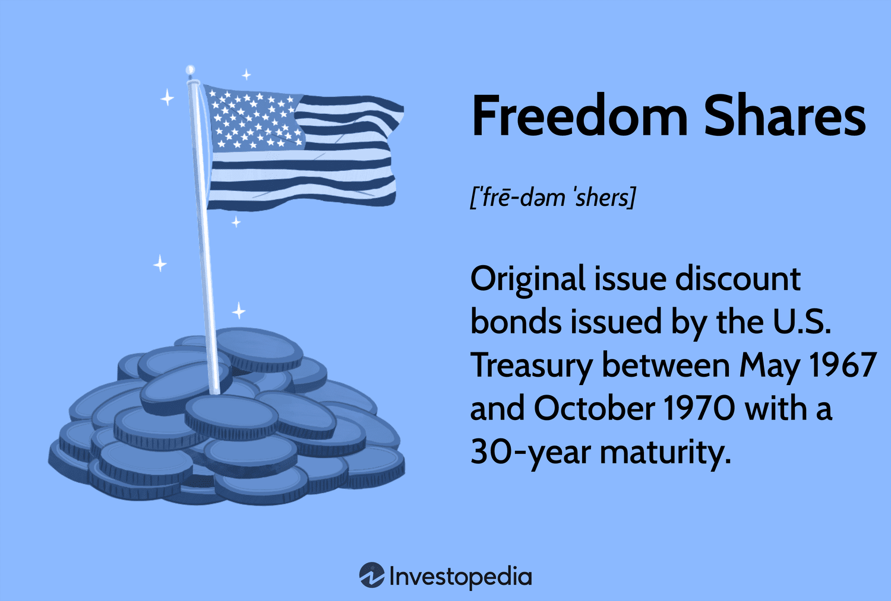

## Table of Contents

## What are Freedom Shares?

Freedom Shares are a type of investment that helps people in South Africa save for their retirement. They are part of a special plan called the Liberty Corporate Freedom Plan, which is designed to help employees build their savings over time. When you invest in Freedom Shares, your money is used to buy shares in different companies. This can help your savings grow because the value of the shares might increase over time.

The main benefit of Freedom Shares is that they offer a way to save for the future while also giving you the chance to earn more money if the companies you invest in do well. This type of investment is popular because it can help you plan for retirement by making your money work harder for you. However, it's important to remember that the value of shares can go up and down, so there is some risk involved. It's a good idea to talk to a financial advisor to see if Freedom Shares are right for you.

## How do Freedom Shares differ from traditional stocks?

Freedom Shares and traditional stocks are both ways to invest in companies, but they work a bit differently. Freedom Shares are part of a special retirement plan called the Liberty Corporate Freedom Plan in South Africa. When you invest in Freedom Shares, your money goes into a mix of shares from different companies, which are chosen by the plan. This mix is designed to help your savings grow over time, especially for your retirement. On the other hand, traditional stocks are individual shares of a single company that you can buy and sell on the stock market. When you buy traditional stocks, you decide which specific companies to invest in.

Another difference is how they are managed. With Freedom Shares, the plan takes care of choosing and managing the shares for you. This can be helpful if you're not sure which companies to invest in or if you want a simpler way to save for retirement. Traditional stocks, however, require you to do more research and make your own decisions about which stocks to buy and when to sell them. This gives you more control, but it also means you need to keep a closer eye on your investments. Both options have their own risks and benefits, so it's important to think about what fits best with your goals and how much risk you're comfortable with.

## What are the benefits of investing in Freedom Shares?

Investing in Freedom Shares can help you save for retirement in a simple way. They are part of the Liberty Corporate Freedom Plan, which means the plan chooses a mix of shares from different companies for you. This takes away the hard work of [picking](/wiki/asset-class-picking) which companies to invest in. It's like having someone else manage your investments, which can be really helpful if you're not sure where to start or if you want to keep things easy.

Another good thing about Freedom Shares is that they can grow your savings over time. Since the plan invests in a variety of companies, it spreads out the risk. This means if one company doesn't do well, the others might still help your money grow. Plus, because it's designed for retirement, you can let your money sit and grow for many years, which can lead to a bigger nest egg when you retire. Just remember, like all investments, there's some risk, but the plan aims to balance that out for you.

## Who can invest in Freedom Shares?

Freedom Shares are part of the Liberty Corporate Freedom Plan, which is made for people in South Africa who want to save for their retirement. If you work for a company that offers this plan, you can invest in Freedom Shares. It's a good choice for employees who want an easy way to save for the future without having to pick which companies to invest in themselves.

The plan is set up to help you grow your savings over time. It's perfect for anyone who wants to let their money work for them without having to manage it every day. If you're thinking about your retirement and want a simple way to invest, and your employer offers the Liberty Corporate Freedom Plan, then Freedom Shares could be a great option for you.

## How can someone start investing in Freedom Shares?

To start investing in Freedom Shares, you need to work for a company that offers the Liberty Corporate Freedom Plan. If your employer has this plan, you can join it. You'll need to talk to your company's HR or benefits department to find out how to sign up. They will help you fill out the forms and get started. Once you're in the plan, a part of your salary will be put into Freedom Shares automatically each month.

After you're signed up, the plan will take care of choosing which shares to invest in. This means you don't have to worry about picking companies yourself. The plan is designed to help your savings grow over time for your retirement. If you have any questions or need help along the way, you can always reach out to your HR department or a financial advisor to make sure you're on the right track.

## What are the risks associated with Freedom Shares?

Investing in Freedom Shares, like any investment, comes with some risks. The main risk is that the value of the shares can go up and down. This means that if the companies the plan invests in don't do well, the value of your savings could drop. Since Freedom Shares are part of a mix of different companies, this helps spread out the risk, but it can't get rid of it completely. 

Another thing to think about is that Freedom Shares are meant for the long term, especially for retirement. If you need to take your money out early, you might not get as much as you hoped for because the value might be lower at that time. It's important to be ready to leave your money in the plan for many years to give it the best chance to grow. Talking to a financial advisor can help you understand these risks better and see if Freedom Shares are a good fit for your retirement plans.

## How do Freedom Shares impact the economy?

Freedom Shares can help the economy in a few ways. When people invest in Freedom Shares, their money goes into different companies. This means more money for these companies to grow and create new jobs. When companies do well, they can hire more people or pay their workers more, which can make the economy stronger. Also, when people feel good about their retirement savings, they might spend more money on other things, which helps the economy too.

But there are also some risks. If a lot of people invest in Freedom Shares and the value of the shares goes down, it can make people feel less confident about their savings. This might make them spend less money, which can slow down the economy. So, while Freedom Shares can help the economy by giving companies more money to grow, they can also affect how people feel about spending, which is important for the economy too.

## What are the tax implications of investing in Freedom Shares?

When you invest in Freedom Shares, there are some tax things to think about. The money you put into Freedom Shares comes out of your salary before taxes are taken out. This means you pay less tax on your salary each month because the money going into Freedom Shares is not counted as part of your income for tax purposes. This can help you save more for retirement because you're keeping more of your money.

When you take money out of Freedom Shares, you might have to pay taxes on it. The tax you pay depends on how old you are when you take the money out and how much you take. If you take money out before you retire, you might have to pay more tax. It's a good idea to talk to a tax advisor to understand exactly how much tax you might have to pay and when.

## How do Freedom Shares contribute to social and environmental causes?

Freedom Shares can help social and environmental causes because they are part of a bigger plan that often thinks about these things. When you invest in Freedom Shares, your money goes into different companies. Some of these companies might work on projects that help the community or the environment. For example, they might build schools, help with clean water projects, or work on reducing pollution. By investing in these companies, you are helping them do more good work.

Also, the people who manage the Liberty Corporate Freedom Plan might choose companies that care about social and environmental issues. This means your investment can support businesses that are trying to make the world a better place. Even though Freedom Shares are mainly for saving for retirement, they can still make a difference in social and environmental areas by supporting companies that focus on these causes.

## What are the historical performance trends of Freedom Shares?

Freedom Shares have been around for a while, and their performance has gone up and down over the years. They are part of the Liberty Corporate Freedom Plan, which invests in a mix of different companies. This mix helps spread out the risk, but it also means that the overall performance depends on how well these companies do. In good years, when the economy is doing well and companies are making more money, Freedom Shares can grow a lot. But in tough years, when companies struggle, the value of Freedom Shares can go down.

Looking back over the years, Freedom Shares have generally grown over the long term. This is because they are designed for people saving for retirement, so they are meant to be held for many years. Even though there have been ups and downs along the way, the overall trend has been positive. This is good news for people who are planning to use Freedom Shares as part of their retirement savings, as long as they are ready to keep their money invested for the long haul.

## How do regulatory frameworks affect Freedom Shares?

Regulatory frameworks are the rules that the government sets for investments like Freedom Shares. These rules make sure that the companies offering Freedom Shares are doing things the right way. They have to be honest about how the shares are doing and make sure people's money is safe. If the rules change, it can affect how Freedom Shares work. For example, if new rules make it harder for companies to invest in certain ways, it might change which companies the Freedom Shares plan can invest in.

These rules can also affect how much risk there is with Freedom Shares. If the government makes stricter rules, it might make Freedom Shares safer but could also limit how much they can grow. On the other hand, if the rules are more relaxed, Freedom Shares might have more room to grow, but they could also be riskier. So, the regulatory frameworks play a big role in how Freedom Shares perform and how safe they are for people saving for retirement.

## What are the future prospects and innovations expected in the Freedom Shares market?

The future of Freedom Shares looks promising as more people in South Africa are thinking about their retirement. Companies like Liberty are always working on new ways to make saving for retirement easier and more effective. One big change we might see is more use of technology. This could mean using apps or online tools to help people keep track of their Freedom Shares and make it easier to manage their savings. Also, there might be new types of Freedom Shares that focus on different things, like companies that are good for the environment or help the community.

Another thing that could happen is that Freedom Shares might become more personalized. This means the plan could be changed to fit what each person wants or needs for their retirement. For example, if someone wants to invest in companies that are working on new technology, the plan might be able to do that. There could also be more education and advice given to people about how to save for retirement with Freedom Shares. This would help people feel more confident about their savings and make better choices. Overall, the future of Freedom Shares is about making them easier to use, more personal, and better at helping people save for their future.

## What is the understanding of financial instruments?

Financial instruments are integral to the global financial markets and comprise a diverse range of tradable assets, such as stocks, bonds, exchange-traded funds (ETFs), options, and derivatives. These instruments serve as essential tools for investors, providing mechanisms for capital allocation, risk management, and return optimization.

Stocks represent ownership in a corporation and constitute a claim on part of the company’s assets and earnings. They are fundamental for [capital raising](/wiki/hedge-fund-capital-raising), contributing significantly to wealth creation and economic growth. Bonds, on the other hand, are fixed-income securities issued by corporations or governments to raise capital, offering periodic interest payments and the return of principal at maturity. Bonds are typically considered less risky than stocks and can provide steady income streams.

Exchange-Traded Funds (ETFs) are investment funds traded on stock exchanges, much like stocks. ETFs hold assets such as stocks, commodities, or bonds and often operate with an arbitration mechanism designed to keep trading close to its net asset value, functioning as a hybrid between mutual funds and stocks. Their ability to spread investments across multiple asset classes offers diversification benefits to investors.

Options are financial derivatives that provide the buyer the right, but not the obligation, to buy or sell an asset at a predetermined price before a specified expiration date. Their versatility allows investors to hedge against potential losses or speculate on price movements, adding a layer of strategic flexibility to their portfolios.

Derivatives, which include options, futures, and swaps, derive their value from underlying assets such as stocks, bonds, commodities, or currencies. They are primarily used for hedging risk but also offer opportunities for speculative gains. The use of derivatives has surged with the advancement of complex financial models and [algorithmic trading](/wiki/algorithmic-trading), providing sophisticated ways to manage financial risk.

The diversity in financial instruments enables investors to implement strategies that balance risk with potential returns. Modern portfolio theory (MPT), for example, emphasizes diversification across asset classes to minimize risk and optimize returns. According to MPT, the risk of a portfolio is not simply the sum of the risks of its individual components, but depends on the correlation between them. This is expressed mathematically as:

$$
\sigma_p = \sqrt{\sum_{i=1}^N \sum_{j=1}^N w_i w_j \sigma_i \sigma_j \rho_{ij}}
$$

where $\sigma_p$ is the portfolio standard deviation, $w_i$ and $w_j$ are the weights of assets $i$ and $j$ in the portfolio, $\sigma_i$ and $\sigma_j$ are their respective standard deviations, and $\rho_{ij}$ is the correlation between the returns of assets $i$ and $j$.

Financial instruments are indispensable in constructing investment strategies that cater to diverse investor preferences, ranging from conservative income-focused approaches to aggressive growth strategies. Their role continues to evolve with the emergence of complex financial products and technological advances, necessitating ongoing adaptation and learning among traders and investors.

## What is the Allure of Freedom Shares?

Freedom shares, introduced in the late 1960s by the U.S. Treasury, represented a strategic initiative to boost savings among American citizens while contributing to the broader economic goals of the nation. These savings notes were characterized by their issuance at a discount and featured a notable 30-year maturity term. The intrinsic design of freedom shares was tailored for individuals seeking reliable and steady growth over a prolonged duration, thus appealing to a demographic interested in financial stability and security.

### Historical Context

The emergence of freedom shares can be traced back to an era marked by evolving economic policies and the need to encourage personal savings amid fluctuating market conditions. Following the post-World War II economic expansion, the U.S. government sought to foster a culture of saving as a countermeasure against inflationary pressures and to support national fiscal policies. The introduction of freedom shares was part of a broader effort to provide citizens with robust tools to contribute to their financial futures, aligning personal interests with national economic stability.

### Mechanisms of Freedom Shares

Freedom shares operate on straightforward principles common to many long-term savings instruments. Issued at a discount, they are essentially zero-coupon bonds that do not provide periodic interest payments. Instead, the interest is compounded and paid at maturity, providing a lump sum return to investors. The formula for calculating the return of a zero-coupon instrument like a freedom share is:

$$

FV = PV \times (1 + r)^n 
$$

Where:
- $FV$ is the future value of the investment at maturity.
- $PV$ is the present value or initial investment amount.
- $r$ is the annual interest rate.
- $n$ is the number of years to maturity.

This formula illustrates the power of compounding, a fundamental principle that makes freedom shares attractive for long-term growth.

### Current Relevance

In today's investment landscape, the concept underpinning freedom shares remains relevant, although the vehicles of choice might differ due to evolving market conditions and investor preferences. Modern equivalents, such as certain types of savings bonds or long-duration treasury securities, continue to resonate with risk-averse investors. They provide a hedge against [volatility](/wiki/volatility-trading-strategies) while ensuring capital appreciation over time.

Moreover, the historical success of freedom shares has influenced contemporary policy decisions and the design of savings products. In an environment increasingly characterized by economic uncertainty, the principles embodied by freedom shares—security, substantial growth potential, and alignment with fiscal strategies—are continually applicable.

In conclusion, freedom shares were a pioneering initiative that not only addressed immediate economic concerns but also laid the groundwork for enduring investment strategies focused on stability and long-term value creation.

## What is Investment in the Modern Era?

Investment in the modern era has undergone a significant transformation, characterized by an amalgamation of traditional investment principles and new-age strategies facilitated by technological advancements. At the heart of this evolution lies an emphasis on diversification, risk management, and a relentless pursuit of sustainable returns, which have been foundational to informed decision-making in investing.

**Diversification** remains a cornerstone of modern investment strategies, mitigating risk by allocating resources across various asset classes. This principle operates on the premise that a diversified portfolio reduces exposure to any single economic event or market fluctuation. For example, an investor might spread investments across equities, bonds, and alternative assets like real estate, reducing the impact of poor performance in one area. The formula for a diversified portfolio's expected return is:

$$
E(R_p) = \sum_{i=1}^{n} w_i E(R_i)
$$

where $E(R_p)$ is the expected return of the portfolio, $w_i$ is the weight of the investment in the portfolio, and $E(R_i)$ is the expected return of the individual investment.

**Risk management**, another pillar of modern investing, involves identifying, assessing, and prioritizing risks followed by coordinated efforts to minimize their impact. Technological innovations have introduced sophisticated risk assessment models, allowing for more precise risk prediction and management. Tools such as Monte Carlo simulations, Value at Risk (VaR), and scenario analysis use statistical methods to predict potential losses and help investors make informed choices.

Investors today are increasingly focused on achieving **sustainable returns**. This involves balancing profit-making with socially responsible investing (SRI), which incorporates environmental, social, and governance ([ESG](/wiki/esg-investing)) criteria into investment analysis and decision-making processes. Such approaches seek to ensure that financial returns do not come at the expense of ethical and sustainable business practices.

Amidst these foundational principles, investment strategies are being reshaped by **emerging technologies** and **new market dynamics**. Technological advancements such as blockchain, [artificial intelligence](/wiki/ai-artificial-intelligence) (AI), and big data analytics are at the forefront of this change. For instance, AI algorithms can process vast datasets to identify investment opportunities, optimize asset allocation, and execute trades with minimal human intervention. Big data analytics supports the identification of trends and patterns in market behavior, enhancing the predictive accuracy of investment models.

The rise of **fintech platforms** has democratized access to investment tools, offering retail investors resources that were traditionally reserved for institutional investors. Automated investment services, commonly known as robo-advisors, apply algorithms to craft personalized investment strategies, further blurring the line between traditional and technologically-driven approaches.

**Market dynamics** are also shifting, influenced by globalization and geopolitical factors. These changes necessitate adaptive investment strategies that can quickly respond to global events and regulatory changes. Investors are employing real-time data and predictive analytics to stay ahead of market movements and capitalize on emerging opportunities.

Overall, the modern investment landscape is one where traditional wisdom meets innovative technology, crafting a vibrant and complex arena for investors. Incorporating both historical insights and cutting-edge tools, today's investors are better equipped to navigate volatility, harnessing these advancements to optimize their portfolios for both financial success and social responsibility.

## References & Further Reading

[1]: Bergstra, J., Bardenet, R., Bengio, Y., & Kégl, B. (2011). ["Algorithms for Hyper-Parameter Optimization."](https://dl.acm.org/doi/10.5555/2986459.2986743) Advances in Neural Information Processing Systems 24.

[2]: ["Advances in Financial Machine Learning"](https://www.amazon.com/Advances-Financial-Machine-Learning-Marcos/dp/1119482089) by Marcos Lopez de Prado

[3]: ["Evidence-Based Technical Analysis: Applying the Scientific Method and Statistical Inference to Trading Signals"](https://www.amazon.com/Evidence-Based-Technical-Analysis-Scientific-Statistical/dp/0470008741) by David Aronson

[4]: ["Machine Learning for Algorithmic Trading"](https://github.com/stefan-jansen/machine-learning-for-trading) by Stefan Jansen

[5]: ["Quantitative Trading: How to Build Your Own Algorithmic Trading Business"](https://www.amazon.com/Quantitative-Trading-Build-Algorithmic-Business/dp/1119800064) by Ernest P. Chan