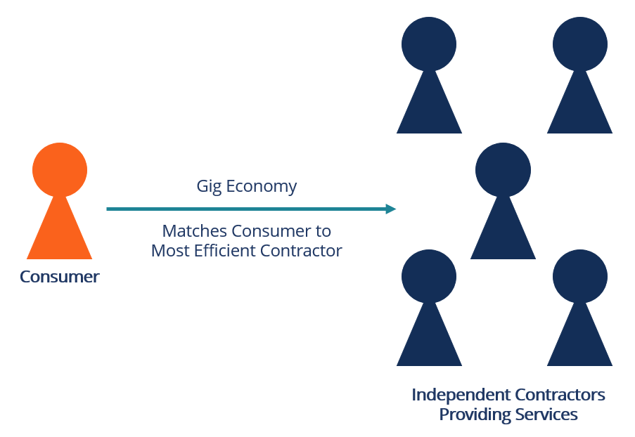

## Table of Contents

## What is the freelance economy?

The freelance economy is when people work for themselves instead of having a regular job with a company. They do different kinds of jobs for different clients and get paid for each job they do. This can include things like writing, designing, programming, or consulting. People choose freelancing because it gives them the freedom to work when and where they want, and they can pick the projects they like.

Freelancers use websites and apps to find work. They can set their own prices and work with clients from all over the world. The freelance economy is growing because more companies are hiring freelancers instead of full-time employees. This helps companies save money and get the skills they need for specific projects. However, freelancers have to manage their own taxes, health insurance, and other benefits, which can be challenging.

## How has the freelance economy evolved over time?

The freelance economy has changed a lot over the years. In the past, freelancing was not very common. Most people worked regular jobs with companies. But as technology got better, it became easier for people to work from home and find clients online. Websites and apps like Upwork and Fiverr started to help freelancers find work. This made freelancing more popular because people could work from anywhere and choose their own projects.

Over time, more and more people started to see the benefits of freelancing. Companies also began to like hiring freelancers because it helped them save money and get specific skills for short projects. This led to a big growth in the freelance economy. Today, freelancing is a big part of the job market. People from all over the world can work together, and freelancers can find all kinds of jobs. But it also means freelancers have to take care of their own taxes and benefits, which can be hard.

## What are the main advantages of participating in the freelance economy?

One of the main advantages of participating in the freelance economy is the flexibility it offers. Freelancers can choose when and where they work, which means they can set their own schedules and work from anywhere. This is great for people who want to balance work with family life or other interests. They can also pick the projects they enjoy and work with clients they like. This freedom can make work more enjoyable and less stressful.

Another big advantage is the potential to earn more money. Freelancers can set their own rates and work on multiple projects at the same time. This can lead to higher earnings compared to a regular job. Plus, freelancers can find clients from all over the world, which means more opportunities to make money. They also have the chance to develop a wide range of skills by working on different types of projects, which can make them more valuable in the job market.

## What are the common challenges and disadvantages faced by freelancers?

One of the biggest challenges for freelancers is the lack of job security. Unlike regular jobs, freelancing doesn't come with a steady paycheck. Freelancers often have to look for new projects all the time, and there can be times when they don't have any work. This can make it hard to plan for the future and can be stressful. Also, freelancers usually don't get benefits like health insurance, paid time off, or retirement plans. They have to pay for these things themselves, which can be expensive and hard to manage.

Another challenge is dealing with taxes. Freelancers need to keep track of their income and expenses, and they have to pay taxes on their earnings. This can be complicated, especially for people who are new to freelancing. They might need to hire an accountant, which costs money. Freelancers also have to deal with clients who might not pay on time or might not be happy with the work. This can lead to disagreements and stress. Overall, while freelancing offers a lot of freedom and potential for higher earnings, it also comes with a lot of responsibility and challenges that freelancers need to be ready to handle.

## How does the freelance economy impact traditional employment?

The freelance economy is changing the way companies think about hiring. Instead of having a lot of full-time employees, more companies are choosing to hire freelancers for specific projects. This helps companies save money because they don't have to pay for things like health insurance and office space for freelancers. It also lets companies get the right skills for each project without having to keep people on staff all the time. This means fewer traditional jobs are available, and more people are working as freelancers.

This shift can make it harder for people looking for regular jobs. With more companies hiring freelancers, there are fewer opportunities for full-time positions. People who want stable jobs might find it harder to get them. On the other hand, the freelance economy can also create new opportunities for people who want to work independently. It gives people the chance to try different kinds of work and build their skills in ways that traditional jobs might not allow. So, while it can be tough on traditional employment, it also opens up new ways for people to make a living.

## What skills are most in demand in the freelance economy?

In the freelance economy, skills that are most in demand often have to do with technology and creativity. People who know how to code, design websites, or work with data are very popular. These skills help companies build and improve their online presence and work more efficiently. Writing and editing skills are also important, especially for creating content for websites, social media, and marketing materials. Being good at these things can help freelancers find a lot of work.

Another set of skills that are in high demand are those related to marketing and sales. Freelancers who can help companies reach more customers and sell more products are very valuable. This includes skills like digital marketing, SEO, and social media management. Also, freelancers who can offer consulting services in areas like business strategy or financial planning are sought after. Being able to speak more than one language is also a big plus, as it helps freelancers work with clients from different countries.

## How can someone start a career as a freelancer?

To start a career as a freelancer, you first need to figure out what skills you have that people might need. Think about what you're good at, like writing, designing, coding, or something else. Once you know your skills, you can start looking for work. There are websites like Upwork, Fiverr, and Freelancer where you can create a profile and find jobs. Make sure your profile is clear and shows off your skills and experience. You can also look for work on social media or by asking friends and family if they know anyone who needs help.

Once you start getting jobs, it's important to do good work and keep your clients happy. This can lead to more work and good reviews, which will help you get more jobs in the future. You'll also need to learn how to manage your time and money. Keep track of your income and expenses, and set aside money for taxes. It can be helpful to talk to other freelancers or join a group where you can share tips and advice. Starting a freelance career takes time and effort, but with the right skills and a good work ethic, you can build a successful business.

## What are the legal and tax considerations for freelancers?

Freelancers need to think about legal and tax stuff when they start working. One big thing is that freelancers are usually their own bosses, so they have to follow the rules for self-employed people. This means they need to register their business, maybe get a license, and make sure they follow any rules for their type of work. They also need to have contracts with their clients to make sure everyone knows what the work is and how much it costs. This can help avoid problems later.

Taxes are another important thing for freelancers. They have to pay taxes on the money they make, but they can also take some money off for things they need for work, like a computer or a home office. Freelancers usually have to pay taxes every few months instead of just once a year, so they need to keep good records of their money. It can be a good idea to talk to a tax person to make sure they do everything right and don't pay more than they need to.

## How do freelancers find and secure work?

Freelancers find work by using websites like Upwork, Fiverr, and Freelancer. They make a profile on these sites and show off their skills and past work. They can look for jobs that match what they can do and apply for them. It's important for freelancers to write good proposals to show clients why they should be hired. They can also find work by networking. This means talking to people they know, going to events, and using social media to meet new people who might need their help.

Once freelancers find a job, they need to do good work to keep getting more jobs. Happy clients can give good reviews and tell other people about the freelancer, which can lead to more work. Freelancers should always talk clearly with their clients about what the job is, how long it will take, and how much it will cost. Having a good contract can help make sure everyone understands and agrees on these things. By doing great work and keeping clients happy, freelancers can build a strong reputation and keep finding new jobs.

## What tools and platforms are essential for freelancers?

Freelancers need some important tools to do their work well. One big tool is a good computer or laptop, because they use it for everything from writing to designing. They also need software that helps them with their work, like Adobe Photoshop for designers or Microsoft Word for writers. Another important tool is a project management app, like Trello or Asana, which helps them keep track of what they need to do and when. Time tracking apps, like Toggl or Harvest, are also useful for seeing how long they spend on different jobs and making sure they get paid fairly.

Freelancers also use online platforms to find work and talk to clients. Websites like Upwork, Fiverr, and Freelancer are great places to look for jobs and make a profile to show off their skills. Social media, like LinkedIn, can help them meet new people and find more work. For talking to clients, freelancers use tools like email, Slack, or Zoom to keep in touch and share files. Having a good website or portfolio where they can show their past work is also important for getting new clients. By using these tools and platforms, freelancers can do their work better and find more jobs.

## How can freelancers ensure a stable income?

Freelancers can make their income more stable by having a lot of different clients. Instead of working with just one or two, they should try to work with many clients at the same time. This way, if one client doesn't have work for them, they can still make money from other clients. Freelancers should also keep looking for new jobs all the time, even when they are busy. Using websites like Upwork and Fiverr to find new work can help them keep their income steady.

Another way to have a stable income is to set aside some money for times when they might not have as much work. Freelancers should save some of their earnings every month so they have money to live on during slow times. They can also offer different kinds of services or learn new skills to attract more clients. By doing good work and keeping clients happy, freelancers can get repeat business and referrals, which can help keep their income steady.

## What are some successful case studies or examples of freelancers in different industries?

One successful freelancer is Sarah, a graphic designer. She started freelancing after working at a design company for a few years. Sarah used websites like Upwork to find clients and built a strong portfolio showing her work. She now works with clients all over the world, designing logos, websites, and marketing materials. Sarah makes sure to save some money every month for taxes and slow times. She also keeps learning new design tools to stay competitive. Her income is stable because she has many clients and always looks for new work.

Another example is Mike, a freelance writer. Mike used to work at a newspaper but decided to go freelance to have more freedom. He joined platforms like Fiverr and started writing articles, blog posts, and social media content for different clients. Mike makes sure to communicate clearly with his clients and always meets his deadlines. He has built a good reputation, which helps him get more work through referrals. Mike also saves money for taxes and slow periods. He enjoys the variety of projects he gets to work on and the flexibility of freelancing.

## References & Further Reading

[1]: Bergstra, J., Bardenet, R., Bengio, Y., & Kégl, B. (2011). ["Algorithms for Hyper-Parameter Optimization."](https://proceedings.neurips.cc/paper/2011/file/86e8f7ab32cfd12577bc2619bc635690-Paper.pdf) Advances in Neural Information Processing Systems 24.

[2]: ["Advances in Financial Machine Learning"](https://www.amazon.com/Advances-Financial-Machine-Learning-Marcos/dp/1119482089) by Marcos Lopez de Prado

[3]: ["Evidence-Based Technical Analysis: Applying the Scientific Method and Statistical Inference to Trading Signals"](https://www.amazon.com/Evidence-Based-Technical-Analysis-Scientific-Statistical/dp/0470008741) by David Aronson

[4]: ["Machine Learning for Algorithmic Trading"](https://github.com/stefan-jansen/machine-learning-for-trading) by Stefan Jansen

[5]: ["Quantitative Trading: How to Build Your Own Algorithmic Trading Business"](https://www.amazon.com/Quantitative-Trading-Build-Algorithmic-Business/dp/1119800064) by Ernest P. Chan