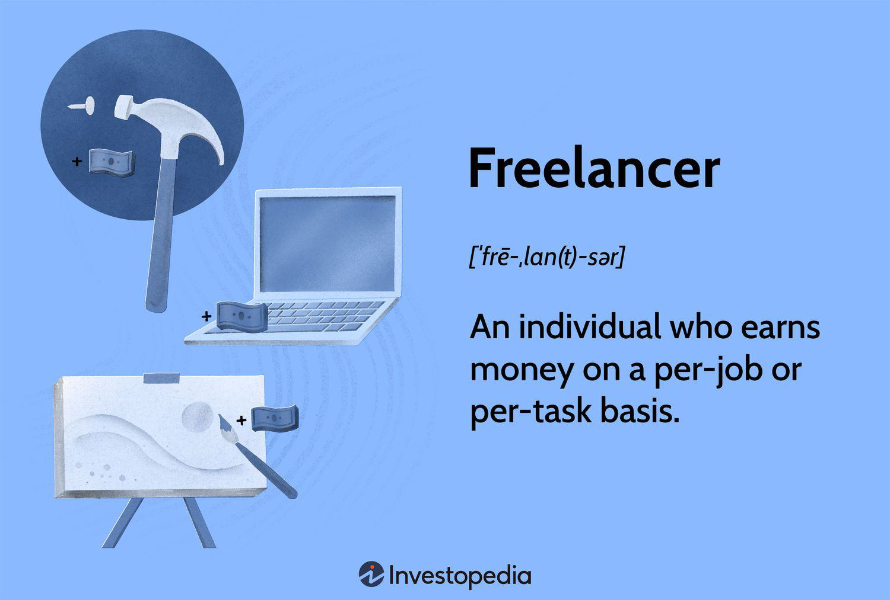

In the contemporary job landscape, two major trends have emerged: the freelance economy and algorithmic trading. Although they may seem unrelated at first glance, both involve independent work and the integration of evolving technologies. The freelance economy signifies a shift where an increasing number of individuals are opting for flexible, short-term contracts over traditional full-time employment. This model empowers workers to choose projects that align with their skills and preferences, often providing more autonomy and the potential for varied income streams.

Concurrently, algorithmic trading, or algo trading, is revolutionizing financial markets by utilizing computer algorithms to execute trades at high speeds. This method is especially appealing to freelancers or self-employed professionals who have the necessary technical expertise. Algo trading allows these individuals to capitalize on rapid market fluctuations, often leading to profitable opportunities that are not easily discernible to human traders.



This article examines the pros and cons of freelancing, its interaction with the gig economy, and the integration of algorithmic trading within this dynamic framework. Understanding these trends is vital for navigating the modern economy, as they present unique opportunities and challenges that can redefine employment and investment landscapes. By comprehending the nuances of both the freelance economy and algorithmic trading, individuals and organizations can better adapt to and thrive in an increasingly digital and flexible world.

## Table of Contents

## Understanding the Freelance Economy

The freelance economy is characterized by a labor market in which individuals engage in short-term contracts rather than permanent employment. This flexible work arrangement allows individuals to offer their services for specific projects, typically through digital platforms, enhancing accessibility and reach. Technology serves as a cornerstone in facilitating the growth of the freelance economy, particularly within the gig economy framework. Digital platforms such as Upwork, Fiverr, and Toptal offer freelancers opportunities to connect with clients globally, enabling them to present their skills and services in a competitive marketplace.

Freelancers benefit significantly from the ability to choose their work schedules, allowing them to maintain a balance between multiple jobs and manage their time more effectively. This flexibility can lead to an improved work-life balance, as individuals can work from diverse locations, eliminating the need for a fixed office space. Such arrangements are appealing to those who value autonomy over their work environment and lifestyle.

Key examples of freelance work span across various fields, including technology, design, and writing. These sectors have been significantly impacted by the freelance economy due to their non-reliance on physical presence, which aligns naturally with remote work capabilities. Recently, algorithmic trading has also become a notable domain within freelance work. Freelancers with expertise in programming and financial markets can leverage algorithms to execute trades autonomously, thereby entering an industry traditionally dominated by full-time professionals.

The gig economy, a subset of the freelance economy, emphasizes temporary, flexible jobs often completed via online platforms. This sector’s expansion has been driven by the demand for on-demand services, which in turn has been enabled by mobile technology and broadband internet access. As gig roles frequently involve smaller tasks or projects (otherwise known as gigs), they provide individuals with the ability to tailor their workload to fit personal schedules, financially benefiting from multiple income streams.

In summary, the freelance economy provides a dynamic alternative to conventional employment, powered by technological advancements and the global reach of digital platforms. This evolution not only transforms how work is performed but also broadens the employment landscape for a wide array of professional fields.

## Advantages of Freelancing in the Gig Economy

Freelancing, particularly within the gig economy, presents numerous advantages that attract individuals seeking a more adaptable work lifestyle. One of the most significant benefits is the flexibility it affords, allowing freelancers to set their own hours and design a work-life balance that caters to personal preferences. This flexibility not only helps in managing personal and professional commitments but also enhances overall satisfaction and productivity. 

The freelance model provides opportunities across a wide array of fields, giving individuals the freedom to engage in diverse projects. With the ability to selectively choose tasks that align with their interests and strengths, freelancers can cultivate a varied skill set. This autonomy in project selection empowers freelancers to control their work environment, adapting it to their specific needs, which can enhance creativity and innovation. 

Working independently also fosters an entrepreneurial mindset. Freelancers need to manage their own businesses, which involves hunting for new opportunities, negotiating contracts, and satisfying clients, all of which are essential entrepreneurial skills. When effectively managed, freelancing can yield substantial income. Individuals have the opportunity to set competitive rates and take on multiple projects, potentially leading to higher earnings than traditional employment structures.

Companies also reap benefits by engaging freelancers. Primarily, they can reduce costs associated with full-time employees, such as benefits, office space, and ongoing training expenses. Freelancers can be hired on an as-needed basis, which allows businesses to remain agile and competitive, particularly important in fast-evolving industrial sectors.

Incorporating [algorithmic trading](/wiki/algorithmic-trading) as a freelance activity provides particular economic advantages. With technological advancements, freelance traders can exploit market efficiencies at unprecedented speeds. The automation capabilities inherent in algo trading mean freelancers can execute trades more efficiently compared to manual processes. The potential for significant earnings is heightened by the ability to trade numerous financial instruments simultaneously and continuously, which can amplify profitability if done with expertise.

Overall, freelancing in the gig economy confers substantial rewards to both individuals and companies, with technological inputs like algorithmic trading offering exciting prospects for savvy freelancers.

## Disadvantages of Freelancing

Freelancing, while offering flexibility and autonomy, is not without its challenges. One primary disadvantage is income instability. Unlike traditional employees who receive consistent paychecks, freelancers must continuously seek new projects or clients to maintain a steady income stream. This ongoing search for work can lead to periods of financial uncertainty, particularly when market demand for specific skills diminishes or competition intensifies.

Moreover, freelancers miss out on employment benefits typically provided by traditional employers, such as health insurance, paid leave, and retirement savings plans. This lack of benefits requires freelancers to independently secure health coverage and plan for their retirement, often at a higher cost compared to group plans offered by employers. In the United States, for example, freelancers may struggle with navigating options within the Health Insurance Marketplace or face high premiums for private insurance plans. Additionally, the responsibility of managing retirement savings falls entirely on freelancers, who must navigate savings vehicles like IRAs or solo 401(k)s, which can be complex and demanding in terms of financial literacy.

Another significant issue is the burden of self-employment taxes. Freelancers, classified as self-employed, must pay both the employee and employer portions of Social Security and Medicare taxes. This can lead to a higher overall tax burden, which necessitates careful financial planning and budgeting to ensure timely tax payments.

Regulation within the freelance economy is often sparse, leading to potential exploitation. Without the protections afforded in traditional employment settings, freelancers can experience disparities in income and working conditions. For instance, payment terms and rates may be inconsistent or prone to unilateral changes by clients, resulting in income disparities. Furthermore, freelancers may lack mechanisms for addressing grievances or resolving disputes, which can lead to unfair treatment.

In the context of algorithmic trading, freelancers face additional challenges. The inherent [volatility](/wiki/volatility-trading-strategies) of financial markets can exacerbate income instability for freelance traders who rely on algorithmic strategies. Market conditions can change rapidly, impacting the effectiveness of previously successful trading algorithms. This volatility necessitates a robust understanding of both technological tools and market dynamics to adapt strategies quickly. The absence of a steady work environment further complicates financial planning for those in this niche, stressing the need for continuous skill enhancement and adaptation to market trends.

## Special Considerations for Freelancers

The freelance economy is a dynamic aspect of the modern job market, largely driven by technological advancements and the increasing demand for flexible work arrangements. As companies look to manage costs, many are turning to freelancers to fill roles traditionally occupied by full-time employees, leading to substantial shifts in employment paradigms. This shift highlights the dual challenge and opportunity facing freelancers today, especially in adapting to the legal and financial frameworks necessitated by self-employment.

Freelancers must navigate a complex landscape of legal and financial responsibilities that do not typically affect traditional employees. These include understanding tax obligations unique to self-employment, such as the need to pay self-employment taxes, which encompass both employer and employee portions of social security and Medicare taxes. Additionally, freelancers must manage their own retirement savings plans, health insurance, and other benefits that employers usually provide.

Moreover, freelancers often juggle diverse projects that require a broad skill set, while also needing to develop specialized expertise. This is particularly important in niche markets such as algorithmic trading, which require proficiency in both financial markets and programming skills. Freelancers in this field must frequently update their knowledge and skills, given the rapid pace of technological change and the highly competitive nature of the market. Mastery of languages such as Python and a deep understanding of financial instruments are essential. An example Python pseudocode for algorithmic trading might include:

```python
def calculate_moving_average(prices, window_size):
    return sum(prices[-window_size:]) / window_size

# Example usage
prices = [120, 125, 130, 128, 127]
window_size = 3
moving_average = calculate_moving_average(prices, window_size)
print(f"The moving average is: {moving_average}")
```

Recent regulatory developments reflect growing awareness of the need to better protect freelancers within the gig economy. Various jurisdictions are considering or have already enacted measures aimed at providing more comprehensive protections and fair treatment for gig workers. These include, but are not limited to, regulations concerning minimum wage standards, health benefits, and the classification of workers as independent contractors versus employees. Such regulatory changes are critical in ensuring that the benefits of freelancing—such as flexibility and autonomy—do not come at the expense of adequate protections and fair compensation.

Overall, freelancers must remain adaptable and informed as they navigate these evolving challenges. By staying updated on regulatory changes and continuously enhancing their skills, freelancers can better position themselves for success in an increasingly competitive and expansive gig economy.

## Algorithmic Trading in the Gig Economy

Algorithmic trading sits at the convergence of advanced technology and the freelance economy, marking a transformative shift in how financial markets operate. This type of trading involves using complex computer algorithms to execute trades at speeds and frequencies impossible for human traders, thereby capitalizing on patterns and market inefficiencies that are often not discernible to the naked eye.

Freelance traders have increasingly adopted algorithmic trading due to its potential for high gains and flexibility. However, entering this field requires proficiency in both the financial markets and computer programming. High-level programming languages such as Python and C++ are frequently used to develop trading algorithms because they offer the ability to handle large datasets efficiently and execute trades quickly. The adaptability and resourcefulness ingrained in freelancers are valuable assets when facing the high competition and constantly evolving landscape of algorithmic trading.

To illustrate the technical complexity involved, consider a simple moving average crossover strategy, which a freelance trader might implement using Python:

```python
import numpy as np
import pandas as pd

# Sample data: historical prices
data = {'Price': [110, 112, 115, 113, 116, 120, 118]}
df = pd.DataFrame(data)

# Calculate moving averages
short_window = 2
long_window = 3

df['Short_MAvg'] = df['Price'].rolling(window=short_window, min_periods=1).mean()
df['Long_MAvg'] = df['Price'].rolling(window=long_window, min_periods=1).mean()

# Generate trading signals
df['Signal'] = 0 
df['Signal'][short_window:] = np.where(df['Short_MAvg'][short_window:] > df['Long_MAvg'][short_window:], 1, 0)

# Calculate positions
df['Position'] = df['Signal'].diff()

print(df)
```

This simple code demonstrates how a trader might generate buy/sell signals based on short-term and long-term moving average crossovers. Implementing more sophisticated strategies requires an understanding of statistical models, [machine learning](/wiki/machine-learning) algorithms, and real-time data processing capabilities.

The field of algo trading presents numerous opportunities for freelancers due to its scalability and the absence of geographical constraints. The increased connectivity and digital nature of trading platforms allow freelancers to operate globally, tapping into diverse markets and leveraging cross-border opportunities. However, this also introduces challenges related to market dynamics, regulatory considerations, and cybersecurity risks, which freelancers must navigate effectively.

The rise of algorithmic trading underscores a broader trend in the freelance economy, where individuals leverage technology and specialized skills to enter competitive, high-reward fields. As these trends progress, algorithmic trading will likely continue to grow, offering tech-savvy freelancers new avenues for income and professional development. However, success in this sector demands continuous skill enhancement, adaptability, and a keen understanding of both market trends and evolving technologies.

## Conclusion

The freelance economy is reshaping how individuals find work and balance their personal and professional lives. As more people transition from traditional employment models to freelance roles, the landscape of work is undergoing a significant transformation. This shift offers remarkable flexibility, enabling individuals to choose when and where they work, and providing opportunities across various fields, including emergent areas like algorithmic trading. Technologies continue to facilitate this evolution, allowing freelancers to leverage sophisticated tools and platforms that were previously inaccessible.

However, freelancing also presents considerable challenges that warrant attention. Income instability and the lack of traditional employee benefits can pose significant obstacles for freelancers. Additionally, independent workers face the continuous task of seeking new projects or clients, which can lead to job insecurity. The burden of self-employment taxes and retirement planning also falls solely on freelancers, unlike traditional employees who may benefit from employer-sponsored plans.

Algorithmic trading within the freelance economy serves as a prime example of how technological advancements are creating new pathways for freelancers. By utilizing algorithms to execute trades at high speeds, freelancers in this niche can capitalize on volatile market conditions. Nonetheless, this field demands a high level of technical skill and market understanding, making it accessible predominantly to those with a strong background in technology and finance.

Understanding the pros and cons of freelancing is crucial for both individuals and companies aiming to navigate the modern labor market effectively. Companies benefit from the flexibility of hiring freelancers, reducing costs associated with full-time employment, while freelancers can cultivate diverse skills and attain significant earnings if managed well.

As the gig economy continues to expand, it is imperative for policymakers to introduce regulations that both protect freelancers and foster innovation and growth. This includes addressing disparities in income and offering protections that traditional employees receive, thereby ensuring equitable treatment across all forms of employment. This dual approach encourages a vibrant economy where freelance workers can thrive while contributing to broader economic innovation.

## References & Further Reading

[1]: Bergstra, J., Bardenet, R., Bengio, Y., & Kégl, B. (2011). ["Algorithms for Hyper-Parameter Optimization."](https://proceedings.neurips.cc/paper/2011/file/86e8f7ab32cfd12577bc2619bc635690-Paper.pdf) Advances in Neural Information Processing Systems 24.

[2]: ["Advances in Financial Machine Learning"](https://www.amazon.com/Advances-Financial-Machine-Learning-Marcos/dp/1119482089) by Marcos Lopez de Prado

[3]: ["Evidence-Based Technical Analysis: Applying the Scientific Method and Statistical Inference to Trading Signals"](https://www.amazon.com/Evidence-Based-Technical-Analysis-Scientific-Statistical/dp/0470008741) by David Aronson

[4]: ["Machine Learning for Algorithmic Trading"](https://github.com/stefan-jansen/machine-learning-for-trading) by Stefan Jansen

[5]: ["Quantitative Trading: How to Build Your Own Algorithmic Trading Business"](https://www.amazon.com/Quantitative-Trading-Build-Algorithmic-Business/dp/1119800064) by Ernest P. Chan