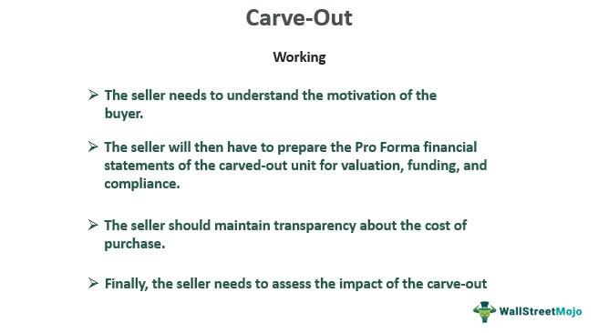

The modern landscape of corporate strategies involves various maneuvers, one of which is termed as 'freeze out'. A freeze out, also known as a squeeze out, is a strategy primarily employed by majority shareholders to exert pressure on minority stakeholders, compelling them to sell their shares. This strategy is often seen in scenarios where consolidating control is essential, such as corporate restructurings, mergers, or acquisitions. Majority shareholders typically engage in freeze outs to streamline decision-making processes, remove dissident parties, or increase profitability by acquiring undervalued shares from minority shareholders.

The implications of freeze outs in the corporate world are multifaceted. On the one hand, they can lead to more efficient governance and operational control by eliminating minority dissent. On the other hand, they raise questions about fairness and minority shareholders' rights, as these tactics can be perceived as coercive and exploitative. Legal frameworks have evolved to address these concerns, emphasizing fairness and equality in dealing with minority shareholders.

Furthermore, the intersection of freeze out strategies with algorithmic trading introduces a complex dynamic in the financial markets. Algorithmic trading has revolutionized stock trading by leveraging computer algorithms to execute trades at high speeds, vastly influencing stock prices and market behaviors. In the context of freeze outs, algorithmic trading might be used to exert additional pressure on minority shareholders, indirectly manipulating stock prices to favor majority shareholders' interests. This intersection underlines the need for ethical business practices and robust regulatory oversight to ensure that financial innovations do not exacerbate existing disparities within corporate governance structures.

This article explores the concept of freeze out, delving into its implications across various sectors of the corporate world and examining how it intersects with the rapidly evolving landscape of algorithmic trading strategies. Ensuring ethical integrity and fairness in these strategies remains a critical consideration as corporations and stakeholders navigate the complexities of contemporary financial dynamics.

## Table of Contents

## Understanding Freeze Out and Squeeze Out

A freeze out, alternatively known as a squeeze out, is a strategic maneuver typically enacted by majority shareholders to push minority shareholders to relinquish their shares in a company. This strategy is particularly prevalent in scenarios involving corporate mergers and acquisitions, where tensions between different shareholder groups are more pronounced. The majority stakeholders, wielding significant control over corporate operations, may utilize various methods to achieve a freeze out.

One common tactic involves the cessation of dividend payouts, which can significantly affect minority shareholders, particularly those relying on dividends for income. By halting these payouts, the majority shareholders create financial pressure on minority ones, potentially driving them to sell their shares at a disadvantageous time. Another approach may involve the termination of roles for minority shareholders who are also employees of the company. This not only removes the shareholder's influence within the company but also serves as an economic pressure point, coercing them into selling their stakes.

These actions present significant issues concerning fairness and legality. Ethically, they raise questions about the rights of minority shareholders and the responsibilities of the majority to protect those rights. Legally, while some jurisdictions provide frameworks that allow freeze outs under specific conditions, others set strict regulations to prevent abuse of power. For instance, legal standards often require that any offer to buy out minority shareholders be conducted at a fair price, reflective of the market value of shares.

In mergers and acquisitions, freeze outs become a focal point of negotiations and regulatory scrutiny. The legal landscape aims to balance the majority's strategic interests with protecting minority rights, ensuring that any squeeze-out strategy does not equate to shareholder oppression. This is crucial because when improperly executed, they can result in significant legal repercussions for the majority shareholders and potentially damage the corporation’s reputation.

Understanding the intricacies of a freeze out is essential for all stakeholders involved, as it impacts decision-making and corporate governance. As corporate dynamics evolve, continually reassessing the fairness and legality of such strategies becomes increasingly necessary.

## The Legal Landscape of Freeze Outs

Historically, the legal landscape surrounding freeze outs has been shaped by the need to balance the interests of majority and minority shareholders while ensuring fair treatment and compliance with corporate laws. Freeze outs, also known as squeeze outs, often involve significant legal scrutiny because they can potentially disadvantage minority shareholders and raise issues related to fairness in corporate transactions.

The landmark case Sterling v. Mayflower Hotel Corp serves as a pivotal reference point in this regard. Decided in the 1950s, this case set important legal precedents by underscoring the necessity of fair dealing in corporate mergers and acquisitions involving freeze outs. The court emphasized that majority shareholders owe a fiduciary duty to minority shareholders, requiring transactions to be intrinsically fair. This includes considering both the process of the transaction and the consideration offered to minority shareholders.

Despite the potential ethical concerns associated with freeze outs, legal frameworks have gradually evolved to permit these transactions under specific conditions. Modern legal standards often require that freeze outs comply with stringent procedural and substantive fairness standards. Procedural fairness involves ensuring that minority shareholders receive adequate information and have the opportunity to voice objections, while substantive fairness pertains to the fairness of the transaction price and terms.

Moreover, the legal evolution reflects an increasing sophistication in dealing with freeze outs, with courts and regulators developing more nuanced approaches to assess these transactions. Legal rules are continually being refined to address emerging concerns and to incorporate more robust protections for minority shareholders. For instance, some jurisdictions have introduced appraisal rights, allowing minority shareholders to dissent from a freeze out and seek a judicial determination of the fair value of their shares.

In summary, while freeze outs continue to present challenges related to equity and ethics, especially given their impact on minority interests, the legal environment aims to ensure that these transactions are conducted with fairness and transparency. As the corporate landscape continues to evolve, legal doctrines related to freeze outs are likely to adapt further, potentially introducing new regulatory measures to safeguard the interests of all stakeholders involved.

## Algorithmic Trading: A Dynamic Approach

Algorithmic trading leverages sophisticated computer programs to execute trades at speeds surpassing human capability. This approach to trading relies on complex algorithms that evaluate high volumes of data to make instantaneous decisions regarding the buying and selling of stocks. The primary advantage of [algorithmic trading](/wiki/algorithmic-trading) is its ability to respond to market conditions with incredible speed and precision, making it a dominant force in the modern trading landscape.

Transforming the traditional trading environment, algorithmic trading has significantly modified how transactions are conducted. Traditionally, trading required traders to be physically present on the floor and make decisions in real-time. Today, however, these electronic trading algorithms can analyze vast datasets, identify price patterns, and execute trades much faster than any human trader could. This has led to increased market efficiency and [liquidity](/wiki/liquidity-risk-premium) but has also raised concerns about the potential for market manipulation and [volatility](/wiki/volatility-trading-strategies).

Opportunities presented by algorithmic trading in managing corporate strategies include the ability to quickly capitalize on market trends and the potential to influence stock prices through strategic trading patterns. For example, a firm might employ an algorithm to initiate large block trades designed to adjust a stock's supply and demand dynamics, thus impacting its price in a way that aligns with broader corporate objectives, such as a freeze out strategy where majority shareholders might seek advantageous conditions to acquire minority shares.

However, the rise of algorithmic trading also introduces challenges, particularly in the context of ethical and regulatory considerations. The speed and automated nature of algorithmic trades can exacerbate market volatility. Flash crashes, where markets can plummet only to recover within minutes, highlight the potential for algorithms to inadvertently cause widespread disruption. Moreover, there is the risk of algorithms being used for manipulative purposes, such as spoofing, where orders are placed with the intent to cancel before execution to create artificial market movement.

The balance between leveraging the strategic benefits of algorithmic trading and maintaining ethical integrity is essential. As algorithmic trading continues to evolve, it necessitates a comprehensive regulatory framework to mitigate risks and ensure fair market practices. Regulators may need to develop more advanced oversight methodologies and employ technologies that can effectively monitor and govern high-frequency trading activities to prevent abuse.

## Freeze Outs in Algo Trading

Algorithmic trading, characterized by the use of complex algorithms and high-speed data processing, adds a new dimension to traditional freeze out strategies employed by majority shareholders. By utilizing these algorithms, traders can execute large volumes of transactions at speeds unmatched by human traders, significantly affecting stock prices and market conditions. This capability can be strategically leveraged to influence the stock valuations in ways that pressure minority shareholders into selling their shares.

One of the primary tactics in this context is market manipulation through algorithmic trading. By executing rapid trades, algorithms can create an artificial price movement or liquidity illusion, affecting the perceived value of a company's shares. For instance, if algorithms are programmed to sell a substantial number of shares in short succession, it could precipitate a sudden drop in the stock price. This engineered volatility can create panic among minority shareholders, potentially coercing them into offloading their shares at undervalued prices, thus enabling a freeze out.

Understanding this intersection of freeze outs and algorithmic trading is not merely an academic exercise but a necessity for maintaining fair market practices. Regulatory authorities face considerable challenges in monitoring and controlling such practices, as the automated nature of algorithmic trading complicates the identification and proof of manipulative intent. Developing robust frameworks that can detect and mitigate these manipulative strategies is vital to safeguarding ethical business practices.

To mitigate such risks, corporations and regulators must invest in technology and systems capable of real-time surveillance and analysis of trading activities. Implementing advanced algorithms for monitoring purposes can help identify unusual trading patterns that may indicate manipulative tactics. Furthermore, collaboration at the international regulatory level is essential, given the borderless nature of modern financial markets.

Overall, algorithmic trading's potential to augment freeze out strategies underscores the need for comprehensive regulatory oversight. As financial strategies evolve with technological advancements, ensuring ethical practices and protecting minority shareholder interests remain key priorities for policymakers and corporate leaders alike.

## Strategic Considerations and Ethical Implications

Freeze outs, while employed as effective corporate strategies, bring forward a host of ethical concerns, primarily focused on minority shareholder rights and corporate governance principles. In executing freeze outs, majority shareholders often wield significant power, resulting in potential imbalances that undermine the equitable treatment of minority investors.

Strategically, businesses must navigate a complex landscape where maximizing shareholder value and maintaining ethical standards intersect. The primary ethical concerns revolve around the potential coercion of minority shareholders and the stripping away of their rights without fair compensation. To mitigate these concerns, corporations need to demonstrate fairness, not only in the process of acquiring minority stakes but also in the valuation of shares and in providing justifiable reasons for the freeze out.

The existing legal frameworks demand that majority shareholders act in good faith and ensure transparency in their transactions. However, the advent of algorithmic trading poses new challenges in maintaining this equilibrium. Algorithmic trading, particularly at high frequencies, can amplify the force of freeze outs by influencing stock volatility and pressuring minority shareholders to sell. This intersection necessitates that companies and regulators remain vigilant in overseeing the ethical dimensions of such strategies.

As the corporate and financial environments become increasingly sophisticated, regulatory bodies are likely to develop more stringent policies to govern the use of algorithmic trading in conjunction with freeze outs. Future regulations may aim to bolster protections for minority shareholders, ensuring they are not subject to undue influence or manipulation resulting from advanced trading technologies. These regulations could include stricter disclosure requirements, enhanced scrutiny of trading patterns, and more definitive guidelines clarifying fair practices in shareholder buyouts.

Balancing strategic interests with ethical considerations is not merely about compliance with regulations but fostering trust among stakeholders. Companies that align their strategies with ethical practices may find not only legal safeguards but also enhanced reputational capital and better long-term shareholder relationships. As the corporate landscape evolves, the commitment to ethical integrity in executing freeze out strategies will be vital in sustaining corporate growth and preserving market fairness.

## Conclusion

The dynamic interplay between freeze out strategies and algorithmic trading exemplifies the complexities of modern financial dynamics. As corporations continue to evolve and enhance their strategic methodologies, it becomes increasingly essential to uphold principles of fair play and ethical integrity. The intricacies involved in these strategic maneuvers require vigilance and conscientiousness from all stakeholders.

Innovation in corporate strategy implementation, especially with the advent of algorithmic trading, introduces a layer of sophistication that can both streamline and complicate traditional business practices. Algorithmic trading, with its unmatched speed and efficiency, presents unique opportunities for executing freeze out strategies, yet it also poses risks of market manipulation and ethical challenges. Thus, a robust understanding of these strategies is vital for stakeholders wishing to effectively navigate and influence the continually transforming corporate and trading environments.

Stakeholders who are well-informed about the mechanics of freeze outs and algorithmic trading are better equipped to anticipate potential impacts and make informed decisions. This knowledge empowers them to shape business practices that are not only strategically sound but also ethically responsible, aligning corporate ambitions with the broader principles of fairness and justice in the marketplace.

In conclusion, the relationship between freeze out strategies and algorithmic trading is a testament to the ongoing evolution of financial and corporate strategy. Ensuring that innovation occurs alongside ethical foresight remains a crucial component for the sustainable development of the corporate world. As these strategies continue to progress and shape the future of corporate and financial practices, stakeholders must remain committed to fostering an environment where strategic innovation is balanced with moral integrity.

## References & Further Reading

[1]: Bebchuk, L. A., & Hamdani, A. (2002). ["Federal Corporate Law: Lessons from History"](https://papers.ssrn.com/sol3/papers.cfm?abstract_id=927008), Columbia Law Review, 102(7), 1583-1647.

[2]: Burkart, M., & Panunzi, F. (2006). ["Takeovers"](https://papers.ssrn.com/sol3/papers.cfm?abstract_id=884080), Encyclopedia of Law and Economics.

[3]: ["Sterling v. Mayflower Hotel Corp."](https://law.justia.com/cases/delaware/supreme-court/1952/93-a-2d-107-1.html) (1952), Court of Appeals of New York.

[4]: Gomber, P., Arndt, B., Lutat, M., & Uhle, T. (2011). ["High-Frequency Trading"](https://papers.ssrn.com/sol3/papers.cfm?abstract_id=1858626), Journal of Financial Regulation and Compliance.

[5]: Hendershott, T., Jones, C. M., & Menkveld, A. J. (2011). ["Does Algorithmic Trading Improve Liquidity?"](https://onlinelibrary.wiley.com/doi/full/10.1111/j.1540-6261.2010.01624.x), The Journal of Finance, 66(1), 1-33.

[6]: DeMarzo, P., Fishman, M. J., & Wang, C. (2005). ["Contracting and Turnover in a Principal-Agent Model of Freezeouts"](https://www.semanticscholar.org/paper/Optimal-Long-Term-Financial-Contracting-DeMarzo-Fishman/db8e22569bafb407d071d345cde1f5491f7a2620), Journal of Financial Economics, 77(3), 69-89.