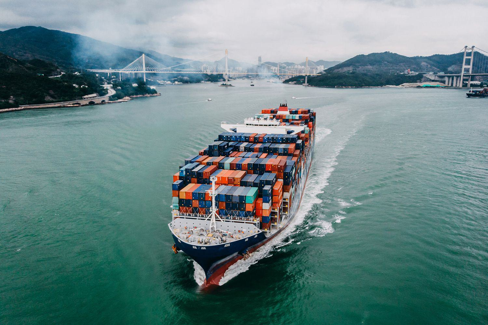

Freight derivatives are vital financial instruments utilized in the shipping and finance industries. They offer indispensable tools for managing the inherent volatility within freight markets. By allowing stakeholders such as shipowners, charterers, and traders to hedge against unpredictable changes in freight rates, these derivatives play a significant role in stabilizing financial performance and optimizing risk management strategies. The shipping industry's complex and volatile nature often leads to fluctuating freight rates, impacting companies' profitability and economic stability. Freight derivatives provide a mechanism for these entities to mitigate such price risks effectively, enhancing their ability to maintain consistent financial operations.

This article focuses on the significance and functioning of freight derivatives. We will examine how these instruments facilitate cargo trading, and explore the growing application of algorithmic trading within the shipping sector. Freight derivatives not only help stakeholders manage risks but also contribute significantly to market liquidity. By enabling participants to buy and sell contracts based on future freight rates, they enhance the tradability and reduce price disparities in the shipping industry.



Understanding the dynamics of freight derivatives is crucial for companies involved in maritime activities, as these instruments offer strategic advantages in navigating economic uncertainties and securing favorable market positions.

## Table of Contents

## Understanding Freight Derivatives

Freight derivatives are financial instruments uniquely linked to the future movements of freight rates. These derivatives serve as pivotal tools for managing the inherent volatility associated with freight rates in the global shipping industry. By enabling stakeholders to predict and hedge against fluctuations in freight rates, these instruments provide a mechanism to stabilize financial outcomes in an otherwise unpredictable market.

The intricacies of freight rate volatility stem from various factors, including fluctuating demand for shipping services, changes in fuel prices, geopolitical tensions, and seasonal variations. For businesses heavily involved in logistics and transportation, such volatility presents substantial risks that could impact profitability and operational stability. Shipowners, grain houses, and integrated oil companies commonly face these challenges, given their dependence on reliable freight services for the movement of goods and commodities.

To mitigate these risks, enterprises employ freight derivatives to hedge against adverse price movements effectively. By entering into contracts that lock in specific freight rates in advance, these companies can safeguard themselves against unexpected cost increases in shipping. This not only facilitates financial planning but also enhances competitiveness by ensuring consistent pricing strategies despite across-the-board market fluctuations.

Moreover, freight derivatives contribute to market [liquidity](/wiki/liquidity-risk-premium), adding depth to trading activities in the freight sector. Increased liquidity enables more efficient price discovery, allowing market participants to make informed decisions. As freight derivatives standardize the pricing of shipping routes and services, they play a crucial role in providing a transparent and reliable reference point for freight costs, facilitating smoother trade operations globally.

In summary, freight derivatives function as essential instruments for the efficient management of freight rate risks. By providing a mechanism to hedge against [volatility](/wiki/volatility-trading-strategies), they cater to the strategic needs of key maritime stakeholders, thereby playing a critical role in the broader framework of shipping finance and the global supply chain.

## Types of Freight Derivatives

Freight derivatives are instrumental in providing mechanisms for managing risk associated with freight rate fluctuations. They encompass several types, each serving distinct functions within the shipping industry.

**Exchange-Traded Futures** are standardized contracts traded on exchanges, where the buyer agrees to purchase, and the seller agrees to sell, a given asset at a predetermined future date and price. These futures provide transparency and liquidity, as they are facilitated through a central exchange.

**Swap Futures** are agreements to exchange cash flows based on different financial instruments. In the context of freight, swap futures allow parties to mitigate risks associated with fluctuating freight rates by determining cash flow exchanges dependent on future rates.

**Forward Freight Agreements (FFAs)** are contracts between two parties to settle the difference between the current and expected future freight rates. FFAs are predominately used for hedging, allowing participants to lock in rates for future freight needs, thus mitigating the risk of price fluctuations.

$$
\text{Payoff of FFA} = (\text{Settlement Price} - \text{Agreed Price}) \times \text{Quantity of Cargo}
$$

**Container Freight Swap Agreements** are similar to FFAs but specifically tailored for container shipping. These agreements enable shippers to hedge against volatile container shipping rates, ensuring more predictable costs for transporting goods.

Each derivative type addresses the needs of different players in the shipping market. Exchange-traded futures cater to those requiring transparency and liquidity, like shipping companies needing reliable budgets. Swap futures and FFAs are pivotal for entities aiming to hedge risks efficiently, whereas container freight swap agreements are essential for entities that focus on container shipping and require more specialized risk management strategies.

The diversity of freight derivatives allows for targeted risk management strategies, enabling various market participants to navigate the complexities of the shipping industry with greater confidence.

## Role of Freight Derivatives in Shipping Finance

Freight derivatives are essential instruments in shipping finance due to their ability to provide liquidity and manage price risks effectively. By allowing companies to lock in freight rates, these financial instruments help stabilize financial operations amid market fluctuations, making them vital for entities such as shipping firms, commodity traders, and financial institutions.

In essence, freight derivatives operate as a buffer against the unpredictable nature of freight rates, which are subject to a variety of factors including fuel prices, geopolitical events, and global economic changes. This volatility poses a significant challenge for companies that rely on maritime transport, as unexpected price hikes can severely impact profit margins. By using freight derivatives, companies can hedge against these risks and ensure more predictable financial planning.

One typical use case involves a shipping company anticipating the need to transport commodities in the future. By entering into a contract using freight derivatives like Forward Freight Agreements (FFAs), the company can lock in the current freight rate, thereby shielding itself from future price hikes. This hedging strategy is akin to locking a fixed [interest rate](/wiki/interest-rate-trading-strategies) on a loan to protect against future interest rate increases.

The liquidity provided by freight derivatives is another significant advantage. In markets characterized by high levels of uncertainty, liquidity allows participants to enter and [exit](/wiki/exit-strategy) positions with ease, ensuring that financial obligations can be met without the need for disruptive measures. This liquidity is essential for maintaining stability and confidence within the shipping finance ecosystem.

Moreover, freight derivatives serve as a foundation for developing sophisticated financial strategies, such as [algorithmic trading](/wiki/algorithmic-trading). By utilizing historical freight rate data and predictive algorithms, companies can optimize their trading strategies to enhance profitability and efficiency. These advancements not only facilitate better risk management but also contribute to more informed decision-making processes.

In summary, freight derivatives are indispensable for mitigating risks associated with volatile freight rates and are instrumental in enhancing the liquidity and stability of financial operations in the shipping industry. As companies continue to face complex global challenges, the role of these financial instruments is likely to grow even more pivotal.

## Forward Freight Agreements (FFAs)

Forward Freight Agreements (FFAs) are widely utilized financial contracts that allow parties to hedge against the volatility of freight rates in the shipping industry. These agreements enable participants to lock in a freight rate for a future period, thus mitigating the risks associated with fluctuating costs in shipping commodities. The primary function of FFAs is to provide a mechanism for price risk management by establishing fixed future prices for freight services, which is crucial for companies engaged in physical commodity trading.

In practical terms, FFAs serve as a pivotal tool for various entities within the shipping ecosystem, including shipowners, operators, and charterers. By engaging in these agreements, shipping companies can stabilize their income streams and manage operational costs more effectively. For instance, a shipowner anticipating a downturn in freight rates might enter into an FFA contract to secure higher rates today, thereby safeguarding future revenues. Conversely, a company expecting an increase in rates might enter into an FFA to lock in lower prices, ensuring cost efficiency.

FFAs are not confined to shipping companies alone; financial institutions such as banks and hedge funds also actively participate in the FFA market. These entities view FFAs as vehicles for speculative investment and portfolio diversification, leveraging the derivatives' potential for profit through strategic trading. By analyzing market trends and leveraging quantitative models, these financial actors can exploit [arbitrage](/wiki/arbitrage) opportunities and gain exposure to the dynamics of the freight market without the need to engage in physical shipping operations.

Moreover, the FFA market is characterized by significant liquidity, which enhances the appeal of these derivatives. The presence of numerous market participants facilitates the execution of trades and provides depth to the market, allowing for efficient price discovery and minimizing transaction costs. The liquidity in the FFA market also supports the seamless transfer of risk among participants, further cementing the importance of FFAs as integral instruments for managing freight rate volatility.

In summary, Forward Freight Agreements are crucial for hedging and speculative activities across the shipping and finance sectors. They cater to a broad array of stakeholders, enabling effective risk management and offering opportunities for financial gains through strategic market engagement. As a result, FFAs remain a cornerstone of modern shipping finance, fostering stability and growth in an inherently volatile industry.

## Algorithmic Trading in Freight Derivatives

Algorithmic trading has become a pivotal component in the freight derivatives market, primarily due to its ability to significantly enhance trading efficiency and profitability. By utilizing complex algorithms and high-frequency trading strategies, market participants can automate the process of buying and selling freight derivatives, thus improving execution speed and reducing the likelihood of human error.

One of the primary advantages of algorithmic trading in this context is its capacity to process large volumes of market data at incredible speeds, allowing traders to identify arbitrage opportunities and execute trades that would be impossible to detect with manual analysis. For instance, algorithms can be programmed to recognize patterns in freight rate fluctuations, enabling traders to swiftly capitalize on price discrepancies.

Companies such as Norden have successfully integrated algorithmic strategies into their trading operations to navigate the intricate dynamics of freight markets. These strategies often incorporate [machine learning](/wiki/machine-learning) techniques, where algorithms are trained on historical freight data to predictive future price movements and optimize trading decisions. The use of predictive analytics not only aids in anticipating market trends but also assists in risk management by forecasting potential market downturns or upswings.

An example of a simple algorithmic trading strategy might involve the Moving Average Crossover, where traders evaluate two moving averages of different periods. When the short-term moving average crosses above the long-term moving average, it signals a potential buying opportunity, while a crossover in the opposite direction indicates a selling opportunity. A basic Python implementation of this strategy might look like:

```python
import pandas as pd

# Load your dataset: freight_data.csv containing date and price columns
data = pd.read_csv('freight_data.csv')

# Calculate moving averages
data['Short_MA'] = data['price'].rolling(window=10).mean()
data['Long_MA'] = data['price'].rolling(window=50).mean()

# Generate signals
data['Signal'] = 0
data['Signal'][10:] = np.where(data['Short_MA'][10:] > data['Long_MA'][10:], 1, -1)

# Calculate trading positions
data['Position'] = data['Signal'].diff()

# Output the first few rows to observe signals and positions
print(data.head())
```

This script calculates short-term and long-term moving averages from freight derivatives prices and generates buy or sell signals based on their crossover. The "Position" column will then reflect changes in trading positions, guiding traders on when to buy or sell their freight derivatives.

Despite the clear benefits, algorithmic trading in the freight derivatives market presents challenges, such as the need for substantial technological infrastructure and the potential for market disruption due to high-frequency trading interventions. Additionally, regulatory environments may impose constraints on algorithmic practices, necessitating vigilant compliance by participants. Nonetheless, as technology continues to evolve, the application of algorithmic trading in freight derivatives is likely to expand, offering new and more sophisticated tools for market participants.

## Challenges and Opportunities

Freight derivatives have brought considerable opportunities to the shipping industry, yet they are accompanied by challenges that cannot be overlooked. One of the primary challenges is market volatility, which stems from fluctuations in global trade dynamics, geopolitical tensions, and sudden shifts in supply and demand. These fluctuations make it difficult for market participants to predict future freight rates accurately, thus heightening the risk associated with trading these financial instruments.

Regulatory complexities also pose significant hurdles. The global nature of the shipping industry necessitates compliance with an array of international regulations that can vary significantly from one jurisdiction to another. This regulatory environment can create barriers to entry and increase the operational costs for companies that wish to participate in freight derivative trading. Constantly evolving regulations require companies to stay informed and adaptable, which can be resource-intensive.

Despite these challenges, freight derivatives present valuable opportunities. Innovations such as algorithmic trading offer significant potential for optimizing trading processes. Algorithmic trading involves using complex algorithms to automate trading strategies, enabling faster and more efficient transactions. This approach not only enhances trading efficiency but also increases market liquidity. By utilizing real-time data and advanced analytics, firms can make more informed trading decisions, potentially mitigating the effects of market volatility.

The implementation of algorithmic trading can be supported by modern programming languages such as Python, which is well-suited for developing sophisticated trading algorithms due to its rich ecosystem of libraries and tools. For instance, market participants can use the Pandas library for data manipulation, NumPy for numerical calculations, and machine learning libraries like Scikit-learn to model and predict market trends.

Here's a simplified Python example demonstrating a basic framework for an algorithmic trading strategy:

```python
import pandas as pd
import numpy as np
from sklearn.ensemble import RandomForestRegressor

# Assume df is a DataFrame with historical freight rate data
# features includes columns related to market indicators 
features = df.drop('freight_rate', axis=1)
target = df['freight_rate']

# Split data into training and testing sets
train_size = int(len(df) * 0.8)
X_train, X_test = features[:train_size], features[train_size:]
y_train, y_test = target[:train_size], target[train_size:]

# Train a Random Forest model
model = RandomForestRegressor(n_estimators=100, random_state=42)
model.fit(X_train, y_train)

# Predict future freight rates
predictions = model.predict(X_test)

# Basic trading strategy: go long if price is predicted to rise
df['predicted_increase'] = (predictions > df['freight_rate'].shift(1))

```

This code provides a basic outline for building an algorithmic trading strategy using historical freight data. By leveraging statistical models and machine learning algorithms, market participants can navigate the volatility and complexity inherent in freight markets more effectively. 

Ultimately, while there are challenges to managing freight derivatives, the opportunities presented by algorithmic trading and technological advancements offer promising avenues for companies to optimize their trading operations and achieve sustainable growth.

## Conclusion

Freight derivatives, in conjunction with algorithmic trading, are significantly reshaping the landscape of shipping finance and cargo trading. These financial instruments offer a sophisticated solution to manage price volatility and enhance market liquidity. Their strategic implementation is essential for stakeholders seeking sustainable growth in the maritime sector.

Freight derivatives, such as forward freight agreements (FFAs), swap futures, and container freight swap agreements, provide a mechanism for hedging against unpredictable freight costs. By locking in future freight rates, these instruments allow companies to stabilize financial operations, thus reducing the impact of market fluctuations on their balance sheets. This financial stability is crucial for maintaining competitiveness in the often volatile shipping market.

Algorithmic trading amplifies the utility of freight derivatives by offering an efficient and systematic approach to trading activities. It enables market participants to execute trades based on predefined strategies, capitalizing on market inefficiencies and trends with precision and speed. This technology-driven approach not only boosts profitability but also supports a more liquid and dynamic market environment.

Understanding and strategically deploying these tools require a nuanced appreciation of global shipping trends, market forecasts, and regulatory developments. Stakeholders, ranging from shipowners to financial institutions, must remain agile and informed to fully leverage the advantages offered by freight derivatives and algorithmic trading. This involves investing in technology, expertise, and partnerships to navigate the complexities of modern shipping finance effectively.

As the maritime industry continues to evolve, those who master the application of freight derivatives and algorithmic trading will be well-positioned to achieve sustainable growth and maintain a competitive edge. The proactive integration of these instruments will ultimately define the future success of stakeholders in the ever-changing global shipping landscape.

## References & Further Reading

[1]: Alizadeh, A., & Nomikos, N. K. (2009). ["Shipping Derivatives and Risk Management."](https://link.springer.com/book/10.1057/9780230235809) Palgrave Macmillan.

[2]: Kavussanos, M. G., & Visvikis, I. D. (2006). ["Derivatives and Risk Management in Shipping."](https://www.taylorfrancis.com/books/edit/10.4324/9780429343681/freight-derivatives-risk-management-shipping-manolis-kavussanos-ilias-visvikis-dimitris-tsouknidis) Springer.

[3]: Adland, R., & Jia, H. (2018). ["Algorithmic Trading in Freight Derivatives."](https://link.springer.com/article/10.1057/s41278-016-0002-3) Transportation Research Part E: Logistics and Transportation Review.

[4]: Nomikos, N. K., & Alizadeh, A. (2002). ["Risk Management in the Shipping Industry: The Theory and Practice of Hedging Freight Rate Risk."](https://pmc.ncbi.nlm.nih.gov/articles/PMC5719095/)00074-0) Maritime Policy & Management.

[5]: Geman, H., & Nguyen, V.-N. (2005). ["Soybean Inventory and Forward Curve Dynamics."](https://www.jstor.org/stable/20110399) The Review of Financial Studies. 