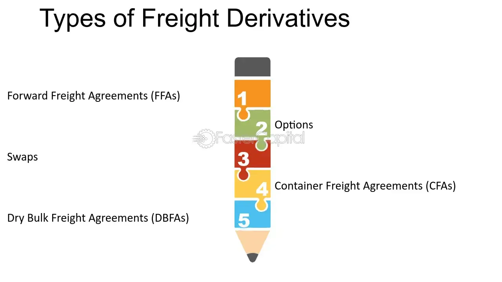

## Table of Contents

## What are freight derivatives?

Freight derivatives are financial instruments that help people manage the risks associated with the costs of shipping goods by sea. They work a bit like insurance policies for shipping companies, allowing them to lock in prices for future shipping costs. This can be useful because the cost of shipping can change a lot due to things like fuel prices, weather, and global trade patterns. By using freight derivatives, a company can protect itself from sudden increases in shipping costs.

These derivatives are traded on special markets, where people can buy and sell them just like stocks or other financial products. The most common type of freight derivative is a forward freight agreement (FFA), which is a contract to pay or receive a certain amount of money based on the future price of shipping. This helps companies plan their budgets more accurately because they know in advance what their shipping costs will be. Overall, freight derivatives are an important tool for managing the uncertainties of the shipping industry.

## How do freight derivatives work?

Freight derivatives are like special agreements that help shipping companies and others manage the ups and downs of shipping costs. Imagine you're planning to ship goods in the future, but you're worried that the cost might go up. With a freight derivative, you can make a deal now to pay a set price for shipping later. This deal is called a forward freight agreement (FFA). It's like locking in today's price for tomorrow's shipping, which helps you avoid surprises if costs suddenly increase.

These agreements are traded on special markets where people buy and sell them. The price of an FFA goes up and down based on what people think future shipping costs will be. If you think shipping costs will go up, you might buy an FFA to protect yourself. If you think costs will go down, you might sell one. At the end of the agreement, if the actual shipping cost is higher than the price you locked in, you save money. If it's lower, you might pay a bit more, but at least you knew what to expect. This way, freight derivatives help everyone involved in shipping plan better and feel more secure about their costs.

## What are the main types of freight derivatives?

The main types of freight derivatives are Forward Freight Agreements (FFAs) and options on FFAs. FFAs are the most common type. They are contracts where you agree to pay or receive a certain amount of money based on the future price of shipping. It's like betting on what the shipping cost will be in the future. If you think shipping costs will go up, you can buy an FFA to protect yourself from higher prices. If you think costs will go down, you can sell an FFA.

Options on FFAs are another type of freight derivative. These give you the right, but not the obligation, to buy or sell an FFA at a certain price before a certain date. It's like having a choice to use the FFA if you want to. If the actual shipping cost turns out to be higher than the price in your option, you can use the option to save money. If not, you can just let the option expire without using it. This can be helpful if you want more flexibility in managing your shipping costs.

## Who uses freight derivatives and why?

Freight derivatives are mainly used by shipping companies, cargo owners, and traders. Shipping companies use them to protect themselves from sudden increases in shipping costs. For example, if a shipping company has a contract to move goods in the future, they can use a freight derivative to lock in today's shipping price. This helps them plan their budgets better and avoid surprises if fuel prices or other costs go up. Cargo owners, like big companies that need to ship their products around the world, also use freight derivatives to manage their shipping expenses. They want to know in advance how much it will cost to move their goods, so they can set their product prices accordingly.

Traders use freight derivatives to make money by betting on what shipping costs will be in the future. If they think shipping prices will go up, they can buy a freight derivative and sell it later at a higher price. If they think prices will go down, they can sell a derivative and buy it back later at a lower price. This kind of trading can be risky, but it's an important part of the freight derivatives market. Overall, freight derivatives help everyone involved in shipping to manage their risks and plan more effectively.

## What are the benefits of using freight derivatives?

Freight derivatives help shipping companies and cargo owners manage the ups and downs of shipping costs. By using a freight derivative, like a forward freight agreement (FFA), they can lock in today's shipping price for a future date. This means they know exactly how much they will pay to move their goods, even if the actual shipping costs go up later. This helps them plan their budgets better and avoid surprises. It's like having a safety net that protects them from sudden increases in fuel prices or other shipping expenses.

Traders also benefit from freight derivatives because they can make money by betting on future shipping costs. If they think prices will go up, they can buy a freight derivative and sell it later at a higher price. If they think prices will go down, they can sell a derivative and buy it back at a lower price. This kind of trading can be risky, but it adds liquidity to the market, making it easier for everyone to use freight derivatives. Overall, freight derivatives help everyone involved in shipping to manage their risks and plan more effectively, making the shipping industry more stable and predictable.

## What are the risks associated with freight derivatives?

Using freight derivatives can be risky. One big risk is that the market for these derivatives can be unpredictable. If you lock in a price for future shipping and the actual cost ends up being lower, you might end up paying more than you needed to. This can happen if, for example, fuel prices drop suddenly. Another risk is that the market for freight derivatives might not be very active, which can make it hard to find someone to buy or sell your derivative when you need to. This can leave you stuck with a contract that's not working out the way you hoped.

There's also the risk of counterparty risk, which means the other person in your agreement might not be able to pay up when it's time. If the company you made the deal with goes bankrupt, you could lose money. Lastly, using freight derivatives involves a lot of guessing about the future. If your guesses about shipping costs are wrong, you could end up losing money. While freight derivatives can help manage risks, they also come with their own set of challenges that need to be carefully considered.

## How are freight derivatives priced?

Freight derivatives are priced based on what people think future shipping costs will be. This guess is influenced by things like fuel prices, global trade patterns, and even the weather. When people think shipping costs will go up, they are willing to pay more for a freight derivative. If they think costs will go down, they will pay less. The price is also affected by how many people want to buy or sell the derivative at any given time. If lots of people want to buy, the price goes up. If lots of people want to sell, the price goes down.

The most common type of freight derivative, called a forward freight agreement (FFA), is priced by looking at the current market for shipping and making a guess about the future. This guess is often based on what's called an index, which is a way to measure average shipping costs over time. The price of an FFA will change every day as new information comes in about fuel prices, trade routes, and other factors that affect shipping. Traders and companies use all this information to decide how much they are willing to pay for an FFA, and that's how the price is set.

## What are the key differences between freight derivatives and other types of derivatives?

Freight derivatives are a bit different from other types of derivatives because they focus on the cost of shipping goods by sea. Most other derivatives, like stock options or futures, are about things like company stocks, interest rates, or commodities like oil and wheat. Freight derivatives, on the other hand, are all about the price of moving things from one place to another. They help shipping companies and cargo owners lock in prices for future shipping costs, which can be really helpful because those costs can change a lot due to things like fuel prices and global trade patterns.

Another key difference is how freight derivatives are used. While many other derivatives are used by investors to make money by betting on price changes, freight derivatives are mainly used by people in the shipping industry to manage their risks. For example, a shipping company might use a freight derivative to protect itself from sudden increases in fuel prices. This makes freight derivatives more of a tool for planning and stability in the shipping world, rather than just a way to make money from price movements.

## Can you explain the role of the Baltic Exchange in freight derivatives?

The Baltic Exchange is like a big club where people in the shipping world come together to trade information and make deals. It's really important for freight derivatives because it helps set the prices for these deals. The Baltic Exchange has something called the Baltic Dry Index (BDI), which is a way to measure how much it costs to ship things around the world. People use this index to guess what shipping costs will be in the future, and that helps them decide how much to pay for freight derivatives.

The Baltic Exchange also makes it easier for people to buy and sell freight derivatives. It's like a marketplace where shipping companies, cargo owners, and traders can meet and make deals. By providing a place where everyone can come together, the Baltic Exchange helps make the market for freight derivatives more active and reliable. This is really helpful for everyone involved in shipping because it lets them manage their risks better and plan their budgets more accurately.

## How have freight derivatives evolved over time?

Freight derivatives started becoming popular in the 1990s. Before that, shipping companies and cargo owners didn't have a good way to protect themselves from sudden changes in shipping costs. Then, people began to use forward freight agreements (FFAs) to lock in prices for future shipping. At first, these deals were made over the phone or in person, but soon they moved to special markets where people could buy and sell them more easily. The Baltic Exchange played a big role in this, helping to set prices and making the market more active.

Over time, the use of freight derivatives has grown a lot. More types of derivatives, like options on FFAs, were introduced, giving people more ways to manage their shipping costs. The market became more organized and transparent, with better ways to track prices and make deals. Today, freight derivatives are used all over the world by shipping companies, cargo owners, and traders. They help everyone in the shipping industry plan better and feel more secure about their costs, even when the market is unpredictable.

## What are some notable case studies or examples of freight derivatives in use?

One notable example of freight derivatives in action is how a big shipping company like Maersk might use them. Imagine Maersk has a contract to move a lot of goods from Asia to Europe in six months. They're worried that the cost of shipping might go up because of rising fuel prices. So, they buy a forward freight agreement (FFA) that locks in today's shipping price for that future date. If the actual shipping cost goes up, Maersk saves money because they're paying the lower price they locked in. If the cost goes down, they might pay a bit more, but at least they knew what to expect and could plan their budget better.

Another example involves a cargo owner like a big car manufacturer, say Toyota. Toyota needs to ship cars from Japan to the United States and wants to know in advance how much it will cost. They use an FFA to set a fixed price for the shipping. This helps Toyota set the price of their cars more accurately because they know their shipping costs won't suddenly increase. If the actual shipping cost turns out to be higher than the price in the FFA, Toyota benefits. If it's lower, they might pay a bit more, but the predictability helps them manage their business better.

## What are the future trends and developments expected in the freight derivatives market?

The freight derivatives market is expected to keep growing as more shipping companies and cargo owners see the benefits of using these tools to manage their costs. One big trend is the use of technology to make trading easier and more efficient. New platforms and apps are being developed that help people buy and sell freight derivatives more quickly and with less hassle. This could make the market more active and easier to use for everyone involved. Another trend is the increasing focus on sustainability. As the shipping industry tries to become more eco-friendly, freight derivatives might start to include costs related to carbon emissions and other environmental factors. This could help companies plan for a greener future.

There's also a lot of interest in making the freight derivatives market more global. Right now, most trading happens in places like London and Singapore, but there's a push to include more regions, especially in Asia and South America. This could make the market more diverse and help more people around the world use freight derivatives to manage their shipping costs. Overall, the future of freight derivatives looks promising, with new technology, a focus on sustainability, and a more global reach all playing a part in making the market better and more useful for everyone in the shipping industry.

## What are the types of freight derivatives?

Freight derivatives are instrumental in providing mechanisms for managing risk associated with freight rate fluctuations. They encompass several types, each serving distinct functions within the shipping industry.

**Exchange-Traded Futures** are standardized contracts traded on exchanges, where the buyer agrees to purchase, and the seller agrees to sell, a given asset at a predetermined future date and price. These futures provide transparency and liquidity, as they are facilitated through a central exchange.

**Swap Futures** are agreements to exchange cash flows based on different financial instruments. In the context of freight, swap futures allow parties to mitigate risks associated with fluctuating freight rates by determining cash flow exchanges dependent on future rates.

**Forward Freight Agreements (FFAs)** are contracts between two parties to settle the difference between the current and expected future freight rates. FFAs are predominately used for hedging, allowing participants to lock in rates for future freight needs, thus mitigating the risk of price fluctuations.

$$
\text{Payoff of FFA} = (\text{Settlement Price} - \text{Agreed Price}) \times \text{Quantity of Cargo}
$$

**Container Freight Swap Agreements** are similar to FFAs but specifically tailored for container shipping. These agreements enable shippers to hedge against volatile container shipping rates, ensuring more predictable costs for transporting goods.

Each derivative type addresses the needs of different players in the shipping market. Exchange-traded futures cater to those requiring transparency and liquidity, like shipping companies needing reliable budgets. Swap futures and FFAs are pivotal for entities aiming to hedge risks efficiently, whereas container freight swap agreements are essential for entities that focus on container shipping and require more specialized risk management strategies.

The diversity of freight derivatives allows for targeted risk management strategies, enabling various market participants to navigate the complexities of the shipping industry with greater confidence.

## References & Further Reading

[1]: Alizadeh, A., & Nomikos, N. K. (2009). ["Shipping Derivatives and Risk Management."](https://link.springer.com/book/10.1057/9780230235809) Palgrave Macmillan.

[2]: Kavussanos, M. G., & Visvikis, I. D. (2006). ["Derivatives and Risk Management in Shipping."](https://www.taylorfrancis.com/books/edit/10.4324/9780429343681/freight-derivatives-risk-management-shipping-manolis-kavussanos-ilias-visvikis-dimitris-tsouknidis) Springer.

[3]: Adland, R., & Jia, H. (2018). ["Algorithmic Trading in Freight Derivatives."](https://link.springer.com/article/10.1057/s41278-016-0002-3) Transportation Research Part E: Logistics and Transportation Review.

[4]: Nomikos, N. K., & Alizadeh, A. (2002). ["Risk Management in the Shipping Industry: The Theory and Practice of Hedging Freight Rate Risk."](https://pmc.ncbi.nlm.nih.gov/articles/PMC5719095/)00074-0) Maritime Policy & Management.

[5]: Geman, H., & Nguyen, V.-N. (2005). ["Soybean Inventory and Forward Curve Dynamics."](https://www.jstor.org/stable/20110399) The Review of Financial Studies. 