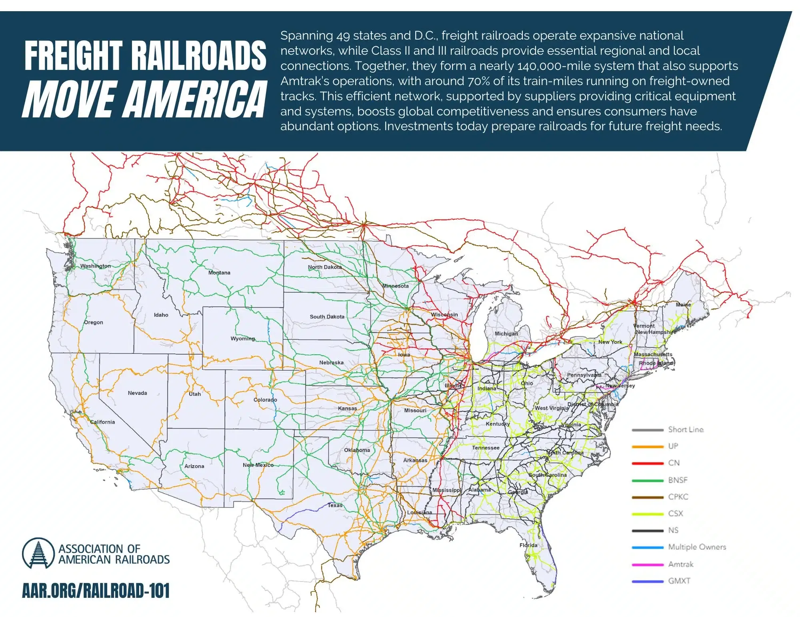

## Table of Contents

## What is the freight railroad sector and its primary function?

The freight railroad sector is a part of the transportation industry that focuses on moving goods and materials by trains. These trains use a network of tracks to transport things like coal, cars, food, and other products from one place to another. The main job of the freight railroad sector is to help businesses move their products efficiently and cost-effectively over long distances.

Freight railroads are important because they can carry a lot of heavy items at once, which is something that trucks or planes can't do as well. This makes them a good choice for moving large amounts of goods across countries or even continents. By using trains, companies can save money and reduce the environmental impact compared to other types of transportation.

## How does the freight railroad sector contribute to the economy?

The freight railroad sector helps the economy by moving goods from one place to another in a cheap and efficient way. When businesses can move their products easily, they can sell more and make more money. This helps the economy grow because when businesses do well, they can hire more people and pay them more. Also, when goods are cheaper to move, the prices of things in stores can be lower, which means people can buy more and spend more money in the economy.

Railroads also create jobs for many people. They need workers to drive the trains, fix the tracks, and manage the schedules. These jobs help support families and communities. Plus, the money that railroads spend on building and maintaining their tracks and equipment goes back into the economy. This spending helps other businesses, like steel and construction companies, which in turn creates more jobs and more economic activity. So, the freight railroad sector is important for keeping the economy strong and growing.

## What types of goods are typically transported by freight railroads?

Freight railroads move all sorts of things that people and businesses need. They [carry](/wiki/carry-trading) heavy stuff like coal, which is used to make electricity, and cars, which go from factories to dealerships. They also move chemicals, which are used to make many products, and steel, which is important for building things like bridges and buildings. These big and heavy items are hard to move by trucks or planes, so railroads are a good choice.

Railroads also carry things like food and drinks. They move grains like wheat and corn from farms to places where they can be turned into food. They also transport fruits and vegetables, which helps get fresh produce to stores all over the country. Sometimes, they even carry things like paper and lumber, which are used to make [books](/wiki/algo-trading-books) and furniture. So, railroads help move a lot of the things we use every day.

## What are the main components of a freight railroad system?

A freight railroad system has several main parts that work together to move goods. The first part is the locomotives, which are the big engines that pull the trains. They are strong and can pull heavy loads over long distances. The second part is the railcars, which are the cars that carry the goods. There are different types of railcars for different types of goods, like flat cars for cars and tank cars for liquids.

Another important part of the system is the tracks, which are the steel rails that the trains run on. The tracks need to be well-maintained and connected to make sure the trains can move safely and efficiently. The system also includes the yards, which are big areas where trains are put together and taken apart. In the yards, workers move railcars around to make sure the right goods are on the right trains.

The last main part is the signaling and control systems. These help keep the trains safe and on schedule. Signals tell the train drivers when to stop or go, and the control systems help manage where the trains are and where they need to go. All these parts work together to make sure goods get from one place to another smoothly and on time.

## How is the freight railroad sector regulated and by whom?

The freight railroad sector is watched over by the government to make sure it runs safely and fairly. In the United States, the main group in charge is the Surface Transportation Board (STB). They set the rules for how railroads can charge for moving goods and how they can work with each other. The Federal Railroad Administration (FRA) is another important group. They focus on making sure the trains and tracks are safe. They check the trains and tracks often and can make rules to improve safety.

Other groups also have a say in how the freight railroad sector works. For example, the Environmental Protection Agency (EPA) makes sure the railroads follow rules about pollution and keeping the environment clean. State governments can also have their own rules for railroads that run in their areas. All these groups work together to keep the freight railroad sector running well and safely for everyone.

## What are the major challenges faced by the freight railroad sector?

One big challenge for the freight railroad sector is keeping the trains and tracks in good shape. Trains and tracks wear out over time, and it costs a lot of money to fix them. If they don't keep everything in good shape, there can be accidents or delays. Another challenge is dealing with bad weather. Snow, ice, and heavy rain can make it hard for trains to run on time. This can slow down the delivery of goods and make customers unhappy.

Another challenge is keeping up with new rules and regulations. Governments are always making new rules to keep trains safe and to protect the environment. These rules can be hard to follow and can cost a lot of money. Railroads also have to compete with other ways of moving goods, like trucks and ships. These other ways can sometimes be faster or cheaper, so railroads have to find ways to stay competitive. This means they need to keep improving their service and finding new ways to move goods more efficiently.

## How has technology impacted the operations within the freight railroad sector?

Technology has made a big difference in how freight railroads work. One way is through better tracking and control systems. Now, railroads can use computers to keep an eye on where all their trains are and when they will arrive at their destinations. This helps them run their trains more smoothly and on time. They also use special sensors to check the tracks and trains for problems. If something is wrong, they can fix it before it causes an accident or delay.

Another way technology helps is by making trains safer and more efficient. New locomotives are more powerful and use less fuel, which saves money and is better for the environment. Trains can also carry more goods because of better designs. Plus, technology like drones and robots can help with things like inspecting tracks and moving railcars around in the yards. All these changes help railroads move goods faster and more safely, which makes their customers happy and keeps the economy moving.

## What are the key differences between freight and passenger rail services?

Freight rail services are all about moving goods, like coal, cars, and food, from one place to another. They use big, strong trains that can carry a lot of heavy stuff. These trains often go long distances and can take a long time to get where they're going. Freight trains usually don't have a set schedule because they move goods whenever they need to, and they can stop and start whenever it's needed. The main goal of freight rail is to move things cheaply and efficiently, so businesses can get their products to customers.

Passenger rail services, on the other hand, are all about moving people. These trains have special cars made for comfort, with seats, sometimes food services, and even sleeping areas for long trips. Passenger trains usually run on a strict schedule because people need to get to work, school, or home on time. They often go shorter distances than freight trains and stop at many stations along the way. The main goal of passenger rail is to move people quickly and comfortably, so they have a good experience traveling.

## How do freight railroads manage safety and environmental concerns?

Freight railroads take safety very seriously. They have special rules and checks to make sure their trains and tracks are safe. They use technology like sensors to find problems before they cause accidents. Workers are trained to follow safety rules, and there are regular checks to make sure everything is working right. If something goes wrong, there are emergency plans to keep people safe. All these steps help make sure that the trains can move goods without hurting people or damaging things.

Freight railroads also care about the environment. They try to use less fuel by using new, more efficient locomotives. They also work to reduce pollution by following rules set by groups like the Environmental Protection Agency. Railroads recycle a lot of the materials they use, like old tracks and railcars. They also try to move goods in a way that makes fewer trips, which means less pollution. By doing these things, freight railroads help keep the environment cleaner while still moving goods where they need to go.

## What are the current trends and future outlook for the freight railroad sector?

The freight railroad sector is seeing some big changes and trends right now. One trend is the use of more technology. Railroads are using computers and sensors to keep track of their trains and make sure they run smoothly. They are also using new types of locomotives that use less fuel and can carry more goods. Another trend is the focus on being more eco-friendly. Railroads are trying to reduce pollution and use more renewable energy. They are also working on making their tracks and trains safer with better inspections and emergency plans.

Looking to the future, the freight railroad sector is expected to keep growing. As more people buy things online, there will be a bigger need to move goods quickly and cheaply. Railroads will need to keep improving their technology and services to stay competitive with other ways of moving goods, like trucks and ships. They will also need to keep up with new rules about safety and the environment. If they can do these things well, the future looks bright for the freight railroad sector, helping to move goods and keep the economy strong.

## How do international trade agreements affect the freight railroad sector?

International trade agreements can have a big impact on the freight railroad sector. These agreements often make it easier for countries to trade with each other. When countries can trade more easily, there are more goods that need to be moved from one place to another. This can be good for railroads because they can carry a lot of heavy things over long distances. More trade means more work for the railroads, which can help them grow and make more money.

However, trade agreements can also bring challenges. Sometimes, these agreements change the rules about how goods can move across borders. Railroads have to follow these new rules, which can be hard and might cost more money. Also, if a trade agreement makes it cheaper or easier to use trucks or ships to move goods, railroads might lose some business. So, while trade agreements can bring more work, they can also make things more complicated for the freight railroad sector.

## What are the advanced logistics and supply chain strategies used in the freight railroad sector?

Freight railroads use smart ways to move goods from one place to another. One way is called "intermodal transportation." This means they work with trucks and ships to move goods. For example, a container might start its journey on a truck, then move to a train, and finally go on a ship. This helps get goods to where they need to go faster and cheaper. Railroads also use something called "just-in-time delivery." This means they try to get goods to arrive right when they are needed, not too early or too late. This saves money because businesses don't have to store goods for a long time.

Another strategy is using technology to plan and track shipments. Railroads use computers to figure out the best routes for trains and to keep an eye on where all their trains are. This helps them move goods more efficiently and avoid delays. They also use big data to predict how much they will need to move in the future. This helps them plan better and make sure they have enough trains and workers. By using these strategies, railroads can move goods quickly and reliably, which helps businesses and the economy.

## What is Algorithmic Trading in the Railroad Industry?

The rise of [algorithmic trading](/wiki/algorithmic-trading) has significantly transformed the landscape of the railroad industry by providing sophisticated tools to analyze vast datasets. This transformation is largely driven by the increasing computational power and advanced data analytics capabilities available today. Algorithmic trading systems enable investors to process large volumes of rail-related data, optimizing investment decisions based on real-time information.

Automated systems can synthesize data from multiple sources, including freight volumes, commodity prices, and economic indicators, to formulate predictive models. These models can assist traders in understanding cyclical trends within the railroad sector, which is particularly known for its sensitivity to economic fluctuations. For instance, changes in intermodal traffic can signal shifts in manufacturing output and consumer demand, offering insights into broader economic conditions. By capturing these trends, algorithmic strategies can anticipate market movements and adjust trading positions accordingly.

One of the key advantages in utilizing algorithmic trading in the railroad sector is its ability to leverage economic indicators. These indicators can be incorporated into statistical models to forecast future performance. For example, time series analysis can be used to detect seasonality and other patterns in rail freight data. Mathematically, this can be represented as:

$$
Y_t = \sum_{i=1}^n \phi_i Y_{t-i} + \epsilon_t
$$

where $Y_t$ is the value of the freight indicator at time $t$, $\phi_i$ are the coefficients that represent the impact of prior values on the current period, and $\epsilon_t$ denotes the error term.

Moreover, algorithms can implement [machine learning](/wiki/machine-learning) techniques, such as regression trees or neural networks, to refine predictions based on historical data. Python libraries such as TensorFlow and scikit-learn have made it feasible to build models that evolve with the continuous influx of new data, refining their accuracy over time. A basic implementation of a predictive model using Python might look like this:

```python
import pandas as pd
from sklearn.model_selection import train_test_split
from sklearn.ensemble import RandomForestRegressor

# Sample code to fit a model for predicting freight volumes
data = pd.read_csv('railroad_data.csv')
X = data.drop('freight_volume', axis=1)
y = data['freight_volume']

X_train, X_test, y_train, y_test = train_test_split(X, y, test_size=0.2, random_state=42)
model = RandomForestRegressor(n_estimators=100)

model.fit(X_train, y_train)
predictions = model.predict(X_test)
```

Such models can process a breadth of indicators simultaneously, adapting to new patterns more effectively than traditional analysis methods. Consequently, these advanced trading algorithms not only foster enhanced investment strategies but also drive a deeper understanding of the railroad industry's dynamics, providing a significant edge in a sector marked by its complex, cyclical nature.

## How are rail operators evaluated?

When evaluating rail operators, investors focus on several key metrics crucial for assessing financial health and operational efficiency. 

Revenue growth is fundamental. It reflects the ability of a railroad company to expand its operations and capture a larger market share. Sustained revenue growth often indicates strong demand for services, effective pricing strategies, and successful market penetration.

Profit margins are another essential metric. These margins, typically expressed as a percentage, gauge the proportion of revenue that translates into profit after all expenses are deducted. High profit margins suggest efficient cost management, effective pricing, and a strong competitive position within the industry.

The operating ratio is a critical measure of profitability specific to the railroad sector. It is defined as operating expenses divided by operating revenue, often expressed as a percentage:

$$
\text{Operating Ratio} = \left( \frac{\text{Operating Expenses}}{\text{Operating Revenue}} \right) \times 100
$$

A lower operating ratio indicates higher profitability, signifying that a greater portion of revenues is retained as profit after covering expenses. Railroads aim for an optimal operating ratio to maintain profitability while ensuring operational efficiency.

Capital requirements also play a vital role. Railroads are capital-intensive, necessitating significant investment in infrastructure, equipment, and technology. The ability to access cost-effective capital is paramount for sustaining operations and supporting growth initiatives. Rail operators must manage their capital structure judiciously to balance debt and equity, ensuring financial stability and flexibility.

In conclusion, for investors considering railroad companies, a thorough analysis of revenue growth, profit margins, operating ratios, and capital management is essential. These metrics collectively provide insight into the financial health and operational efficiency of rail operators, guiding informed investment decisions.

## References & Further Reading

[1]: ["Railroads and American Economic Growth: Essays in Econometric History"](https://www.jstor.org/stable/pdf/2116005.pdf) by Robert William Fogel

[2]: ["Iron Rails in the Garden State: Tales of New Jersey Railroading"](https://www.amazon.com/Iron-Rails-Garden-State-Railroading/dp/025335174X) by Anthony J. Bianculli

[3]: ["Principles of Financial Modelling: Model Design and Best Practices Using Excel and VBA"](https://onlinelibrary.wiley.com/doi/book/10.1002/9781118903933) by Michael Rees

[4]: ["Freight Rail and the Environment"](https://www.aar.org/wp-content/uploads/2020/06/AAR-Positive-Environmental-Effects-of-Freight-Rail-White-Paper-62020.pdf) by the Association of American Railroads

[5]: ["Transportation and the Economy"](https://www.bts.gov/topics/transportation-and-economy) by the Bureau of Transportation Statistics

[6]: ["Algorithmic and High-Frequency Trading"](https://assets.cambridge.org/97811070/91146/frontmatter/9781107091146_frontmatter.pdf) by Álvaro Cartea, Sebastian Jaimungal, and José Penalva