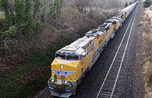

Freight railroads are a cornerstone of the transportation sector, forming a crucial part of economic infrastructure in modern society. These railroads have historical roots dating back to the Gilded Age, a period of rapid economic growth in the United States during the late 19th century, marked by significant industrial expansion and infrastructure development. The railroads of that era laid the groundwork for today's extensive network, facilitating the movement of goods across vast distances and supporting industry and commerce on an unprecedented scale.

As economic needs have evolved, so too have freight railroads. Today, they continue to play a pivotal role in the transportation of goods, adapting to technological advancements and shifting market demands. The industry's cyclical nature reflects broader economic patterns, creating opportunities for investors to capitalize on these fluctuations. Railroads serve as a barometer for economic health, with investment potential closely linked to their operational performance and external economic indicators.



In recent years, algorithmic trading and automated investment strategies have gained prominence in the sector, offering new methodologies for analyzing and investing in the railroad industry. These approaches use complex algorithms and vast datasets to identify patterns and opportunities, allowing investors to make informed decisions based on quantitative analysis. As technology continues to integrate with finance, algorithmic trading represents a growing frontier in railroad investments.

This article examines the layers of complexity inherent in the railroad industry, including its historical significance, economic impact, and modern investment strategies like algorithmic trading. These elements together highlight the railroad sector's enduring importance and the emerging tools that offer innovative ways to engage with its potential.

## Table of Contents

## The Role of Freight Railroads Today

Freight railroads constitute a vital component of the transportation infrastructure in the United States, responsible for handling a substantial portion of intercity freight delivery. They are instrumental in transporting bulk commodities such as coal, chemicals, and grain, which are cornerstones of various industrial sectors and essential for commercial activities nationwide.

The efficiency of rail transportation arises from its ability to move large quantities of goods across significant distances using less energy compared to other modes of transport. This energy efficiency translates into cost advantages, particularly for long-haul freight, where railroads can transport a ton of cargo over 400 miles on a single gallon of diesel fuel. This lower fuel consumption directly ties into one of the major advantages of rail: the reduction of greenhouse gas emissions per ton-mile, making rail a more environmentally sustainable option. According to the Association of American Railroads, if just 10% of the long-distance freight now moved by trucks were shifted to rail, annual greenhouse gas emissions would fall by approximately 17 million tons.

Moreover, safety is a critical aspect where railroads surpass other freight transportation methods. The nature of the rail system, with dedicated tracks and reduced human error potential due to automation and regulatory oversight, minimizes the risk of accidents. Federal regulations and continuous monitoring ensure that safety standards are strictly adhered to, contributing to a secure and reliable mode of freight transportation.

Intermodal transport further enhances the adaptability and efficiency of railroads. By using standardized containers that can be easily transferred between ships, trucks, and trains, intermodal transport significantly reduces handling costs—and time—during the transfer process. This integration allows railways to play a crucial part in supply chains, offering seamless transitions between transportation modes. The use of intermodal transport has been steadily increasing, as it benefits from the scalability of rail for long-haul segments combined with the flexibility of truck transport for final deliveries.

Freight railroads, through a combination of efficiency, safety, and intermodal capabilities, maintain a compelling position within the transportation ecosystem. They not only fulfill essential functions in moving bulk goods efficiently and safely but also form a strategic component of modern logistics by facilitating intermodal transfers. These attributes underscore the ongoing relevance and indispensable role of freight railroads in contemporary freight distribution networks.

## The Economic Influence of Railroads

Railroad traffic is a vital indicator of economic activity, acting as a barometer for the health of numerous sectors. Freight railroads' ability to handle massive quantities of goods positions them as a reliable proxy for broader economic trends. Specifically, carload and intermodal traffic metrics are pivotal in understanding the economic landscape.

The carload metric refers to the [volume](/wiki/volume-trading-strategy) of freight carried by rail, broken down by type, such as coal, chemicals, or grain. This measurement can reveal insights into sector-specific economic performance. For instance, a surge in coal shipments might suggest increased energy production, whereas a rise in grain transportation could indicate a robust agricultural yield. As these metrics fluctuate, they provide valuable clues about the supply and demand dynamics within these industries.

Intermodal traffic, which involves transporting standardized containers that can seamlessly switch between different modes of transportation, offers another crucial perspective. The efficiency of intermodal transport is particularly relevant in global trade, as it reflects the flow of goods across borders. An uptick in intermodal traffic might suggest a strengthening in international trade relationships, while a decline could signal global economic challenges.

Railroads mirror trends in international commerce, making them a key resource for understanding economic strengths or weaknesses. A robust flow of rail traffic typically aligns with economic expansion, as businesses require a steady supply of raw materials and finished goods. Conversely, a downturn in railroad activity may be a precursor to economic contraction, as reduced shipping volumes can indicate lowered production or consumption.

The alignment between railroad traffic data and economic performance is not merely observational but can be analytically modeled. For example, economists and analysts often employ time series analysis to forecast GDP growth or sector-specific performance based on rail shipment volumes. By analyzing past data trends and integrating various economic indicators, such models can offer predictive insights into future economic conditions.

```python
import pandas as pd
import numpy as np
from statsmodels.tsa.arima_model import ARIMA
import matplotlib.pyplot as plt

# Sample data
dates = pd.date_range(start='1/1/2010', periods=100, freq='M')
rail_traffic = np.random.normal(loc=200, scale=10, size=len(dates))  # Simulated carload traffic data

# Creating a pandas DataFrame
data = pd.DataFrame({'Date': dates, 'Rail_Traffic': rail_traffic})
data.set_index('Date', inplace=True)

# ARIMA model creation
model = ARIMA(data['Rail_Traffic'], order=(1, 1, 1))
model_fit = model.fit(disp=0)

# Summary of the model
print(model_fit.summary())

# Forecasting
forecast, stderr, conf_int = model_fit.forecast(steps=12)

# Plot the results
plt.figure(figsize=(12, 6))
plt.plot(data.index, data['Rail_Traffic'], label='Observed')
plt.plot(pd.date_range(data.index[-1], periods=12, freq='M'), forecast, label='Forecast')
plt.fill_between(pd.date_range(data.index[-1], periods=12, freq='M'), 
                 conf_int[:, 0], conf_int[:, 1], color='pink', alpha=0.3)
plt.title('Rail Traffic Forecast')
plt.xlabel('Date')
plt.ylabel('Rail Traffic Volume')
plt.legend()
plt.show()
```

This Python code snippet demonstrates how historical rail traffic data can be used to forecast future trends using an ARIMA model, providing a quantitative basis for assessing economic conditions. In summary, by analyzing railroad traffic metrics, stakeholders can gain valuable insights into economic vitality and anticipate changes across various sectors.

## Algorithmic Trading in the Railroad Industry

The rise of [algorithmic trading](/wiki/algorithmic-trading) has significantly transformed the landscape of the railroad industry by providing sophisticated tools to analyze vast datasets. This transformation is largely driven by the increasing computational power and advanced data analytics capabilities available today. Algorithmic trading systems enable investors to process large volumes of rail-related data, optimizing investment decisions based on real-time information.

Automated systems can synthesize data from multiple sources, including freight volumes, commodity prices, and economic indicators, to formulate predictive models. These models can assist traders in understanding cyclical trends within the railroad sector, which is particularly known for its sensitivity to economic fluctuations. For instance, changes in intermodal traffic can signal shifts in manufacturing output and consumer demand, offering insights into broader economic conditions. By capturing these trends, algorithmic strategies can anticipate market movements and adjust trading positions accordingly.

One of the key advantages in utilizing algorithmic trading in the railroad sector is its ability to leverage economic indicators. These indicators can be incorporated into statistical models to forecast future performance. For example, time series analysis can be used to detect seasonality and other patterns in rail freight data. Mathematically, this can be represented as:

$$
Y_t = \sum_{i=1}^n \phi_i Y_{t-i} + \epsilon_t
$$

where $Y_t$ is the value of the freight indicator at time $t$, $\phi_i$ are the coefficients that represent the impact of prior values on the current period, and $\epsilon_t$ denotes the error term.

Moreover, algorithms can implement [machine learning](/wiki/machine-learning) techniques, such as regression trees or neural networks, to refine predictions based on historical data. Python libraries such as TensorFlow and scikit-learn have made it feasible to build models that evolve with the continuous influx of new data, refining their accuracy over time. A basic implementation of a predictive model using Python might look like this:

```python
import pandas as pd
from sklearn.model_selection import train_test_split
from sklearn.ensemble import RandomForestRegressor

# Sample code to fit a model for predicting freight volumes
data = pd.read_csv('railroad_data.csv')
X = data.drop('freight_volume', axis=1)
y = data['freight_volume']

X_train, X_test, y_train, y_test = train_test_split(X, y, test_size=0.2, random_state=42)
model = RandomForestRegressor(n_estimators=100)

model.fit(X_train, y_train)
predictions = model.predict(X_test)
```

Such models can process a breadth of indicators simultaneously, adapting to new patterns more effectively than traditional analysis methods. Consequently, these advanced trading algorithms not only foster enhanced investment strategies but also drive a deeper understanding of the railroad industry's dynamics, providing a significant edge in a sector marked by its complex, cyclical nature.

## Evaluating Rail Operators

When evaluating rail operators, investors focus on several key metrics crucial for assessing financial health and operational efficiency. 

Revenue growth is fundamental. It reflects the ability of a railroad company to expand its operations and capture a larger market share. Sustained revenue growth often indicates strong demand for services, effective pricing strategies, and successful market penetration.

Profit margins are another essential metric. These margins, typically expressed as a percentage, gauge the proportion of revenue that translates into profit after all expenses are deducted. High profit margins suggest efficient cost management, effective pricing, and a strong competitive position within the industry.

The operating ratio is a critical measure of profitability specific to the railroad sector. It is defined as operating expenses divided by operating revenue, often expressed as a percentage:

$$
\text{Operating Ratio} = \left( \frac{\text{Operating Expenses}}{\text{Operating Revenue}} \right) \times 100
$$

A lower operating ratio indicates higher profitability, signifying that a greater portion of revenues is retained as profit after covering expenses. Railroads aim for an optimal operating ratio to maintain profitability while ensuring operational efficiency.

Capital requirements also play a vital role. Railroads are capital-intensive, necessitating significant investment in infrastructure, equipment, and technology. The ability to access cost-effective capital is paramount for sustaining operations and supporting growth initiatives. Rail operators must manage their capital structure judiciously to balance debt and equity, ensuring financial stability and flexibility.

In conclusion, for investors considering railroad companies, a thorough analysis of revenue growth, profit margins, operating ratios, and capital management is essential. These metrics collectively provide insight into the financial health and operational efficiency of rail operators, guiding informed investment decisions.

## Investment Challenges in the Railroad Sector

Freight railroads, while crucial to the economic infrastructure, face significant investment challenges primarily due to high fuel and labor costs. These expenses represent a considerable portion of the operational budget of railroad companies, affecting their overall profitability. Given the substantial distance that freight trains cover, fluctuations in fuel prices can lead to major cost implications. Additionally, labor is a critical component where costs remain relatively fixed irrespective of the volume of transported goods, adding to these financial pressures.

The cyclical nature of railroad demand further complicates the investment landscape. Demand for rail transport is often contingent on broader economic conditions, including industrial output and consumer demand for goods. During economic downturns, freight volumes typically decrease, leading to reduced revenues for railroad companies. This cyclicality affects investor confidence as it introduces an element of unpredictability in returns.

Valuing railroad companies also presents challenges due to their high capital expenditures. Railroads routinely require substantial investments in infrastructure, such as tracks and terminals, as well as rolling stock such as locomotives and railcars. This capital-intensive nature means that a significant portion of earnings is often reinvested into the maintenance and expansion of physical assets, sometimes at the expense of shareholder returns.

One metric that can provide valuable insights into valuation is the price/book (P/B) ratio. This ratio, which compares a company's market capitalization to its book value, can be particularly insightful for valuation in capital-intensive industries like railroads. A low P/B ratio might indicate undervaluation, while a high ratio could suggest overvaluation. This measure considers the net asset value of the company, providing a clearer picture of intrinsic worth distinct from market fluctuations.

Investors often use additional financial metrics to evaluate the financial health and investment potential of railroad firms. Revenue growth, profit margins, and especially the operating ratio—which is calculated as operating expenses divided by operating revenue—are scrutinized to assess efficiency and profitability. As a measure specific to the railroad sector, a lower operating ratio indicates better cost control and operational efficiency.

In conclusion, despite the inherent investment challenges posed by high costs and cyclical demand, the strategic significance of freight railroads endures. By understanding these challenges and employing evaluation methodologies such as the P/B ratio, investors can better navigate the complexities of the railroad sector.

## Conclusion

Freight railroads are an essential component of North America’s economic landscape, providing a crucial backbone for the transportation of goods across vast distances. As a key player in the economic infrastructure, they support various sectors by facilitating the movement of bulk commodities like coal, chemicals, and grain, which are fundamental to industrial and agricultural outputs. The strategic importance of freight railroads is highlighted by their efficiency and safety, offering robust transportation solutions compared to other freight modes.

Despite enduring challenges, notably the cyclical nature of railroad demand and significant capital requirements, railroads continue to provide formidable investment opportunities. The cyclicality refers to the regular fluctuations in demand for rail services, which are closely tied to economic conditions and can impact the operational revenue of railroad companies. Similarly, high capital expenditures are necessary for maintaining and expanding rail networks, which can complicate valuations and long-term planning.

Recent advancements in algorithmic trading have introduced new dimensions to traditional investment strategies in the railroad sector. These sophisticated trading systems enable investors to analyze vast datasets, identify patterns, and make informed decisions with unprecedented precision. By leveraging cyclical trends and economic indicators derived from railroad data, investors can potentially enhance returns and better manage risks.

In conclusion, while freight railroads confront various intrinsic challenges, their role in securing economic stability and growth in North America is beyond question. The integration of technology, particularly in financial analysis and trading, presents innovative opportunities for investors to harness the potential of the railroad industry. With appropriate strategies, both individual and institutional investors can capitalize on these opportunities, securing a stake in a sector that remains vital to the continent's economic prosperity.

## References & Further Reading

[1]: ["Railroads and American Economic Growth: Essays in Econometric History"](https://www.jstor.org/stable/pdf/2116005.pdf) by Robert William Fogel

[2]: ["Iron Rails in the Garden State: Tales of New Jersey Railroading"](https://www.amazon.com/Iron-Rails-Garden-State-Railroading/dp/025335174X) by Anthony J. Bianculli

[3]: ["Principles of Financial Modelling: Model Design and Best Practices Using Excel and VBA"](https://onlinelibrary.wiley.com/doi/book/10.1002/9781118903933) by Michael Rees

[4]: ["Freight Rail and the Environment"](https://www.aar.org/wp-content/uploads/2020/06/AAR-Positive-Environmental-Effects-of-Freight-Rail-White-Paper-62020.pdf) by the Association of American Railroads

[5]: ["Transportation and the Economy"](https://www.bts.gov/topics/transportation-and-economy) by the Bureau of Transportation Statistics

[6]: ["Algorithmic and High-Frequency Trading"](https://assets.cambridge.org/97811070/91146/frontmatter/9781107091146_frontmatter.pdf) by Álvaro Cartea, Sebastian Jaimungal, and José Penalva