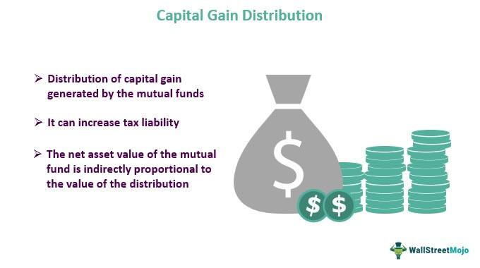

In today's dynamic financial markets, capital gains, investment distribution, mutual funds, and algorithmic trading are integral components of modern investing. These elements form the backbone of strategies employed by investors to navigate the complex landscapes of financial growth and risk mitigation. Capital gains, defined as the profit from selling a security at a higher price than it was purchased, are a key consideration for investors in terms of both potential profit and tax impact.

Mutual funds, which pool money from many investors to buy a diversified portfolio of stocks, bonds, or other securities, frequently distribute these gains to their shareholders. This distribution is not merely a financial transaction but also a pivotal factor influencing both fund performance and the investor's tax obligations. Understanding the nuances of how these distributions operate is vital for investors aiming to optimize their returns while remaining compliant with tax regulations.



Algorithmic trading, another essential facet of contemporary investing, uses computer algorithms to automate trading decisions based on complex mathematical models. This sophisticated approach enhances precision in trade execution, optimizes buying and selling decisions, and reduces transaction costs, ultimately providing investors with a competitive edge. The synergy of algorithmic trading with traditional investment strategies presents a powerful tool for navigating the ebbs and flows of financial markets.

This article examines the connection between capital gains arising from mutual fund distributions and how algorithmic trading can enhance investment strategies. It aims to equip investors—both novices and veterans—with the insights needed to effectively manage tax implications and leverage technological advancements in their investment decisions. By exploring these aspects, readers will gain a comprehensive understanding of how to balance growth and risk, aiming for optimal financial success.

## Table of Contents

## Understanding Capital Gains in Mutual Funds

Capital gains in mutual funds represent the profits generated from the sale of securities held within the fund. When a mutual fund sells a security at a price higher than its purchase price, the fund realizes a capital gain. These gains are accumulated throughout the fiscal year and must be distributed to the fund's shareholders annually. This distribution can be received either as a cash payout or reinvested back into the fund, allowing for a compounding effect on the investment.

The distribution of capital gains is a critical factor for both the performance of the mutual fund and the tax obligations of the investor. Mutual funds, by law, are structured as pass-through entities for tax purposes. This means they pass the tax liabilities of their investment income directly to their shareholders. The capital gains distribution affects a shareholder’s tax liability, as these distributions are taxable events, regardless of whether they are taken as cash or reinvested in the fund. Therefore, understanding the timing and magnitude of these distributions is essential to effectively manage and forecast one's tax obligations.

Mitigating unexpected tax burdens starts with comprehending how capital gains distributions impact overall investment strategy. Shareholders should be aware of the fund’s distribution schedule and its historical capital gains patterns. Such insights can be instrumental in planning tax-efficient withdrawal strategies or assessing the timing of additional investments. Ultimately, balancing the receipt of capital gains distributions and the associated tax liabilities requires a strategic approach to enhance post-tax returns.

## Tax Implications of Mutual Fund Distributions

Mutual fund distributions encompass various tax treatments determined by the holding period of the assets that generated gains. In essence, these distributions are classified as either long-term or short-term capital gains, each with distinct tax implications.

Long-term capital gains result from assets held for more than one year. These gains enjoy preferential tax treatment, with rates significantly lower than those applied to regular income. For instance, in the United States, long-term capital gains tax rates are typically 0%, 15%, or 20%, depending on the investor's taxable income.

Conversely, short-term capital gains originate from assets held for one year or less and are taxed as ordinary income. This means they are subject to the investor’s marginal tax rate, which can be considerably higher than the maximum rate applied to long-term gains. For example, the highest marginal tax rate on ordinary income can reach 37% for high-income individuals in the U.S.

Here is a basic comparison:

- **Long-term capital gains tax rate:** Lower, generally between 0% to 20%.
- **Short-term capital gains tax rate:** Higher, as high as ordinary income tax rates, potentially up to 37%.

Understanding these distinctions allows investors to devise effective tax strategies. For instance, delaying the sale of appreciated assets to qualify them as long-term holdings can generate substantial tax savings. Furthermore, incorporating tax-efficient investment strategies can substantially enhance post-tax returns.

Proper tax planning involves not only recognizing when to realize gains but also combining techniques such as tax-loss harvesting. This strategy involves selling securities at a loss to offset gains, reducing the total taxable amount. Here's a simple example using Python to calculate net capital gain after offsetting a loss:

```python
def net_capital_gain(gains, losses):
    return gains - losses

# Example amounts
capital_gains = 10000
capital_losses = 3000

net_gain = net_capital_gain(capital_gains, capital_losses)
print(f"Net Capital Gain: ${net_gain}")
```

The potential for significant savings is apparent when considering taxes' impact on investment profits. Investors can effectively plan to manage their tax liabilities and optimize their investment performance by aligning their investment activities with their tax situations. Engaging with financial advisors or tax professionals may also be beneficial in aligning strategies to individual financial circumstances, ensuring that investors maximize their post-tax returns.

## Algorithmic Trading: A Game Changer in Investment Strategies

Algorithmic trading, often referred to as algo trading, utilizes computer algorithms to execute trades according to predefined criteria, allowing for enhanced precision and optimization in financial markets. These algorithms analyze vast amounts of market data at speeds beyond human capacity, making them a critical component in modern investment strategies.

By automating the trading process, [algorithmic trading](/wiki/algorithmic-trading) optimizes buying and selling decisions, ensuring trades are executed at the most favorable prices, and significantly reducing transaction costs. This is particularly important in high-frequency trading ([HFT](/wiki/high-frequency-trading-strategies)), where success is measured in milliseconds. For example, the implementation of statistical [arbitrage](/wiki/arbitrage) or market-making strategies relies heavily on algorithms to identify price discrepancies and execute trades efficiently, exploiting these opportunities before they vanish.

Algorithmic strategies facilitate capitalizing on market opportunities by predicting future price movements with greater accuracy. These algorithms can be programmed to follow various strategies such as [trend following](/wiki/trend-following), mean reversion, and [volatility](/wiki/volatility-trading-strategies) arbitrage. For instance, trend-following strategies can employ moving averages to identify entry and [exit](/wiki/exit-strategy) points, using historical price data to forecast future trends.

Incorporating algorithmic trading with traditional investment methods offers key advantages. Traditional portfolio management, accustomed to manual trade execution and [fundamental analysis](/wiki/fundamental-analysis), can significantly benefit from the speed and analytical prowess of algorithms. This integration allows for a hybrid approach, combining human judgment and computational power to maximize returns.

Understanding how algo trading aligns with existing investment practices is crucial for maximizing its potential. Investors can tailor algorithms to match their specific objectives, constraints, and risk tolerance. A practical implementation might involve using Python-based libraries such as pandas for data manipulation, NumPy for numerical calculations, and frameworks like QuantConnect or Zipline for [backtesting](/wiki/backtesting) algorithmic strategies. These tools enable investors to experiment with various algorithms and backtest them using historical data to determine their effectiveness.

A simple Python example for a moving average crossover strategy, which is a common algorithmic approach, could look like this:

```python
import pandas as pd

def compute_moving_averages(prices, short_window, long_window):
    short_ma = prices.rolling(window=short_window, min_periods=1, center=False).mean()
    long_ma = prices.rolling(window=long_window, min_periods=1, center=False).mean()
    return short_ma, long_ma

def moving_average_crossover_strategy(prices, short_window=40, long_window=100):
    short_ma, long_ma = compute_moving_averages(prices, short_window, long_window)
    signals = pd.DataFrame(index=prices.index)
    signals['signal'] = 0.0
    signals['signal'][short_window:] = np.where(short_ma[short_window:] > long_ma[short_window:], 1.0, 0.0)
    signals['positions'] = signals['signal'].diff()
    return signals

price_data = pd.Series(...)  # Assume this contains historical price data
signals = moving_average_crossover_strategy(price_data)
```

This code calculates short-term and long-term moving averages and determines buy or sell signals based on their crossover points, demonstrating how algorithms can automate strategic decisions.

In summary, algorithmic trading transforms investment strategies through precision and efficiency. Its integration into traditional investments enables traders to leverage technology for enhanced performance, marking it as a pivotal development in contemporary financial markets.

## Integrating Algorithmic Trading with Mutual Fund Investments

Algorithmic trading leverages the power of computer algorithms to process and analyze substantial datasets, facilitating market timing, trend prediction, and enhanced decision-making capabilities in mutual fund investments. This approach has become increasingly vital as mutual fund managers seek to optimize returns and manage risks effectively.

Algorithms, through sophisticated quantitative models, are capable of scanning vast amounts of historical and real-time market data to unearth patterns that are often undetectable through traditional analysis methods. This capability enables them to identify arbitrage opportunities, forecast potential asset price movements, and make informed investment decisions promptly. 

By adopting algorithmic trading, mutual funds can strategically manage capital gains distribution and reduce taxable events. This process often involves rebalancing portfolios in a manner that capitalizes on favorable market movements while minimizing the tax impact from forced asset sales. For instance, algorithms can assist in timing the execution of trades to coincide with anticipated market shifts, thereby optimizing buying or selling strategies to enhance net returns.

A practical example of algorithmic trading in mutual fund management is the use of [momentum](/wiki/momentum)-based strategies. These strategies rely on the premise that assets which have performed well in the past will continue to do so in the short term. Such strategies may employ statistical measures like moving averages to trigger buy or sell signals, helping managers capitalize on prevailing market trends without incurring substantial tax liabilities from frequent trading.

Another application is in volatility forecasting, where algorithms assess the volatility of assets to adjust investment positions dynamically. By predicting periods of high volatility, mutual funds can hedge against potential losses or exploit volatility spikes to maximize returns.

Mutual fund managers can employ these algorithmic strategies to refine their investment processes, leveraging technological advancements to stay competitive in rapidly evolving markets. The integration of algorithms into traditional investment frameworks allows for more adaptive and responsive fund management, aligning with the overall objective of achieving sustained growth with efficient risk management.

## Practical Tips for Minimizing Tax Liabilities

To effectively minimize tax liabilities associated with mutual fund investments, investors can leverage several key strategies. One fundamental approach is the use of tax-advantaged accounts, such as Individual Retirement Accounts (IRAs). These accounts allow investors to defer taxes on mutual fund distributions until funds are withdrawn, typically during retirement. This deferral not only delays tax payments but can also lead to reduced tax rates if withdrawals are made in a lower tax bracket.

Another effective strategy involves dividend reinvestment plans, which focus on using dividends to purchase additional shares of a mutual fund instead of receiving cash payouts. This approach aids in compounding investment growth while potentially benefiting from specific tax advantages, as reinvested dividends might qualify for lower tax rates under certain conditions.

Tax-loss harvesting presents another valuable tool for managing tax liabilities. This involves selling mutual fund holdings that have experienced a loss to offset taxable capital gains from other investments. By strategically realizing losses in this manner, investors can significantly reduce their overall tax burden. The formula for calculating tax savings through tax-loss harvesting can be summarized as:

$$
\text{Tax Savings} = (\text{Capital Gain} - \text{Loss}) \times \text{Tax Rate}
$$

Python can be used to automate the process of identifying potential tax-loss harvesting opportunities. Here is a simple example:

```python
def calculate_tax_savings(gain, loss, tax_rate):
    return (gain - loss) * tax_rate

capital_gain = 10000  # Example capital gain
loss = 3000  # Example capital loss
tax_rate = 0.25  # Example tax rate (25%)

savings = calculate_tax_savings(capital_gain, loss, tax_rate)
print(f"Tax savings from harvesting: ${savings}")
```

Finally, consulting with tax professionals is an essential step for investors wishing to tailor tax strategies to their specific financial situations. Tax laws and implications can be complex and highly individualized; professional advice ensures that strategies align with current regulations and personal financial goals. By employing these strategies, investors can effectively manage their tax liabilities and optimize their investment returns.

## Conclusion

In today's intricate financial landscape, the intersection of capital gains, mutual fund distributions, and algorithmic trading presents both challenges and abundant opportunities for investors. A deep understanding of these elements allows investors to navigate and optimize their investment strategies, ensuring both growth and risk management.

First, capital gains from mutual fund distributions can significantly impact an investor's portfolio, both in terms of realized returns and tax liabilities. Investors who comprehend the nature of these distributions and their tax implications are better prepared to plan and execute strategies that mitigate unexpected tax burdens, enhancing after-tax returns.

Algorithmic trading, with its capacity to process vast datasets and execute trades with precision, adds another layer of sophistication to investment strategies. By integrating algorithmic approaches, investors can efficiently identify and seize market opportunities that might be missed through traditional methods alone. This technological advancement offers a means to minimize taxable events and manage capital gains distribution strategically.

Navigating the interface of technology and finance demands staying updated with evolving tax regulations and advancements in trading technology. In doing so, investors not only position themselves to optimize returns but also to achieve a higher level of tax efficiency.

Ultimately, synthesizing insights from both finance and technology equips investors with the tools needed for greater success. By effectively harnessing these components, investors can enhance their financial outcomes, achieving a more efficient and prosperous investment journey.

## References & Further Reading

Investopedia offers comprehensive resources on topics such as mutual fund taxation, algorithmic trading strategies, and investment planning crucial for both new and seasoned investors. These resources are valuable for understanding the nuances of investment management and providing foundational knowledge for developing robust investment strategies.

Research articles and [books](/wiki/algo-trading-books) also provide essential perspectives on financial markets. 'A Random Walk Down Wall Street' by Burton G. Malkiel stands out, offering an in-depth look into investment principles and the efficiency of markets. This book is particularly valuable for understanding the theoretical underpinnings of why algorithmic trading can be both a challenge and an opportunity within efficient markets.

IRS publications are indispensable for investors seeking to comprehend their tax obligations. Documents such as IRS Publication 550, which details investment income and expenses, are vital for demystifying the tax regulations that affect mutual fund distributions and capital gains. Staying updated with these publications ensures that investors are well-informed about any changes in tax laws that may impact their strategies.

These materials collectively provide a richer understanding of the financial landscape and are instrumental in aiding investors to make informed decisions. Accessing and studying these sources can empower investors to craft strategies that are both innovative and tax-efficient, leveraging both traditional investment knowledge and modern technological advancements.

