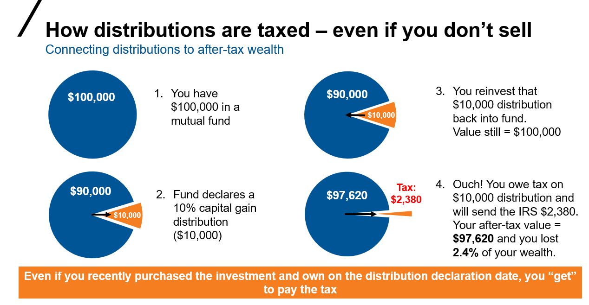

## Table of Contents

## What are capital gains distributions in mutual funds?

Capital gains distributions in mutual funds happen when the fund sells investments that have gone up in value. The profit from these sales is called a capital gain. When the fund makes these profits, it has to share them with the people who own shares in the fund. This sharing is called a capital gains distribution. It usually happens once a year, but sometimes it can happen more often.

When you get a capital gains distribution, it's like getting a bit of money from the fund. But, you have to pay taxes on this money, even if you don't sell your shares in the fund. The tax depends on how long the fund held the investments before selling them. If the fund held them for more than a year, it's called a long-term capital gain, and the tax is usually lower. If it was less than a year, it's a short-term capital gain, and the tax is higher, like your regular income tax.

## How often do mutual funds typically distribute capital gains?

Mutual funds usually distribute capital gains once a year. This happens near the end of the year, often in December. The reason they do this is because they need to pass on the profits they made from selling investments to the people who own shares in the fund.

Sometimes, a mutual fund might distribute capital gains more than once a year. This can happen if the fund has made a lot of profits and needs to share them more often. But most of the time, you can expect to get your capital gains distribution at the end of the year.

## What factors influence the frequency of capital gains distributions?

The frequency of capital gains distributions in mutual funds can be influenced by how often the fund manager decides to sell investments that have gone up in value. If the fund manager sells a lot of investments throughout the year, there might be a need to distribute capital gains more often. This is because the fund has to pass on these profits to the shareholders. If the fund manager mostly holds onto investments and only sells them at the end of the year, then the capital gains distribution will likely happen just once a year, usually in December.

Another [factor](/wiki/factor-investing) that can affect how often capital gains are distributed is the type of mutual fund. Some funds, like actively managed funds, might trade more frequently and thus might need to distribute capital gains more often. On the other hand, index funds or passively managed funds tend to trade less often, so they might only distribute capital gains once a year. The overall performance of the market and the specific investments the fund holds can also play a role in how often and how much capital gains are distributed.

## Can the frequency of capital gains distributions affect an investor's tax situation?

Yes, the frequency of capital gains distributions can affect an investor's tax situation. When a mutual fund distributes capital gains, the investor has to pay taxes on that money, even if they don't sell their shares in the fund. If a fund distributes capital gains more often, like multiple times a year, the investor might have to pay taxes more often too. This can mean more paperwork and possibly higher tax bills spread out over the year.

The type of capital gains also matters for taxes. If the fund held the investments for more than a year before selling, the gains are considered long-term, and the tax rate is usually lower. But if the fund sells investments it held for less than a year, those gains are short-term and taxed at a higher rate, like regular income. So, if a fund often sells investments quickly, an investor might end up paying more in taxes because of the short-term gains.

## How do different types of mutual funds (e.g., equity, bond, balanced) differ in their capital gains distribution patterns?

Different types of mutual funds can have different patterns when it comes to distributing capital gains. Equity funds, which invest mainly in stocks, often have more capital gains distributions because stocks can go up and down a lot. If the fund manager sells stocks that have gone up in value, they have to share those profits with the people who own the fund. This can happen more often if the fund is actively managed, meaning the manager is always buying and selling stocks to try to do better than the market.

Bond funds, on the other hand, usually have fewer capital gains distributions. This is because bonds don't change in value as much as stocks do. Bond funds mostly get income from the interest that bonds pay, not from selling bonds at a profit. But if a bond fund does sell bonds that have gone up in value, it will distribute those gains to the shareholders. Balanced funds, which mix stocks and bonds, can have a mix of these patterns. They might distribute capital gains more often than bond funds but less often than equity funds, depending on how much they invest in stocks versus bonds.

## What is the impact of a fund's turnover rate on the frequency of capital gains distributions?

A fund's turnover rate is how often the fund buys and sells its investments. If a fund has a high turnover rate, it means the fund manager is trading a lot. This can lead to more capital gains distributions because every time the fund sells something that has gone up in value, it has to share that profit with the people who own the fund. So, if the fund is always selling things, it might have to distribute capital gains more often.

On the other hand, if a fund has a low turnover rate, it means the fund manager is not trading as much. This can lead to fewer capital gains distributions because the fund is not selling its investments as often. Funds with low turnover rates, like index funds, usually only distribute capital gains once a year, at the end of the year. This is because they hold onto their investments for a longer time and only sell them when they really need to.

## How can investors use the frequency of capital gains distributions to assess a fund's investment strategy?

Investors can learn about a fund's investment strategy by looking at how often it gives out capital gains. If a fund gives out capital gains a lot, it might mean the fund manager is buying and selling investments all the time. This kind of fund is probably trying to make quick profits by trading a lot. These funds are often called actively managed funds because the manager is always making changes to try to do better than the market.

On the other hand, if a fund only gives out capital gains once a year, it might mean the fund manager is not trading as much. This kind of fund is probably holding onto its investments for a longer time, trying to grow them slowly over time. These funds are often called index funds or passively managed funds because they follow a set plan and don't change things as much. By looking at how often a fund gives out capital gains, investors can get a good idea of whether the fund is trying to make quick profits or grow slowly over time.

## What are the regulatory requirements or guidelines that affect how and when mutual funds distribute capital gains?

In the United States, the rules that affect how and when mutual funds give out capital gains come from the Internal Revenue Service (IRS) and the Securities and Exchange Commission (SEC). The IRS says that mutual funds have to give out almost all their capital gains to the people who own the fund by the end of the year. This is to make sure the fund doesn't have to pay taxes on those gains. The fund has to do this because it's a "pass-through" entity, meaning it passes its tax responsibilities to the shareholders.

The SEC also has rules about how mutual funds have to tell people about capital gains distributions. Funds have to let their shareholders know ahead of time when they are going to give out capital gains. This helps people who own the fund plan for taxes and other things. The SEC wants to make sure that everyone knows what's happening with their money, so they have rules about how and when funds have to share this information.

## How do capital gains distributions impact the net asset value (NAV) of a mutual fund?

When a mutual fund gives out capital gains to its shareholders, it affects the fund's net asset value (NAV). The NAV is like the price of one share of the fund, and it goes down a bit after a capital gains distribution. This happens because the money that's given out to shareholders comes from the fund's assets. So, when the fund pays out the capital gains, it's like taking money out of the fund, which makes the NAV lower.

Even though the NAV goes down after a capital gains distribution, it doesn't mean the fund is worth less overall. It just means that some of the money that was in the fund is now in the hands of the shareholders. If you're an investor who gets the capital gains, you might have to pay taxes on that money. But if you don't sell your shares in the fund, you'll still own the same number of shares, even though each share is now worth a bit less because of the lower NAV.

## What strategies can mutual fund managers employ to minimize the frequency and impact of capital gains distributions?

Mutual fund managers can use a few different strategies to make capital gains distributions happen less often and have less of an impact. One way is by holding onto investments for a longer time. When a fund keeps its investments for more than a year, any gains from selling them are called long-term capital gains. These are taxed at a lower rate, which can be better for shareholders. By not trading as much, the fund can also reduce how often it has to give out capital gains. This approach is often used by index funds, which follow a set plan and don't change their investments as much.

Another strategy is to use something called tax-loss harvesting. This is when the fund manager sells investments that have gone down in value to offset the gains from other investments. By doing this, the fund can reduce the amount of capital gains it has to distribute. It's like balancing out the wins and losses so that the overall amount of money the fund has to give out is smaller. This can help keep the fund's net asset value from dropping too much and can also help shareholders with their taxes.

## How does the holding period of securities within a mutual fund influence the timing and amount of capital gains distributions?

The time a mutual fund holds onto its investments, called the holding period, can change when and how much capital gains it gives out. If a fund keeps its investments for more than a year before selling them, the profits are called long-term capital gains. These are taxed at a lower rate, which is good for the people who own the fund. Because of this, fund managers might try to hold onto investments for at least a year to make the tax situation better for their shareholders. If a fund holds onto its investments for a long time, it won't have to sell them as often, so it might only give out capital gains once a year, usually at the end of the year.

On the other hand, if a fund sells its investments before holding them for a year, the profits are short-term capital gains. These are taxed at a higher rate, like regular income. Funds that trade a lot and sell their investments quickly might have to give out capital gains more often. This means the fund could distribute capital gains multiple times a year, which can be a bigger hassle for shareholders because they have to deal with more taxes and paperwork. By understanding how long a fund holds its investments, investors can get a better idea of when and how much capital gains they might get.

## What are the historical trends in the frequency of capital gains distributions among top-performing mutual funds?

Over the years, top-performing mutual funds have shown different patterns in how often they give out capital gains. In general, funds that do really well often have to give out capital gains more often because they are making more profits from selling investments. For example, in the late 1990s and early 2000s, during the tech boom, many top-performing equity funds had to distribute capital gains more frequently because they were selling stocks that had gone up a lot in value. This was especially true for actively managed funds that were trying to beat the market by trading a lot.

However, in more recent years, there has been a shift towards funds that trade less often, like index funds and other passively managed funds. These funds tend to give out capital gains less often, usually just once a year at the end of the year. This is because they hold onto their investments for longer periods, aiming for steady growth over time rather than quick profits. As a result, even among top-performing funds, there has been a trend towards fewer and less frequent capital gains distributions, which can be better for investors who want to minimize their tax bills.

## What are some practical tips for minimizing tax liabilities?

To effectively minimize tax liabilities associated with mutual fund investments, investors can leverage several key strategies. One fundamental approach is the use of tax-advantaged accounts, such as Individual Retirement Accounts (IRAs). These accounts allow investors to defer taxes on mutual fund distributions until funds are withdrawn, typically during retirement. This deferral not only delays tax payments but can also lead to reduced tax rates if withdrawals are made in a lower tax bracket.

Another effective strategy involves dividend reinvestment plans, which focus on using dividends to purchase additional shares of a mutual fund instead of receiving cash payouts. This approach aids in compounding investment growth while potentially benefiting from specific tax advantages, as reinvested dividends might qualify for lower tax rates under certain conditions.

Tax-loss harvesting presents another valuable tool for managing tax liabilities. This involves selling mutual fund holdings that have experienced a loss to offset taxable capital gains from other investments. By strategically realizing losses in this manner, investors can significantly reduce their overall tax burden. The formula for calculating tax savings through tax-loss harvesting can be summarized as:

$$
\text{Tax Savings} = (\text{Capital Gain} - \text{Loss}) \times \text{Tax Rate}
$$

Python can be used to automate the process of identifying potential tax-loss harvesting opportunities. Here is a simple example:

```python
def calculate_tax_savings(gain, loss, tax_rate):
    return (gain - loss) * tax_rate

capital_gain = 10000  # Example capital gain
loss = 3000  # Example capital loss
tax_rate = 0.25  # Example tax rate (25%)

savings = calculate_tax_savings(capital_gain, loss, tax_rate)
print(f"Tax savings from harvesting: ${savings}")
```

Finally, consulting with tax professionals is an essential step for investors wishing to tailor tax strategies to their specific financial situations. Tax laws and implications can be complex and highly individualized; professional advice ensures that strategies align with current regulations and personal financial goals. By employing these strategies, investors can effectively manage their tax liabilities and optimize their investment returns.

## References & Further Reading

Investopedia offers comprehensive resources on topics such as mutual fund taxation, [algorithmic trading](/wiki/algorithmic-trading) strategies, and investment planning crucial for both new and seasoned investors. These resources are valuable for understanding the nuances of investment management and providing foundational knowledge for developing robust investment strategies.

Research articles and [books](/wiki/algo-trading-books) also provide essential perspectives on financial markets. 'A Random Walk Down Wall Street' by Burton G. Malkiel stands out, offering an in-depth look into investment principles and the efficiency of markets. This book is particularly valuable for understanding the theoretical underpinnings of why algorithmic trading can be both a challenge and an opportunity within efficient markets.

IRS publications are indispensable for investors seeking to comprehend their tax obligations. Documents such as IRS Publication 550, which details investment income and expenses, are vital for demystifying the tax regulations that affect mutual fund distributions and capital gains. Staying updated with these publications ensures that investors are well-informed about any changes in tax laws that may impact their strategies.

These materials collectively provide a richer understanding of the financial landscape and are instrumental in aiding investors to make informed decisions. Accessing and studying these sources can empower investors to craft strategies that are both innovative and tax-efficient, leveraging both traditional investment knowledge and modern technological advancements.

