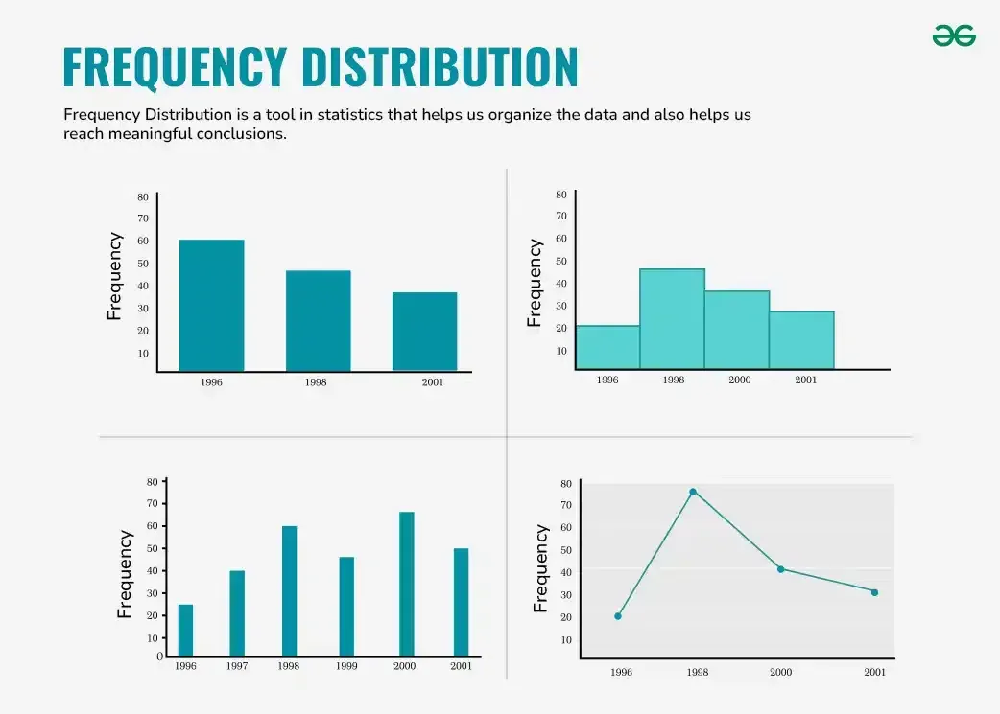

## Table of Contents

## What is frequency distribution?

Frequency distribution is a way to show how often different values or data points appear in a set of data. Imagine you have a bunch of numbers, and you want to know how many times each number shows up. You can count them and then list how many times each number appears. This list is called a frequency distribution. It helps you see patterns and understand your data better.

For example, if you are a teacher and you want to know how many students got each score on a test, you would count the number of students who got a score of 10, the number who got 20, and so on. By doing this, you create a frequency distribution that shows the scores and how many students achieved each score. This can help you see if most students did well or if many need more help.

## Why is frequency distribution important in data analysis?

Frequency distribution is important in data analysis because it helps us see how data is spread out. When we look at a big set of numbers, it can be hard to understand what's going on. But if we count how many times each number appears and put it in a frequency distribution, we can see patterns more easily. This makes it simpler to understand the data and spot things like what's common or what's rare.

It also helps us make better decisions. For example, if a store owner wants to know which products sell the most, they can use frequency distribution to see which items are bought more often. This can help them decide what to stock more of or what to put on sale. By understanding the frequency of different data points, we can make choices based on clear, organized information.

## How do you construct a frequency distribution table?

To construct a frequency distribution table, start by collecting all the data you want to analyze. This could be test scores, the number of items sold, or any other data points. Once you have your data, count how many times each value appears. For example, if you're looking at test scores, count how many students got a score of 10, how many got 20, and so on. Write down each unique value and the number of times it appears. This count is called the frequency.

Next, organize these counts into a table. The table will have two columns: one for the values (like test scores) and another for the frequency (how many times each score appears). List the values in the first column, usually in order from lowest to highest. In the second column, put the frequency for each value. For example, if 5 students got a score of 10, you would write '10' in the first column and '5' in the second column. Once you finish filling out the table, you'll have a clear picture of how often each value appears in your data set.

## What are the different types of frequency distributions?

There are different types of frequency distributions that help us understand data in different ways. One type is the simple frequency distribution. This is the most basic kind where you just count how many times each value appears in your data. For example, if you're looking at the ages of people in a room, you would count how many people are 10 years old, how many are 20 years old, and so on. This gives you a clear picture of how common each age is.

Another type is the grouped frequency distribution. This is used when you have a lot of different values, and it can be hard to see patterns if you list them all out. Instead, you group the values into ranges or intervals. For example, instead of counting how many people are exactly 10, 11, 12, and so on, you might count how many people are between 10 and 19 years old, how many are between 20 and 29, and so on. This makes it easier to see the overall pattern in the data.

A third type is the cumulative frequency distribution. This shows the total number of times a value or values below it appear in the data. For example, if you're looking at test scores, the cumulative frequency for a score of 70 would tell you how many students scored 70 or less. This type of distribution is useful for understanding how many data points fall below certain thresholds, which can be helpful for making decisions or setting goals.

## Can you explain the concept of class intervals in frequency distribution?

Class intervals are used in frequency distribution to group data into smaller, manageable chunks. When you have a lot of different numbers, it can be hard to see the big picture. So, you can divide the numbers into groups or ranges called class intervals. For example, if you're looking at the ages of people, instead of counting how many people are 10, 11, 12, and so on, you might count how many people are between 10 and 19 years old, how many are between 20 and 29, and so on. Each group, like 10-19 or 20-29, is a class interval.

Using class intervals makes it easier to see patterns in the data. You can quickly see how many people fall into each age group, which helps you understand the overall spread of ages. When you create a frequency distribution table with class intervals, you list the intervals in one column and the number of data points in each interval in another column. This way, you get a clear picture of how the data is distributed across different ranges, making it simpler to analyze and understand.

## How do you determine the appropriate number of class intervals?

To determine the right number of class intervals, you need to think about how many data points you have and how spread out they are. A good rule of thumb is to use between 5 and 20 class intervals. If you have too few intervals, you won't see the patterns in your data clearly. But if you have too many, it can be hard to make sense of the information. A common method is to use the square root of the total number of data points as a starting point for the number of intervals. For example, if you have 100 data points, the square root is about 10, so you might start with around 10 class intervals.

Once you have a starting number, you can adjust it based on how your data looks. If your data is spread out a lot, you might need more intervals to capture the different ranges. On the other hand, if your data is bunched together, fewer intervals might be better. You also want to make sure that each interval is the same size, so the data is grouped in a way that's easy to understand. By playing around with the number of intervals and looking at how it affects your frequency distribution, you can find the best fit for your data.

## What is a cumulative frequency distribution and how is it used?

A cumulative frequency distribution shows the total number of times a value or values below it appear in the data. It's like adding up the frequencies as you go along. For example, if you're looking at test scores, the cumulative frequency for a score of 70 would tell you how many students scored 70 or less. This type of distribution helps you see how many data points fall below certain thresholds.

Cumulative frequency distributions are useful for understanding the overall spread of your data. They can help you answer questions like how many people are below a certain age or how many sales were below a certain amount. For example, a store owner might use a cumulative frequency distribution to see how many customers spent $50 or less on their shopping trips. This can help them make decisions about pricing or promotions. By looking at the cumulative totals, you get a better sense of where your data falls and can make more informed choices based on that information.

## How does frequency distribution help in understanding data variability?

Frequency distribution helps us understand data variability by showing how spread out the data is. When you make a frequency distribution table, you count how many times each value appears. This lets you see if the data is all bunched together or spread out over a wide range. For example, if you're looking at test scores and most students got around 70, the frequency distribution will show a lot of scores around 70 and fewer scores far away from that. This tells you that the scores are not very variable because they are close to each other.

On the other hand, if the scores are all over the place, with some students getting 10, others getting 90, and everything in between, the frequency distribution will show that the data is spread out. This means the scores are more variable. By looking at the frequency distribution, you can quickly see how much the data varies. This is important because it helps you understand if the data is consistent or if there are big differences, which can affect how you interpret and use the data.

## What are the graphical representations of frequency distribution, such as histograms and bar charts?

Histograms and bar charts are two common ways to show frequency distribution graphically. A histogram is a type of bar chart that groups data into class intervals. Each bar in a histogram represents a class interval, and the height of the bar shows how many data points fall into that interval. For example, if you're looking at the ages of people, a histogram might have bars for age groups like 10-19, 20-29, and so on. The taller the bar, the more people fall into that age group. Histograms are great for showing how data is spread out and are often used for continuous data, like measurements or times.

Bar charts, on the other hand, are used to show the frequency of individual values or categories. Each bar represents a single value or category, and the height of the bar shows how many times that value or category appears in the data. For example, if you're looking at the number of students who got different test scores, a bar chart might have a bar for each score, like 10, 20, 30, and so on. The taller the bar, the more students got that score. Bar charts are useful for showing the frequency of discrete data, like counts or categories, and they make it easy to compare different values at a glance.

## How can frequency distribution be used to identify skewness in data?

Frequency distribution helps us see if data is skewed by showing how the values are spread out. Imagine you have a bunch of test scores. If you make a frequency distribution table or a histogram, you can see where most of the scores are. If the scores are spread out evenly, the data is not skewed. But if most of the scores are on one side, like a lot of low scores with just a few high ones, the data is skewed to the right. This means the tail of the distribution is longer on the right side.

On the other hand, if most of the scores are high with just a few low ones, the data is skewed to the left. This means the tail of the distribution is longer on the left side. By looking at the frequency distribution, you can quickly tell if the data is skewed and in which direction. This is important because it helps you understand if the data is typical or if there are unusual patterns that you need to think about when making decisions or drawing conclusions.

## What statistical measures can be derived from a frequency distribution?

From a frequency distribution, we can find out many important things about our data. One key measure is the mean, which is the average of all the values. To find the mean, you multiply each value by its frequency, add up all those products, and then divide by the total number of data points. This tells you the central point of your data. Another measure is the median, which is the middle value when you list all the data points in order. If you have an odd number of data points, the median is the one in the middle. If you have an even number, it's the average of the two middle values. The median helps you see where the middle of your data is, which is useful if your data has some very high or very low values that might pull the mean in one direction.

Another useful measure is the mode, which is the value that appears the most often. In a frequency distribution, it's easy to spot the mode because it's the value with the highest frequency. The mode tells you what's most common in your data. We can also find the range, which is the difference between the highest and lowest values. This shows how spread out your data is. Finally, you can calculate the standard deviation, which tells you how much the values vary from the mean. A small standard deviation means the values are close to the mean, while a large one means they're spread out more. All these measures help you understand your data better and make decisions based on what you find.

## How can advanced statistical software be used to analyze frequency distributions?

Advanced statistical software makes it easy to analyze frequency distributions. You can put your data into the software, and it will quickly create a frequency distribution table for you. This table shows how many times each value appears in your data. The software can also make graphs like histograms and bar charts, which help you see the patterns in your data at a glance. For example, if you're looking at test scores, the software can show you a histogram where each bar represents a range of scores and how many students fall into that range. This makes it simple to see if most students did well or if there's a wide spread of scores.

The software also helps you find important statistical measures from your frequency distribution. It can calculate the mean, which is the average of all the values, the median, which is the middle value, and the mode, which is the most common value. You can also get the range, which shows how spread out your data is, and the standard deviation, which tells you how much the values vary from the mean. All these measures give you a deeper understanding of your data. For example, if you're a store owner looking at sales data, the software can help you see which products sell the most and how consistent your sales are, helping you make better decisions about what to stock or promote.

## References & Further Reading

[1]: "Numerical Recipes 3rd Edition: The Art of Scientific Computing" by William H. Press, Saul A. Teukolsky, William T. Vetterling, Brian P. Flannery. Cambridge University Press.

[2]: ["Algorithmic Trading and DMA: An introduction to direct access trading strategies"](https://www.amazon.com/Algorithmic-Trading-DMA-introduction-strategies/dp/0956399207) by Barry Johnson

[3]: Glasserman, P. (2003). ["Monte Carlo Methods in Financial Engineering."](https://link.springer.com/book/10.1007/978-0-387-21617-1) Springer.

[4]: Box, G.E.P., Jenkins, G.M., Reinsel, G.C., & Ljung, G.M. (2015). ["Time Series Analysis: Forecasting and Control."](https://onlinelibrary.wiley.com/doi/book/10.1002/9781118619193) Wiley.

[5]: Tsay, R. S. (2010). ["Analysis of Financial Time Series."](https://onlinelibrary.wiley.com/doi/book/10.1002/9780470644560) Wiley.

[6]: Cont, R., & Tankov, P. (2004). ["Financial Modelling with Jump Processes."](https://www.taylorfrancis.com/books/mono/10.1201/9780203485217/financial-modelling-jump-processes-peter-tankov-rama-cont) Chapman and Hall/CRC.

[7]: Ruey, S. Tsay. (2014). ["A Course in Time Series Analysis."](https://onlinelibrary.wiley.com/doi/book/10.1002/9781118032978) Stata Press.

[8]: ["Algorithmic and High-Frequency Trading"](https://www.cambridge.org/us/universitypress/subjects/mathematics/mathematical-finance/algorithmic-and-high-frequency-trading) by Álvaro Cartea, Sebastian Jaimungal, and José Penalva