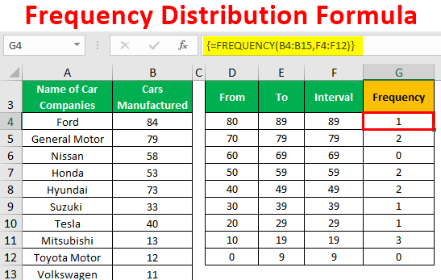

In the digital age, data analysis has become an indispensable component of financial markets. Among the many facets of financial data analysis, algorithmic trading, often referred to as algo trading, stands out for its reliance on data-driven techniques to generate automated trading decisions. Frequency distribution is fundamentally linked to this process, offering vital insights by detailing how data points are spread across various levels. In the context of the stock market, frequency distribution allows traders to recognize patterns and trends that would be less perceptible through other analytical methods.

Algo trading systems depend heavily on statistical tools to analyze vast datasets swiftly and accurately. Frequency distributions summarize large volumes of financial data, such as stock prices, by indicating the intervals at which certain price changes occur most frequently. This statistical approach simplifies the complex landscapes of market trends into comprehensible intervals and frequencies, providing traders with a clearer vision of market behavior.



This article reviews the significance of frequency distributions within data analysis and algorithmic trading. It discusses how these statistical tools can sharpen trading strategies, affording a trader or analyst increased precision in recognizing patterns that signal potential market movement. By fostering an enhanced understanding of historical price actions and their frequencies, frequency distributions enable traders to construct more robust forecasting models, thus optimizing trading strategies for better decision-making. As technological advances persist, the integration of frequency distribution into automated trading strategies promises to offer enriched opportunities for traders and financial analysts alike.

## Table of Contents

## What is Frequency Distribution?

Frequency distribution is a statistical tool that organizes data to showcase the frequency of observations within defined intervals. This categorization allows for a clear visualization of how data points are spread across different segments, thereby illuminating the underlying distribution pattern. The tool can be graphically represented through histograms, bar charts, or frequency polygons, as well as tabularly, providing a cumulative count of observations within each set range.

In mathematical terms, a frequency distribution is defined by determining the number of data points, $n_i$, falling within each interval or bin of a dataset. If we have a dataset $X$, a frequency distribution can be represented as an array $[n_1, n_2, \ldots, n_k]$, where $k$ is the number of interval divisions.

For example, consider the Python code snippet below to create a simple frequency distribution table:

```python
import numpy as np

# Sample data
data = np.array([5, 6, 7, 8, 5, 6, 7, 6, 9, 10, 5, 9, 8])

# Define the bins for the frequency distribution
bins = np.arange(5, 11)  # Bins ranging from 5 to 10

# Calculate frequency distribution
frequency, bin_edges = np.histogram(data, bins=bins)

# Print the frequency distribution
for i in range(len(frequency)):
    print(f"Interval: [{bin_edges[i]}, {bin_edges[i+1]}), Frequency: {frequency[i]}")
```

The above code calculates how many data points lie within each interval or bin. The distribution pattern is thereby elucidated by these frequency counts.

In the context of trading, frequency distributions provide significant insights into market behavior. By analyzing the frequency of price changes over time, traders can identify notable trends and patterns in asset price movements. This understanding can highlight periods of [volatility](/wiki/volatility-trading-strategies) or stability, crucial for making informed trading decisions. For instance, if a particular stock shows frequent price increases within certain ranges more than others, this trend can inform trading strategies aimed at capitalizing on such price movements. 

Frequency distributions thus enable traders to dissect and comprehend complex market data, reducing uncertainty and bolstering strategic decision-making.

## The Role of Frequency Distribution in Trading

Frequency distributions are an essential element in the toolkit of traders, especially for those involved in [algorithmic trading](/wiki/algorithmic-trading). By analyzing data through the lens of frequency distributions, traders can discern patterns that may not be immediately apparent through raw data inspection. This statistical tool helps in visualizing how often various price levels occur over a given period, providing insights into market behavior that are crucial for strategic decision-making.

The application of frequency distributions allows traders to observe market trends by highlighting the frequency of price changes over time. By organizing data into specific intervals—usually price ranges or time periods—traders can identify prevalent trends such as the most common price levels, volatilities, and periods of significant trading activity. For example, a frequency distribution can display how often a stock's price remains within certain ranges, thus providing insights into its stability or volatility. This is especially beneficial in algo trading, where rapid and data-driven decisions are necessary.

Moreover, frequency distributions play a significant role in predicting future price movements. By scrutinizing historical data patterns, traders can develop hypotheses about future behaviors. For instance, if a stock consistently tends to increase in price following a specific trading pattern, traders can program algorithms to recognize this pattern and execute trades accordingly. This predictive capability is bolstered by the construction of historical price trends, which frequency distributions facilitate by presenting a clear, organized view of past data.

Integrating frequency distributions into trading models helps refine forecasting techniques. Traders can enhance their models' precision by incorporating statistical analysis that interprets the frequency of past price levels and movements. Frequency distributions serve as a foundational element in building more sophisticated statistical models such as time series analysis or [machine learning](/wiki/machine-learning) algorithms, which can further analyze the intricacies of market behavior and improve the accuracy of predictions. This integration is crucial for the development of robust, data-driven trading strategies that can react to and capitalize on market changes with minimal human intervention.

## Algorithmic Trading and Data Analysis

Algorithmic trading, commonly referred to as algo trading, utilizes data analysis and statistical models to automate and refine trading strategies. This approach exploits the computational power of modern computers to execute trades in financial markets at speeds and volumes impossible for human traders. At the heart of this methodology is the reliance on data analysis tools, which efficiently process high-frequency data streams generated by financial markets.

Frequency distribution, a fundamental statistical tool, is integral to this process. It helps algo traders manage vast amounts of data, breaking it down into comprehensible distributions that reveal underlying market dynamics. By assessing how often different price levels or price changes occur, frequency distributions provide insights into market volatility, [liquidity](/wiki/liquidity-risk-premium), and potential price trends.

Automated trading strategies benefit significantly from the accurate representation and analysis of frequency data. For instance, by recognizing patterns in the frequency of specific price movements, algorithmic systems can predict short-term fluctuations, enabling profitable trading decisions. Furthermore, advanced statistical methods, such as machine learning algorithms and regression analysis, incorporate frequency data to enhance their predictive power.

Machine learning models like decision trees, neural networks, and support vector machines can be trained on these frequency distributions. This training improves their ability to detect and anticipate market behaviors, optimizing trading strategies. For instance, a simple Python snippet to analyze frequency data using a histogram might look like this:

```python
import numpy as np
import matplotlib.pyplot as plt

# Sample data: price changes
price_changes = np.random.normal(0, 1, 1000)

# Create a histogram
plt.hist(price_changes, bins=30, edgecolor='k')
plt.xlabel('Price Change')
plt.ylabel('Frequency')
plt.title('Frequency Distribution of Price Changes')
plt.show()
```

In addition to machine learning applications, algorithmic trading also employs time series analysis and other statistical techniques to handle high-frequency trading data. These methods aggregate and analyze transaction data to capture intricate patterns frequently missed by simpler models. With the ongoing advancement of AI and machine learning technologies, the ability to process and exploit these vast datasets will only enhance, providing even more sophisticated tools for algo traders in developing their strategies.

## Statistical Approaches in Algo Trading

Various statistical modeling approaches are crucial for handling high-frequency trading data in algorithmic trading. Two predominant models that traders rely on are point process models and time series analysis.

Point process models are employed to capture the dynamics of events that occur randomly over time, such as trades. These models are particularly useful for understanding the market microstructures by evaluating the sequences of trade and price discretizations. By analyzing the time intervals between trades and their volumes, traders can gain insights into liquidity and volatility in the market. This mathematical approach can incorporate covariates and is often represented by the conditional intensity function, which specifies the instantaneous rate of occurrence of new events given past events. Such insights are vital for building strategies that require precise timing to capitalize on market microstructures.

Time series analysis, on the other hand, focuses on understanding and predicting the future values based on previously observed values. It is a powerful tool for modeling financial data, given its capability to capture trends and seasonal patterns over time. Typical models used in time series analysis include Autoregressive Integrated Moving Average (ARIMA) models, GARCH models, and vector autoregressions. These models are instrumental in predicting asset price movements by analyzing historical data and extrapolating future trends.

Integrating frequency distribution with these statistical models enhances their precision and effectiveness. The distribution aids in understanding the density and the probability of different outcomes associated with a trading strategy. For instance, by determining how often certain price levels are reached, traders can adjust their algorithms to incorporate market tendencies. This integration improves the predictive power and robustness of trading models by providing a more granular view of price changes and market behaviors.

Python libraries such as NumPy and Pandas are often used to perform time series analysis and work with frequency distributions. Here is an example code snippet demonstrating how Python can be utilized to analyze trading data:

```python
import pandas as pd
import numpy as np
import matplotlib.pyplot as plt
from statsmodels.tsa.arima.model import ARIMA

# Load financial data
# data = pd.read_csv('financial_data.csv')
# data['date'] = pd.to_datetime(data['date'])
# data.set_index('date', inplace=True)

# Example of ARIMA modeling
# model = ARIMA(data['close'], order=(5, 1, 0))
# model_fit = model.fit()

# Plot results
# plt.figure(figsize=(10, 4))
# plt.plot(data['close'], label='Observed')
# plt.plot(model_fit.fittedvalues, color='red', label='Fitted')
# plt.title('ARIMA Model Fit')
# plt.legend()
# plt.show()
```

Incorporating such computational tools allows traders to automate and enhance their algorithms by leveraging statistical methods to make informed decisions. As data continues to grow in [volume](/wiki/volume-trading-strategy) and complexity, these statistical approaches remain central to maintaining a competitive edge in algorithmic trading.

## Challenges and Future Directions

One major challenge encountered in high-frequency trading ([HFT](/wiki/high-frequency-trading-strategies)) is the management of data noise and asynchronous trading data. In HFT environments, data is generated and processed at extremely high speeds, often resulting in significant noise that can obscure meaningful patterns and signals. This noise arises from various sources, such as incomplete data transmissions, market microstructure noise, and anomalies in order execution. Such factors can lead to a divergence between observed and true market conditions, complicating accurate decision-making and prediction.

To address these complexities, future research is likely to focus on the development of robust models designed to better handle noisy and asynchronous data. These models must be capable of filtering out irrelevant information while preserving crucial signals that reflect genuine market behavior. Statistical techniques, such as stochastic calculus and advanced filtering methods, are vital in this respect. More sophisticated approaches may include adaptive algorithms that self-adjust based on incoming data patterns to maintain accuracy in prediction and trading decisions.

The anticipated growth in the application of [artificial intelligence](/wiki/ai-artificial-intelligence) (AI) and machine learning (ML) in trading is transformative. These technologies offer promising tools to process vast amounts of data efficiently, improve the precision of trading signals, and enhance decision-making. Techniques such as [deep learning](/wiki/deep-learning), reinforced learning, and natural language processing – when applied to trading data – can lead to the development of predictive models that adjust to market conditions in real-time. These models can learn from historical data, detect subtle patterns often missed by traditional statistical methods, and provide insights into future market trends.

Moreover, AI-driven algorithms can evolve by learning from both structured and unstructured data, allowing traders to exploit nuances in market sentiment and economic indicators. In essence, the role of AI and ML signifies a shift towards more adaptive, predictive trading strategies that leverage comprehensive data analysis, marking a new era in algorithmic trading.

## Conclusion

Frequency distribution serves as a powerful tool in the arsenal of data analysis for trading. Its application in algorithmic trading provides traders with a deeper understanding of market dynamics through statistical insights. By evaluating the frequency of various price changes and market events, traders can detect subtle patterns and biases that might be obscured by the noise inherent in financial data. This understanding allows traders to anticipate and react to market movements with greater confidence and precision.

As technology continues to advance, the integration of frequency distribution in automated trading strategies will keep evolving. Enhanced computational capabilities permit more complex analyses and the processing of vast quantities of high-frequency data in real-time. This technological evolution offers new opportunities for traders and financial analysts, facilitating the development of more sophisticated algorithms that can adapt to rapidly changing market conditions. Moreover, the future likely holds increased incorporation of artificial intelligence and machine learning techniques, which will allow for even more nuanced interpretations and applications of frequency distributions in trading strategies. These developments promise to further refine trading decisions and enhance the profitability and risk management of algorithmic trading systems.

## References & Further Reading

[1]: "Numerical Recipes 3rd Edition: The Art of Scientific Computing" by William H. Press, Saul A. Teukolsky, William T. Vetterling, Brian P. Flannery. Cambridge University Press.

[2]: ["Algorithmic Trading and DMA: An introduction to direct access trading strategies"](https://www.amazon.com/Algorithmic-Trading-DMA-introduction-strategies/dp/0956399207) by Barry Johnson

[3]: Glasserman, P. (2003). ["Monte Carlo Methods in Financial Engineering."](https://link.springer.com/book/10.1007/978-0-387-21617-1) Springer.

[4]: Box, G.E.P., Jenkins, G.M., Reinsel, G.C., & Ljung, G.M. (2015). ["Time Series Analysis: Forecasting and Control."](https://onlinelibrary.wiley.com/doi/book/10.1002/9781118619193) Wiley.

[5]: Tsay, R. S. (2010). ["Analysis of Financial Time Series."](https://onlinelibrary.wiley.com/doi/book/10.1002/9780470644560) Wiley.

[6]: Cont, R., & Tankov, P. (2004). ["Financial Modelling with Jump Processes."](https://www.taylorfrancis.com/books/mono/10.1201/9780203485217/financial-modelling-jump-processes-peter-tankov-rama-cont) Chapman and Hall/CRC.

[7]: Ruey, S. Tsay. (2014). ["A Course in Time Series Analysis."](https://onlinelibrary.wiley.com/doi/book/10.1002/9781118032978) Stata Press.

[8]: ["Algorithmic and High-Frequency Trading"](https://www.cambridge.org/us/universitypress/subjects/mathematics/mathematical-finance/algorithmic-and-high-frequency-trading) by Álvaro Cartea, Sebastian Jaimungal, and José Penalva